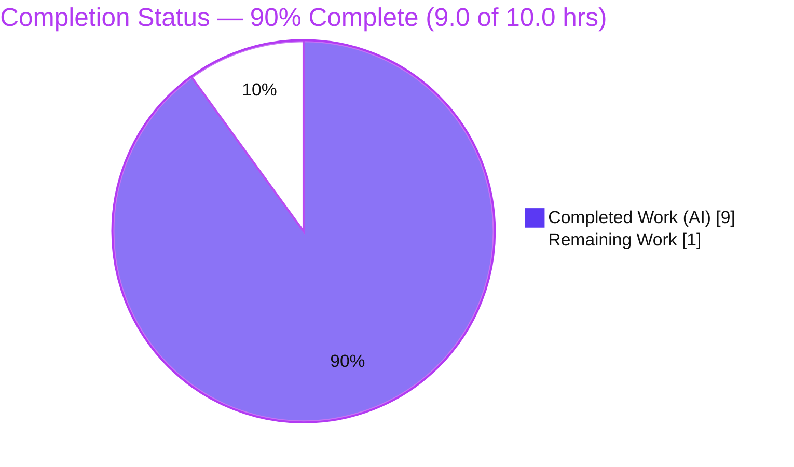
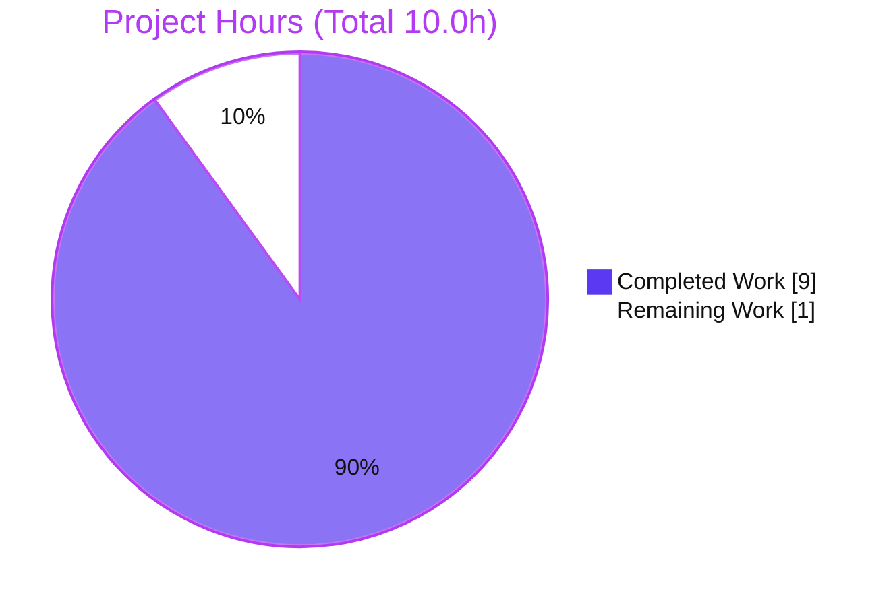
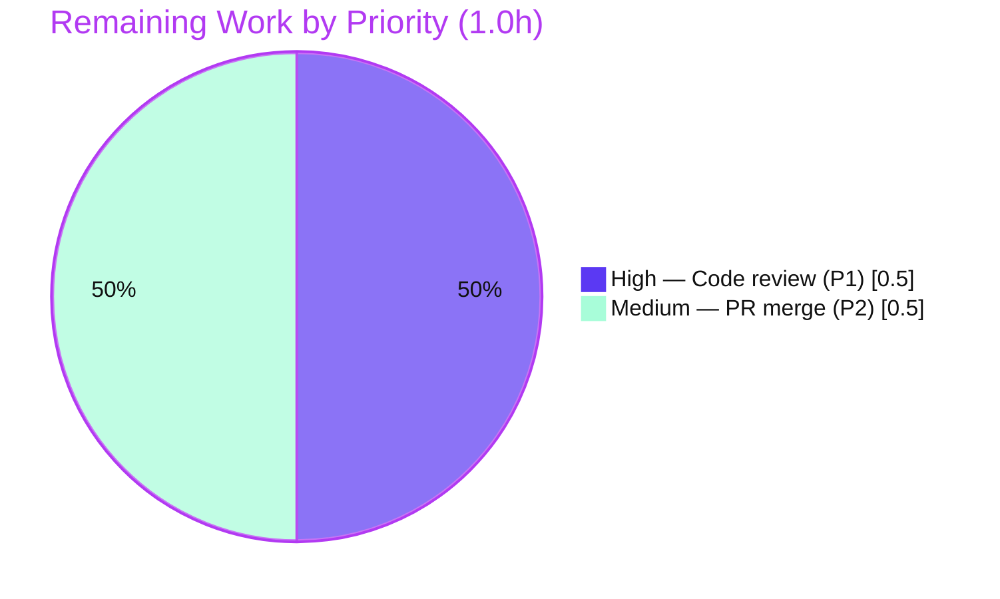

# Blitzy Project Guide — `hello_world` Express.js Endpoint Feature

> **Color Legend (Blitzy brand):** ■ Completed / AI Work = Dark Blue `#5B39F3` · □ Remaining / Not Completed = White `#FFFFFF` · Headings/Accents = Violet-Black `#B23AF2` · Highlight = Mint `#A8FDD9`

---

## 1. Executive Summary

### 1.1 Project Overview

This project introduces the **Express.js** web framework into a previously zero-dependency, single-file Node.js HTTP server and adds a second plain-text endpoint (`GET /good-evening` → `Good evening`) while preserving the original greeting endpoint (`GET /` → `Hello, World!\n`) with byte-exact backward compatibility. Target users are developers and maintainers of this minimal tutorial service, which binds to `127.0.0.1:3000`. Technical scope spans five files: `server.js` (re-platformed onto Express), `package.json` and `package-lock.json` (Express `^5.2.1`), a new `.gitignore`, and `README.md`. Business impact is enabling path-based routing for future endpoint growth. All four AAP requirements are delivered and independently validated.

### 1.2 Completion Status



| Metric | Hours |
|--------|-------|
| **Total Hours** | **10.0** |
| Completed Hours (AI 9.0 + Manual 0.0) | 9.0 |
| Remaining Hours | 1.0 |
| **Percent Complete** | **90.0%** |

> **Calculation (PA1, AAP-scoped):** Completion % = Completed ÷ (Completed + Remaining) × 100 = 9.0 ÷ 10.0 × 100 = **90.0%**. The figure reflects only AAP-scoped work plus in-scope path-to-production activity. The 10% remaining is the mandatory human review + merge gate (not implementation debt).

### 1.3 Key Accomplishments

- ✅ **R1 — Express.js introduced** as a production dependency (`express@^5.2.1`), locked in `package-lock.json` (lockfileVersion 3, 68 entries) and installed into `node_modules/`.
- ✅ **R2 — Server re-platformed onto Express**: `http.createServer` catch-all replaced by an `express()` app object with path-based routing.
- ✅ **R3 — Original greeting preserved**: `GET /` returns `Hello, World!\n` (14 bytes, trailing LF) with explicit `text/plain`, byte-for-byte backward compatible.
- ✅ **R4 — New endpoint added**: `GET /good-evening` returns `Good evening` (12 bytes) as `text/plain`.
- ✅ **Hygiene delivered**: `.gitignore` excludes `node_modules/`; `README.md` documents install/run and both endpoints.
- ✅ **Security hardening beyond baseline**: `X-Powered-By` disabled (CWE-200) and `X-Content-Type-Options: nosniff` added on both routes; fail-fast `listen` error handler (non-zero exit on `EADDRINUSE`).
- ✅ **Zero-defect validation**: `node --check` clean, `npm audit` 0 vulnerabilities, both endpoints byte-exact, server starts via `node server.js` and `npm start`.

### 1.4 Critical Unresolved Issues

| Issue | Impact | Owner | ETA |
|-------|--------|-------|-----|
| _None identified_ | No functional, compilation, dependency, or runtime issues remain. All AAP requirements delivered and independently re-validated with zero defects. | — | — |

### 1.5 Access Issues

| System/Resource | Type of Access | Issue Description | Resolution Status | Owner |
|-----------------|----------------|-------------------|-------------------|-------|
| _None_ | — | No access issues identified. The project requires no service credentials, API keys, secrets, or external systems; the npm registry dependency (`express`) is already installed and locked. | N/A | — |

**No access issues identified.**

### 1.6 Recommended Next Steps

1. **[High]** Perform peer code review and AAP-compliance sign-off of the 5 changed files (`server.js`, `package.json`, `package-lock.json`, `.gitignore`, `README.md`).
2. **[Medium]** Merge branch `blitzy-f783057c-7e43-4816-bde3-d6c8fab410c3` into the target mainline (`origin/main` or `origin/QA-14-july-qa`).
3. **[Low]** _(Optional, out of current AAP scope)_ Add a minimal smoke test to guard the byte-exact response contract for future changes.
4. **[Low]** _(Optional, out of current AAP scope)_ If the service ever moves off localhost, add env-based `PORT`/`HOST` config, a health-check endpoint, and structured logging.

---

## 2. Project Hours Breakdown

### 2.1 Completed Work Detail

| Component | Hours | Description |
|-----------|-------|-------------|
| `server.js` — Express re-platform + dual routing (R2, R3, R4) | 3.0 | Replaced `http` module with `express()`; registered `GET /` (explicit `text/plain`, byte-exact `Hello, World!\n`) and `GET /good-evening` (`Good evening`); preserved `app.listen(3000,'127.0.0.1',…)`. |
| `server.js` — Security & robustness hardening | 1.5 | Disabled `X-Powered-By` (CWE-200), added `X-Content-Type-Options: nosniff` parity on both routes, and a fail-fast `listen` `error` handler (non-zero exit on `EADDRINUSE`). Commits `3ba1489`, `55f5b91`. |
| Express dependency management (R1) | 1.5 | Declared `express@^5.2.1` in `package.json`, ran `npm install`, regenerated `package-lock.json` (68 entries), verified clean audit. Commit `7dbaf47`. |
| `.gitignore` creation (H1) | 0.5 | New file excluding `node_modules/`. Commits `7dbaf47`, `2befd70`. |
| `README.md` documentation (H2) | 1.0 | Documented Express usage, install/run, endpoints table, and trailing-newline distinction. Commits `c2caa49`, `838a2ad`. |
| Web-search research (§0.2.3) | 0.5 | Confirmed Express 5 latest stable, `node >= 18` engine requirement, and the idiomatic multi-route pattern. |
| Functional acceptance validation (V1) | 1.0 | Started server via both commands; byte-exact `curl` of both endpoints; verified status, headers, and body lengths. |
| **Total Completed** | **9.0** | Sum of all AI-delivered components. |

> **Validation:** The Hours column totals **9.0**, matching Completed Hours in Section 1.2. ✓

### 2.2 Remaining Work Detail

| Category | Hours | Priority |
|----------|-------|----------|
| Human code review & AAP-compliance sign-off (P1) | 0.5 | High |
| PR merge / branch integration to mainline (P2) | 0.5 | Medium |
| **Total Remaining** | **1.0** | — |

> **Validation:** The Hours column totals **1.0**, matching Remaining Hours in Section 1.2 and the Section 7 pie chart "Remaining Work" value. ✓
>
> **Out of AAP scope (informational, 0h counted):** automated test framework, health-check endpoint, structured logging, env-based config, deployment/CI-CD/containerization, TLS/auth, non-localhost binding. Per AAP §0.6.2 these are explicitly excluded and are **not** counted toward remaining hours.

### 2.3 Hours Summary & Reconciliation

| Bucket | Hours | Cross-Section Check |
|--------|-------|---------------------|
| Section 2.1 — Completed | 9.0 | = Section 1.2 Completed ✓ |
| Section 2.2 — Remaining | 1.0 | = Section 1.2 Remaining = Section 7 "Remaining Work" ✓ |
| **Total (2.1 + 2.2)** | **10.0** | = Section 1.2 Total Hours ✓ |
| **Percent Complete** | **90.0%** | 9.0 ÷ 10.0 × 100 ✓ |

---

## 3. Test Results

All entries below originate from Blitzy's autonomous validation logs and were independently re-executed during this assessment. **No unit-test framework exists by AAP design** (§0.6.2 explicitly excludes introducing a test framework or test files, and mandates leaving the placeholder `test` script unchanged) — this is intentional scope, not a gap.

| Test Category | Framework | Total Tests | Passed | Failed | Coverage % | Notes |
|---------------|-----------|-------------|--------|--------|------------|-------|
| Functional Acceptance (Endpoints) | Manual HTTP — `curl` / Node `http` client | 2 | 2 | 0 | N/A | `GET /` → 200 `Hello, World!\n` (14B); `GET /good-evening` → 200 `Good evening` (12B); byte-exact per AAP §0.5.2 |
| Runtime Smoke | Node.js runtime | 2 | 2 | 0 | N/A | Clean startup via `node server.js` and `npm start`; startup log present; no stderr |
| Negative Routing | Manual HTTP | 1 | 1 | 0 | N/A | `GET /<unknown>` → 404 (Express default; intentional new behavior) |
| Static Syntax Gate | `node --check` | 1 | 1 | 0 | N/A | `server.js` parses; exit 0 |
| Dependency Resolution | `npm ls` | 1 | 1 | 0 | N/A | `express@5.2.1` resolves cleanly |
| Dependency Audit | `npm audit` | 1 | 1 | 0 | N/A | 0 vulnerabilities across 67 transitive deps |
| Unit Tests | _(none — excluded by AAP design)_ | 0 | 0 | 0 | N/A | Placeholder `test` script (`echo … && exit 1`) intentionally unchanged |
| **Total** | — | **8** | **8** | **0** | **N/A** | 100% pass rate; coverage N/A (no instrumented unit tests by design) |

---

## 4. Runtime Validation & UI Verification

**Runtime health**

- ✅ **Operational** — Server startup via `node server.js` → logs `Server running at http://127.0.0.1:3000/`, no stderr.
- ✅ **Operational** — Server startup via `npm start` → same log via the npm `start` script.
- ✅ **Operational** — Listens on `127.0.0.1:3000`; clean shutdown; port released.
- ✅ **Operational** — Fail-fast `listen` error handler surfaces `EADDRINUSE` to stderr with non-zero exit (no false "running" report).

**API integration / endpoints**

- ✅ **Operational** — `GET /` → `200 OK`, `Content-Type: text/plain; charset=utf-8`, `Content-Length: 14`, body `Hello, World!\n` (trailing LF preserved).
- ✅ **Operational** — `GET /good-evening` → `200 OK`, `Content-Type: text/plain; charset=utf-8`, `Content-Length: 12`, body `Good evening` (no trailing newline).
- ✅ **Operational** — `GET /<unknown>` → `404` (Express default) — expected, intentional path-based routing.
- ✅ **Operational** — Security headers: `X-Powered-By` **absent** on all responses; `X-Content-Type-Options: nosniff` present on both success routes.

**UI verification**

- ➖ **Not Applicable** — This feature is entirely server-side and returns plain-text HTTP responses. There is no user interface, template engine, HTML generation, or frontend asset (AAP §0.5.3). No UI verification is required.

---

## 5. Compliance & Quality Review

Cross-mapping of AAP deliverables and quality benchmarks to their validated status. Fixes applied during autonomous validation are noted; there are no outstanding compliance items.

| Deliverable / Benchmark | Requirement | Status | Progress | Notes |
|-------------------------|-------------|--------|----------|-------|
| R1 — Express dependency | `express` declared, locked, installed | ✅ Pass | 100% | `^5.2.1` in `package.json`; lockfileVersion 3, 68 entries; installed |
| R2 — Re-platform onto Express | `express()` app replaces `http` catch-all | ✅ Pass | 100% | Commit `ec987aa`; `node --check` clean |
| R3 — Preserve `GET /` | Byte-exact `Hello, World!\n`, `text/plain` | ✅ Pass | 100% | 14 bytes, trailing LF; explicit `text/plain` parity |
| R4 — Add `GET /good-evening` | Returns `Good evening` | ✅ Pass | 100% | 12 bytes; `text/plain` |
| H1 — `.gitignore` | Exclude `node_modules/` | ✅ Pass | 100% | `git check-ignore` confirms |
| H2 — `README.md` docs | Document Express + endpoints | ✅ Pass | 100% | Endpoints table + trailing-newline note (resolved review finding M1) |
| C1 — Preserve conventions | CommonJS, `127.0.0.1:3000`, single-file, `main:index.js` | ✅ Pass | 100% | All conventions retained; entry-point discrepancy intentionally preserved |
| C2 — Pin patched version | `save and apply-` rule | ✅ Pass | 100% | `^5.2.1` current patched stable; audit 0 vulnerabilities |
| Compilation / Syntax | Zero errors | ✅ Pass | 100% | `node --check` exit 0; valid UTF-8 |
| Dependency Security | No known vulnerabilities | ✅ Pass | 100% | `npm audit` → 0 vulnerabilities |
| Linting | Static analysis | ➖ N/A | — | No linter configured (no ESLint/Prettier/devDependencies); `node --check` gate passed |
| Human Review Sign-off | Peer approval before merge | ⏳ Pending | 0% | Remaining human gate (Section 2.2 / P1) |

**Fixes applied during autonomous validation:** README trailing-newline distinction clarified (review finding M1, commit `838a2ad`); `.gitignore` trimmed to minimal `node_modules/` exclusion per AAP (commit `2befd70`); response headers hardened (commit `3ba1489`); `listen` failure made observable with non-zero exit (commit `55f5b91`). **Outstanding compliance items:** none.

---

## 6. Risk Assessment

Overall posture: **LOW** across all categories — no High or Medium severity risks. Each item is either intentionally accepted per AAP scope or already mitigated by delivered work.

| Risk | Category | Severity | Probability | Mitigation | Status |
|------|----------|----------|-------------|------------|--------|
| T1 — No automated regression tests; future edits could silently break the byte-exact contract | Technical | Low | Low | README documents `curl` checks; add smoke test if project grows (out of current scope) | Accepted (AAP design) |
| T2 — Unmatched paths now return 404 vs original catch-all answering all paths | Technical | Low | Very Low | Intentional path-based routing per AAP; documented | Resolved (intentional) |
| T3 — Caret range `^5.2.1` could float on lock-less installs | Technical | Low | Low | `package-lock.json` committed → deterministic `npm install` | Mitigated |
| S1 — Express supply chain (67 transitive deps); new advisories may emerge | Security | Low | Low | `npm audit` 0 vulns; pinned patched release; lockfile committed; periodic audit recommended | Mitigated |
| S2 — No TLS/auth | Security | Low | Very Low | Binds `127.0.0.1` loopback only (not externally exposed); AAP scopes localhost | Accepted (AAP scope) |
| O1 — No health-check / structured logging / monitoring | Operational | Low | Low | Acceptable for localhost tutorial; note for any future production deployment | Accepted (AAP scope) |
| O2 — Hardcoded port 3000, no env config | Operational | Low | Low | Fail-fast `error` handler exits non-zero on `EADDRINUSE` (conflicts surfaced, not masked) | Mitigated |
| I1 — `node_modules` not committed; requires `npm install` | Integration | Low | Low | README step 1 = `npm install`; lockfile ensures reproducible tree | Mitigated |
| I2 — Node.js ≥ 18 runtime requirement (Express 5 engine) | Integration | Low | Low | README states "Node.js 18 or higher"; env Node v22.23.1 satisfies | Mitigated |
| I3 — No external services/DB/secrets | Integration | Low | Very Low | Self-contained server; nothing to configure | N/A |

**Positive quality signals:** `X-Powered-By` disabled (CWE-200 information-disclosure hardening) and `X-Content-Type-Options: nosniff` added — hardening beyond AAP minimum.

---

## 7. Visual Project Status

**Project Hours Breakdown** (Completed = Dark Blue `#5B39F3`, Remaining = White `#FFFFFF`):



**Remaining Work by Priority** (0.5h High + 0.5h Medium = 1.0h):



**Remaining hours per Section 2.2 category:**

| Category | Hours | Priority |
|----------|-------|----------|
| Human code review & sign-off (P1) | 0.5 | High |
| PR merge / integration (P2) | 0.5 | Medium |
| **Total** | **1.0** | — |

> **Integrity:** "Remaining Work" = **1.0** here equals Section 1.2 Remaining Hours and the Section 2.2 Hours total. ✓

---

## 8. Summary & Recommendations

**Achievements.** The project is **90.0% complete** (9.0 of 10.0 AAP-scoped hours). All four requirements (R1–R4), both recommended hygiene items (`.gitignore`, `README.md`), and both AAP constraints (convention preservation, patched-version pinning) are delivered. The single-file server was cleanly re-platformed onto Express, both endpoints return byte-exact responses, and the change adds security hardening (disabled `X-Powered-By`, `nosniff`) and a fail-fast startup error handler beyond the AAP minimum. Independent re-validation found **zero defects**: `node --check` clean, `npm audit` 0 vulnerabilities, and both documented run commands work.

**Remaining gaps.** The remaining **1.0h (10%)** is exclusively the human path-to-production gate — peer code review/sign-off (0.5h) and PR merge to mainline (0.5h) — which cannot be performed autonomously. There is **no implementation debt** and no unresolved defect.

**Critical path to production.** (1) Review the 5 changed files → (2) merge `blitzy-f783057c-7e43-4816-bde3-d6c8fab410c3` into the mainline → (3) optional post-merge smoke test (`npm install`, `node server.js`, `curl` both endpoints).

**Success metrics.** `GET /` byte-exact (`Hello, World!\n`, 14B) ✅ · `GET /good-evening` (`Good evening`, 12B) ✅ · `npm audit` 0 vulnerabilities ✅ · starts via `node server.js` & `npm start` ✅.

**Production readiness assessment.** **Ready for human review and merge.** Within the explicit AAP scope (a localhost tutorial service), the deliverable is functionally complete and validated. Items commonly associated with broader production hardening (tests, health checks, logging, deployment, TLS) are **intentionally out of AAP scope** and are documented as optional future enhancements rather than blockers.

---

## 9. Development Guide

### 9.1 System Prerequisites

- **Node.js ≥ 18** (Express 5 declares `engines: { node: '>= 18' }`). Verified on **Node v22.23.1**.
- **npm** (bundled with Node). Verified on **npm 10.9.8**.
- **OS:** cross-platform (verified on Windows Server 2022; commands below are shell-agnostic).
- No database, cache, message queue, environment variables, or secrets are required.

### 9.2 Environment Setup

No environment variables or external services are needed. The server uses hardcoded host/port constants (`127.0.0.1:3000`). No `.env` file is required or read.

### 9.3 Dependency Installation

```bash
# From the repository root
npm install
```

Expected output (idempotent on repeat runs):

```
up to date in <time>ms
```

Optional verification:

```bash
npm ls express      # → hello_world@1.0.0 └── express@5.2.1
npm audit           # → found 0 vulnerabilities
node --check server.js   # → (no output; exit code 0)
```

### 9.4 Application Startup

```bash
node server.js
# or, equivalently:
npm start
```

Expected startup log:

```
Server running at http://127.0.0.1:3000/
```

The process runs in the foreground and listens on `127.0.0.1:3000`. Stop it with `Ctrl+C`.

### 9.5 Verification Steps

With the server running, in a second terminal:

```bash
curl http://127.0.0.1:3000/
# → Hello, World!
#   (HTTP 200, Content-Type: text/plain; charset=utf-8, Content-Length: 14, trailing newline)

curl http://127.0.0.1:3000/good-evening
# → Good evening
#   (HTTP 200, Content-Type: text/plain; charset=utf-8, Content-Length: 12, no trailing newline)
```

Inspect headers (confirms hardening):

```bash
curl -i http://127.0.0.1:3000/
# 200 OK · X-Content-Type-Options: nosniff · Content-Type: text/plain; charset=utf-8
# (X-Powered-By header is intentionally ABSENT)
```

### 9.6 Example Usage

| Request | Response Body | Status | Content-Type |
|---------|---------------|--------|--------------|
| `GET /` | `Hello, World!\n` | 200 | `text/plain; charset=utf-8` |
| `GET /good-evening` | `Good evening` | 200 | `text/plain; charset=utf-8` |
| `GET /<anything-else>` | `Cannot GET …` (Express default) | 404 | `text/html; charset=utf-8` |

### 9.7 Troubleshooting

- **`Error: Cannot find module 'express'`** — Run `npm install` first. `node_modules/` is git-ignored and not committed.
- **`EADDRINUSE` / port 3000 busy** — The server prints `Failed to start server at http://127.0.0.1:3000/: …` to stderr and exits non-zero (fail-fast). Free port 3000 (stop the other process) or change the `port` constant in `server.js`.
- **Node version error** — Express 5 requires Node ≥ 18. Verify with `node --version` and upgrade if needed.
- **404 on a path you expected to work** — Only `/` and `/good-evening` are registered. All other paths return 404 by design (Express path-based routing).
- **Windows / PowerShell maintainers** — When launching via `Start-Process`, `npm` is `npm.cmd` (a batch script); wrap it as `cmd /c "npm start"`. `node server.js` launches directly.

---

## 10. Appendices

### A. Command Reference

| Command | Purpose |
|---------|---------|
| `npm install` | Install `express@5.2.1` + transitive deps into `node_modules/` |
| `npm start` | Start the server (`node server.js`) via the npm script |
| `node server.js` | Start the server directly |
| `node --check server.js` | Syntax/parse gate (exit 0 = OK) |
| `npm ls express` | Confirm resolved Express version |
| `npm audit` | Security audit of the dependency tree |
| `curl http://127.0.0.1:3000/` | Exercise the root greeting endpoint |
| `curl http://127.0.0.1:3000/good-evening` | Exercise the new endpoint |
| `curl -i http://127.0.0.1:3000/` | Inspect status + response headers |

### B. Port Reference

| Port | Bind Address | Service | Configurable |
|------|--------------|---------|--------------|
| 3000 | `127.0.0.1` (loopback only) | Express HTTP server | Hardcoded constant in `server.js` (not env-driven, per AAP) |

### C. Key File Locations

| Path | Role | Change |
|------|------|--------|
| `server.js` | Express HTTP server entry point (2 routes) | Modified (re-platformed) |
| `package.json` | npm manifest; `express` dependency + `start` script | Modified |
| `package-lock.json` | Dependency lock (lockfileVersion 3, 68 entries) | Regenerated |
| `.gitignore` | Excludes `node_modules/` | Created |
| `README.md` | Install/run + endpoint documentation | Modified |
| `node_modules/` | Installed dependency tree (git-ignored, ~2.1 MB) | Generated |

### D. Technology Versions

| Technology | Version | Notes |
|------------|---------|-------|
| Node.js | v22.23.1 | Satisfies Express 5 `node >= 18` |
| npm | 10.9.8 | Bundled with Node |
| Express | 5.2.1 | Declared `^5.2.1`; resolved exact `5.2.1` |
| Lockfile format | lockfileVersion 3 | 68 package entries (root + 67) |
| Dependency vulnerabilities | 0 | Per `npm audit` |

### E. Environment Variable Reference

| Variable | Required | Default | Notes |
|----------|----------|---------|-------|
| _(none)_ | No | — | The application reads no environment variables. Host/port are hardcoded constants per AAP. No secrets or credentials are used. |

### F. Developer Tools Guide

- **Static check:** `node --check server.js` — validates syntax without executing.
- **Dependency tree:** `npm ls` — inspects resolved versions.
- **Security audit:** `npm audit` — reports known advisories (currently 0).
- **HTTP client:** `curl` (available at `C:\Windows\system32\curl.exe` on the validation host) — exercise endpoints; use `-i` for headers, `-s` for silent body-only.
- **Linting:** none configured (no ESLint/Prettier). The `node --check` gate provides syntax validation; adding a linter is optional and out of AAP scope.

### G. Glossary

| Term | Definition |
|------|------------|
| **AAP** | Agent Action Plan — the primary directive enumerating the feature's requirements and scope. |
| **R1–R4** | The four explicit AAP requirements: introduce Express (R1), re-platform onto Express (R2), preserve `GET /` (R3), add `GET /good-evening` (R4). |
| **Byte-exact** | Response body matches the specified bytes precisely, including the trailing newline on `GET /` and its absence on `GET /good-evening`. |
| **Path-to-production** | Standard activities (here: human review + merge) required to move validated code to production. |
| **CWE-200** | Common Weakness Enumeration for information exposure; mitigated by disabling `X-Powered-By`. |
| **`EADDRINUSE`** | OS error when the target port is already bound; surfaced by the fail-fast `listen` error handler. |
| **lockfileVersion 3** | The npm `package-lock.json` schema version used to pin the full dependency graph. |

---

> **Cross-Section Integrity — validated before submission:**
> Rule 1 (1.2 ↔ 2.2 ↔ 7): Remaining = **1.0h** in all three. ✓
> Rule 2 (2.1 + 2.2 = Total): 9.0 + 1.0 = **10.0h** = Section 1.2 Total. ✓
> Rule 3 (Section 3): All tests originate from Blitzy's autonomous validation logs. ✓
> Rule 4 (Section 1.5): No access issues (validated — no credentials/secrets required). ✓
> Rule 5 (Colors): Completed = `#5B39F3`, Remaining = `#FFFFFF` throughout. ✓
> Completion **90.0%** consistent across Sections 1.2, 7, and 8. ✓