# Technical Specification

# 1. Introduction

## 1.1 Executive Summary

### 1.1.1 Project Overview

`hao-backprop-test` is a deliberately minimal, localhost-only Node.js HTTP service, distributed under the npm package name `hello_world`. As recorded in `package.json`, it is version `1.0.0`, authored by `hxu`, and licensed under MIT. The repository originated as a controlled test project for Backprop integration: its first committed `README.md` described it verbatim as a "test project for backprop integration. Do not touch!", and the repository is named accordingly.

The service has since been re-platformed from its original zero-dependency implementation — which relied solely on the Node.js built-in `http` module — onto the Express 5 web framework (`express` at `^5.2.1`, resolved to `5.2.1`). In its current form, `server.js` creates an Express application, binds it to `127.0.0.1:3000`, and serves two plain-text routes: `GET /` preserves the original, byte-exact greeting `Hello, World!\n`, while `GET /good-evening` returns `Good evening`.

| Attribute | Value |
|-----------|-------|
| Repository name | `hao-backprop-test` |
| npm package name | `hello_world` |
| Version | `1.0.0` |
| Author / License | `hxu` / MIT |
| Runtime requirement | Node.js ≥ 18 (Express 5 engine constraint) |
| Web framework | Express `^5.2.1` (resolved `5.2.1`) |
| Bind target | `127.0.0.1:3000` (loopback only) |
| HTTP endpoints | `GET /`, `GET /good-evening` |

The human-facing project name (`hao-backprop-test`, from `README.md` and the repository) differs from the npm package name (`hello_world`, from `package.json`); both identifiers refer to the same project.

### 1.1.2 Core Business Problem

The project exists to provide a controlled, minimal, and predictable environment rather than exercising tooling against a large production codebase that would introduce many variables and potential failure points. Two related problems are addressed:

- **Original purpose — a stable target for Backprop integration testing.** A tiny, deterministic service with known behavior makes it straightforward to validate a code-analysis or AI-assisted development tool ("Backprop") against a predictable baseline, with clear cause-and-effect and no confounding complexity. This purpose is established by the repository name and the project's first committed `README.md` ("test project for backprop integration").
- **Recent delivery — removing the baseline's inability to grow.** The original implementation used a single request handler that answered every method and path with an identical response, so the codebase could not host additional endpoints without structural change. Re-platforming onto Express introduces path-based routing, which resolves that limitation while preserving the original greeting byte-for-byte (as documented in `blitzy/documentation/Project Guide.md`).

### 1.1.3 Key Stakeholders and Users

| Stakeholder | Role | Primary interest |
|-------------|------|------------------|
| Development / integration team | Primary users | Run, validate, and extend the service; exercise Backprop integration workflows |
| `hxu` (author) | Owner / maintainer | Preserve test-environment integrity and backward compatibility |
| Backprop tooling developers | Indirect users | Receive integration feedback against a known, stable target |

### 1.1.4 Business Impact and Value Proposition

As an internal test and tutorial asset, the system delivers value through simplicity, isolation, and disciplined change management rather than through production features. The Express re-platforming preserved the original contract while adding routing capacity and security hardening beyond the original baseline.

| Value driver | How it is delivered | Evidence |
|--------------|---------------------|----------|
| Risk reduction / isolation | Binds to `127.0.0.1:3000` only; never externally exposed | `server.js` |
| Backward compatibility | `GET /` preserved byte-exact (`Hello, World!\n`, 14 bytes) | `server.js`, `Project Guide.md` |
| Extensibility | Express path-based routing enables new endpoints such as `GET /good-evening` | `server.js` |
| Reproducibility | Committed `package-lock.json` (lockfileVersion 3, 68 entries); `npm audit` reports 0 vulnerabilities | `package-lock.json`, `Project Guide.md` |
| Security hardening | `X-Powered-By` disabled (CWE-200); `X-Content-Type-Options: nosniff` on both routes; fail-fast startup on bind failure | `server.js` |

## 1.2 System Overview

### 1.2.1 Project Context

#### Business Context and Market Positioning

The service occupies a purely internal, infrastructure-support role. It is not intended for market deployment, customer-facing operation, or production workloads; it is a protected test and tutorial asset whose original `README.md` carried an explicit "Do not touch!" directive. All operation is confined to the loopback interface (`127.0.0.1:3000`), so the service is never externally reachable by design (`server.js`).

#### Current System Limitations (Baseline Being Upgraded)

The current implementation is the result of a recent re-platforming of an earlier baseline that lived in the same repository. The baseline (recorded in the initial commit) was a 14-line `server.js` built on the Node.js built-in `http` module with a single request handler that returned `Hello, World!\n` with HTTP 200 and `text/plain` to every method and path, had no external dependencies, and logged startup success unconditionally. That design imposed several limitations that motivated the upgrade:

- **No routing or path differentiation** — every request received an identical response, so additional endpoints could not be added without structural change.
- **No startup error handling** — a failed bind (for example, port `3000` already in use) could still print a success message and allow the process to exit `0`, masking the failure.
- **No hardening hooks** — the response contract was fixed with no place to attach security headers or framework-level behavior.

The current Express 5 implementation resolves these limitations while preserving the original greeting byte-for-byte. The transition is summarized below.

| Aspect | Original native-`http` baseline | Current Express 5 implementation |
|--------|--------------------------------|----------------------------------|
| Foundation | Node.js built-in `http` module, zero dependencies | Express `^5.2.1` framework (+ 67 transitive packages) |
| Request handling | Single catch-all handler; all methods/paths identical | Path-based routing; unmatched paths return Express default `404` |
| Endpoints | 1 undifferentiated response | 2 named routes: `GET /`, `GET /good-evening` |
| Startup failure handling | None (could log success and exit `0`) | Fail-fast: success guarded on `server.listening`; `error` handler writes to stderr and sets exit code `1` |
| Response header hardening | Framework/runtime defaults only | `X-Powered-By` disabled; `X-Content-Type-Options: nosniff` on both routes |
| Install step | None required | `npm install` required (committed lockfile) |

#### Integration with the Existing Landscape

The service is self-contained and integrates with only a minimal local toolchain. It requires Node.js ≥ 18 and npm, and its sole external supply-chain touchpoint is the npm registry, from which Express and its transitive dependencies are installed and pinned deterministically in `package-lock.json`. It reads no environment variables, connects to no database, message queue, or third-party service, and requires no credentials or secrets (`server.js`, `package.json`, `blitzy/documentation/Project Guide.md`).

Within the repository the runtime coexists with several non-runtime artifacts that suggest a multi-artifact / multi-language test ground but are **not read or served by the running process**: a static `industry.csv` dataset, an incomplete Java stub (`LoginTest.java`), two empty placeholder files (`test.py.txt`, `test.txt.txt`), and binary test fixtures (`100Pages.pdf`, `demo.jpg`, `sample.doc`).

Two identity/configuration discrepancies exist in the current repository and are noted here for accuracy: the repository/README name (`hao-backprop-test`) differs from the npm package name (`hello_world`), and `package.json` declares `"main": "index.js"` while the actual executable entry point (and the `start` script) is `server.js`. Neither affects runtime behavior, and the entry-point discrepancy was intentionally preserved during the re-platforming.

### 1.2.2 High-Level Description

#### Primary System Capabilities

The system provides a small set of well-defined, deterministic HTTP capabilities over the loopback interface:

- **Static greeting endpoint** — `GET /` returns `Hello, World!\n` (`200`, `text/plain; charset=utf-8`, 14 bytes), preserved byte-for-byte from the baseline.
- **Evening greeting endpoint** — `GET /good-evening` returns `Good evening` (`200`, `text/plain; charset=utf-8`, 12 bytes, no trailing newline).
- **Default routing behavior** — requests that match neither route receive Express's default `404` response.
- **Response hardening** — the framework `X-Powered-By` header is disabled and `X-Content-Type-Options: nosniff` is set on both success routes.
- **Observable, fail-fast startup** — the service logs `Server running at http://127.0.0.1:3000/` only once actually listening, and surfaces bind errors (such as `EADDRINUSE`) to stderr with a non-zero exit code.

#### Major System Components

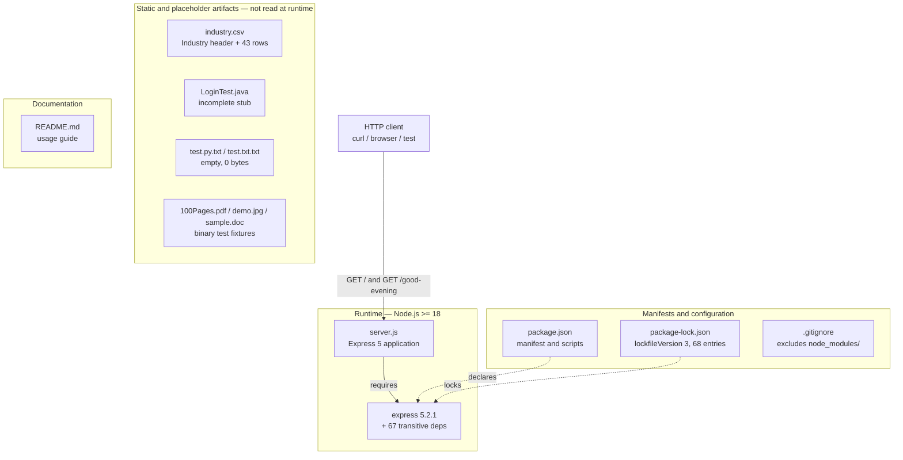
```mermaid
flowchart TB
    Client["HTTP client<br/>curl / browser / test"]

    subgraph Runtime["Runtime — Node.js &gt;= 18"]
        Server["server.js<br/>Express 5 application"]
        Express["express 5.2.1<br/>+ 67 transitive deps"]
    end

    subgraph Config["Manifests and configuration"]
        Pkg["package.json<br/>manifest and scripts"]
        Lock["package-lock.json<br/>lockfileVersion 3, 68 entries"]
        Ignore[".gitignore<br/>excludes node_modules/"]
    end

    subgraph Static["Static and placeholder artifacts — not read at runtime"]
        CSV["industry.csv<br/>Industry header + 43 rows"]
        Java["LoginTest.java<br/>incomplete stub"]
        Empty["test.py.txt / test.txt.txt<br/>empty, 0 bytes"]
        Bin["100Pages.pdf / demo.jpg / sample.doc<br/>binary test fixtures"]
    end

    subgraph Docs["Documentation"]
        Readme["README.md<br/>usage guide"]
    end

    Client -->|"GET / and GET /good-evening"| Server
    Server -->|requires| Express
    Pkg -.declares.-> Express
    Lock -.locks.-> Express
```

#### Component Inventory

| Component | File(s) | Role | Status |
|-----------|---------|------|--------|
| HTTP server | `server.js` | Express app, routing, startup/error handling | Functional (63 lines) |
| Package manifest | `package.json` | Metadata, scripts, `express` dependency | Configured |
| Dependency lock | `package-lock.json` | Deterministic install (lockfileVersion 3, 68 entries) | Present |
| Installed dependencies | `node_modules/` | Express plus 67 transitive packages | Installed |
| VCS ignore | `.gitignore` | Excludes `node_modules/` | Present |
| Documentation | `README.md` | Install / run / endpoint usage guide | Current |
| Static dataset | `industry.csv` | 43 industry categories under an `Industry` header | Static, unused at runtime |
| Java placeholder | `LoginTest.java` | Incomplete `com.blitzyTest` stub | Non-functional |
| Empty placeholders | `test.py.txt`, `test.txt.txt` | 0-byte placeholder files | Placeholder |
| Binary fixtures | `100Pages.pdf`, `demo.jpg`, `sample.doc` | Test document / image / file | Static, unused at runtime |

#### Core Technical Approach

1. **Single-file Express application** — all runtime logic resides in `server.js`, written in CommonJS (`require('express')`).
2. **Framework-based routing** — an `express()` application registers explicit `GET` routes; unmatched paths fall through to Express's default `404` handler.
3. **Hardcoded configuration** — `hostname` (`127.0.0.1`) and `port` (`3000`) are constants; no environment variables are consulted.
4. **Backward-compatible responses** — each route sets `text/plain` explicitly and sends a byte-exact body, preserving the original response contract.
5. **Defensive startup** — the success log is guarded on `server.listening`, and an `error` listener reports bind failures to stderr and sets `process.exitCode = 1` (rather than calling `process.exit()` abruptly).
6. **Deterministic dependencies** — exactly one direct dependency (`express`) with a committed lockfile; installed modules are excluded from version control.

### 1.2.3 Success Criteria

#### Measurable Objectives

| Objective | Measurement | Target / observed |
|-----------|-------------|-------------------|
| Requirement delivery | Delivery of requirements R1–R4 | 4 of 4 delivered |
| Endpoint correctness | Byte-exact response bodies | `GET /` = 14 bytes; `GET /good-evening` = 12 bytes |
| Startup | Server starts via `node server.js` and `npm start` | Both succeed and log the URL |
| Dependency security | `npm audit` vulnerabilities | 0 |

#### Critical Success Factors

- **Backward compatibility** — the `GET /` body remains byte-exact (`Hello, World!\n`).
- **Localhost isolation** — binding stays confined to `127.0.0.1:3000`.
- **Minimal change surface** — the delivery touched only five files (`server.js`, `package.json`, `package-lock.json`, `.gitignore`, `README.md`), keeping the change reviewable.
- **Reproducible installs** — a committed lockfile yields a deterministic dependency tree.
- **Convention preservation** — CommonJS, single-file structure, and hardcoded host/port were retained.

#### Key Performance Indicators

The KPIs below are drawn from the current manifests, source, and the validation recorded in `blitzy/documentation/Project Guide.md`. Latency/throughput targets are intentionally omitted because no measured values exist in the repository.

| KPI | Current value | Source |
|-----|---------------|--------|
| Direct runtime dependencies | 1 (`express` `^5.2.1`) | `package.json` |
| Transitive dependencies | 67 (68 lockfile entries incl. root) | `package-lock.json` |
| `npm audit` vulnerabilities | 0 | `Project Guide.md` |
| Validation checks passed | 8 of 8 | `Project Guide.md` |
| `server.js` size | 63 lines | `server.js` |
| Runtime endpoints | 2 (plus Express default `404`) | `server.js` |

## 1.3 Scope

### 1.3.1 In-Scope Elements

#### Core Features and Functionalities

**Must-have capabilities** (all implemented in `server.js`):

| Capability | Description | Implementation |
|------------|-------------|----------------|
| Application initialization | Create the Express app and disable the framework header | `express()` + `app.disable('x-powered-by')` |
| Root greeting route | `GET /` returns byte-exact `Hello, World!\n` as `text/plain` | `app.get('/', …)` |
| Evening greeting route | `GET /good-evening` returns `Good evening` as `text/plain` | `app.get('/good-evening', …)` |
| Response header hardening | `X-Content-Type-Options: nosniff` on both success routes | `res.set('X-Content-Type-Options', 'nosniff')` |
| Loopback listen + fail-fast | Bind `127.0.0.1:3000`; guard the success log; surface bind errors | `app.listen(…)` + `server.on('error', …)` |
| Startup logging | Print the running URL once the socket is listening | `console.log(…)` |

**Primary user workflow:**


```mermaid
flowchart LR
    A["Developer"] --> B["npm install"]
    B --> C["node server.js<br/>or npm start"]
    C --> D["Server logs<br/>127.0.0.1:3000"]
    D --> E["curl GET / and<br/>GET /good-evening"]
    E --> F["Byte-exact<br/>plain-text responses"]
```

1. The developer runs `npm install` to install Express and its transitive dependencies from the committed lockfile.
2. The developer starts the service with `node server.js` or `npm start`.
3. The service logs `Server running at http://127.0.0.1:3000/` once it is listening.
4. A client issues requests: `GET /` yields `Hello, World!\n`, `GET /good-evening` yields `Good evening`, and any unmatched request yields Express's default `404`.
5. Responses can be verified for both body bytes and headers (`X-Content-Type-Options: nosniff` present, `X-Powered-By` absent).

**Essential integrations** (deliberately minimal):

| Integration | Purpose | Basis |
|-------------|---------|-------|
| npm registry | Install and pin `express` plus transitive packages | Declared in `package.json`, locked in `package-lock.json` |
| Node.js runtime (≥ 18) | Execute `server.js` | Express 5 engine requirement |
| Local HTTP client | Exercise and verify the two endpoints | Documented `curl` examples in `README.md` |

**Key technical requirements:**

| Requirement | Specification |
|-------------|---------------|
| Runtime | Node.js ≥ 18 (Express 5 engine constraint) |
| Framework | Express `^5.2.1` |
| Network binding | Loopback `127.0.0.1` |
| Port | `3000` (hardcoded) |
| Module system | CommonJS (`require`) |

#### Implementation Boundaries

**System boundaries:**

- A single Express application instance.
- Loopback-only binding to `127.0.0.1:3000`.
- Exactly two `GET` routes; all other methods and paths return Express's default `404`.
- Plain-text responses only — no dynamic content, templating, or persistence.
- Hardcoded host and port — no environment-variable configuration.

**User groups covered:**

- Developers and maintainers who run, verify, and extend the service.
- `hxu`, the repository owner/maintainer.
- Automated or manual verification driven by a local HTTP client.

**Geographic / market coverage:**

- Not applicable. The service binds to loopback only and is not deployed to any network, region, cloud, or market. Operation is single-host and single-developer in nature.

**Data domains included:**

| Domain | File | Records | Runtime usage |
|--------|------|---------|---------------|
| Industry categories | `industry.csv` | 43 rows under an `Industry` header | None — static repository artifact, not read by the server |

### 1.3.2 Out-of-Scope Elements

#### Explicitly Excluded Features

| Excluded feature | Rationale |
|------------------|-----------|
| Production deployment / non-localhost exposure | Loopback binding; internal test and tutorial asset |
| Authentication / authorization | No security requirements for a localhost harness |
| TLS / HTTPS encryption | Unnecessary for loopback-only testing |
| Database connectivity / persistence | No stateful data; `industry.csv` is not consumed at runtime |
| Environment-based configuration (`PORT` / `HOST`) | Hardcoded constants ensure consistent behavior |
| Health-check endpoint | Not required within the current scope |
| Structured logging / monitoring / observability | Console output is sufficient |
| Automated test framework / unit tests | Intentionally excluded; the placeholder `npm test` script is left unchanged |
| Linting / formatting tooling | No ESLint/Prettier or `devDependencies` are configured |
| Deployment / CI-CD / containerization | Excluded per the delivery guide |

#### Future Phase Considerations

These items are documented as optional and explicitly outside the current scope in `blitzy/documentation/Project Guide.md`:

- A minimal smoke test to guard the byte-exact response contract against future changes.
- If the service ever moves off localhost: environment-based `PORT`/`HOST` configuration, a health-check endpoint, and structured logging.

The repository also contains placeholder artifacts (`LoginTest.java`, `test.py.txt`, `test.txt.txt`) and a static `industry.csv` dataset. These are not exercised by the current implementation, and no future behavior for them is defined in the codebase.

#### Integration Points Not Covered

The current codebase references none of the following, and each is therefore out of scope:

- External / third-party APIs.
- Databases (SQL or NoSQL).
- Message queues or event streams.
- Cloud service providers (AWS, Azure, GCP).
- Third-party authentication or identity providers.
- CDN or caching layers.
- Container orchestration platforms.

#### Unsupported Use Cases

| Use case | Reason for exclusion |
|----------|----------------------|
| Production traffic / load handling | Single-instance localhost test server |
| Multi-tenant or authenticated access | No authentication or session management |
| Dynamic or templated content serving | Static plain-text responses only |
| Data persistence / stateful sessions | Stateless by design; no storage |
| Non-`GET` semantics on the two routes | Only `GET` routes are registered; other methods return `404` |
| Remote or cross-host access | Loopback binding only |

## 1.4 References

The following repository files, folders, and version-control history were examined as evidence for this section.

**Repository source and configuration files**

- `server.js` — Current Express 5 server: `require('express')`, `app.disable('x-powered-by')`, the two `GET` routes (`/` → `Hello, World!\n`; `/good-evening` → `Good evening`), `nosniff` headers, hardcoded `127.0.0.1:3000`, and the guarded `listen` + `error` handler.
- `package.json` — Package identity (`hello_world`, `1.0.0`, `hxu`, MIT), `main: index.js`, `start`/`test` scripts, and the `express` `^5.2.1` dependency.
- `package-lock.json` — lockfileVersion 3 with 68 total package entries (root + 67 dependencies), establishing the deterministic dependency tree.
- `README.md` — Current usage guide: Node.js 18+ requirement, install/run commands, the endpoint table, and the trailing-newline distinction.
- `.gitignore` — Excludes `node_modules/`.
- `industry.csv` — Static dataset: an `Industry` header followed by 43 category rows; not read at runtime.
- `LoginTest.java` — Incomplete Java stub in the `com.blitzyTest` package (non-functional placeholder).
- `test.py.txt`, `test.txt.txt` — Empty (0-byte) placeholder files.
- `100Pages.pdf`, `demo.jpg`, `sample.doc` — Binary test fixtures present in the working tree (referenced as test document/image/file in the reference specification).
- `node_modules/express/package.json` — Confirmed the resolved Express version (`5.2.1`) and its `engines` requirement (`node >= 18`).

**Documentation**

- `blitzy/documentation/Project Guide.md` — Express delivery guide: requirements R1–R4, the five changed files, security/robustness hardening, the validation results (8 of 8 checks passing, `npm audit` 0 vulnerabilities), business impact, and the explicit out-of-scope list.
- `blitzy/documentation/Technical Specifications.md` — Reference specification for the original native-`http` baseline; source of still-valid business context, stakeholder roles, and scope framing.

**Folders**

- `blitzy/documentation/` — Authoritative prior documentation (the two Markdown documents above).
- `node_modules/` — Installed dependency tree (Express plus 67 transitive packages).

**Version-control history**

- Git commit history — Commit `01e3721` established the original baseline (14-line native-`http` `server.js`; `README.md` reading "test project for backprop integration. Do not touch!"); commits `7dbaf47`, `c2caa49`, `2befd70`, `ec987aa`, `3ba1489`, and `55f5b91` performed the Express re-platforming, documentation, and hardening.

No external web sources were used for this section.

# 2. Product Requirements

## 2.1 Feature Catalog

This catalog decomposes the current Express 5 implementation of `hao-backprop-test` (npm package `hello_world`, version `1.0.0`) into discrete, individually testable features. All runtime behavior resides in a single file, `server.js`, and every feature below is grounded in that source, in the project manifests (`package.json`, `package-lock.json`, `.gitignore`), the user documentation (`README.md`), or the delivery record in `blitzy/documentation/Project Guide.md`. The delivery record frames the implemented work as four requirements (R1–R4) plus two hygiene items (H1–H2) and two constraints (C1–C2); those identifiers are used throughout this section for traceability.

Features F-001 through F-006 constitute the running service. Features F-007 and F-008 are static repository artifacts that physically exist and are version-controlled but are **not read, imported, or served by the running process** — they are catalogued for completeness because they are part of the delivered repository. No feature has been invented; each maps to observed code or files.

**Feature summary:**

| Feature ID | Feature Name | Category | Priority |
|------------|--------------|----------|----------|
| F-001 | Express Application & Routing Foundation | Web Framework / Application Core | Critical |
| F-002 | Root Greeting Endpoint (`GET /`) | HTTP API Endpoint | Critical |
| F-003 | Evening Greeting Endpoint (`GET /good-evening`) | HTTP API Endpoint | High |
| F-004 | HTTP Response Security Hardening | Security / Response Hardening | Medium |
| F-005 | Observable Fail-Fast Startup & Error Handling | Runtime Operations / Reliability | Medium |
| F-006 | Deterministic Dependency Management & Repository Hygiene | Build & Dependency Management | High |
| F-007 | Static Industry Dataset Asset | Static Data Artifact (Non-Runtime) | Low |
| F-008 | Multi-Language Placeholder & Test-Fixture Artifacts | Placeholder / Fixture (Non-Runtime) | Low |

**Status summary:** F-001 through F-006 are **Completed** — each was delivered and independently validated (8 of 8 validation checks passing, `npm audit` reporting 0 vulnerabilities, per `blitzy/documentation/Project Guide.md`). F-007 and F-008 are **Completed** in the sense of being present in their intended, inert placeholder state; `LoginTest.java` is deliberately an incomplete, non-compilable stub.

### 2.1.1 F-001 — Express Application & Routing Foundation

| Attribute | Value |
|-----------|-------|
| Unique ID | F-001 |
| Feature Name | Express Application & Routing Foundation |
| Feature Category | Web Framework / Application Core |
| Priority Level | Critical |
| Status | Completed |
| Requirement Provenance | R1 (Express dependency), R2 (re-platform onto Express with path-based routing) |

**Description**

- **Overview:** `server.js` requires Express (`require('express')`), instantiates a single application object (`const app = express();`), and uses Express's path-based router as the foundation on which all endpoints are registered. Requests that match no registered route fall through to Express's built-in default `404` handler.
- **Business Value:** Replaces the original native-`http` single catch-all handler with a routing layer, enabling multiple differentiated endpoints to be added without structural rewrites — the stated business driver of "enabling path-based routing for future endpoint growth" in `blitzy/documentation/Project Guide.md`.
- **User Benefits:** Developers and maintainers gain a conventional, idiomatic Express surface for adding and reasoning about routes; unknown paths return a clear `404` instead of an undifferentiated success response.
- **Technical Context:** CommonJS module system; a single self-starting `server.js` (no exported application object). Express resolves to version `5.2.1`, which declares `engines: { node: '>= 18' }`. This feature is the prerequisite substrate for F-002, F-003, F-004, and F-005.

**Dependencies**

| Dependency Type | Detail |
|-----------------|--------|
| Prerequisite Features | F-006 (Express must be installed and locked before the app can be created) |
| System Dependencies | Node.js ≥ 18 runtime; CommonJS module loader |
| External Dependencies | `express` `^5.2.1` (resolved `5.2.1`) plus 67 transitive packages from the npm registry |
| Integration Requirements | `npm install` to populate `node_modules/`; loopback TCP stack for binding at `127.0.0.1:3000` |

### 2.1.2 F-002 — Root Greeting Endpoint (`GET /`)

| Attribute | Value |
|-----------|-------|
| Unique ID | F-002 |
| Feature Name | Root Greeting Endpoint (`GET /`) |
| Feature Category | HTTP API Endpoint |
| Priority Level | Critical |
| Status | Completed |
| Requirement Provenance | R3 (preserve original greeting byte-for-byte) |

**Description**

- **Overview:** `app.get('/', …)` responds to `GET /` with the plain-text body `Hello, World!\n` (14 bytes, one trailing newline). The handler explicitly sets `text/plain` via `res.type('text/plain')` and sends the byte-exact body; `server.js` comments identify this route as requirement R3.
- **Business Value:** Guarantees backward compatibility with the original service contract — the greeting is preserved byte-for-byte through the Express re-platforming, protecting any existing consumer or Backprop test baseline that depends on it.
- **User Benefits:** A client issuing `GET /` receives an identical response to the pre-migration server, so no downstream change is required.
- **Technical Context:** Express's `res.send` would default a string body to `text/html`; the explicit `res.type('text/plain')` preserves the original `Content-Type`. Independent execution confirmed `HTTP 200`, `Content-Type: text/plain; charset=utf-8`, `Content-Length: 14`.

**Dependencies**

| Dependency Type | Detail |
|-----------------|--------|
| Prerequisite Features | F-001 (routing foundation) |
| System Dependencies | Express response API (`res.type`, `res.set`, `res.send`) |
| External Dependencies | `express` (transitively) |
| Integration Requirements | An HTTP client (e.g., `curl`, browser, or Node `http` client) on the loopback interface |

### 2.1.3 F-003 — Evening Greeting Endpoint (`GET /good-evening`)

| Attribute | Value |
|-----------|-------|
| Unique ID | F-003 |
| Feature Name | Evening Greeting Endpoint (`GET /good-evening`) |
| Feature Category | HTTP API Endpoint |
| Priority Level | High |
| Status | Completed |
| Requirement Provenance | R4 (add new endpoint) |

**Description**

- **Overview:** `app.get('/good-evening', …)` responds to `GET /good-evening` with the plain-text body `Good evening` (12 bytes, **no** trailing newline). `server.js` comments identify this route as requirement R4.
- **Business Value:** Demonstrates and exercises the newly introduced routing capacity (F-001), validating that additional endpoints can be added cleanly — the concrete deliverable that justified the re-platforming.
- **User Benefits:** Provides a second, distinct, verifiable endpoint that maintainers can use as a template for future routes.
- **Technical Context:** Sets `text/plain` for consistency with the root route. The absence of a trailing newline (unlike `GET /`) is intentional and documented in `README.md`. Independent execution confirmed `HTTP 200`, `Content-Type: text/plain; charset=utf-8`, `Content-Length: 12`.

**Dependencies**

| Dependency Type | Detail |
|-----------------|--------|
| Prerequisite Features | F-001 (routing foundation) |
| System Dependencies | Express response API (`res.type`, `res.set`, `res.send`) |
| External Dependencies | `express` (transitively) |
| Integration Requirements | An HTTP client on the loopback interface |

### 2.1.4 F-004 — HTTP Response Security Hardening

| Attribute | Value |
|-----------|-------|
| Unique ID | F-004 |
| Feature Name | HTTP Response Security Hardening |
| Feature Category | Security / Response Hardening |
| Priority Level | Medium |
| Status | Completed |
| Requirement Provenance | Hardening beyond the AAP minimum (delivery record §1.3, §6) |

**Description**

- **Overview:** Two complementary hardening measures: `app.disable('x-powered-by')` removes the framework-advertising `X-Powered-By` header from all responses, and each success route sets `X-Content-Type-Options: nosniff` via `res.set('X-Content-Type-Options', 'nosniff')`.
- **Business Value:** Reduces information disclosure (the delivery record ties the `X-Powered-By` removal to CWE-200) and provides MIME-sniffing protection parity between success and error responses, improving the service's security posture beyond the original baseline at negligible cost.
- **User Benefits:** Clients and security scanners observe hardened headers; the framework is not advertised on any response.
- **Technical Context:** `res.set()` returns `res`, so the `nosniff` header chains ahead of `res.type().send()` in each handler. Independent execution confirmed `X-Content-Type-Options: nosniff` present on both routes and `X-Powered-By` absent from responses.

**Dependencies**

| Dependency Type | Detail |
|-----------------|--------|
| Prerequisite Features | F-001 (`app.disable` at app level); F-002 and F-003 (the `nosniff` header is set inside their handlers) |
| System Dependencies | Express header APIs (`app.disable`, `res.set`) |
| External Dependencies | `express` (transitively) |
| Integration Requirements | An HTTP client capable of inspecting response headers (e.g., `curl -i`) |

### 2.1.5 F-005 — Observable Fail-Fast Startup & Error Handling

| Attribute | Value |
|-----------|-------|
| Unique ID | F-005 |
| Feature Name | Observable Fail-Fast Startup & Error Handling |
| Feature Category | Runtime Operations / Reliability |
| Priority Level | Medium |
| Status | Completed |
| Requirement Provenance | Robustness hardening beyond the AAP minimum (delivery record §1.3, §6) |

**Description**

- **Overview:** The service binds `127.0.0.1:3000` via `app.listen(port, hostname, callback)`. The success log `Server running at http://127.0.0.1:3000/` is emitted **only** when `server.listening` is true, and a dedicated `server.on('error', …)` handler writes bind/startup failures to stderr and sets `process.exitCode = 1`.
- **Business Value:** Prevents a failed launch (for example, port `3000` already in use) from being reported as success — a defect present in the original baseline where the process could log success and exit `0` despite a failed bind.
- **User Benefits:** Operators receive an accurate, actionable startup signal and a non-zero exit status on failure, making the service safe to script and integrate.
- **Technical Context:** In Express 5 the `listen` callback fires even when the underlying bind fails, so the success message is guarded on `server.listening`. Using `process.exitCode` (rather than `process.exit()`) lets pending output flush and the event loop unwind cleanly. Independent execution confirmed the success log on a clean start, and — on a second instance against a busy port — the stderr message `Failed to start server at http://127.0.0.1:3000/: listen EADDRINUSE: address already in use 127.0.0.1:3000` with exit code `1` and no false success line.

**Dependencies**

| Dependency Type | Detail |
|-----------------|--------|
| Prerequisite Features | F-001 (the Express `app` object being listened on) |
| System Dependencies | Node.js `net`/`http` stack (`app.listen`, server `error` event); `process.exitCode`; `console` |
| External Dependencies | `express` (transitively; `app.listen` wraps Node's HTTP server) |
| Integration Requirements | Availability of loopback port `3000`; stdout/stderr for logging |

### 2.1.6 F-006 — Deterministic Dependency Management & Repository Hygiene

| Attribute | Value |
|-----------|-------|
| Unique ID | F-006 |
| Feature Name | Deterministic Dependency Management & Repository Hygiene |
| Feature Category | Build & Dependency Management / Documentation |
| Priority Level | High |
| Status | Completed |
| Requirement Provenance | R1 (declare/lock/install Express), H1 (`.gitignore`), H2 (`README.md`), C2 (pin patched version) |

**Description**

- **Overview:** `package.json` declares one direct dependency, `express` `^5.2.1`, and `package-lock.json` (lockfileVersion 3, 68 entries = root + 67 dependencies) pins the exact resolved graph. `.gitignore` excludes `node_modules/`, and `README.md` documents the install/run steps and both endpoints (including the trailing-newline distinction).
- **Business Value:** Delivers reproducible installs (a committed lockfile yields a deterministic tree), supply-chain hygiene (`npm audit` reports 0 vulnerabilities), and clear onboarding documentation — supporting the project's value drivers of reproducibility and disciplined change management.
- **User Benefits:** Any developer can `npm install` and obtain an identical dependency tree, then follow the `README.md` to run and verify the service.
- **Technical Context:** The caret range `^5.2.1` combined with the committed lockfile keeps installs deterministic; `node_modules/` is intentionally not committed. The manifest retains `"main": "index.js"` while the executable entry point is `server.js` — an intentional discrepancy preserved under constraint C1.

**Dependencies**

| Dependency Type | Detail |
|-----------------|--------|
| Prerequisite Features | None (foundational) |
| System Dependencies | npm (lockfileVersion 3 implies npm ≥ 7); Git (for `.gitignore` semantics) |
| External Dependencies | npm registry (source of `express` and transitive tarballs) |
| Integration Requirements | `npm install`; version control honoring `.gitignore` |

### 2.1.7 F-007 — Static Industry Dataset Asset

| Attribute | Value |
|-----------|-------|
| Unique ID | F-007 |
| Feature Name | Static Industry Dataset Asset |
| Feature Category | Static Data Artifact (Non-Runtime) |
| Priority Level | Low |
| Status | Completed (present as a static asset) |
| Requirement Provenance | None (pre-existing repository artifact) |

**Description**

- **Overview:** `industry.csv` (749 bytes) contains a single `Industry` header row followed by 43 industry-category rows (`Accounting/Finance` … `Other`). It is a static, version-controlled data file.
- **Business Value:** Retained as a repository data artifact; it contributes to the repository's role as a mixed-artifact test ground but adds no runtime capability.
- **User Benefits:** Available as reference/reusable static data for future or external use; it does not affect the running service.
- **Technical Context:** The file is **not opened, parsed, or served** by `server.js`; the running service consults no data files. It is documented as an in-scope data domain with "no runtime usage" in Section 1.3.1.

**Dependencies**

| Dependency Type | Detail |
|-----------------|--------|
| Prerequisite Features | None |
| System Dependencies | None (not loaded at runtime) |
| External Dependencies | None |
| Integration Requirements | None |

### 2.1.8 F-008 — Multi-Language Placeholder & Test-Fixture Artifacts

| Attribute | Value |
|-----------|-------|
| Unique ID | F-008 |
| Feature Name | Multi-Language Placeholder & Test-Fixture Artifacts |
| Feature Category | Placeholder / Fixture (Non-Runtime) |
| Priority Level | Low |
| Status | Completed (present as intentionally inert placeholders) |
| Requirement Provenance | None (pre-existing repository artifacts) |

**Description**

- **Overview:** A set of non-runtime artifacts present and version-controlled in the repository root: `LoginTest.java` (128 bytes, an incomplete `com.blitzyTest` stub containing a stray `Web` token — non-compilable), `test.py.txt` and `test.txt.txt` (0-byte empty placeholders), and three binary test fixtures — `100Pages.pdf` (~9 MB), `demo.jpg` (~2 MB), and `sample.doc` (~96 KB).
- **Business Value:** Preserves the repository's multi-artifact / multi-language character used for tooling exercises; no production value is claimed.
- **User Benefits:** Serve as inert fixtures/placeholders for experimentation; they impose no behavior on the service.
- **Technical Context:** None of these files is imported, compiled, executed, or served by `server.js`. `LoginTest.java` is intentionally an incomplete stub, not a functioning program.

**Dependencies**

| Dependency Type | Detail |
|-----------------|--------|
| Prerequisite Features | None |
| System Dependencies | None (not loaded, compiled, or served) |
| External Dependencies | None |
| Integration Requirements | None |

## 2.2 Functional Requirements

This section specifies the testable functional requirements for each catalogued feature. Requirement IDs follow the `F-XXX-RQ-YYY` convention. Priority uses the MoSCoW scale (Must-Have / Should-Have / Could-Have) and complexity is rated relative to this deliberately minimal codebase. Because the repository defines **no measured latency or throughput targets** (Section 1.2.3 intentionally omits them for lack of recorded values), performance criteria are stated qualitatively; no numeric SLA is fabricated. All acceptance criteria below were confirmed either by the validation record in `blitzy/documentation/Project Guide.md` or by direct execution of `server.js`.

### 2.2.1 F-001 — Express Application & Routing Foundation

**Requirement details**

| Requirement ID | Description | Priority | Complexity |
|----------------|-------------|----------|------------|
| F-001-RQ-001 | Load Express via `require('express')` and instantiate exactly one application via `express()` | Must-Have | Low |
| F-001-RQ-002 | Route requests by path; unmatched paths and non-registered methods receive Express's default `404` | Must-Have | Low |

**Acceptance criteria**

| Requirement ID | Acceptance Criteria |
|----------------|---------------------|
| F-001-RQ-001 | `node --check server.js` exits `0`; `npm ls express` resolves `express@5.2.1`; the server starts and dispatches requests |
| F-001-RQ-002 | `GET /` and `GET /good-evening` dispatch to their handlers; `GET /nope` and `POST /` return HTTP `404` |

**Technical specifications**

| Requirement ID | Input Parameters | Output / Response | Data Requirements |
|----------------|------------------|-------------------|-------------------|
| F-001-RQ-001 | None (module load at process start) | Initialized Express `app` with routes registered | `node_modules/express` populated by `npm install` |
| F-001-RQ-002 | HTTP method plus request path | Handler dispatch, otherwise default `404` (`text/html; charset=utf-8`, 143-byte page) | None (stateless; no persistence) |

**Performance criteria:** Routing is resolved in-process with no external I/O or shared state; the repository defines no latency or throughput target.

**Validation rules**

| Requirement ID | Business Rules | Data Validation | Security & Compliance |
|----------------|----------------|-----------------|-----------------------|
| F-001-RQ-001 | Exactly one app instance; CommonJS retained (C1) | No request input is parsed or trusted | Dependency graph locked; `npm audit` 0 vulnerabilities |
| F-001-RQ-002 | Only explicitly registered routes succeed | Unknown path/method rejected with `404` (no catch-all body) | Verified default `404` carries `Content-Security-Policy: default-src 'none'` and `X-Content-Type-Options: nosniff` |

### 2.2.2 F-002 — Root Greeting Endpoint (`GET /`)

**Requirement details**

| Requirement ID | Description | Priority | Complexity |
|----------------|-------------|----------|------------|
| F-002-RQ-001 | `GET /` returns the byte-exact body `Hello, World!\n` (14 bytes) with status `200` and `Content-Type: text/plain` | Must-Have | Low |

**Acceptance criteria**

| Requirement ID | Acceptance Criteria |
|----------------|---------------------|
| F-002-RQ-001 | `curl http://127.0.0.1:3000/` returns `Hello, World!` followed by exactly one trailing newline; response is `200`, `Content-Type: text/plain; charset=utf-8`, `Content-Length: 14` |

**Technical specifications**

| Requirement ID | Input Parameters | Output / Response | Data Requirements |
|----------------|------------------|-------------------|-------------------|
| F-002-RQ-001 | `GET` request to path `/` (no query or body consumed) | `200`; `text/plain; charset=utf-8`; `Content-Length: 14`; body `Hello, World!\n` | Static literal body; no data source |

**Performance criteria:** Static in-memory string served without I/O; no defined latency/throughput target in the repository.

**Validation rules**

| Requirement ID | Business Rules | Data Validation | Security & Compliance |
|----------------|----------------|-----------------|-----------------------|
| F-002-RQ-001 | Body preserved byte-for-byte from the original baseline (R3) | Exactly 14 bytes including one trailing `\n`; explicit `text/plain` | `X-Content-Type-Options: nosniff` present; `X-Powered-By` absent; loopback-only exposure |

### 2.2.3 F-003 — Evening Greeting Endpoint (`GET /good-evening`)

**Requirement details**

| Requirement ID | Description | Priority | Complexity |
|----------------|-------------|----------|------------|
| F-003-RQ-001 | `GET /good-evening` returns the body `Good evening` (12 bytes, no trailing newline) with status `200` and `Content-Type: text/plain` | Must-Have | Low |

**Acceptance criteria**

| Requirement ID | Acceptance Criteria |
|----------------|---------------------|
| F-003-RQ-001 | `curl http://127.0.0.1:3000/good-evening` returns `Good evening` with no trailing newline; response is `200`, `Content-Type: text/plain; charset=utf-8`, `Content-Length: 12` |

**Technical specifications**

| Requirement ID | Input Parameters | Output / Response | Data Requirements |
|----------------|------------------|-------------------|-------------------|
| F-003-RQ-001 | `GET` request to path `/good-evening` (no query or body consumed) | `200`; `text/plain; charset=utf-8`; `Content-Length: 12`; body `Good evening` | Static literal body; no data source |

**Performance criteria:** Static in-memory string served without I/O; no defined latency/throughput target in the repository.

**Validation rules**

| Requirement ID | Business Rules | Data Validation | Security & Compliance |
|----------------|----------------|-----------------|-----------------------|
| F-003-RQ-001 | New endpoint delivered under R4 | Exactly 12 bytes with no trailing newline | `X-Content-Type-Options: nosniff` present; `X-Powered-By` absent; loopback-only exposure |

### 2.2.4 F-004 — HTTP Response Security Hardening

**Requirement details**

| Requirement ID | Description | Priority | Complexity |
|----------------|-------------|----------|------------|
| F-004-RQ-001 | Disable the `X-Powered-By` header on all responses via `app.disable('x-powered-by')` | Should-Have | Low |
| F-004-RQ-002 | Set `X-Content-Type-Options: nosniff` on both success routes | Should-Have | Low |

**Acceptance criteria**

| Requirement ID | Acceptance Criteria |
|----------------|---------------------|
| F-004-RQ-001 | `curl -i` on both routes shows no `X-Powered-By` header on any response |
| F-004-RQ-002 | `curl -i` on `GET /` and `GET /good-evening` shows `X-Content-Type-Options: nosniff` |

**Technical specifications**

| Requirement ID | Input Parameters | Output / Response | Data Requirements |
|----------------|------------------|-------------------|-------------------|
| F-004-RQ-001 | Any HTTP response | Response with no `X-Powered-By` header | None |
| F-004-RQ-002 | `GET /` or `GET /good-evening` | Response including `X-Content-Type-Options: nosniff` | None |

**Performance criteria:** Header operations are constant-time in-process; no defined target.

**Validation rules**

| Requirement ID | Business Rules | Data Validation | Security & Compliance |
|----------------|----------------|-----------------|-----------------------|
| F-004-RQ-001 | The framework must not be advertised | Header absent on every response | Mitigates information disclosure (CWE-200, per delivery record) |
| F-004-RQ-002 | Success/error header parity | Header value is exactly `nosniff` | Reduces MIME-sniffing risk (defense-in-depth) |

### 2.2.5 F-005 — Observable Fail-Fast Startup & Error Handling

**Requirement details**

| Requirement ID | Description | Priority | Complexity |
|----------------|-------------|----------|------------|
| F-005-RQ-001 | Bind `127.0.0.1:3000` and log `Server running at http://127.0.0.1:3000/` only when `server.listening` is true | Must-Have | Medium |
| F-005-RQ-002 | On a bind/startup `error`, write the failure to stderr and set a non-zero exit code (fail-fast) | Should-Have | Medium |

**Acceptance criteria**

| Requirement ID | Acceptance Criteria |
|----------------|---------------------|
| F-005-RQ-001 | `node server.js` and `npm start` print the running URL exactly once, only after the socket is listening |
| F-005-RQ-002 | A second instance on a busy port prints `Failed to start server at http://127.0.0.1:3000/: … EADDRINUSE …` to stderr, exits with code `1`, and prints no success line |

**Technical specifications**

| Requirement ID | Input Parameters | Output / Response | Data Requirements |
|----------------|------------------|-------------------|-------------------|
| F-005-RQ-001 | Host `127.0.0.1`, port `3000` (hardcoded constants) | stdout log line plus a listening socket | None |
| F-005-RQ-002 | Node server `error` event (e.g., `EADDRINUSE`) | stderr message; `process.exitCode = 1` | None |

**Performance criteria:** Startup performs a single bind attempt with no retry or backoff; no defined target.

**Validation rules**

| Requirement ID | Business Rules | Data Validation | Security & Compliance |
|----------------|----------------|-----------------|-----------------------|
| F-005-RQ-001 | Success is announced only when actually listening | Log guarded on `server.listening` | Bind is loopback-only, not externally exposed |
| F-005-RQ-002 | A failed launch is never reported as success | Error surfaced to stderr, not swallowed | Non-zero exit enables safe scripting and automation |

### 2.2.6 F-006 — Deterministic Dependency Management & Repository Hygiene

**Requirement details**

| Requirement ID | Description | Priority | Complexity |
|----------------|-------------|----------|------------|
| F-006-RQ-001 | Declare `express` `^5.2.1`, lock the full tree in `package-lock.json`, and install into `node_modules/` deterministically | Must-Have | Low |
| F-006-RQ-002 | `.gitignore` excludes `node_modules/` (H1) | Should-Have | Low |
| F-006-RQ-003 | `README.md` documents install/run commands and both endpoints, including the trailing-newline distinction (H2) | Should-Have | Low |

**Acceptance criteria**

| Requirement ID | Acceptance Criteria |
|----------------|---------------------|
| F-006-RQ-001 | `npm install` is idempotent; `npm ls express` resolves `express@5.2.1`; `npm audit` reports 0 vulnerabilities; lockfileVersion 3 with 68 entries |
| F-006-RQ-002 | `git check-ignore node_modules/` confirms exclusion; `node_modules/` is untracked |
| F-006-RQ-003 | `README.md` lists Node ≥ 18, `npm install`, `node server.js` / `npm start`, and an endpoint table with the newline note |

**Technical specifications**

| Requirement ID | Input Parameters | Output / Response | Data Requirements |
|----------------|------------------|-------------------|-------------------|
| F-006-RQ-001 | `npm install` against the committed lockfile | Reproducible `node_modules/` tree (root plus 67 deps) | `package.json`, `package-lock.json` |
| F-006-RQ-002 | Git operations | `node_modules/` excluded from version control | `.gitignore` |
| F-006-RQ-003 | Reader/operator | Documented usage contract | `README.md` |

**Performance criteria:** Not applicable — build-time and documentation concern with no runtime performance dimension.

**Validation rules**

| Requirement ID | Business Rules | Data Validation | Security & Compliance |
|----------------|----------------|-----------------|-----------------------|
| F-006-RQ-001 | Pin the current patched stable release (C2) | Lockfile integrity (SHA-512 per entry) | `npm audit` 0 vulnerabilities; deterministic supply chain |
| F-006-RQ-002 | Installed dependencies are not version-controlled | `node_modules/` absent from tracked files | Avoids committing third-party code |
| F-006-RQ-003 | Documentation must match implemented behavior | Documented bodies/bytes match `server.js` | Not applicable |

### 2.2.7 F-007 — Static Industry Dataset Asset

**Requirement details**

| Requirement ID | Description | Priority | Complexity |
|----------------|-------------|----------|------------|
| F-007-RQ-001 | `industry.csv` is present and well-formed (an `Industry` header plus 43 category rows) and is not read by the running service | Could-Have | Low |

**Acceptance criteria**

| Requirement ID | Acceptance Criteria |
|----------------|---------------------|
| F-007-RQ-001 | The file exists at repository root with 44 lines (1 header + 43 rows); `server.js` contains no read of it; server behavior is identical with or without the file present |

**Technical specifications**

| Requirement ID | Input Parameters | Output / Response | Data Requirements |
|----------------|------------------|-------------------|-------------------|
| F-007-RQ-001 | None (never loaded) | None (never served) | Single-column CSV (`Industry`) with 43 category values |

**Performance criteria:** Not applicable — the file is not loaded at runtime.

**Validation rules**

| Requirement ID | Business Rules | Data Validation | Security & Compliance |
|----------------|----------------|-----------------|-----------------------|
| F-007-RQ-001 | Static asset, not a runtime data source | Header plus 43 non-empty rows | No exposure — the server never serves or reads the file |

### 2.2.8 F-008 — Multi-Language Placeholder & Test-Fixture Artifacts

**Requirement details**

| Requirement ID | Description | Priority | Complexity |
|----------------|-------------|----------|------------|
| F-008-RQ-001 | Placeholder/fixture artifacts (`LoginTest.java`, `test.py.txt`, `test.txt.txt`, `100Pages.pdf`, `demo.jpg`, `sample.doc`) are present and inert — never imported, compiled, executed, or served | Could-Have | Low |

**Acceptance criteria**

| Requirement ID | Acceptance Criteria |
|----------------|---------------------|
| F-008-RQ-001 | The files exist and are version-controlled; `server.js` references none of them; server behavior is unaffected by their presence or absence |

**Technical specifications**

| Requirement ID | Input Parameters | Output / Response | Data Requirements |
|----------------|------------------|-------------------|-------------------|
| F-008-RQ-001 | None (never loaded) | None (never served) | Inert files: two 0-byte placeholders, one incomplete Java stub, three binary fixtures |

**Performance criteria:** Not applicable — none of the artifacts is loaded at runtime.

**Validation rules**

| Requirement ID | Business Rules | Data Validation | Security & Compliance |
|----------------|----------------|-----------------|-----------------------|
| F-008-RQ-001 | Non-functional placeholders retained as-is | `LoginTest.java` is a known-incomplete stub | No runtime exposure — none are served or executed |

## 2.3 Feature Relationships

The relationships below are limited to those directly evident in `server.js`, the manifests, and `.gitignore`. Because the entire runtime is a single-process, single-file monolith, feature coupling is intentionally shallow: the Express application object created in F-001 is the hub through which the endpoint, hardening, and startup features connect, and the two non-runtime artifact features (F-007, F-008) are fully isolated.

### 2.3.1 Feature Dependency Map

In the diagram, an arrow from **X to Y** (labelled with the enabling mechanism in `server.js` or the manifests) means **X provides or enables Y** — equivalently, Y builds upon X. Nodes are grouped by lifecycle: install-time supply chain, the runtime service, and inert non-runtime artifacts.

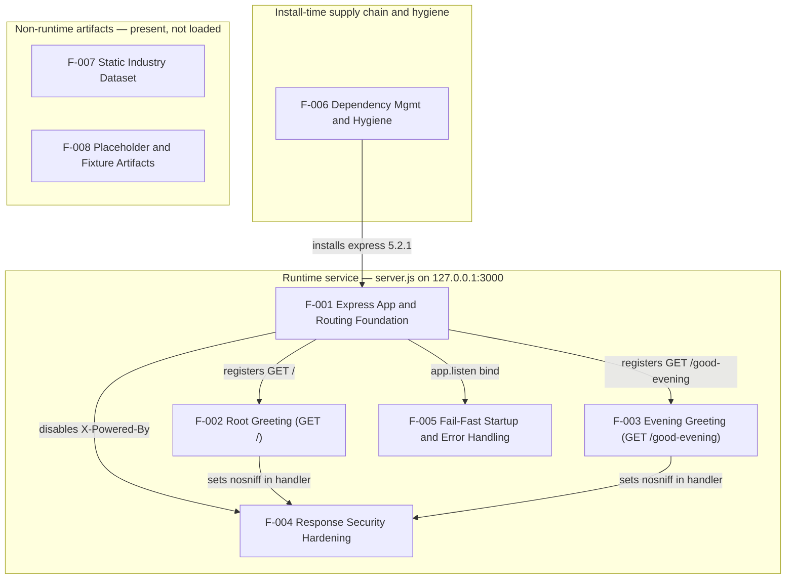
```mermaid
flowchart TD
    subgraph Supply["Install-time supply chain and hygiene"]
        F006["F-006 Dependency Mgmt and Hygiene"]
    end
    subgraph Runtime["Runtime service — server.js on 127.0.0.1:3000"]
        F001["F-001 Express App and Routing Foundation"]
        F002["F-002 Root Greeting (GET /)"]
        F003["F-003 Evening Greeting (GET /good-evening)"]
        F004["F-004 Response Security Hardening"]
        F005["F-005 Fail-Fast Startup and Error Handling"]
    end
    subgraph Inert["Non-runtime artifacts — present, not loaded"]
        F007["F-007 Static Industry Dataset"]
        F008["F-008 Placeholder and Fixture Artifacts"]
    end
    F006 -->|"installs express 5.2.1"| F001
    F001 -->|"registers GET /"| F002
    F001 -->|"registers GET /good-evening"| F003
    F001 -->|"disables X-Powered-By"| F004
    F002 -->|"sets nosniff in handler"| F004
    F003 -->|"sets nosniff in handler"| F004
    F001 -->|"app.listen bind"| F005
```

**Dependency matrix:**

| Feature | Depends On | Depended On By | Relationship Basis |
|---------|-----------|----------------|--------------------|
| F-001 | F-006 | F-002, F-003, F-004, F-005 | Provides the `express()` app and router |
| F-002 | F-001 | F-004 | Route registered on the app; hosts a `nosniff` header |
| F-003 | F-001 | F-004 | Route registered on the app; hosts a `nosniff` header |
| F-004 | F-001, F-002, F-003 | — | `x-powered-by` disabled at app level; `nosniff` set within each handler |
| F-005 | F-001 | — | Calls `app.listen` on the app object |
| F-006 | — | F-001 (and, transitively, all runtime features) | Declares, locks, and installs Express |
| F-007 | — | — | Isolated — never loaded or served |
| F-008 | — | — | Isolated — never loaded, compiled, or served |

### 2.3.2 Integration Points

All integration points are evident in the code and configuration; the service exposes exactly one inbound runtime surface (the loopback HTTP listener) and has no outbound runtime integrations (no database, message queue, or third-party API is referenced anywhere in `server.js`).

| Integration Point | Type | Direction / Lifecycle | Features Involved |
|-------------------|------|-----------------------|-------------------|
| npm registry | Package registry | Outbound, install-time | F-006 → F-001 |
| Loopback HTTP `127.0.0.1:3000` | HTTP over TCP | Inbound, runtime | F-001, F-002, F-003, F-004 |
| `stdout` / `stderr` console | Process I/O | Outbound, runtime | F-005 |
| Node.js runtime and `net`/`http` stack | Host runtime | Hosts the process, runtime | F-001, F-005 |
| Git working tree and `.gitignore` | Source control | Development-time | F-006 |

The repository's broader purpose as a **Backprop integration-test target** (Section 1.1) is an external, read-only, out-of-process concern — Backprop analyzes repository files statically and is **not referenced by any source code**, so it is not a runtime integration of any feature and is deliberately excluded from the map above.

### 2.3.3 Shared Components

| Shared Component | Defined In | Shared By | Purpose |
|------------------|-----------|-----------|---------|
| Express `app` object | `server.js` (F-001) | F-002, F-003, F-004, F-005 | Route registration, `x-powered-by` disable, and `listen` |
| `express` dependency | `package.json` / `node_modules/` (F-006) | All runtime features | The HTTP framework itself |
| Response idiom `res.set(...).type('text/plain').send(...)` | `server.js` (F-002, F-003) | F-002, F-003 (carrying F-004's `nosniff`) | Consistent, hardened plain-text responses |
| `hostname` / `port` constants (`127.0.0.1`, `3000`) | `server.js` | F-005 (bind and both log messages) | Single source of the bind target and logged URL |
| The single `server.js` module | Repository root | F-001 through F-005 | Houses all runtime logic in one file |

### 2.3.4 Common Services

The system has **no internal service decomposition** and therefore no shared internal services in the microservice or service-layer sense. It is a single-process "Minimal Monolith": there is no separate data service, cache, authentication service, message broker, or background worker — consistent with the out-of-scope determinations in Section 1.3.2 and the "not applicable" architecture assessments in Section 6 (System Components Design). The only shared infrastructural substrate is the **Node.js runtime** and the **Express middleware/routing pipeline**, which every runtime feature (F-001 through F-005) relies upon; the technology details of that substrate are documented in Section 3 (Technology Stack). Non-runtime features F-007 and F-008 share nothing with the runtime and participate in no service.

## 2.4 Implementation Considerations

The considerations below reflect only what is observable in the repository. Where the codebase defines no measured target (notably for latency, throughput, and scaling), that absence is stated explicitly rather than filled with assumed figures. The risk framing draws on the LOW-severity risk register in `blitzy/documentation/Project Guide.md` (§6).

### 2.4.1 Technical Constraints

Several constraints apply system-wide and were deliberately preserved during the Express re-platforming (constraint C1): the CommonJS module system, a single self-starting `server.js` (no exported app object), the hardcoded bind target `127.0.0.1:3000` (no `PORT`/`HOST` environment configuration is read), the retained `"main": "index.js"` manifest field despite `server.js` being the true entry point, the Node.js ≥ 18 floor imposed by Express 5, and the intentionally unchanged placeholder `npm test` script (no test framework).

| Feature | Feature-Specific Technical Constraints |
|---------|----------------------------------------|
| F-001 | Single `express()` instance; CommonJS retained; requires Node ≥ 18; app is self-starting and not exported |
| F-002 | Body must stay byte-exact `Hello, World!\n` (14 bytes); `text/plain` must be set explicitly or Express defaults the string body to `text/html` |
| F-003 | Body must stay exactly `Good evening` (12 bytes, no trailing newline) |
| F-004 | `app.disable('x-powered-by')` must run at app scope; `nosniff` is set per-handler (no global middleware is used) |
| F-005 | Hardcoded bind target; single bind attempt (no retry); must use `process.exitCode` rather than `process.exit()`; success log guarded on `server.listening` |
| F-006 | lockfileVersion 3 implies npm ≥ 7; `node_modules/` not committed; caret range `^5.2.1` relies on the committed lockfile for determinism |
| F-007 | Retained as-is; wiring it into the runtime would expand the documented scope |
| F-008 | Retained as-is; `LoginTest.java` is non-compilable and must not be treated as a build input |

### 2.4.2 Performance Requirements

The repository specifies **no numeric latency or throughput requirement** (Section 1.2.3 omits such KPIs because no measured values exist). The following are qualitative characteristics observable from the code, not targets.

| Feature | Observed Performance Characteristic |
|---------|-------------------------------------|
| F-001 | Path routing resolved in-process; Express adds ETag generation, `charset` negotiation, and keep-alive as emergent overhead |
| F-002 / F-003 | Responses are constant, in-memory string literals served with no file, database, or network I/O |
| F-004 | Header set/disable operations are constant-time |
| F-005 | Startup is a single asynchronous bind; no warm-up, pooling, or health polling |
| F-006 | Build-time only; `npm install` is idempotent against the committed lockfile |

Any performance verification is manual (for example, `curl` timing) and is not automated in the repository.

### 2.4.3 Scalability Considerations

The service is a single Node.js process bound to one hardcoded loopback port, so it is **not horizontally scalable in its current form** and no clustering, load-balancing, or process-manager configuration exists (all explicitly out of scope per Section 1.3.2). Two observations temper this:

- **Statelessness aids future scaling.** F-001 through F-005 keep no per-request or shared mutable state, so the handlers themselves would parallelize cleanly if host/port configuration and a process manager were introduced — but those are future-phase items, not present capabilities.
- **Feature-level extensibility is the delivered scalability benefit.** The routing foundation (F-001) is precisely what allows new endpoints (such as F-003) to be added without structural change — the stated purpose of the re-platforming. F-007 and F-008 are inert and impose no scaling concern.

### 2.4.4 Security Implications

| Feature | Security Implication and Mitigation |
|---------|-------------------------------------|
| F-001 | Introduces an Express supply chain of 67 transitive packages; mitigated by a committed lockfile and `npm audit` reporting 0 vulnerabilities (residual risk S1 — periodic audit recommended) |
| F-002 / F-003 | Responses are static with no reflected user input, so there is no injection or templating surface |
| F-004 | `X-Powered-By` removed (CWE-200 information-disclosure hardening); `nosniff` on success routes; the Express default `404` additionally carries `Content-Security-Policy: default-src 'none'` and `nosniff` |
| F-005 | Fail-fast startup prevents a masked bind failure; loopback-only binding keeps the service unreachable off-host (risk S2 accepted for a localhost harness) |
| F-006 | No secrets, credentials, or API keys are present or required; dependency integrity enforced via lockfile SHA-512 hashes |

Cross-cutting: there is **no TLS and no authentication/authorization**, which is an accepted risk because the service binds to loopback only and is never externally exposed. No request body or query string is parsed, so there is no input-validation attack surface in the current routes.

### 2.4.5 Maintenance Requirements

| Feature | Maintenance Requirement |
|---------|-------------------------|
| F-001 | Keep CommonJS and the single-file structure; track the Node ≥ 18 floor as Express evolves |
| F-002 / F-003 | Guard the byte-exact response contract on any future edit (risk T1); an optional smoke test is suggested but out of scope |
| F-004 | Preserve the `nosniff`/`x-powered-by` behavior when adding routes (apply the same pattern to new handlers) |
| F-005 | Preserve the `server.listening` guard and `error` handler when changing startup logic |
| F-006 | Run `npm audit` periodically (risk S1); the caret range can float on lock-less installs, mitigated by the committed lockfile (risk T3); re-lock after intentional upgrades |
| F-007 / F-008 | None — inert artifacts require no maintenance and should not be wired into the runtime |

The overall maintenance surface is deliberately small: the entire delivery touched only five files (`server.js`, `package.json`, `package-lock.json`, `.gitignore`, `README.md`), keeping changes reviewable. The primary standing maintenance obligations are dependency hygiene and preserving the byte-exact endpoint contracts.

## 2.5 Traceability Matrix

This matrix ties every functional requirement to its implementing feature, the exact source evidence, and the validation that confirms it. Line references are to `server.js` as read during this analysis; validation entries derive from `blitzy/documentation/Project Guide.md` (§3) and from direct execution.

### 2.5.1 Requirement-to-Source Traceability

| Requirement ID | Feature | Source Evidence | Validation |
|----------------|---------|-----------------|------------|
| F-001-RQ-001 | F-001 | `server.js` L1 (`require('express')`), L3 (`express()`) | `node --check` exit 0; `npm ls express` → `5.2.1` |
| F-001-RQ-002 | F-001 | `server.js` L19, L30 (routes); Express default `404` fall-through | `GET /nope` and `POST /` → `404` |
| F-002-RQ-001 | F-002 | `server.js` L19–L25 (L24 sends `Hello, World!\n`) | `curl GET /` → 200, 14 bytes, `text/plain` |
| F-003-RQ-001 | F-003 | `server.js` L30–L33 (L32 sends `Good evening`) | `curl GET /good-evening` → 200, 12 bytes |
| F-004-RQ-001 | F-004 | `server.js` L9 (`app.disable('x-powered-by')`) | `curl -i` → `X-Powered-By` absent |
| F-004-RQ-002 | F-004 | `server.js` L24, L32 (`res.set('X-Content-Type-Options','nosniff')`) | `curl -i` → `nosniff` on both routes |
| F-005-RQ-001 | F-005 | `server.js` L45–L53 (L50 guard, L51 log) | `node server.js` / `npm start` log the URL |
| F-005-RQ-002 | F-005 | `server.js` L60–L63 (error handler, L62 `process.exitCode = 1`) | second instance → stderr `EADDRINUSE`, exit `1` |
| F-006-RQ-001 | F-006 | `package.json` L12–14; `package-lock.json` (lockfileVersion 3, 68 entries) | `npm ls`; `npm audit` → 0 vulnerabilities |
| F-006-RQ-002 | F-006 | `.gitignore` (`node_modules/`) | `git check-ignore node_modules/` |
| F-006-RQ-003 | F-006 | `README.md` (requirements, install/run, endpoint table) | Manual documentation review |
| F-007-RQ-001 | F-007 | `industry.csv` (44 lines); no read in `server.js` | File present; server behavior unaffected |
| F-008-RQ-001 | F-008 | `LoginTest.java`, `test.py.txt`, `test.txt.txt`, `100Pages.pdf`, `demo.jpg`, `sample.doc`; no references in `server.js` | Files present and inert |

### 2.5.2 Feature-to-Delivery-Requirement Mapping

The Express delivery was recorded as four requirements (R1–R4), two hygiene items (H1–H2), and two constraints (C1–C2) in `blitzy/documentation/Project Guide.md`. This table maps those identifiers onto the features catalogued in Section 2.1.

| Feature | AAP Requirements / Hygiene | Constraints | Delivery Status |
|---------|----------------------------|-------------|-----------------|
| F-001 | R1, R2 | C1 (conventions preserved) | Completed |
| F-002 | R3 | — | Completed |
| F-003 | R4 | — | Completed |
| F-004 | Security hardening (beyond AAP minimum) | — | Completed |
| F-005 | Robustness hardening (beyond AAP minimum) | — | Completed |
| F-006 | R1, H1, H2 | C2 (patched-version pin) | Completed |
| F-007 | — (pre-existing artifact) | — | Present (non-runtime) |
| F-008 | — (pre-existing artifacts) | — | Present (non-runtime) |

### 2.5.3 Validation Traceability

The delivery record documents eight validation checks (8 of 8 passing; unit tests intentionally excluded). Each is mapped to the feature(s) it exercises.

| Validation Check | Method | Feature(s) Covered | Result |
|------------------|--------|--------------------|--------|
| Functional acceptance (endpoints) | `curl` / Node `http` client | F-002, F-003 | 2 of 2 pass |
| Runtime smoke | `node server.js` and `npm start` | F-001, F-005 | 2 of 2 pass |
| Negative routing | Unmatched path → `404` | F-001 | 1 of 1 pass |
| Static syntax gate | `node --check server.js` | F-001 | 1 of 1 pass |
| Dependency resolution | `npm ls` | F-006 | 1 of 1 pass |
| Dependency audit | `npm audit` | F-006 | 1 of 1 pass |
| Unit tests | None — excluded by design | — | 0 (intentional) |

### 2.5.4 Related Flowcharts and Specifications

| Related Artifact | Relevance to Section 2 Features |
|------------------|---------------------------------|
| Section 1.2.2 (Major System Components diagram) | Component inventory backing F-001 and F-006 |
| Section 1.3.1 (Primary user workflow flowchart) | End-to-end `npm install` → run → `curl` flow across F-002, F-003, F-005, F-006 |
| Section 3 (Technology Stack) | Express/Node/npm details underpinning F-001, F-006 |
| Section 4 (Process Flowchart) | Request/response, startup, and error-handling process flows for F-001, F-002, F-003, F-005 |
| Section 5 (System Architecture) | Component boundaries and data flow for the runtime features |
| Section 6 (System Components Design) | Rationale for why database, microservice, and integration architectures are not applicable (relevant to F-007 and to the "no common services" finding in Section 2.3.4) |
| `blitzy/documentation/Project Guide.md` (§3 validation, §5 compliance, §6 risk) | Authoritative delivery record for requirements, validation results, and risk posture |

## 2.6 Assumptions and Constraints

This sub-section records the assumptions the requirements depend on, the constraints they operate within, and the version provenance of the delivered requirements. A documentation caveat applies throughout: the repository contains an older reference specification (`blitzy/documentation/Technical Specifications.md`) that describes the **superseded** native-`http` baseline; Section 2 documents the **current** Express 5 state as observed in `server.js` and the manifests. Where the two disagree, the current code is authoritative.

### 2.6.1 Assumptions

| ID | Assumption | Basis / Evidence |
|----|------------|------------------|
| A-001 | Node.js ≥ 18 is available on the host | Express 5 declares `engines: { node: '>= 18' }`; `README.md` states the requirement; verified on Node v22.23.1 |
| A-002 | `npm install` is run before startup to populate `node_modules/` from the committed lockfile | `node_modules/` is git-ignored; `README.md` step 1 is `npm install` |
| A-003 | Loopback port `3000` is free at startup | Hardcoded `port = 3000`; a busy port triggers the fail-fast `error` handler (F-005) |
| A-004 | Operation is single-host, single-developer, and loopback-only | Bind target `127.0.0.1`; no external exposure is intended (Section 1.3) |
| A-005 | No environment variables, secrets, database, or external services are required | `server.js` reads none; `package.json` declares only `express` |
| A-006 | The `main: index.js` vs. `server.js` entry-point discrepancy does not affect execution | Documented commands and the `start` script use `server.js`; discrepancy intentionally preserved (C-001) |

### 2.6.2 Constraints

| ID | Constraint | AAP Mapping | Evidence |
|----|------------|-------------|----------|
| C-001 | Preserve original conventions: CommonJS, single-file `server.js`, hardcoded `127.0.0.1:3000`, retained `main: index.js` | C1 | `server.js`; `package.json`; `blitzy/documentation/Project Guide.md` §5 |
| C-002 | Pin a current patched-stable dependency version with a committed lockfile | C2 | `express` `^5.2.1` in `package.json`; `package-lock.json` (lockfileVersion 3); `npm audit` 0 |
| C-003 | Loopback-only binding; no TLS and no authentication/authorization | — | Hardcoded `127.0.0.1`; no TLS/auth code (Section 1.3.2) |
| C-004 | Hardcoded configuration; no `PORT`/`HOST` environment overrides | — | `hostname`/`port` constants in `server.js` |
| C-005 | No automated test framework; verification is manual | — | Placeholder `npm test` exits `1`; no test files or devDependencies |
| C-006 | Exactly one direct runtime dependency; no linter or build tooling | — | Only `express` in `package.json`; no `devDependencies` |
| C-007 | `GET /` body must remain byte-exact (`Hello, World!\n`, 14 bytes) | R3 | `server.js` L24; `README.md`; delivery record |

### 2.6.3 Requirement Version Tracking

The package is at version `1.0.0` (`package.json`). The current requirement set (R1–R4, plus hygiene H1–H2 and constraints C1–C2) was delivered by re-platforming an earlier native-`http` baseline. The table below tracks the provenance of the requirements against the version-control history cited in Section 1.4 and `blitzy/documentation/Project Guide.md` (§2.1, §5).

| Version / Commit | Change | Requirements / Features Affected |
|------------------|--------|----------------------------------|
| Baseline `01e3721` | Original 14-line native-`http` single-handler server; zero dependencies | Pre-migration (superseded) |
| `7dbaf47` | Declare and install `express`; regenerate lockfile; add `.gitignore` | R1, H1 (F-006) |
| `ec987aa` | Re-platform onto `express()` with path-based routing and the two `GET` routes | R2, R3, R4 (F-001, F-002, F-003) |
| `c2caa49`, `838a2ad` | Author and refine `README.md` (endpoint table, trailing-newline note) | H2 (F-006) |
| `2befd70` | Trim `.gitignore` to a minimal `node_modules/` exclusion | H1 (F-006) |
| `3ba1489` | Response header hardening (`x-powered-by` disabled, `nosniff` added) | F-004 |
| `55f5b91` | Observable fail-fast `listen` error handling (non-zero exit on `EADDRINUSE`) | F-005 |

**Requirement version status:** All four requirements (R1–R4) are delivered and independently validated as of package version `1.0.0`; the Section 2 feature catalog (F-001–F-008) and its requirements are documented at revision 1.0 corresponding to this state. Non-runtime artifact features (F-007, F-008) are pre-existing and unversioned within this requirement set.

## 2.7 References

The following repository files, folders, documentation, and technical-specification sections were examined as evidence for Section 2. No external web sources were used.

**Repository source and configuration files**

- `server.js` — Established every runtime feature: `require('express')` and `express()` (F-001), the two `GET` routes and their byte-exact bodies (F-002, F-003), `app.disable('x-powered-by')` and per-handler `nosniff` (F-004), and the guarded `app.listen` plus `error` handler with `process.exitCode = 1` (F-005). Provided the line references in Section 2.5.
- `package.json` — Established package identity (`hello_world` `1.0.0`, `hxu`, MIT), the `express` `^5.2.1` dependency, the `start`/`test` scripts, and the `main: index.js` entry-point discrepancy (F-006, C-001).
- `package-lock.json` — Established the deterministic dependency graph (lockfileVersion 3, 68 entries = root + 67 dependencies) supporting F-006 and constraint C-002.
- `README.md` — Established the documented install/run contract, the endpoint table, and the trailing-newline distinction (hygiene item H2 within F-006).
- `.gitignore` — Established the `node_modules/` exclusion (hygiene item H1 within F-006).

**Repository data and placeholder artifacts**

- `industry.csv` — Established the static dataset (an `Industry` header plus 43 category rows) that is not read at runtime (F-007).
- `LoginTest.java` — Established the incomplete, non-compilable `com.blitzyTest` stub (F-008).
- `test.py.txt`, `test.txt.txt` — Established the 0-byte empty placeholders (F-008).
- `100Pages.pdf`, `demo.jpg`, `sample.doc` — Established the binary test fixtures present in the working tree (F-008).

**Installed dependencies**

- `node_modules/express/package.json` — Confirmed the resolved Express version (`5.2.1`) and its `engines` requirement (`node >= 18`).
- `node_modules/` — Contained the installed Express dependency tree (Express plus 67 transitive packages).

**Documentation**

- `blitzy/documentation/Project Guide.md` — Authoritative delivery record: the definitions of requirements R1–R4, hygiene items H1–H2, and constraints C1–C2; the eight validation checks (§3); the compliance mapping (§5); and the LOW-severity risk register (§6).
- `blitzy/documentation/Technical Specifications.md` — Prior reference specification describing the **superseded** native-`http` baseline; consulted only to confirm which facts are historical rather than current.
- `blitzy/documentation/` — Folder containing the two Markdown documents above.

**Technical Specification cross-references** (retrieved via the specification)

- Section 1.1 Executive Summary — Project identity, the Backprop-integration business problem, stakeholders, and value drivers.
- Section 1.2 System Overview — Primary capabilities, component inventory, and success criteria/KPIs (including the intentional omission of latency/throughput targets).
- Section 1.3 Scope — In-scope capabilities, out-of-scope exclusions, system boundaries, and the `industry.csv` data domain.
- Section 1.4 References — Location of the R1–R4 definitions and the version-control commit history.
- Sections 3 (Technology Stack), 4 (Process Flowchart), 5 (System Architecture), and 6 (System Components Design) — Linked from Section 2.5.4 for stack, process-flow, architecture, and applicability context.

**Runtime verification**

- Independent execution of `server.js` on Node v22.23.1 with `express@5.2.1` — Confirmed the status codes, headers (`nosniff` present, `X-Powered-By` absent, default `404` carrying `Content-Security-Policy: default-src 'none'`), byte-exact bodies (14 and 12 bytes), the startup log, and the `EADDRINUSE` fail-fast exit code that underpin the acceptance criteria in Section 2.2.

# 3. Technology Stack

## 3.1 Programming Languages

This system employs a **deliberately minimal, single-language technology stack**. The entire executable runtime is one JavaScript file (`server.js`) running on Node.js, with the Express framework as its only direct dependency. The stack was inherited from an earlier native-`http` baseline and preserved during the Express 5 re-platforming, so the technology choices below reflect a conscious commitment to minimalism rather than an accumulation of tooling. The figure below orients the whole of Section 3; each layer is expanded in the sub-sections that follow.

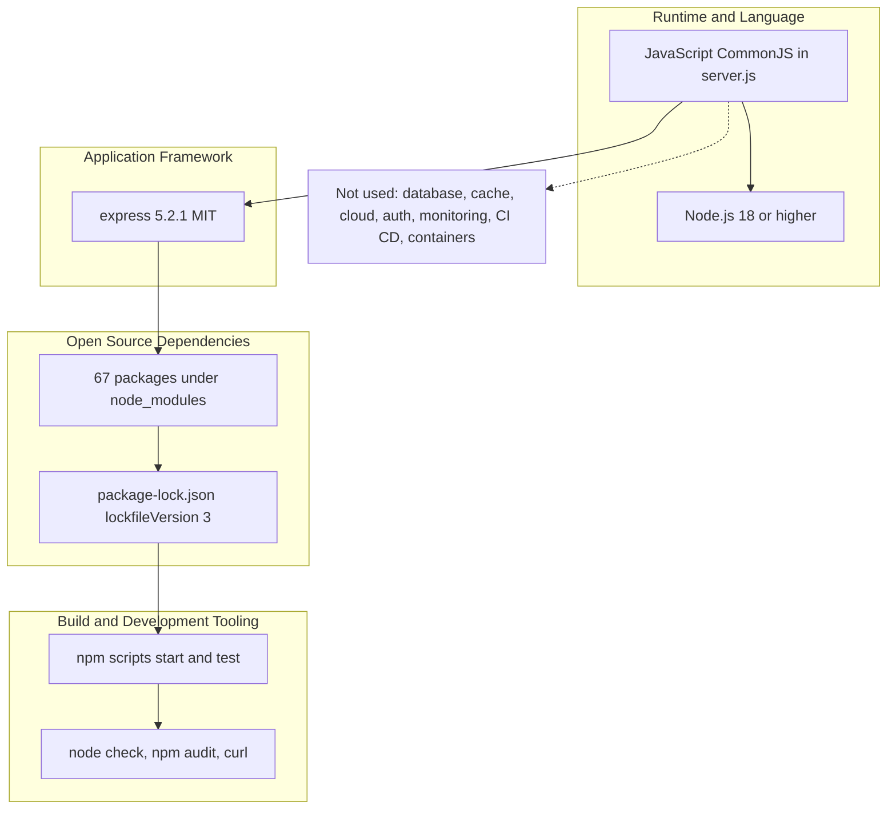
```mermaid
flowchart TB
    subgraph Lang["Runtime and Language"]
        Node["Node.js 18 or higher"]
        JS["JavaScript CommonJS in server.js"]
    end
    subgraph Fw["Application Framework"]
        Express["express 5.2.1 MIT"]
    end
    subgraph Deps["Open Source Dependencies"]
        Tree["67 packages under node_modules"]
        Lock["package-lock.json lockfileVersion 3"]
    end
    subgraph Tooling["Build and Development Tooling"]
        NPM["npm scripts start and test"]
        Val["node check, npm audit, curl"]
    end
    NoExt["Not used: database, cache, cloud, auth, monitoring, CI CD, containers"]

    JS --> Node
    JS --> Express
    Express --> Tree
    Tree --> Lock
    Lock --> NPM
    NPM --> Val
    JS -.-> NoExt
```

### 3.1.1 Runtime Language — JavaScript on Node.js

JavaScript is the only language in the runtime path. All application logic lives in the single source file `server.js`, which is written in modern JavaScript (ES2015+ syntax — `const`, arrow functions, template literals) under the **CommonJS** module system. It is loaded and executed directly by the Node.js runtime with no compilation, transpilation, or bundling step. There is no TypeScript in the project (no `tsconfig.json`, no `.ts` files), and `server.js` is the only `.js` source outside of `node_modules/`.

| Component | Language | Module System | Source | Evidence |
|-----------|----------|---------------|--------|----------|
| HTTP service (routing, responses, startup) | JavaScript (ES2015+) | CommonJS | `server.js` | `require('express')`, `app.get(...)`, `app.listen(...)` |

The CommonJS choice is explicit and observable: the framework is imported with `require`, and `package.json` declares no `"type": "module"` field, so Node treats `server.js` as CommonJS by default.

```javascript
const express = require('express'); // CommonJS require; JavaScript is the sole runtime language
const app = express();
```

### 3.1.2 Language Selection Criteria and Justification

The JavaScript/Node.js choice was **inherited from the project's original baseline and deliberately retained** during the Express re-platforming, per the convention-preservation constraint (C-001 in Section 2.6, "C1" in `blitzy/documentation/Project Guide.md`). The selection criteria observable in the repository are:

- **Minimalism and reproducibility** — a single interpreted language with no build toolchain keeps this tutorial/integration-test harness small and its behavior deterministic; the whole delivery touched only five files.
- **Fit for purpose** — the service's sole responsibility is to serve two static plain-text HTTP endpoints on loopback, which Node.js (through Express) satisfies natively without additional language runtimes.
- **Convention continuity** — retaining CommonJS and the single self-starting `server.js` avoided restructuring during the migration and kept the change reviewable.

### 3.1.3 Language Constraints and Dependencies

The one hard language-runtime constraint is the **Node.js version floor imposed transitively by Express 5**.

| Constraint | Value | Source / Evidence |
|------------|-------|-------------------|
| Minimum Node.js version | `>= 18` | Express 5 `engines: { node: ">= 18" }` (`node_modules/express/package.json`); `README.md` states "Node.js 18 or higher" |
| Documented reference version | Node.js v20.19.6 (compatible) | `blitzy/documentation/` specification |
| Validated runtime | Node.js v22.23.1 | `blitzy/documentation/Project Guide.md` (risk I2) |
| Package manager | npm `>= 7` | Implied by `package-lock.json` `lockfileVersion: 3` |
| Module system | CommonJS (retained) | No `"type": "module"` in `package.json`; `require()` used in `server.js` |

Two related observations: the project's own `package.json` declares **no `engines` field** (the Node floor is inherited from Express, not asserted locally), and there are **no runtime-version pin files** (`.nvmrc`, `.node-version`, `.npmrc` are all absent), so version enforcement relies on the Express engine declaration and the README rather than on tooling.

### 3.1.4 Non-Runtime Placeholder Language Artifacts

The repository additionally contains source-file artifacts in **other languages that are not part of the runtime** and are never executed or compiled by the service. They are documented here for completeness and explicitly excluded from the active technology stack:

| Artifact | Language | Status | Evidence |
|----------|----------|--------|----------|
| `LoginTest.java` | Java (`package com.blitzyTest`) | Incomplete, non-compilable stub (contains a stray `Web` token); not a build input | `LoginTest.java` |
| `test.py.txt` | Python (by name only) | 0-byte placeholder; the `.py.txt` double extension means it is not even a runnable `.py` file | `test.py.txt` |
| `test.txt.txt` | Plain text | 0-byte placeholder | `test.txt.txt` |

These files suggest a multi-language "test ground" heritage but contribute **no runtime language** to the stack. Consistent with Sections 1.2 and 2.4, they are inert and must not be treated as compilation or execution inputs.

## 3.2 Frameworks and Libraries

The application layer is built on exactly **one framework — Express — and no additional first-party supporting libraries**. Every other package in the tree is a transitive dependency pulled in by Express (documented in Section 3.3). This one-framework posture is a stated constraint of the system (C-006 in Section 2.6: "exactly one direct dependency, no linter or build tooling").

### 3.2.1 Application Framework — Express 5.2.1

Express is the sole web framework and the only direct dependency declared by the project. It provides the HTTP server, the routing layer, and the response-construction helpers used throughout `server.js`.

| Attribute | Value | Evidence |
|-----------|-------|----------|
| Package | `express` | `package.json` → `dependencies` |
| Declared range | `^5.2.1` | `package.json` |
| Resolved / installed version | `5.2.1` | `package-lock.json`; `node_modules/express/package.json` |
| License | MIT | `node_modules/express/package.json` |
| Node engine requirement | `>= 18` | `express` `engines` field |
| Funding | Open Collective | `express` package metadata |

Express is imported once at the top of `server.js` using CommonJS and used to instantiate the application object:

```javascript
const express = require('express');
const app = express();
```

### 3.2.2 Express Capabilities Utilized

The service uses a small, well-defined subset of Express's surface area. No sub-routers, view engines, sessions, or body-parsing middleware are wired up (the endpoints are read-only and take no request bodies).

| Capability | Express API used | Purpose in `server.js` |
|------------|------------------|------------------------|
| Path-based routing | `app.get('/', ...)`, `app.get('/good-evening', ...)` | Maps the two `GET` endpoints to handlers |
| Response construction | `res.type('text/plain')`, `res.send(...)` | Sets Content-Type and writes the plain-text body |
| Response headers | `res.set('X-Content-Type-Options', 'nosniff')` | Per-response MIME-sniffing hardening |
| Framework hardening | `app.disable('x-powered-by')` | Suppresses the `X-Powered-By: Express` banner (info-disclosure hardening) |
| Server lifecycle | `app.listen(port, hostname, callback)` | Binds `127.0.0.1:3000` and confirms readiness |

The routing layer is what motivated the framework's adoption: Express's declarative `app.get(path, handler)` model makes adding endpoints (such as `GET /good-evening`) a one-line addition rather than manual URL parsing on the raw request object.

### 3.2.3 Version Declaration, Compatibility, and Supporting Libraries

- **Declared vs. resolved.** `package.json` uses the caret range `^5.2.1`, which permits any `5.x` at or above `5.2.1`; the `package-lock.json` (lockfileVersion 3) pins the exact resolved version `5.2.1` with a SHA-512 integrity hash, so installs are reproducible despite the flexible range. This satisfies the "pin the patched version and commit the lockfile" constraint (C-002 in Section 2.6).
- **Compatibility.** Express 5 raises the runtime floor to Node.js `>= 18`; this is the origin of the language constraint documented in Section 3.1.3 and the "Node.js 18+" statement in `README.md`.
- **Supporting libraries.** There are **no additional directly-declared libraries** — `package.json` has a single `dependencies` entry and no `devDependencies`. The project ships no utility, logging, validation, templating, or middleware libraries of its own; any such functionality present in the tree arrives transitively through Express (see Section 3.3).

### 3.2.4 Framework Selection Justification

Express was introduced during the re-platforming of an earlier zero-dependency native-`http` server, as recorded in `blitzy/documentation/Project Guide.md`. The justification observable from the repository and the already-written specification is:

- **Endpoint growth ergonomics** — the change set added a second route (`GET /good-evening`) and needed a routing abstraction that scales cleanly to additional paths; Express's router replaces hand-rolled `req.url` branching (requirements R1–R4 in the Project Guide).
- **Batteries-included but minimal** — Express provides the response helpers (`res.type`, `res.send`) and header controls used for the security posture, without requiring the team to add further libraries.
- **Mature, permissively licensed, well-supported** — Express is MIT-licensed with a large maintenance base, aligning with the project's permissive-licensing profile (Section 3.3) and low-maintenance goals.

The trade-off is explicitly acknowledged in Section 2.4: adopting Express replaced a zero-dependency baseline with a 67-package transitive tree, accepting a supply-chain surface (risk S1) in exchange for routing ergonomics — a surface the team mitigates by committing the lockfile and running `npm audit` (0 vulnerabilities).

## 3.3 Open Source Dependencies

Although the project declares only one direct dependency, that dependency (Express 5.2.1) transitively pulls in a full HTTP-middleware ecosystem. This sub-section enumerates the complete open-source footprint that ships in `node_modules/` and is pinned by `package-lock.json`.

### 3.3.1 Dependency Tree Overview

| Metric | Value | Evidence |
|--------|-------|----------|
| Direct dependencies | 1 (`express`) | `package.json` → `dependencies` |
| Packages installed under `node_modules/` | 67 | `package-lock.json` (67 `node_modules/*` records) |
| Total lockfile `packages` entries (incl. root project) | 68 | `package-lock.json` |
| Distinct package name@version combinations | 66 | `content-type@2.0.0` is installed twice (see 3.3.2) |
| Lockfile format | `lockfileVersion: 3` | `package-lock.json` (npm ≥ 7) |
| Source registry | `registry.npmjs.org` (all 67) | `resolved` URLs in `package-lock.json` |
| Integrity coverage | 67 / 67 packages carry SHA-512 `integrity` hashes | `package-lock.json` |

The lockfile is committed to source control, so every install resolves to the exact same versions and content hashes — this reproducibility is a stated constraint of the system (C-002 in Section 2.6).

### 3.3.2 Direct versus Transitive Dependencies

Exactly one package is direct; the remaining 66 are transitive, arriving through Express's dependency graph. The functionally significant transitive packages — the ones that implement Express's routing, request/response handling, and content negotiation — are highlighted below.

| Package | Version | Role in the Express stack |
|---------|---------|---------------------------|
| `express` | 5.2.1 | **Direct dependency** — web framework and routing layer |
| `router` | 2.2.0 | Express 5 routing engine |
| `path-to-regexp` | 8.4.2 | Route-path pattern compilation |
| `body-parser` | 2.3.0 | Request-body parsing middleware |
| `finalhandler` | 2.1.1 | Terminal request handler / error responder |
| `send` | 1.2.1 | Byte-stream response primitive |
| `serve-static` | 2.2.1 | Static-file serving middleware |
| `type-is` / `accepts` / `negotiator` | 2.1.0 / 2.0.0 / 1.0.0 | Content-type detection and negotiation |
| `mime-types` / `mime-db` | 3.0.2 / 1.54.0 | MIME-type lookup tables |
| `qs` | 6.15.3 | Query-string parsing |
| `http-errors` / `statuses` | 2.0.1 / 2.0.2 | HTTP error objects and status metadata |
| `cookie` / `cookie-signature` | 0.7.2 / 1.2.2 | Cookie parsing / signing |
| `debug` / `ms` | 4.4.3 / 2.1.3 | Diagnostic logging utilities |

**Duplicate-version note:** `content-type` resolves to two versions in the tree — `1.0.5` hoisted at `node_modules/content-type`, plus `2.0.0` nested under both `body-parser` and `type-is`. npm preserved all three physical installs (two of them the same `2.0.0`), which is why the 67 installed packages span 66 distinct name@version pairs.

### 3.3.3 Complete Dependency Inventory

The full set of packages resolved in `package-lock.json` (alphabetical; `content-type@2.0.0` is installed in two locations):

| Package | Version | License |
|---------|---------|---------|
| `accepts` | 2.0.0 | MIT |
| `body-parser` | 2.3.0 | MIT |
| `bytes` | 3.1.2 | MIT |
| `call-bind-apply-helpers` | 1.0.2 | MIT |
| `call-bound` | 1.0.4 | MIT |
| `content-disposition` | 1.1.0 | MIT |
| `content-type` | 1.0.5 | MIT |
| `content-type` | 2.0.0 | MIT |
| `cookie` | 0.7.2 | MIT |
| `cookie-signature` | 1.2.2 | MIT |
| `debug` | 4.4.3 | MIT |
| `depd` | 2.0.0 | MIT |
| `dunder-proto` | 1.0.1 | MIT |
| `ee-first` | 1.1.1 | MIT |
| `encodeurl` | 2.0.0 | MIT |
| `es-define-property` | 1.0.1 | MIT |
| `es-errors` | 1.3.0 | MIT |
| `es-object-atoms` | 1.1.2 | MIT |
| `escape-html` | 1.0.3 | MIT |
| `etag` | 1.8.1 | MIT |
| `express` | 5.2.1 | MIT |
| `finalhandler` | 2.1.1 | MIT |
| `forwarded` | 0.2.0 | MIT |
| `fresh` | 2.0.0 | MIT |
| `function-bind` | 1.1.2 | MIT |
| `get-intrinsic` | 1.3.0 | MIT |
| `get-proto` | 1.0.1 | MIT |
| `gopd` | 1.2.0 | MIT |
| `has-symbols` | 1.1.0 | MIT |
| `hasown` | 2.0.4 | MIT |
| `http-errors` | 2.0.1 | MIT |
| `iconv-lite` | 0.7.3 | MIT |
| `inherits` | 2.0.4 | ISC |
| `ipaddr.js` | 1.9.1 | MIT |
| `is-promise` | 4.0.0 | MIT |
| `math-intrinsics` | 1.1.0 | MIT |
| `media-typer` | 1.1.0 | MIT |
| `merge-descriptors` | 2.0.0 | MIT |
| `mime-db` | 1.54.0 | MIT |
| `mime-types` | 3.0.2 | MIT |
| `ms` | 2.1.3 | MIT |
| `negotiator` | 1.0.0 | MIT |
| `object-inspect` | 1.13.4 | MIT |
| `on-finished` | 2.4.1 | MIT |
| `once` | 1.4.0 | ISC |
| `parseurl` | 1.3.3 | MIT |
| `path-to-regexp` | 8.4.2 | MIT |
| `proxy-addr` | 2.0.7 | MIT |
| `qs` | 6.15.3 | BSD-3-Clause |
| `range-parser` | 1.3.0 | MIT |
| `raw-body` | 3.0.2 | MIT |
| `router` | 2.2.0 | MIT |
| `safer-buffer` | 2.1.2 | MIT |
| `send` | 1.2.1 | MIT |
| `serve-static` | 2.2.1 | MIT |
| `setprototypeof` | 1.2.0 | ISC |
| `side-channel` | 1.1.1 | MIT |
| `side-channel-list` | 1.0.1 | MIT |
| `side-channel-map` | 1.0.1 | MIT |
| `side-channel-weakmap` | 1.0.2 | MIT |
| `statuses` | 2.0.2 | MIT |
| `toidentifier` | 1.0.1 | MIT |
| `type-is` | 2.1.0 | MIT |
| `unpipe` | 1.0.0 | MIT |
| `vary` | 1.1.2 | MIT |
| `wrappy` | 1.0.2 | ISC |

### 3.3.4 License Composition

Every resolved package uses a permissive, OSI-approved license; there is **no copyleft (GPL/LGPL/AGPL) exposure** anywhere in the tree.

| License | Count | Packages |
|---------|-------|----------|
| MIT | 62 | Majority of the tree (Express and most middleware) |
| ISC | 4 | `inherits`, `once`, `setprototypeof`, `wrappy` |
| BSD-3-Clause | 1 | `qs` |

This uniformly permissive profile means the dependency tree imposes only attribution-style obligations and is compatible with the project's own MIT license (declared in `package.json`).

### 3.3.5 Registry, Integrity, and Security Posture

- **Single registry.** All 67 packages resolve from the public npm registry (`registry.npmjs.org`); there is no private registry, scoped package, or `.npmrc` override in the repository.
- **Cryptographic integrity.** Every lockfile entry carries a `sha512-` `integrity` hash, so `npm ci`/`npm install` verifies package content against the committed hashes.
- **Vulnerability status.** The re-platforming validation recorded in `blitzy/documentation/Project Guide.md` and reflected in Section 1.2 reports **`npm audit` = 0 vulnerabilities** across this tree.
- **Supply-chain consideration.** As noted in Section 2.4 (risk S1), moving from a zero-dependency baseline to a 67-package transitive tree enlarges the supply-chain surface; the committed lockfile with integrity hashes and the clean audit result are the observable mitigations. Keeping the direct-dependency count at exactly one (constraint C-006) bounds how much of this tree the project itself introduces.

## 3.4 Third-Party Services

This system integrates with **no third-party runtime services of any kind**. Documenting this absence is architecturally significant: it defines the system's trust boundary, its (nil) external attack surface, and its zero-configuration deployment model. The only external system involved anywhere in the lifecycle is the npm registry, and that involvement is strictly build-time.

### 3.4.1 External Service Posture

The runtime is fully self-contained. `server.js` performs no outbound network calls, reads no configuration from the environment, and requires no credentials to start. This is consistent with the loopback-only, no-authentication scope constraint (C-003 in Section 2.6) and the "no external dependencies at runtime" characterization in Section 1.2. Direct inspection of `server.js` finds no `process.env` reads, no API keys or secrets, and no external URLs — the only `http://` strings present are the loopback address (`http://127.0.0.1:3000/`) printed to the console on startup and on error.

### 3.4.2 Absence by Service Category

The table below records each candidate integration category from the default technology stack and the evidence that it is not present.

| Service category | Status | Evidence |
|------------------|--------|----------|
| Cloud platform (AWS / Azure / GCP) | Not used | No cloud SDK in the dependency tree; no IaC (`terraform`) or cloud config in the repository |
| Authentication / identity (Auth0, Okta, JWT, Passport) | Not used | No auth SDK in the tree; endpoints are unauthenticated (C-003) |
| Monitoring / observability (Datadog, Sentry, Prometheus, New Relic) | Not used | No APM/telemetry SDK in the tree; logging is `console.log`/`console.error` only |
| External APIs / third-party integrations | Not used | No HTTP client (`axios`, `node-fetch`, `got`, `request`) in the tree; no outbound calls in `server.js` |
| Database / cache as-a-service | Not used | No DB or cache driver in the tree (see Section 3.5) |
| CDN / API gateway / load balancer | Not used | Single process binds `127.0.0.1:3000` directly; no proxy or gateway configuration |
| Managed message queue / event bus | Not used | No broker client in the tree; no async messaging in `server.js` |

A scan of the 67-package dependency tree for common cloud, authentication, monitoring, HTTP-client, database, and cache SDKs returned **no matches** — every package present is part of Express's HTTP-middleware closure (Section 3.3).

### 3.4.3 Build-Time External Touchpoint

The system has exactly one external dependency across its entire lifecycle, and it is not a runtime service:

| Touchpoint | Phase | Purpose | Evidence |
|-----------|-------|---------|----------|
| npm registry (`registry.npmjs.org`) | Build / install time only | Source for Express and its 66 transitive packages during `npm install` / `npm ci` | `resolved` URLs in `package-lock.json` |

No secrets, API keys, tokens, or credentials are required to build, install, or run the service — there are no `.env` files, no configuration files, and no secret-management integration anywhere in the repository.

## 3.5 Databases and Storage

The system has **no database, cache, or storage layer of any kind**. It is a fully stateless HTTP service whose responses are compile-time string literals; it performs no reads or writes to any datastore, filesystem, or network resource at request time.

### 3.5.1 Data Persistence Posture

Both endpoints return fixed, in-memory string literals. There is no application state that survives a request, and no state shared between requests — restarting the process loses nothing because nothing is persisted. Direct inspection of `server.js` confirms the handlers perform **no filesystem, database, or network I/O**: there is no `require('fs')`, no file reads, and no datastore client. The response bodies are the literals `'Hello, World!\n'` (`GET /`) and `'Good evening'` (`GET /good-evening`), written directly via `res.send(...)`.

```javascript
// Responses are in-memory literals — no datastore is consulted
res.set('X-Content-Type-Options', 'nosniff').type('text/plain').send('Hello, World!\n');
```

### 3.5.2 Absence by Storage Category

| Storage category | Status | Evidence |
|------------------|--------|----------|
| Relational database (PostgreSQL, MySQL, SQLite) | Not used | No SQL driver in the dependency tree; no connection string or migration files |
| NoSQL / document store (MongoDB, DynamoDB) | Not used | No document-store driver (`mongodb`, `mongoose`) in the tree |
| Key-value / cache (Redis, Memcached) | Not used | No cache client in the tree; responses are static literals |
| ORM / query builder (Sequelize, TypeORM, Prisma, Knex) | Not used | No ORM package in the tree |
| Object / blob storage (S3, MinIO, GCS) | Not used | No storage SDK in the tree; no upload/download paths in `server.js` |
| Local file / embedded persistence | Not used | No `fs` usage in `server.js`; nothing is written to disk at runtime |

A targeted scan of the 67-package dependency tree for database, cache, ORM, and object-storage drivers returned **no matches**, consistent with the "no persistence layer" characterization in Sections 1.2 and 2.4.

### 3.5.3 Static Data Artifacts (Non-Runtime)

The repository contains data files that are **not part of the runtime data path** and are never opened by the service. They are catalogued here so they are not mistaken for a storage layer.

| Artifact | Description | Runtime role | Evidence |
|----------|-------------|--------------|----------|
| `industry.csv` | 44-line CSV: an `Industry` header row followed by 43 industry-category values (`Accounting/Finance` … `Transportation/Logistics`, `Other`) | None — not referenced by `server.js`; orphan static data | `industry.csv`; no `.csv`/`fs` reference in `server.js` |
| `100Pages.pdf`, `demo.jpg`, `sample.doc` | Binary document/image artifacts | None — inert repository files, not served or read | Repository root listing; not referenced in `server.js` |

These files are leftovers of a mixed-artifact "test ground" repository (see Section 3.1.4) and impose no storage, driver, or persistence requirement on the system.

## 3.6 Development and Deployment

The development and deployment toolchain is intentionally minimal. There is **no build step, no containerization, no infrastructure-as-code, and no CI/CD pipeline**; the project is developed, validated, and run with stock npm and Node.js commands. This minimalism is a deliberate constraint (C-006 in Section 2.6: no linter or build tooling; C-005: no test framework).

### 3.6.1 Build System

The "build" is npm-script-driven and involves no compilation, bundling, or transpilation — Node.js executes `server.js` directly.

| npm script | Command | Purpose |
|------------|---------|---------|
| `start` | `node server.js` | Launches the HTTP service |
| `test` | `echo "Error: no test specified" && exit 1` | Placeholder — deliberately fails; there is no test suite (C-005) |

Observations from `package.json`: there are **no `devDependencies`**, no bundler/transpiler configuration (`tsconfig.json`, `webpack.config.js`, `babel.config.js` are all absent), and the `main` field points at `index.js` even though the actual entry point is `server.js` (a documented metadata discrepancy — the runtime is invoked explicitly as `node server.js`, so the stale `main` field does not affect execution).

### 3.6.2 Development and Validation Tooling

Validation relies on Node's built-in syntax checker and standard npm/CLI utilities rather than a dedicated test or lint stack. The following tools are the observed development-and-validation surface (drawn from `blitzy/documentation/Project Guide.md` and the repository):

| Tool | Role |
|------|------|
| `node --check server.js` | Syntax gate — verifies the source parses before running |
| `npm install` / `npm ci` | Installs the dependency tree from the committed lockfile |
| `npm ls` | Inspects the resolved dependency tree |
| `npm audit` | Vulnerability scan of the dependency tree (reported clean — 0 vulnerabilities) |
| `curl` | Manual endpoint verification against `http://127.0.0.1:3000/` |
| `git` | Version control; `.gitignore` excludes `node_modules/` |

### 3.6.3 Absent Tooling (Intentional)

The absence of the following is confirmed by direct inspection of the repository and is a defining characteristic of the system's operational profile:

| Category | Typical artifacts | Status |
|----------|-------------------|--------|
| Containerization | `Dockerfile`, `docker-compose.yml`, `.dockerignore` | Absent |
| Infrastructure as Code | `terraform` / `main.tf` | Absent |
| CI/CD pipelines | `.github/workflows/`, `.circleci/`, `.gitlab-ci.yml`, `Jenkinsfile`, `.travis.yml` | Absent |
| Linter / formatter | `.eslintrc*`, `.prettierrc` | Absent |
| Test framework | `jest.config.js`, `.mocharc.json` (test script is a placeholder) | Absent |
| Runtime-version pins | `.nvmrc`, `.node-version`, `.npmrc` | Absent |

### 3.6.4 Deployment Model

Deployment is **manual and local**. An operator installs dependencies and starts the process directly on a host; there is no orchestration, no reverse proxy, and no remote target. The service binds the loopback interface `127.0.0.1:3000` (both hardcoded in `server.js`), so it is reachable only from the local machine, and it uses a **fail-fast startup**: the `server.on('error')` handler surfaces bind failures such as `EADDRINUSE` to `stderr` and sets `process.exitCode = 1`, while a `server.listening` guard ensures the success log is only emitted once the socket is truly bound.

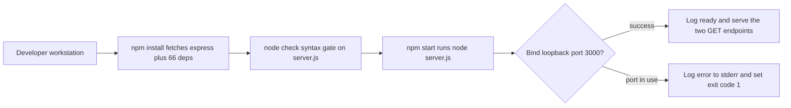
```mermaid
flowchart LR
    Dev["Developer workstation"] --> Install["npm install fetches express plus 66 deps"]
    Install --> Check["node check syntax gate on server.js"]
    Check --> Run["npm start runs node server.js"]
    Run --> Bind{"Bind loopback port 3000?"}
    Bind -->|success| Ready["Log ready and serve the two GET endpoints"]
    Bind -->|port in use| Fail["Log error to stderr and set exit code 1"]
```

This model aligns with the loopback-only, single-process scope described in Sections 1.2 and 2.6 (C-001, C-003): the deployment target is a developer or CI workstation running the process for local use, not a networked or production-grade environment.

## 3.7 References

The following repository files, folders, and specification sections were inspected as the evidentiary basis for this Technology Stack section.

**Repository files**

- `server.js` - Established the sole runtime language (JavaScript/CommonJS), Express usage (routing, `res.type`/`res.send`/`res.set`, `app.disable('x-powered-by')`, `app.listen`), the hardcoded `127.0.0.1:3000` bind, fail-fast error handling, the two static string-literal responses, and the absence of any env-var reads, external calls, or datastore/filesystem I/O.
- `package.json` - Established the single direct dependency (`express ^5.2.1`), the npm `start`/`test` scripts, the MIT project license, the absence of `devDependencies`, and the `main: index.js` metadata discrepancy.
- `package-lock.json` - Established `lockfileVersion: 3`, the 67 installed packages / 68 total entries, exact resolved versions, per-package licenses, the `registry.npmjs.org` origin, SHA-512 integrity hashes, and the `content-type` dual-version resolution.
- `README.md` - Established the "Node.js 18+" requirement, the Express-based framing, the loopback URL, and the two endpoints' plain-text behavior.
- `node_modules/express/package.json` - Established Express's resolved version `5.2.1`, its MIT license, its `engines: { node: ">= 18" }` requirement, and its Open Collective funding metadata.
- `.gitignore` - Established that `node_modules/` is the only ignored path.
- `LoginTest.java` - Established a non-runtime, non-compilable Java placeholder artifact (`package com.blitzyTest`).
- `test.py.txt`, `test.txt.txt` - Established zero-byte, non-runtime placeholder artifacts.
- `industry.csv` - Established a 44-line static dataset (an `Industry` header plus 43 category rows) that is not read at runtime.
- `100Pages.pdf`, `demo.jpg`, `sample.doc` - Established inert binary artifacts with no runtime storage role.

**Repository folders**

- `node_modules/` - Contained the full installed dependency tree (67 packages) forming Express's transitive closure.
- `blitzy/documentation/` - Contained the project documentation subtree.
- `blitzy/documentation/Project Guide.md` - Established the current Express 5 re-platforming state, requirements R1–R4, the validated runtime (Node.js v22.23.1), the `npm audit` = 0 result, and the development/validation tooling.
- `blitzy/documentation/Technical Specifications.md` - Identified as documenting the **superseded** zero-dependency native-`http` baseline; used only to confirm which state is historical (not current).

**Internal specification cross-references**

- Section 1.2 System Overview - Corroborated the Express 5.2.1 current state, the 67-transitive / 68-lockfile dependency counts, `npm audit` = 0, and the two-endpoint behavior.
- Section 2.4 Implementation Considerations - Corroborated the security posture (nosniff, `X-Powered-By` disabled) and the supply-chain consideration (risk S1).
- Section 2.6 Assumptions and Constraints - Corroborated constraints C-001 (convention preservation), C-002 (version pin + lockfile), C-003 (loopback-only, no auth/TLS), C-005 (no test framework), and C-006 (exactly one direct dependency, no linter/build tooling).

# 4. Process Flowchart

## 4.1 System Workflows

This section documents the operational workflows of the service defined in `server.js` — a single-file Express 5 HTTP application. Because the system is a stateless single-process monolith that binds the loopback interface `127.0.0.1:3000` and serves two greeting routes from in-memory string literals, its workflows are deliberately compact: a build-time dependency-installation flow, a fail-fast startup flow, and a per-request routing flow. Every workflow below is grounded in the actual control flow of `server.js` and corroborated by first-hand runtime execution. Where a workflow category enumerated by the section prompt (external API integration, event processing, batch sequences) has no corresponding implementation, that absence is stated explicitly rather than fabricated.

### 4.1.1 System Context, Actors, and Boundaries

The service participates in three interaction contexts, each crossing a distinct boundary. There is **no application-level authentication, authorization, session, or persistence boundary** — the process accepts any TCP client that can reach the loopback interface and responds directly from code.

| Actor / External System | Role | Boundary Crossed | When Active |
|---|---|---|---|
| Developer / Operator | Runs `npm install` and `npm start` (or `node server.js`); reads console output | Shell / process boundary | Build-time and startup |
| npm registry (`registry.npmjs.org`) | Supplies `express` 5.2.1 and its 67 transitive dependencies | Network egress (build-time only) | `npm install` |
| HTTP Client (curl, browser, automated test) | Issues `GET /` and `GET /good-evening` over TCP | Loopback HTTP boundary `127.0.0.1:3000` | Runtime |
| Node.js runtime (`net` / `http` stack) | Hosts the process, manages the listening socket and connection lifecycle | Host runtime boundary | Startup and runtime |
| Console streams (stdout / stderr) | Receive the startup success line and startup failure diagnostics | Process I/O boundary | Startup |

The system boundary is narrow: the process listens **only** on `127.0.0.1`, so it is unreachable from other hosts by design; the sole outbound network interaction (the npm registry) occurs before the process ever runs. The following context diagram places the actors relative to the runtime boundary.

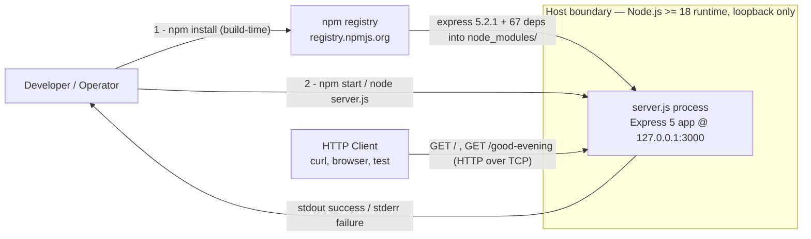
```mermaid
flowchart LR
    Dev["Developer / Operator"]
    Client["HTTP Client<br/>curl, browser, test"]
    Registry["npm registry<br/>registry.npmjs.org"]

    subgraph Host["Host boundary — Node.js &gt;= 18 runtime, loopback only"]
        direction TB
        Proc["server.js process<br/>Express 5 app @ 127.0.0.1:3000"]
    end

    Dev -->|"1 - npm install (build-time)"| Registry
    Registry -->|"express 5.2.1 + 67 deps into node_modules/"| Proc
    Dev -->|"2 - npm start / node server.js"| Proc
    Client -->|"GET / , GET /good-evening (HTTP over TCP)"| Proc
    Proc -->|"stdout success / stderr failure"| Dev
```

### 4.1.2 High-Level System Workflow

The end-to-end lifecycle proceeds through three sequential phases: a **build-time** phase that populates `node_modules/`, a **startup** phase that constructs the Express application and attempts a single socket bind, and a **request-serving** phase that repeats for every inbound HTTP request while the process remains alive. The startup phase is fail-fast: a bind error terminates the readiness path and marks the process for a non-zero exit rather than retrying (feature F-005). The request-serving phase contains the primary routing decision that dispatches to one of two greeting handlers or to the Express default 404.

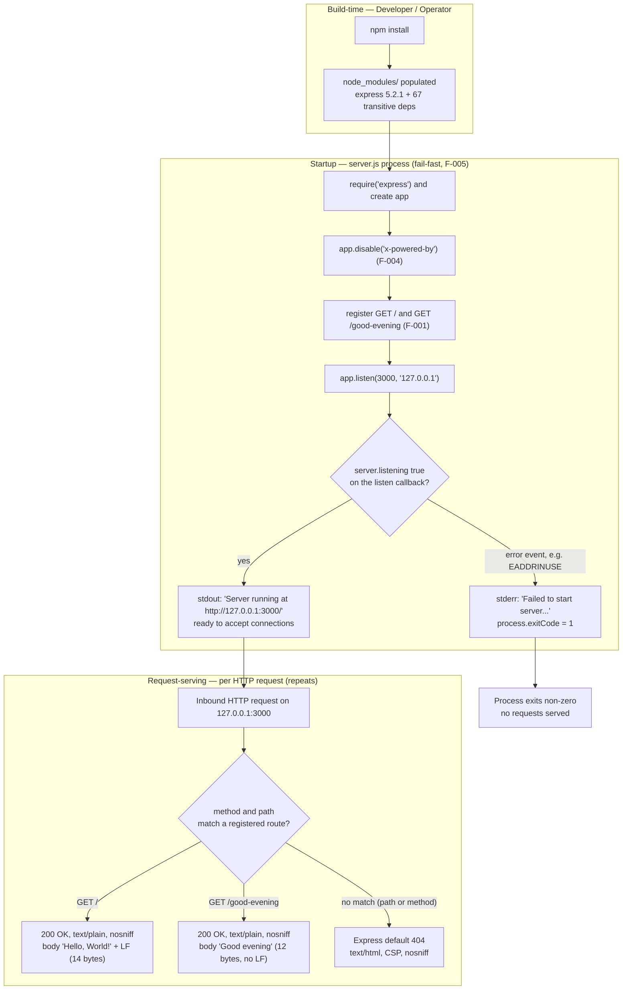
```mermaid
flowchart TB
    subgraph BuildTime["Build-time — Developer / Operator"]
        direction TB
        B1["npm install"] --> B2["node_modules/ populated<br/>express 5.2.1 + 67 transitive deps"]
    end

    subgraph Startup["Startup — server.js process (fail-fast, F-005)"]
        direction TB
        S1["require('express') and create app"] --> S2["app.disable('x-powered-by') (F-004)"]
        S2 --> S3["register GET / and GET /good-evening (F-001)"]
        S3 --> S4["app.listen(3000, '127.0.0.1')"]
        S4 --> S5{"server.listening true<br/>on the listen callback?"}
        S5 -->|"yes"| S6["stdout: 'Server running at http://127.0.0.1:3000/'<br/>ready to accept connections"]
        S5 -->|"error event, e.g. EADDRINUSE"| S7["stderr: 'Failed to start server...'<br/>process.exitCode = 1"]
    end

    subgraph Serving["Request-serving — per HTTP request (repeats)"]
        direction TB
        R1["Inbound HTTP request on 127.0.0.1:3000"] --> R2{"method and path<br/>match a registered route?"}
        R2 -->|"GET /"| R3["200 OK, text/plain, nosniff<br/>body 'Hello, World!' + LF (14 bytes)"]
        R2 -->|"GET /good-evening"| R4["200 OK, text/plain, nosniff<br/>body 'Good evening' (12 bytes, no LF)"]
        R2 -->|"no match (path or method)"| R5["Express default 404<br/>text/html, CSP, nosniff"]
    end

    B2 --> S1
    S6 --> R1
    S7 --> Exit["Process exits non-zero<br/>no requests served"]
```

### 4.1.3 Core Business Process: End-to-End HTTP Request Lifecycle

The core business process of the running service is servicing a single HTTP request. There is exactly one meaningful decision point in the request path — whether the incoming method-and-path tuple matches one of the two registered `GET` routes — and its two branches are a matched greeting handler or the framework's default 404 finalizer. Each greeting handler applies the same security hardening (the `X-Content-Type-Options: nosniff` header, feature F-004) and writes a fixed-length plain-text body with no I/O, no downstream calls, and no shared mutable state. Responses are therefore served synchronously from string literals; the only observable timing constant is the Node.js default `Keep-Alive: timeout=5` on the connection, and **no numeric latency or throughput SLA is defined anywhere in the repository.**

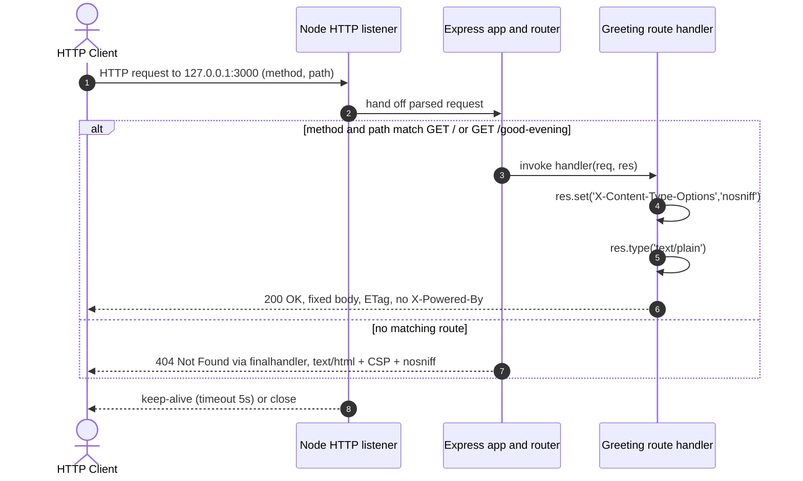
```mermaid
sequenceDiagram
    autonumber
    actor Client as HTTP Client
    participant Net as Node HTTP listener
    participant App as Express app and router
    participant H as Greeting route handler
    Client->>Net: HTTP request to 127.0.0.1:3000 (method, path)
    Net->>App: hand off parsed request
    alt method and path match GET / or GET /good-evening
        App->>H: invoke handler(req, res)
        H->>H: res.set('X-Content-Type-Options','nosniff')
        H->>H: res.type('text/plain')
        H-->>Client: 200 OK, fixed body, ETag, no X-Powered-By
    else no matching route
        App-->>Client: 404 Not Found via finalhandler, text/html + CSP + nosniff
    end
    Net-->>Client: keep-alive (timeout 5s) or close
```

#### 4.1.3.1 Decision Points and Branch Outcomes

The request lifecycle contains a single routing decision that resolves to one of three terminal outcomes, all verified by direct execution:

| Decision Point | Condition Evaluated | Branch Outcome | Verified Response |
|---|---|---|---|
| Route match | `GET /` | Root greeting handler (F-002) | `200 OK`, `text/plain; charset=utf-8`, `Content-Length: 14`, body `Hello, World!` + LF |
| Route match | `GET /good-evening` | Evening greeting handler (F-003) | `200 OK`, `text/plain; charset=utf-8`, `Content-Length: 12`, body `Good evening` (no LF) |
| Route match | Unknown path (e.g. `GET /nope`) | Express default 404 (F-001) | `404 Not Found`, `text/html; charset=utf-8`, `Content-Length: 143`, body `Cannot GET /nope` |
| Route match | Known path, wrong method (e.g. `POST /`) | Express default 404 (F-001) | `404 Not Found`, `text/html; charset=utf-8`, `Content-Length: 140`, body `Cannot POST /` |

Two behaviors on the 404 branch are emergent framework defaults rather than route code: Express's `finalhandler` emits the response as `text/html` and attaches `Content-Security-Policy: default-src 'none'` alongside `X-Content-Type-Options: nosniff`. The greeting handlers, by contrast, set `nosniff` explicitly and never emit a `Content-Security-Policy` header. The user touchpoint in all branches is the HTTP client; there is no interactive UI, form, or multi-step user journey beyond the single request/response exchange.

### 4.1.4 Integration Workflows

The service has exactly **one** integration workflow — the build-time supply-chain flow that resolves and installs dependencies from the npm registry. At runtime the process performs **no outbound integration of any kind**: there are no third-party API calls, no database or cache connections, no message-broker or event-stream producers/consumers, and no scheduled or batch jobs. This is confirmed by the source (`server.js` contains a single `require('express')` and no network-client, queue, or scheduler code) and matches the integration inventory established in the specification.

#### 4.1.4.1 Build-Time Supply-Chain Workflow

`npm install` reads the manifest (`package.json`) and the lockfile (`package-lock.json`, `lockfileVersion 3`, 68 entries = the root project plus 67 dependency records), resolves the pinned `express ^5.2.1`, downloads the tarballs, verifies each package's `integrity` (SHA-512) hash, and materializes the dependency tree under `node_modules/`. This is the only workflow in which the system communicates with an external network endpoint, and it completes before the server process starts (feature F-006).

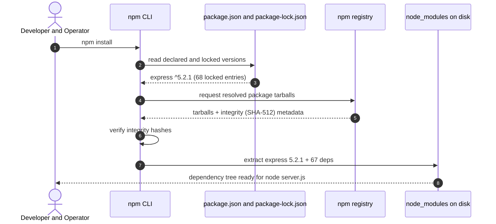
```mermaid
sequenceDiagram
    autonumber
    actor Dev as Developer and Operator
    participant CLI as npm CLI
    participant Manifest as package.json and package-lock.json
    participant Reg as npm registry
    participant FS as node_modules on disk
    Dev->>CLI: npm install
    CLI->>Manifest: read declared and locked versions
    Manifest-->>CLI: express ^5.2.1 (68 locked entries)
    CLI->>Reg: request resolved package tarballs
    Reg-->>CLI: tarballs + integrity (SHA-512) metadata
    CLI->>CLI: verify integrity hashes
    CLI->>FS: extract express 5.2.1 + 67 deps
    FS-->>Dev: dependency tree ready for node server.js
```

#### 4.1.4.2 Runtime Integration Surface

At runtime the only integration surfaces are inbound loopback HTTP and outbound console logging. The table below enumerates every integration point of the system and its direction, consolidating the integration inventory of the specification with the observed runtime behavior.

| Integration Point | Direction | Lifecycle Phase | Notes |
|---|---|---|---|
| npm registry (`registry.npmjs.org`) | Outbound (network) | Build-time only | Supplies `express` 5.2.1 + 67 deps; never contacted at runtime |
| Loopback HTTP `127.0.0.1:3000` | Inbound | Runtime | Only channel for serving requests; not exposed off-host |
| Console streams (stdout / stderr) | Outbound (process I/O) | Startup | Startup success on stdout; bind failure diagnostics on stderr (F-005) |
| Node.js `net` / `http` stack | Host runtime | Startup and runtime | Provides the listening socket and connection lifecycle |
| Git / `.gitignore` | Local (dev-time) | Development | Excludes `node_modules/` from version control (hygiene, H1) |

#### 4.1.4.3 Non-Applicable Integration Categories

The section prompt enumerates several integration categories that do not apply to this system. To prevent ambiguity, each is documented explicitly as absent, with the supporting evidence:

- **Data flow between systems (runtime):** None. Each response is derived solely from a hardcoded string literal inside `server.js`; no request data is read, transformed, or forwarded to another system.
- **Third-party / external API interactions:** None. The process opens no outbound sockets after startup and imports no HTTP/SDK client.
- **Event processing flows:** None. There is no message broker, queue, publisher, subscriber, or event stream beyond the Node.js request/response cycle; the only event handler registered is `server.on('error', ...)` for the bind failure path.
- **Batch processing sequences:** None. There is no scheduler, cron entry, worker, or bulk-processing routine; the static dataset `industry.csv` (feature F-007) is present on disk but never opened or read by the runtime.

## 4.2 Detailed Process Flows by Feature

This section decomposes each runtime feature of `server.js` into a detailed flow: the fail-fast startup/bind sequence (F-005), the two greeting endpoints (F-002 and F-003), and the framework-default unmatched-route handler (F-001). Every step, decision, and terminal state below is taken directly from the 63-line source and confirmed by first-hand execution. Because responses are produced synchronously from in-memory string literals with no I/O, there are no intermediate persistence, queueing, or downstream-call steps in any flow; the only timing element present anywhere is the connection-level `Keep-Alive: timeout=5` applied by the Node.js HTTP layer.

### 4.2.1 Server Startup and Fail-Fast Bind Sequence (F-005)

Startup constructs the app, disables `X-Powered-By`, registers both routes, then calls `app.listen(port, hostname, callback)` on `127.0.0.1:3000`. The sequence is deliberately fail-fast and makes a **single bind attempt with no retry or backoff**. Two subtleties drive the design: in Express 5 the listen callback fires **even when the bind fails** (with `server.listening === false`), and a separate `'error'` event carries the real failure. The success log is therefore guarded on `server.listening` (so a failed bind never prints a misleading "Server running" line), and a dedicated `server.on('error', ...)` handler reports the failure to **stderr** and sets `process.exitCode = 1` (verified: a second instance on a busy port produced empty stdout, exit code 1, and an `EADDRINUSE` message on stderr).

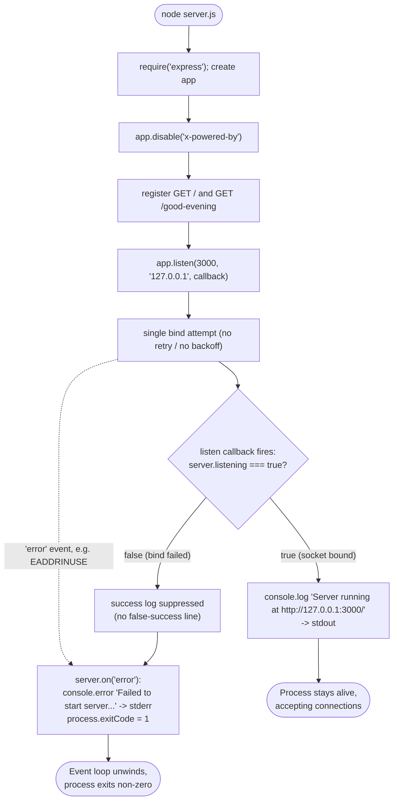
```mermaid
flowchart TB
    Start(["node server.js"]) --> A1["require('express'); create app"]
    A1 --> A2["app.disable('x-powered-by')"]
    A2 --> A3["register GET / and GET /good-evening"]
    A3 --> A4["app.listen(3000, '127.0.0.1', callback)"]
    A4 --> A5["single bind attempt (no retry / no backoff)"]

    A5 --> CB{"listen callback fires:<br/>server.listening === true?"}
    CB -->|"true (socket bound)"| OK["console.log 'Server running at http://127.0.0.1:3000/'<br/>-> stdout"]
    CB -->|"false (bind failed)"| Suppress["success log suppressed<br/>(no false-success line)"]

    A5 -.->|"'error' event, e.g. EADDRINUSE"| ERR["server.on('error'):<br/>console.error 'Failed to start server...' -> stderr<br/>process.exitCode = 1"]

    OK --> Ready(["Process stays alive,<br/>accepting connections"])
    Suppress --> ERR
    ERR --> Dead(["Event loop unwinds,<br/>process exits non-zero"])
```

Start point: the `node server.js` invocation (or `npm start`). End points: a long-lived listening process (success) or a clean non-zero exit (failure). The only decision diamond is the `server.listening` guard inside the listen callback; the error path is triggered by the asynchronous `'error'` event rather than by a synchronous branch. `process.exitCode` is set instead of calling `process.exit`, allowing pending output to flush and the event loop to unwind cleanly.

### 4.2.2 Root Greeting Endpoint — GET / (F-002, R3)

The root handler preserves the original service's greeting byte-for-byte. It chains `res.set('X-Content-Type-Options', 'nosniff')` (F-004 hardening) into `res.type('text/plain')` and `send('Hello, World!\n')`. The body is exactly 14 bytes including the single trailing newline, yielding `200 OK` with `Content-Type: text/plain; charset=utf-8`, `Content-Length: 14`, a weak `ETag`, and no `X-Powered-By` header (verified by execution).

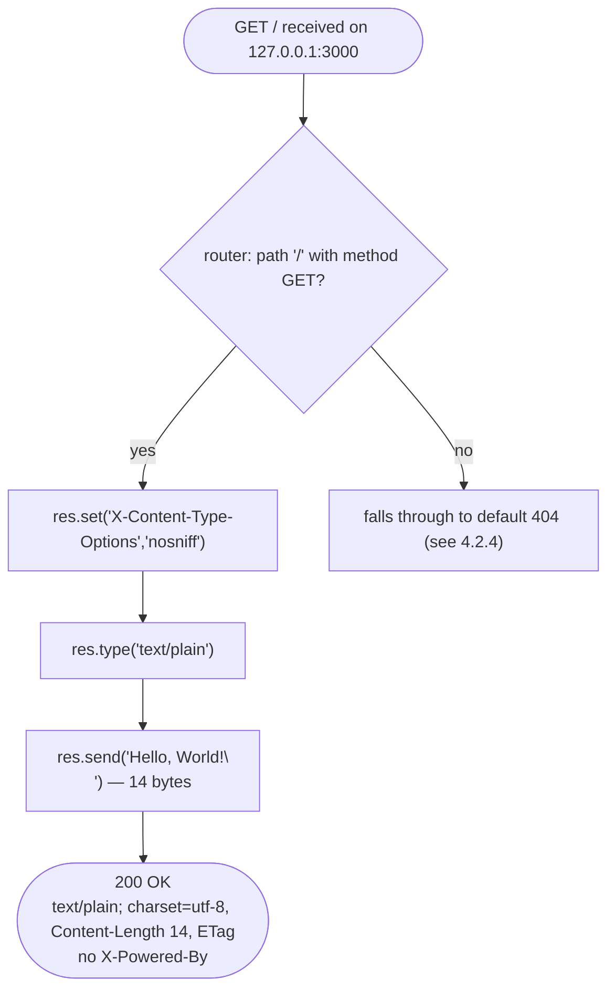
```mermaid
flowchart TB
    In(["GET / received on 127.0.0.1:3000"]) --> D{"router: path '/' with method GET?"}
    D -->|"yes"| H1["res.set('X-Content-Type-Options','nosniff')"]
    H1 --> H2["res.type('text/plain')"]
    H2 --> H3["res.send('Hello, World!\\n') — 14 bytes"]
    H3 --> Out(["200 OK<br/>text/plain; charset=utf-8, Content-Length 14, ETag<br/>no X-Powered-By"])
    D -->|"no"| NF["falls through to default 404 (see 4.2.4)"]
```

Start point: an inbound `GET /`. End point: a `200 OK` plain-text response. There is no data validation, authentication, or persistence step — the handler neither reads request input nor touches external state. The single decision is the router's path/method match; a non-match falls through to the default 404 flow documented in 4.2.4.

### 4.2.3 Evening Greeting Endpoint — GET /good-evening (F-003, R4)

The evening handler mirrors the root handler's structure but returns `'Good evening'` **without** a trailing newline — a 12-byte body. It applies the same `nosniff` header and `text/plain` type, producing `200 OK` with `Content-Length: 12` and a distinct weak `ETag` (verified by execution). The deliberate absence of the trailing newline is the only material difference from the root route.

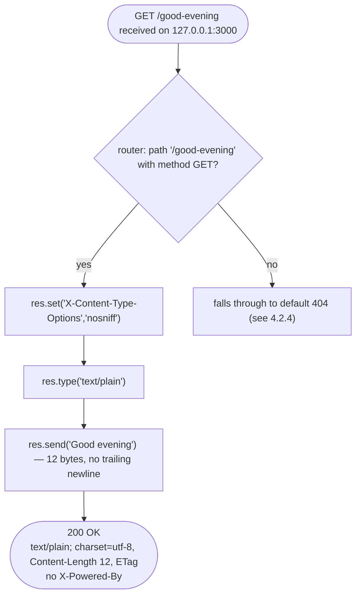
```mermaid
flowchart TB
    In(["GET /good-evening received on 127.0.0.1:3000"]) --> D{"router: path '/good-evening' with method GET?"}
    D -->|"yes"| H1["res.set('X-Content-Type-Options','nosniff')"]
    H1 --> H2["res.type('text/plain')"]
    H2 --> H3["res.send('Good evening') — 12 bytes, no trailing newline"]
    H3 --> Out(["200 OK<br/>text/plain; charset=utf-8, Content-Length 12, ETag<br/>no X-Powered-By"])
    D -->|"no"| NF["falls through to default 404 (see 4.2.4)"]
```

Start point: an inbound `GET /good-evening`. End point: a `200 OK` plain-text response. As with the root route there are no validation, authorization, or persistence steps, and the sole decision is the router's path/method match.

### 4.2.4 Unmatched Route and Default 404 Flow (F-001)

The application registers **no** catch-all route, error middleware, or custom 404 handler. Any request whose method-and-path tuple does not match `GET /` or `GET /good-evening` — whether an unknown path or a wrong method on a known path — falls through to Express's built-in `finalhandler`, which produces a `404 Not Found`. This response is `text/html; charset=utf-8` and, notably, carries `Content-Security-Policy: default-src 'none'` together with `X-Content-Type-Options: nosniff` — headers added by the framework's finalizer, not by any route code. Verified bodies: `Cannot GET /nope` (143 bytes) for an unknown path and `Cannot POST /` (140 bytes) for a wrong method on the root path.

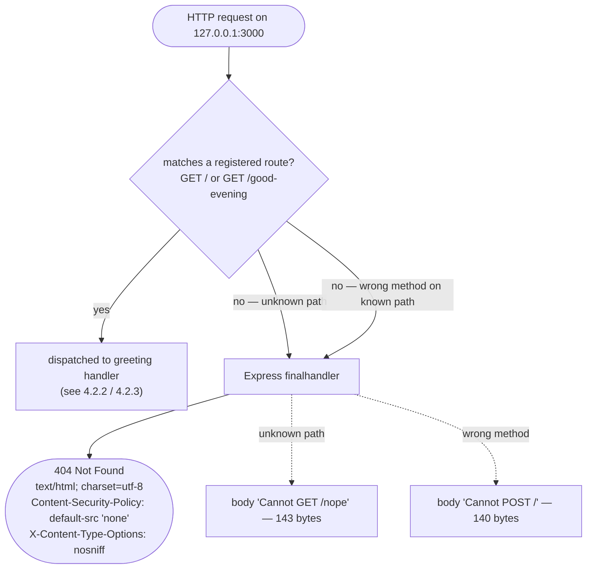
```mermaid
flowchart TB
    In(["HTTP request on 127.0.0.1:3000"]) --> M{"matches a registered route?<br/>GET / or GET /good-evening"}
    M -->|"yes"| Handled["dispatched to greeting handler<br/>(see 4.2.2 / 4.2.3)"]
    M -->|"no — unknown path"| FH["Express finalhandler"]
    M -->|"no — wrong method on known path"| FH
    FH --> R404(["404 Not Found<br/>text/html; charset=utf-8<br/>Content-Security-Policy: default-src 'none'<br/>X-Content-Type-Options: nosniff"])
    FH -.->|"unknown path"| B1["body 'Cannot GET /nope' — 143 bytes"]
    FH -.->|"wrong method"| B2["body 'Cannot POST /' — 140 bytes"]
```

Start point: any inbound request. End point: a framework-generated `404 Not Found`. The decision diamond is the router's overall match test with two distinct no-match causes (unknown path, wrong method), both converging on the same finalizer. This flow is the system's only implicit error state on the request path; it requires no recovery action from the client beyond issuing a supported request.

## 4.3 Validation Rules, Authorization, and Compliance Checkpoints

This section documents the business rules, data-validation posture, authorization checkpoints, and regulatory-compliance checks that apply along the workflows in 4.1 and 4.2. The dominant finding is that the service enforces a small set of **routing and output-hardening rules** and performs **no application-level input validation, authentication, authorization, or regulatory-compliance processing**. Rather than omit the absent categories, each is documented explicitly with its supporting evidence so the enforcement surface is unambiguous.

### 4.3.1 Business Rules Enforced at Each Step

The rules below are the complete set enforced by `server.js`. They are structural (route shape and response shape) and security-posture rules; none are data-content or identity rules.

| Workflow Step | Business Rule | Evidence (`server.js`) |
|---|---|---|
| Route registration | Only `GET /` and `GET /good-evening` are served; every other method/path is unmatched | `app.get('/')`, `app.get('/good-evening')` — no other routes, no `app.use` middleware |
| Root response body | Body must be the byte-exact greeting `Hello, World!` + trailing newline (14 bytes) for backward compatibility (R3) | `send('Hello, World!\n')` with explicit `type('text/plain')` |
| Evening response body | Body must be `Good evening` with **no** trailing newline (12 bytes) (R4) | `send('Good evening')` with explicit `type('text/plain')` |
| All responses | The framework must not be advertised — no `X-Powered-By` header on any response (F-004, CWE-200) | `app.disable('x-powered-by')` |
| 200 responses | Successful greeting responses carry `X-Content-Type-Options: nosniff` and `text/plain` (F-004) | `res.set('X-Content-Type-Options','nosniff').type('text/plain')` in both handlers |
| Startup announcement | A success line is emitted only once the socket is actually bound; a failed bind must not report success (F-005) | `if (server.listening)` guard around `console.log` |
| Startup failure | Bind/startup errors must surface to stderr and force a non-zero exit | `server.on('error', ...)` -> `console.error(...)` + `process.exitCode = 1` |

### 4.3.2 Data Validation Posture

The service performs **no request-data validation** because it consumes no request data. Neither handler reads `req.body`, `req.query`, `req.params`, headers, or any other request-derived value; each responds with a fixed literal. Consequently there is no schema validation, type coercion, sanitization, length check, or content-negotiation logic in the application. The only input that influences behavior is the request line itself (method and path), and the sole gate applied to it is Express's exact-match routing: a request either matches one of the two registered `GET` routes or falls through to the default `404` (see 4.2.4). There is no request-body size limit, no parser (e.g. `express.json`) mounted, and therefore no payload-validation step to document.

### 4.3.3 Authorization and Access Checkpoints

There are **no application-level authentication or authorization checkpoints**. The code registers no authentication middleware, checks no credentials, tokens, API keys, cookies, or session state, and evaluates no roles, scopes, or permissions before invoking a handler. Likewise there is no rate-limiting, quota, or IP-allowlist logic in the application.

The single access control present is a **network-boundary** one and is implicit rather than coded as a checkpoint: the server binds only the loopback address `127.0.0.1`, so it is reachable only by clients on the same host and is unreachable from other machines by design. Any client that can open a TCP connection to `127.0.0.1:3000` is served without further gating. The following diagram shows the complete set of gates a request actually passes through.

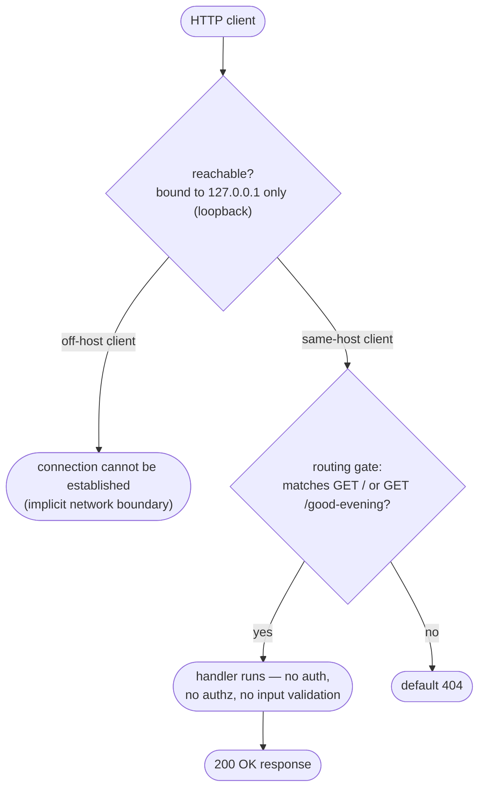
```mermaid
flowchart TB
    C(["HTTP client"]) --> G1{"reachable?<br/>bound to 127.0.0.1 only (loopback)"}
    G1 -->|"off-host client"| Block(["connection cannot be established<br/>(implicit network boundary)"])
    G1 -->|"same-host client"| G2{"routing gate:<br/>matches GET / or GET /good-evening?"}
    G2 -->|"yes"| Serve(["handler runs — no auth,<br/>no authz, no input validation"])
    G2 -->|"no"| NF(["default 404"])
    Serve --> Done(["200 OK response"])
```

### 4.3.4 Regulatory Compliance Checkpoints

There are **no regulatory-compliance checkpoints** in the codebase, and none are required by the observed behavior. The service collects, stores, transmits, and logs **no personal, financial, or health data**: request payloads are never read, responses are static non-personal greetings, and the only console output is an operational startup line (stdout) or a bind-failure diagnostic (stderr) — neither contains user data. There is accordingly no GDPR/CCPA consent flow, no PCI-DSS cardholder-data handling, no HIPAA PHI handling, no audit-logging requirement, and no data-retention or data-subject-access logic present anywhere in `server.js` or its configuration. This absence is a property of the system's minimal, stateless scope rather than a gap to be remediated within the documented feature set.

## 4.4 State Management and Transaction Boundaries

State management in this system is confined almost entirely to the **process lifecycle**. There is no application data state: request handling is stateless, no data is persisted, no cache is maintained by the application, and no transactions are opened. The only stateful object in the code is the `server` returned by `app.listen`, whose `listening` flag gates the startup log (see 4.2.1).

### 4.4.1 Process Lifecycle State Transitions

The process moves through a short, linear lifecycle from invocation to either a long-lived listening state or a failed exit. The transitions below are taken directly from `server.js`: construction and `x-powered-by` disable, route registration, the `app.listen` bind, the `server.listening` guard, and the `'error'` handler.

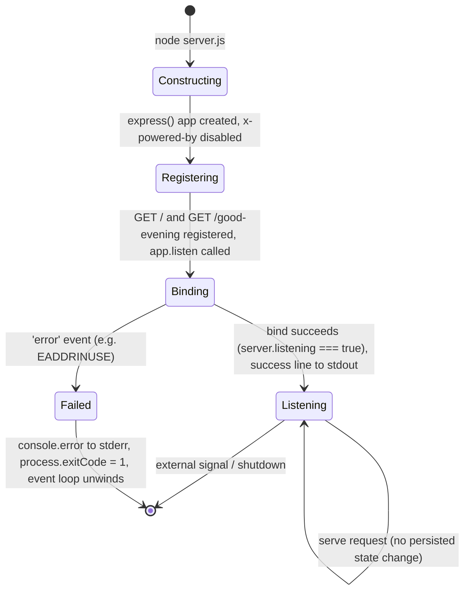
```mermaid
stateDiagram-v2
    [*] --> Constructing: node server.js
    Constructing --> Registering: express() app created, x-powered-by disabled
    Registering --> Binding: GET / and GET /good-evening registered, app.listen called
    Binding --> Listening: bind succeeds (server.listening === true), success line to stdout
    Binding --> Failed: 'error' event (e.g. EADDRINUSE)
    Listening --> Listening: serve request (no persisted state change)
    Listening --> [*]: external signal / shutdown
    Failed --> [*]: console.error to stderr, process.exitCode = 1, event loop unwinds
```

The `Listening` self-transition captures the key architectural fact that serving a request does not alter process state: the handlers read nothing and write nothing beyond the response socket. The only branch is at `Binding`, which resolves to either `Listening` (success) or `Failed` (bind error); there is no intermediate retry state.

### 4.4.2 Per-Request State and Data Persistence Points

Request handling is **stateless and share-nothing**. Each handler computes its response from a hard-coded string literal, holds no module-level mutable variables that accumulate across requests, and shares no state between concurrent requests. There is no session, no in-memory user/store object, and no request-scoped context beyond the `req`/`res` pair that Node.js creates and discards per connection.

There are **no data-persistence points** anywhere in the flow. `server.js` performs no database access, opens no file handles for writing, and imports no persistence client (its only `require` is `express`). The repository's static `industry.csv` is not read at runtime, and the placeholder artifacts are never loaded. The only durable side effects of the process are its console streams — the startup line on stdout and any failure diagnostic on stderr — which are operational, not data, outputs.

### 4.4.3 Caching Posture

The application defines **no caching layer and sets no `Cache-Control` header**; it maintains no in-memory or external cache of any kind. Two cache-adjacent artifacts observed on responses originate from the framework and transport layers rather than application code:

| Artifact | Origin | Observed value |
|---|---|---|
| Weak `ETag` | Auto-generated by Express `res.send` from the response body | `W/"e-..."` on `GET /`, distinct `W/"c-..."` on `GET /good-evening` |
| Connection reuse | Node.js HTTP keep-alive defaults | `Connection: keep-alive`, `Keep-Alive: timeout=5` |

Because bodies are fixed literals, the auto-generated `ETag` values are stable across restarts for a given route, which would permit conditional-request (`304`) handling by the framework; however, the application itself implements no explicit cache-validation logic. The `Keep-Alive: timeout=5` value is the only timing constant present anywhere in the runtime and is a connection-level setting, not an application cache TTL.

### 4.4.4 Transaction Boundaries

There are **no transaction boundaries** in the system. With no database, message broker, or multi-resource write, there is nothing to commit, roll back, or coordinate. Each request is handled within a single synchronous pass through one route handler that emits an in-memory literal with zero I/O, so the "unit of work" begins and ends entirely within that handler and cannot partially fail in a way that would require compensation. Startup is similarly atomic from the operator's perspective: the bind either succeeds (process enters `Listening`) or fails (process exits non-zero), with no partially-initialized intermediate state to reconcile.

## 4.5 Error Handling and Recovery Flows

The service has a deliberately narrow error surface. Only two error conditions can arise, and they occur on different planes: a **startup/bind failure** on the process-lifecycle plane, and an **unmatched-route `404`** on the request plane. There is no application-level error middleware and no `try/catch`; because both handlers emit static string literals with no I/O, no runtime exception path (and therefore no `5xx`) is reachable during normal operation. The subsections below give the taxonomy, the detection-and-notification flow, and the retry/fallback/recovery posture — all grounded in `server.js` and confirmed by first-hand execution.

### 4.5.1 Error Taxonomy

| Error | Plane | Trigger | Detection | Notification | Terminal state |
|---|---|---|---|---|---|
| Startup bind failure | Process lifecycle | Port `3000` unavailable (e.g. `EADDRINUSE`) or other `net` bind error | `server.on('error', ...)` receives the `'error'` event; startup log is suppressed because `server.listening === false` | `console.error('Failed to start server at http://127.0.0.1:3000/: <message>')` to **stderr**; `process.exitCode = 1` | Process exits non-zero |
| Unmatched route / method | Request | Request method+path is neither `GET /` nor `GET /good-evening` | Express router finds no match | HTTP `404 Not Found` to the client (`text/html`, `Content-Security-Policy: default-src 'none'`, `X-Content-Type-Options: nosniff`); no server-side log | Response sent; process stays healthy |
| Handler exception / `5xx` | Request | (not reachable) | — | — | Not exercised: handlers emit static literals and cannot throw |

The third row is included for completeness: the application registers no custom error-handling middleware, so an unexpected handler exception would fall to Express 5's built-in error handler and yield a `500`, but no code path in the current handlers can raise one.

### 4.5.2 Error Handling and Notification Flow

The following swim-lane flowchart separates the two planes. The startup lane shows the `server.listening` guard and the `'error'` handler; the request lane shows the routing decision converging on either a handler or the default `404`. Notification channels differ by plane: stdout/stderr for startup, and the HTTP response itself for the request path.

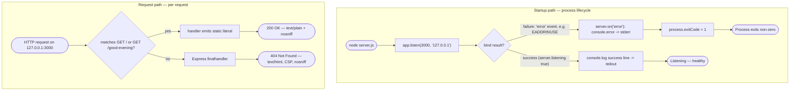
```mermaid
flowchart TB
    subgraph Startup["Startup path — process lifecycle"]
        S0(["node server.js"]) --> S1["app.listen(3000, '127.0.0.1')"]
        S1 --> S2{"bind result?"}
        S2 -->|"success (server.listening true)"| S3["console.log success line -> stdout"]
        S2 -->|"failure: 'error' event, e.g. EADDRINUSE"| S4["server.on('error'): console.error -> stderr"]
        S4 --> S5["process.exitCode = 1"]
        S3 --> S6(["Listening — healthy"])
        S5 --> S7(["Process exits non-zero"])
    end
    subgraph Request["Request path — per request"]
        R0(["HTTP request on 127.0.0.1:3000"]) --> R1{"matches GET / or GET /good-evening?"}
        R1 -->|"yes"| R2["handler emits static literal"]
        R2 --> R3(["200 OK — text/plain + nosniff"])
        R1 -->|"no"| R4["Express finalhandler"]
        R4 --> R5(["404 Not Found — text/html, CSP, nosniff"])
    end
```

The two lanes never cross: a startup failure prevents the process from ever reaching the request lane, and a request-path `404` is a normal, self-contained client outcome that leaves the process healthy for subsequent requests.

### 4.5.3 Retry, Fallback, and Recovery Procedures

**Retry / backoff.** There is none. Startup makes a **single bind attempt** with no retry loop, no exponential backoff, and no alternate-port fallback; a failed bind goes straight to the error handler and a non-zero exit. On the request path there is likewise no retry — an unmatched request receives one `404` and the exchange ends.

**Fallback processes.** There is no degraded mode, no secondary listener, and no cached/last-known-good response. The port and host are hard-coded (`127.0.0.1:3000`), so the process cannot self-select an alternate endpoint.

**Notification.** Failures are machine-observable through two channels only: the **stderr** diagnostic line and the **non-zero exit code**. Success is announced on **stdout**. No email, webhook, alerting, or log-aggregation integration exists in the code.

**Recovery.** Recovery is entirely **operator-driven and manual** — the code contains no supervisor, watchdog, or automated restart, and the repository's runtime files declare only a `start` script (`node server.js`). The typical recovery loop for the dominant failure (`EADDRINUSE`) is to free port `3000` and re-run the process, as shown below.

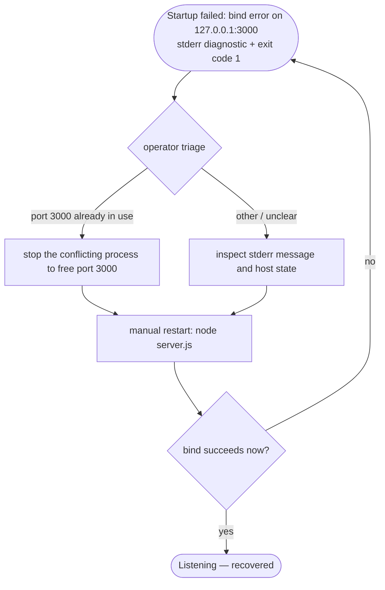
```mermaid
flowchart TB
    E(["Startup failed: bind error on 127.0.0.1:3000<br/>stderr diagnostic + exit code 1"]) --> D{"operator triage"}
    D -->|"port 3000 already in use"| A1["stop the conflicting process to free port 3000"]
    D -->|"other / unclear"| A2["inspect stderr message and host state"]
    A1 --> RR["manual restart: node server.js"]
    A2 --> RR
    RR --> C{"bind succeeds now?"}
    C -->|"yes"| OK(["Listening — recovered"])
    C -->|"no"| E
```

Because the failure is signalled cleanly (empty stdout, exit code `1`, explicit stderr message), an external process manager could automate this loop, but such supervision is outside the scope of what `server.js` itself implements.

## 4.6 References

The process flows, decision points, timing notes, and error/recovery behavior documented in this section were derived directly from the repository source and corroborated by first-hand execution of the service. The evidence base is enumerated below.

**Repository files examined**

- `server.js` - the entire runtime; established the app construction, `app.disable('x-powered-by')`, the two `GET` route handlers and their byte-exact bodies (`Hello, World!\n` = 14 bytes; `Good evening` = 12 bytes), the `nosniff`/`text/plain` header chain, the `app.listen` bind, the `server.listening` startup-log guard, and the `server.on('error')` handler that writes to stderr and sets `process.exitCode = 1`
- `package.json` - the `start` script (`node server.js`), the `express: ^5.2.1` dependency, and the `main: index.js` manifest discrepancy noted in the workflow narrative
- `package-lock.json` - deterministic dependency resolution (lockfileVersion 3) underpinning the install-time supply-chain integration flow
- `README.md` - documented endpoints, Node.js `>= 18` runtime expectation, and the trailing-newline distinction between the two greetings
- `.gitignore` - exclusion of `node_modules/`, referenced in the install-time/dev-time integration surface
- `industry.csv` - static dataset confirmed **not** read at runtime (no persistence/data-flow step in any workflow)
- `LoginTest.java`, `test.py.txt`, `test.txt.txt`, `100Pages.pdf`, `demo.jpg`, `sample.doc` - inert placeholder/fixture artifacts confirmed absent from every runtime flow

**Repository folders examined**

- `blitzy/documentation/` - project documentation folder consulted for context during orientation; not part of any runtime flow

**Cross-referenced Technical Specification sections** (retrieved via the section-retrieval tool)

- `1.2 System Overview` - system context, the "Minimal Monolith" characterization, and the major-components diagram reused for naming consistency
- `2.1 Feature Catalog` - feature identifiers F-001 through F-008 referenced throughout the flows
- `2.2 Functional Requirements` - requirement identifiers (R1-R4, F-XXX-RQ-YYY), the 404 content-type/size facts, and the "single bind attempt with no retry or backoff" statement
- `2.3 Feature Relationships` - integration points and the feature-dependency map reused for consistency

**Verification basis**

- First-hand runtime execution of `server.js` (Node.js v22.23.1, express 5.2.1) established the observed response headers (`X-Content-Type-Options: nosniff`, `Content-Type`, `Content-Length`, weak `ETag`, `Connection: keep-alive`, `Keep-Alive: timeout=5`, absence of `X-Powered-By`), the `404` bodies (`Cannot GET /nope` = 143 bytes; `Cannot POST /` = 140 bytes), and the failed-bind behavior (empty stdout, exit code `1`, `EADDRINUSE` diagnostic on stderr)
- No external web sources were used in the preparation of this section

# 5. System Architecture

## 5.1 High-Level Architecture

This section documents the architecture of the `hao-backprop-test` service (npm package `hello_world`, version `1.0.0`) as it exists in the current codebase. All runtime behavior resides in a single file, `server.js` — a self-starting Express 5 HTTP application bound to the loopback interface `127.0.0.1:3000`. Every architectural statement below is grounded in `server.js`, the project manifests (`package.json`, `package-lock.json`, `.gitignore`), `README.md`, and first-hand runtime execution, and is consistent with the system framing established in Sections 1.2, 4.1, and 4.5. The system is intentionally minimal; where the section prompt enumerates an architectural concern that this system does not exhibit, that absence is stated explicitly rather than invented.

### 5.1.1 System Overview

#### Architectural Style and Rationale

The service is a **single-process, single-file monolithic HTTP microservice** built on the Express 5.2.1 web framework, written in CommonJS, and bound to the loopback interface only. It represents the smallest viable form of a layered web application: a **runtime/transport layer** (the Node.js `net`/`http` stack that owns the listening socket), a **framework/routing layer** (the Express application and its router), and a **handler layer** (two route callbacks that emit fixed responses). There is no service decomposition, no multi-tier separation, no worker pool, and no process beyond the single Node.js process launched by `node server.js`.

The rationale for this style is recorded in the project's evolution and cross-referenced documentation. The service is a controlled, minimal integration-test target that was deliberately **re-platformed from a native Node.js `http`-module baseline onto Express** (git commit `ec987aa`) to gain path-based routing — enabling multiple differentiated endpoints — while preserving the original root greeting byte-for-byte for backward compatibility. Express was adopted for its idiomatic routing surface and future endpoint growth (feature F-001), and the implementation was kept to a single file to minimize the change surface and keep the delivery reviewable.

#### Key Architectural Principles and Patterns

The following principles are directly observable in `server.js` and the manifests:

- **Framework-based routing** — an `express()` application registers explicit `GET` routes; requests matching no route fall through to Express's built-in default `404` finalhandler.
- **Stateless request/response** — each response is derived solely from an in-memory string literal; there is no shared mutable state, session, or persistence, so any request is served independently of every other.
- **Fail-fast, observable startup** — the success log is emitted only when `server.listening` is true, and a dedicated `server.on('error', …)` handler surfaces bind failures to stderr and sets `process.exitCode = 1` (feature F-005).
- **Defense-in-depth response hardening** — the framework-advertising `X-Powered-By` header is disabled application-wide via `app.disable('x-powered-by')`, and `X-Content-Type-Options: nosniff` is set on each success route (feature F-004).
- **Deterministic dependency management** — exactly one direct dependency (`express ^5.2.1`) is declared and pinned by a committed `package-lock.json` (feature F-006).
- **Convention preservation** — CommonJS module loading and hardcoded host/port constants are retained; no environment variables are consulted.

#### System Boundaries and Major Interfaces

The system boundary is deliberately narrow. The process listens **only** on `127.0.0.1`, so it is unreachable from other hosts by design, and it holds no authentication, session, or persistence boundary — any TCP client that can reach the loopback interface receives a direct code-generated response.

- **Inbound (runtime):** HTTP/1.1 over TCP on `127.0.0.1:3000` — the only channel that serves requests.
- **Outbound (process I/O):** console `stdout` (startup success line) and `stderr` (bind-failure diagnostics).
- **Build-time only:** the npm registry, which supplies Express and its transitive packages during `npm install`; it is never contacted at runtime.
- **Host runtime:** the Node.js ≥ 18 `net`/`http` stack, which provides the listening socket and connection lifecycle.

The layered runtime boundary and the build-time supply chain are shown below.

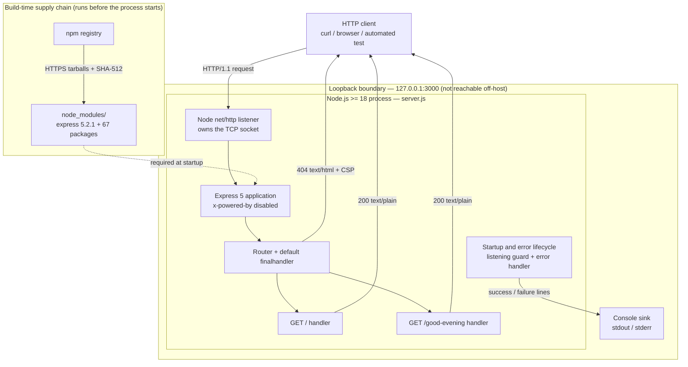
```mermaid
flowchart TB
    Client["HTTP client<br/>curl / browser / automated test"]

    subgraph Supply["Build-time supply chain (runs before the process starts)"]
        direction TB
        Registry["npm registry"]
        Mods["node_modules/<br/>express 5.2.1 + 67 packages"]
        Registry -->|"HTTPS tarballs + SHA-512"| Mods
    end

    subgraph Boundary["Loopback boundary — 127.0.0.1:3000 (not reachable off-host)"]
        direction TB
        subgraph Proc["Node.js &gt;= 18 process — server.js"]
            direction TB
            Net["Node net/http listener<br/>owns the TCP socket"]
            App["Express 5 application<br/>x-powered-by disabled"]
            Router["Router + default finalhandler"]
            H1["GET / handler"]
            H2["GET /good-evening handler"]
            Life["Startup and error lifecycle<br/>listening guard + error handler"]
            Net --> App
            App --> Router
            Router --> H1
            Router --> H2
        end
        Console["Console sink<br/>stdout / stderr"]
    end

    Client -->|"HTTP/1.1 request"| Net
    H1 -->|"200 text/plain"| Client
    H2 -->|"200 text/plain"| Client
    Router -->|"404 text/html + CSP"| Client
    Life -->|"success / failure lines"| Console
    Mods -.->|"required at startup"| App
```

### 5.1.2 Core Components

The running service comprises a small set of logical components, all resident in the single `server.js` process except the manifests and installed modules that support it. Because tables are capped at four columns, the core-component attributes are presented as a four-column table followed by per-component **critical considerations**.

| Component | Primary Responsibility | Key Dependencies |
|-----------|------------------------|------------------|
| Application Runtime (`server.js` process) | Bootstraps the process, creates the Express `app`, holds the host/port constants, and initiates the single socket bind | Express 5.2.1; Node.js ≥ 18 `net`/`http` |
| Express Application and Router | Path/method-based routing; app-level header policy (`x-powered-by` disabled); default `404` finalhandler for unmatched requests | Express 5.2.1 |
| Greeting Route Handlers (`GET /`, `GET /good-evening`) | Emit byte-exact `text/plain` bodies with the `nosniff` header | Express response API (`res.set`/`res.type`/`res.send`) |
| Startup and Error Lifecycle Controller | Guards the success log on `server.listening`; handles the server `'error'` event; sets the process exit code | Node `net`/`http` server events; `process`; `console` |
| Dependency and Configuration Manifests (`package.json`, `package-lock.json`, `.gitignore`) | Declare and pin the dependency graph, exclude `node_modules/`, and define the `start` script | npm (lockfileVersion 3); Git |

Integration points and critical considerations, per component:

- **Application Runtime (`server.js`)** — integrates with the Node runtime, the loopback socket, and the console. *Critical considerations:* it is the single point of execution; there is no clustering, worker pool, or multi-process model (one event loop), and no graceful-shutdown handler is registered.
- **Express Application and Router** — integrates the Node HTTP listener with the route handlers. *Critical considerations:* the unmatched-request branch emits Express framework defaults (`text/html` plus `Content-Security-Policy: default-src 'none'`) that differ from the route code; no custom error-handling middleware is registered.
- **Greeting Route Handlers** — integrate with inbound HTTP clients. *Critical considerations:* the response bodies are byte-significant (`GET /` = 14 bytes with a trailing newline; `GET /good-evening` = 12 bytes with none); no request data is parsed, validated, or consumed.
- **Startup and Error Lifecycle Controller** — integrates with `stdout`/`stderr`. *Critical considerations:* a single bind attempt with no retry or backoff; it uses `process.exitCode` (not `process.exit()`) so pending output can flush and the event loop can unwind cleanly.
- **Dependency and Configuration Manifests** — integrate with the npm registry at build time and with Git. *Critical considerations:* the `main` field (`index.js`) diverges from the real entry point (`server.js`) — an intentional, harmless discrepancy — and `node_modules/` is intentionally excluded from version control.

### 5.1.3 Data Flow Description

**Primary data flows.** At runtime there is exactly one data flow: an inbound HTTP request arrives on the loopback socket, the Node `http` listener parses it and hands it to the Express application, the router evaluates the method-and-path tuple, and one of three outcomes is produced. A match on `GET /` or `GET /good-evening` invokes the corresponding handler, which sets `X-Content-Type-Options: nosniff` and `text/plain` and sends a fixed string literal; any other method or path falls through to Express's default `404` finalhandler. **No request payload, header, or query parameter is read, stored, transformed, or forwarded** — the response depends solely on route identity, not on request content. The build-time flow is separate: `npm install` reads `package.json`/`package-lock.json`, downloads verified tarballs from the npm registry, and materializes the dependency tree under `node_modules/` before the process ever runs.

**Integration patterns and protocols.** The runtime pattern is synchronous request/response over HTTP/1.1 on TCP, confined to the loopback interface, with connection reuse governed by Node's default `Keep-Alive: timeout=5`. The build-time pattern is package retrieval over HTTPS with per-package SHA-512 integrity verification. Logging is a fire-and-forget, line-oriented text pattern to `stdout`/`stderr`. There is no request/reply messaging, publish/subscribe, streaming, or polling of any external system at runtime.

**Data transformation points.** Transformations are minimal and entirely framework-applied. On a matched route, Express derives the response metadata from the body: `Content-Type: text/plain; charset=utf-8`, an explicit `Content-Length`, and a weak `ETag` (observed `W/"e-…"` on `GET /`). On the unmatched branch, the `finalhandler` renders an HTML error document and attaches a `Content-Security-Policy`. There is no application-level serialization, deserialization, encoding conversion, or parsing of inbound data.

**Key data stores and caches.** There are **none**. The service uses no database, no cache, no session store, and performs no file reads at runtime; the response bodies exist only as in-memory string literals compiled into `server.js`. The only cache-adjacent mechanisms present are HTTP-level emergent defaults — the weak `ETag` that enables conditional GETs and Node keep-alive connection reuse — neither of which is application-managed caching. The static `industry.csv` file exists on disk but is never opened or served by the running process (feature F-007).

### 5.1.4 External Integration Points

The system's external surface is deliberately narrow. At runtime the only inbound channel is loopback HTTP and the only outbound channel is console logging; the sole networked dependency (the npm registry) is contacted only at build/install time, consistent with Sections 3.4 and 4.1.4. The table below enumerates every integration touchpoint. Because tables are capped at four columns, the requested "data exchange pattern" attribute is described in the prose that follows.

| System / Touchpoint | Integration Type and Direction | Protocol / Format | SLA Requirements |
|---------------------|--------------------------------|-------------------|------------------|
| npm registry (`registry.npmjs.org`) | Build-time supply chain; outbound | HTTPS; package tarballs with SHA-512 integrity; JSON manifest/lock | None defined in the repository |
| HTTP clients (`curl` / browser / automated test) | Runtime request/response; inbound | HTTP/1.1 over TCP (loopback); `text/plain` on `200`, `text/html` on `404` | None defined in the repository |
| Console streams (`stdout` / `stderr`) | Startup/runtime logging; outbound (process I/O) | Line-oriented UTF-8 text | None defined in the repository |
| Node.js runtime (`net`/`http` stack) | Host runtime; bidirectional (in-process) | Node API over a TCP listening socket | Not applicable (host runtime) |

The **data exchange pattern** at runtime is a single synchronous request/response exchange per inbound connection; there are no webhooks, callbacks, long-polling, streaming, message queues, event buses, or batch feeds. The build-time exchange is a one-shot pull of pinned packages during `npm install`/`npm ci`. Two facts are architecturally significant and are stated explicitly: **no SLA — latency, throughput, or uptime — is defined anywhere in the repository**, and the only observable timing constant is Node's default keep-alive timeout of five seconds; and the runtime uses **no third-party services, credentials, secrets, or environment-based configuration** of any kind (Section 3.4).

## 5.2 Component Details

This section details each major component of the service. Given the single-file design, the "components" are the logical responsibilities co-located inside `server.js` plus the manifests that provision and configure it. Each component is described by its purpose and responsibilities, the technologies and frameworks it uses, its key interfaces and APIs, its data-persistence requirements, and its scaling considerations. The required component-interaction, state-transition, and sequence diagrams follow in Section 5.2.4.

### 5.2.1 Application Server Component (`server.js`)

- **Purpose and responsibilities:** This component *is* the runtime. It bootstraps the process, constructs the Express application, declares the hardcoded `hostname` (`127.0.0.1`) and `port` (`3000`) constants, applies the application-level header policy, registers the routes, initiates the single socket bind, and owns the startup/error lifecycle. It is self-starting and exports nothing — it is executed directly, not imported as a module.
- **Technologies and frameworks:** Node.js ≥ 18 (the engine constraint inherited from Express 5), the Express 5.2.1 framework, and the CommonJS module system (`const express = require('express')`).
- **Key interfaces and APIs:** `express()` to create the app; `app.disable('x-powered-by')` for the header policy; `app.get()` to register routes; `app.listen(port, hostname, callback)` to bind; the server `'error'` event via `server.on('error', …)`; and `console.log`/`console.error` plus `process.exitCode` for observable startup. A representative binding pattern:

```javascript
const server = app.listen(port, hostname, () => {
  if (server.listening) { console.log(`Server running at http://${hostname}:${port}/`); }
});
```

- **Data persistence requirements:** None. The component is fully stateless — it opens no database, cache, session store, or file at runtime and reads no environment variables.
- **Scaling considerations:** The service runs as a single process on a single Node.js event loop; there is no clustering, worker pool, or multi-process supervisor in the code. Concurrency is handled cooperatively by Node's asynchronous I/O within that one event loop. Because host and port are hardcoded and the bind is loopback-only, the component cannot be horizontally scaled behind a load balancer or bound to a non-local interface without code changes; scaling is therefore effectively vertical and constrained by design to a single local instance.

### 5.2.2 Routing and Request-Handling Subsystem

- **Purpose and responsibilities:** This subsystem maps each inbound method-and-path tuple to a handler and produces the response. It owns the two greeting routes and, by delegation to Express, the default handling of every unmatched request.
- **Technologies and frameworks:** The Express 5 router (which uses `path-to-regexp` for path matching) and the Express `finalhandler` that produces the default `404`.
- **Key interfaces and APIs:** `app.get('/', handler)` and `app.get('/good-evening', handler)`; within each handler the chained response API `res.set('X-Content-Type-Options', 'nosniff').type('text/plain').send(body)`. The `res.set()` call returns `res`, so the `nosniff` header chains ahead of `res.type().send()`. Unmatched requests are finalized by Express with no application code involved.
- **Data persistence requirements:** None. Both response bodies are in-memory string literals — `Hello, World!\n` (14 bytes, trailing newline) for `GET /` and `Good evening` (12 bytes, no trailing newline) for `GET /good-evening`. No request data is read or stored.
- **Scaling considerations:** Routing cost is proportional to the two registered routes and is negligible; handlers perform no I/O and cannot block the event loop. There is no route-level caching, rate limiting, or connection pooling. The `404` branch is an emergent framework default that returns `text/html; charset=utf-8` with `Content-Security-Policy: default-src 'none'` and `X-Content-Type-Options: nosniff` — distinct from the explicitly hardened success responses.

### 5.2.3 Dependency and Configuration Subsystem

- **Purpose and responsibilities:** This subsystem declares, pins, and installs the dependency graph, excludes installed modules from version control, documents install/run steps, and defines the npm scripts. It provisions the runtime rather than participating in request handling.
- **Technologies and frameworks:** npm (the committed `package-lock.json` uses `lockfileVersion 3`, implying npm ≥ 7) and Git (for `.gitignore` semantics).
- **Key interfaces and APIs:** `package.json` declares the single direct dependency `express ^5.2.1`, the `start` script (`node server.js`), and a placeholder `test` script that deliberately fails; `package-lock.json` pins the exact resolved graph (68 package entries: the root project plus 67 dependency records); `.gitignore` excludes `node_modules/`. The `main` field points at `index.js`, an intentional discrepancy since the runtime entry is `server.js`.
- **Data persistence requirements:** The only persisted artifact is the resolved dependency graph recorded in `package-lock.json` (a build-time artifact); there is no runtime data persistence.
- **Scaling considerations:** A committed lockfile yields deterministic, reproducible installs across environments; with a single direct dependency and a clean `npm audit` (0 vulnerabilities per the delivery record), the supply-chain surface is small and predictable.

### 5.2.4 Component Interaction, State, and Sequence Diagrams

**Component interaction diagram.** The following diagram shows how the logical components inside `server.js` collaborate with each other and with the external actors (HTTP client, npm registry) and host facilities (Node `net`/`http` stack, console).

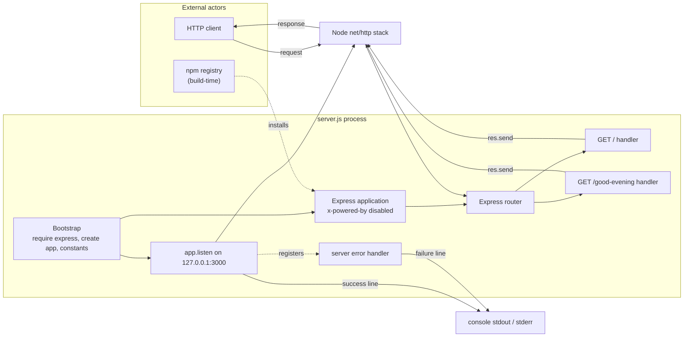
```mermaid
flowchart LR
    subgraph External["External actors"]
        direction TB
        Client["HTTP client"]
        NPM["npm registry<br/>(build-time)"]
    end

    subgraph ServerJS["server.js process"]
        direction TB
        Boot["Bootstrap<br/>require express, create app, constants"]
        AppComp["Express application<br/>x-powered-by disabled"]
        RouterComp["Express router"]
        RootH["GET / handler"]
        EveH["GET /good-evening handler"]
        Listener["app.listen on 127.0.0.1:3000"]
        ErrH["server error handler"]
    end

    NodeHttp["Node net/http stack"]
    Log["console stdout / stderr"]

    Boot --> AppComp
    AppComp --> RouterComp
    RouterComp --> RootH
    RouterComp --> EveH
    Boot --> Listener
    Listener --> NodeHttp
    Listener -. registers .-> ErrH
    Client -->|"request"| NodeHttp
    NodeHttp --> RouterComp
    RootH -->|"res.send"| NodeHttp
    EveH -->|"res.send"| NodeHttp
    NodeHttp -->|"response"| Client
    Listener -->|"success line"| Log
    ErrH -->|"failure line"| Log
    NPM -. installs .-> AppComp
```

**State transition diagram.** The process moves through a compact lifecycle: an initialization phase, a single bind attempt, and then either a long-lived listening state that serves requests statelessly or a terminal failure state. Request serving is a self-transition on the listening state because no request changes process state.

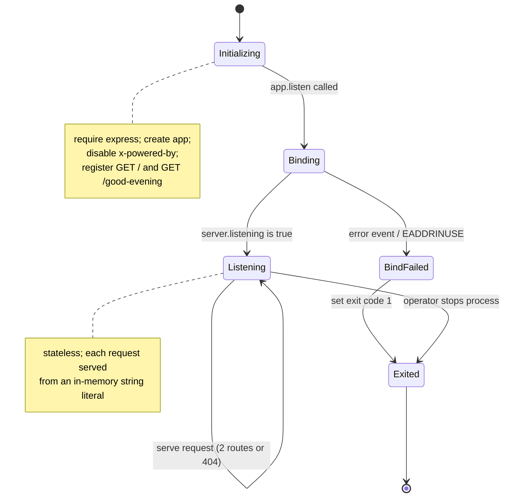
```mermaid
stateDiagram-v2
    [*] --> Initializing
    Initializing --> Binding : app.listen called
    Binding --> Listening : server.listening is true
    Binding --> BindFailed : error event / EADDRINUSE
    Listening --> Listening : serve request (2 routes or 404)
    BindFailed --> Exited : set exit code 1
    Listening --> Exited : operator stops process
    Exited --> [*]

    note right of Initializing
        require express; create app;
        disable x-powered-by;
        register GET / and GET /good-evening
    end note
    note right of Listening
        stateless; each request served
        from an in-memory string literal
    end note
```

**Sequence diagram for the key flow.** The dominant runtime flow is servicing a matched `GET /` request. The diagram emphasizes the internal component collaboration and the response metadata Express derives from the body.

```mermaid
sequenceDiagram
    autonumber
    actor Client as HTTP Client
    participant Node as Node net/http listener
    participant App as Express app + router
    participant H as GET / handler
    Client->>Node: GET / over HTTP/1.1 (loopback)
    Node->>App: dispatch parsed request
    App->>App: match method and path to a route
    App->>H: invoke handler(req, res)
    H->>H: set nosniff header
    H->>H: set text/plain content type
    H->>App: send root greeting (14 bytes)
    App->>App: derive Content-Type, Content-Length, ETag
    App-->>Node: finalize 200 (no X-Powered-By)
    Node-->>Client: 200 OK, keep-alive
```

## 5.3 Technical Decisions

This section records the architectural decisions evidenced by the current codebase and its commit history, together with their rationale and tradeoffs. The decisions are reconstructed from `server.js`, the manifests, and the Git history — the re-platforming commit `ec987aa` (native `http` → Express), the hardening commit `3ba1489` (disable `X-Powered-By`, add `nosniff`), and the reliability commit `55f5b91` (fail-fast on listen error; decline host validation). Decisions recorded in earlier documentation that described a zero-dependency native-`http` baseline are superseded by the current Express implementation.

### 5.3.1 Architecture Style Decision

The central decision was to re-platform the service from the Node.js built-in `http` module onto the **Express 5 framework**, retained as a **single-file CommonJS monolith** with **hardcoded loopback configuration**. Express was chosen to provide path-based routing (so multiple differentiated endpoints could be added without structural rewrites) and idiomatic response hardening, while the original root greeting was preserved byte-for-byte. The single-file, hardcoded style was retained to minimize the change surface and keep the service an easily-reviewable local test target.

| Decision | Chosen Approach | Rejected Alternative | Key Tradeoff |
|----------|-----------------|----------------------|--------------|
| HTTP foundation | Express 5.2.1 framework | Native Node.js `http` module | Gains routing, default `404`, and header APIs; costs 67 transitive packages and a required `npm install` |
| Code structure | Single-file CommonJS (`server.js`) | Multi-module layout / ES Modules | Maximum simplicity and reviewability; limited ergonomics as the surface grows |
| Configuration | Hardcoded `127.0.0.1:3000` constants | Environment variables / config file | Zero-configuration determinism; relocating the bind requires a code change |

The decision path that yields the current architecture is shown below.

```mermaid
flowchart TB
    Start{{"Need: minimal HTTP test<br/>target with routing"}}
    Q1{"Multiple differentiated<br/>endpoints needed?"}
    Q2{"Minimize change surface<br/>and footprint?"}
    Q3{"Externally reachable<br/>or internet-facing?"}
    Q4{"Persist or share state<br/>across requests?"}

    Start --> Q1
    Q1 -->|"yes (routing required)"| UseExpress["Adopt Express 5 router<br/>over native http"]
    Q1 -->|"no"| NativeHttp["rejected: stay on native http"]
    UseExpress --> Q2
    Q2 -->|"yes"| SingleFile["Single-file CommonJS monolith<br/>one direct dependency"]
    Q2 -->|"no"| Modular["rejected: multi-module layout"]
    SingleFile --> Q3
    Q3 -->|"no, loopback only"| Loopback["Bind 127.0.0.1 hardcoded;<br/>no auth, header hardening only"]
    Q3 -->|"yes"| Public["rejected: public bind + auth/TLS"]
    Loopback --> Q4
    Q4 -->|"no"| Stateless["Stateless handlers;<br/>no database or cache"]
    Q4 -->|"yes"| Stateful["rejected: add datastore/cache"]
    Stateless --> Done{{"Current architecture"}}
```

### 5.3.2 Communication, Storage, and Caching Decisions

The communication, storage, and caching postures all follow from the system's scope as a stateless loopback greeting service.

| Concern | Decision | Rationale |
|---------|----------|-----------|
| Communication pattern | Synchronous HTTP/1.1 request/response only | The single inbound channel is loopback HTTP; there are no external systems to integrate, so no asynchronous messaging, events, or queues are warranted |
| Data storage | None (fully stateless) | Both responses are fixed string literals; there is no data domain to persist, so no database, file store, or session store is introduced |
| Caching | No application cache tier | Responses are tiny and static; the HTTP-level `ETag` (conditional GET) and Node keep-alive are sufficient emergent defaults, so a dedicated cache would add complexity with no benefit |

In prose: the runtime performs no outbound calls, opens no sockets after startup, and imports no HTTP client, database driver, cache client, or broker library (Section 3.4). Caching is not implemented at the application layer; the weak `ETag` that Express generates from the response body enables conditional requests and the `Keep-Alive: timeout=5` connection reuse are Express/Node defaults rather than deliberate caching strategy.

### 5.3.3 Security Mechanism Selection

Security relies primarily on **network isolation** supplemented by **response-header hardening**, with authentication and transport encryption deliberately omitted for the loopback test scope. The `nosniff` header is set explicitly on the success routes, giving success/error parity with the `nosniff` header Express already applies to its default error responses.

| Mechanism | Purpose | Scope | Evidence |
|-----------|---------|-------|----------|
| Loopback bind (`127.0.0.1`) | Network isolation — the service is unreachable off-host | Transport | `hostname` constant in `server.js` |
| Disable `X-Powered-By` | Reduce framework fingerprinting / information disclosure (CWE-200) | All responses | `app.disable('x-powered-by')` |
| `X-Content-Type-Options: nosniff` | MIME-sniffing protection with success/error parity | Both success routes | `res.set(...)` in each handler |
| No authentication/authorization; no TLS | Deliberately omitted as unnecessary for a loopback-only test target | N/A | No auth or TLS code; constraint C-003 |

Two decisions are explicitly negative and are recorded for accuracy: **no authentication, authorization, or TLS** is implemented (the loopback boundary is treated as the trust boundary), and **host-header validation was explicitly declined** during the reliability hardening work (commit `55f5b91`). Supply-chain risk is managed through the committed lockfile and a clean `npm audit` (0 vulnerabilities) rather than through any runtime control.

### 5.3.4 Architecture Decision Records (ADRs)

The following ADRs capture the decisions above in a durable form. Each reflects the current implementation state; all are **Accepted** because they are realized in the committed code.

| ADR | Decision | Status |
|-----|----------|--------|
| ADR-01 | Adopt Express 5 over the native `http` module | Accepted (implemented) |
| ADR-02 | Retain a single-file CommonJS monolith | Accepted |
| ADR-03 | Hardcode the loopback bind; no environment-based configuration | Accepted |
| ADR-04 | Keep the service stateless with no datastore or cache | Accepted |
| ADR-05 | Fail fast on startup with an explicit error handler | Accepted |
| ADR-06 | Harden response headers (disable `X-Powered-By`, add `nosniff`) | Accepted |
| ADR-07 | Omit authentication/authorization; treat loopback as the trust boundary | Accepted |

- **ADR-01 — Express 5 over native `http`.** *Context:* the baseline was a single catch-all `http` handler with no routing. *Decision:* adopt Express 5.2.1 and register explicit `GET` routes. *Consequences:* enables differentiated endpoints and a default `404`, adds 67 transitive packages and a required `npm install`, and raises the minimum runtime to Node.js ≥ 18.
- **ADR-02 — Single-file CommonJS monolith.** *Context:* the service is a minimal test target. *Decision:* keep all logic in `server.js` using `require`. *Consequences:* maximally reviewable and simple; not structured for large-scale growth, and the stale `main: index.js` field is tolerated.
- **ADR-03 — Hardcoded loopback configuration.** *Context:* the service must never be externally reachable. *Decision:* hardcode `127.0.0.1:3000` and read no environment variables. *Consequences:* zero-configuration and deterministic; relocating or exposing the service requires a code change.
- **ADR-04 — Stateless, no persistence or cache.** *Context:* responses are fixed literals with no data domain. *Decision:* introduce no database, file store, session, or cache. *Consequences:* trivial horizontal reasoning per request; no durability or shared-state capability exists.
- **ADR-05 — Fail-fast startup.** *Context:* the baseline could log success and exit `0` on a failed bind. *Decision:* guard the success log on `server.listening` and add a `server.on('error', …)` handler that writes to stderr and sets `process.exitCode = 1`. *Consequences:* startup failures such as `EADDRINUSE` are observable and correctly signalled; there is a single bind attempt with no retry.
- **ADR-06 — Response-header hardening.** *Context:* the baseline advertised the framework and set no security headers. *Decision:* `app.disable('x-powered-by')` and set `X-Content-Type-Options: nosniff` on both success routes. *Consequences:* reduced information disclosure and MIME-sniffing protection at negligible cost.
- **ADR-07 — No authn/authz; loopback as trust boundary.** *Context:* the service is a loopback-only test asset. *Decision:* implement no authentication, authorization, or TLS, and decline host-header validation. *Consequences:* zero credential/configuration burden; the security posture depends entirely on the loopback bind remaining in place.

## 5.4 Cross-Cutting Concerns

This section documents the cross-cutting concerns of the service. Because the system is a stateless loopback monolith with no external dependencies at runtime, several concerns that would normally require dedicated infrastructure (distributed tracing, metrics pipelines, identity providers, backup/restore) are simply not present; those absences are stated explicitly and are consistent with Sections 3.4, 4.1, and 4.5.

### 5.4.1 Monitoring, Observability, Logging and Tracing

Observability is limited to console output and the HTTP responses themselves; there is no metrics, tracing, health-check, or APM integration in the codebase (Section 3.4 confirms no telemetry SDK is present in the dependency tree).

- **Logging:** two `console` sinks only — `console.log` writes the single startup success line to `stdout`, and `console.error` writes the bind-failure diagnostic to `stderr`. There is no structured (JSON) logging, no log levels, no log rotation, no log file, and no request-access logging (no `morgan` or equivalent is installed, and Express does not log requests by default).
- **Tracing:** none. There are no correlation IDs, spans, or distributed-tracing hooks.
- **Metrics and health checks:** none. There is no `/health`, `/metrics`, or readiness endpoint, and no counter/gauge/histogram instrumentation.

The complete observability surface is the following four signals:

| Observable Signal | Channel | Emitted When |
|-------------------|---------|--------------|
| Startup success line (`Server running at …`) | `stdout` | Once `server.listening` is true |
| Bind-failure diagnostic (`Failed to start server …`) | `stderr` | On the server `'error'` event |
| Process exit code (`0` healthy / `1` bind failure) | Process | On process exit |
| HTTP status and response headers | HTTP response | Per request (`200` or default `404`) |

### 5.4.2 Error Handling Patterns

The service has a deliberately narrow error surface handled on two independent planes, with **no error-handling middleware and no `try/catch`** anywhere in `server.js`. Because both handlers emit static string literals with no I/O, no runtime exception path (and therefore no `5xx`) is reachable during normal operation.

- **Process-lifecycle plane — fail-fast:** a startup bind failure (for example `EADDRINUSE`) is caught by `server.on('error', …)`, which writes a diagnostic to stderr and sets `process.exitCode = 1`; the success log is suppressed because `server.listening` is false. There is a single bind attempt — no retry, backoff, or alternate-port fallback.
- **Request plane — framework-default finalization:** a request that matches neither route is finalized by Express's built-in `finalhandler` as a `404` (`text/html`, `Content-Security-Policy: default-src 'none'`, `X-Content-Type-Options: nosniff`); the process stays healthy for subsequent requests and nothing is logged server-side.

The two planes never cross: a startup failure prevents the process from reaching the request plane, and a request-plane `404` is a normal, self-contained client outcome. The following diagram captures both flows and their distinct notification channels.

```mermaid
flowchart TB
    subgraph Lifecycle["Process-lifecycle plane"]
        direction TB
        L0["app.listen on 127.0.0.1:3000"] --> L1{"bind succeeded?<br/>(server.listening)"}
        L1 -->|"yes"| L2["stdout: Server running<br/>state: Listening / healthy"]
        L1 -->|"no: error event"| L3["stderr: Failed to start<br/>process.exitCode = 1"]
        L3 --> L4["terminal: process exits non-zero"]
    end
    subgraph RequestPlane["Request plane (per request)"]
        direction TB
        R0["inbound HTTP request"] --> R1{"route match?"}
        R1 -->|"GET / or /good-evening"| R2["200 text/plain + nosniff"]
        R1 -->|"no match"| R3["Express finalhandler<br/>404 text/html + CSP + nosniff"]
        R2 --> R4["process stays healthy"]
        R3 --> R4
    end
```

### 5.4.3 Authentication and Authorization

There is **no authentication or authorization framework**, by design. `server.js` registers no auth middleware, reads no credentials, issues no tokens or sessions, and configures no CORS policy; every endpoint is fully open to any client that can reach the loopback socket (constraint C-003; Section 3.4). The **trust boundary is the loopback bind itself** — because the process listens only on `127.0.0.1`, it is unreachable from other hosts, and this network isolation substitutes for application-level access control. No identity provider, API key, or role model exists anywhere in the repository.

### 5.4.4 Performance, Scalability, and SLAs

**No performance SLA — latency, throughput, or uptime — is defined anywhere in the repository**, and no benchmark, load-test, or performance-configuration artifact exists; this is consistent with the KPIs in Section 1.2.3 and the workflow notes in Section 4.1, which intentionally omit numeric targets. The observed performance characteristics below are structural facts, not commitments.

| Aspect | Observed Characteristic | Evidence |
|--------|-------------------------|----------|
| Latency / throughput SLA | None defined; no measured values exist | Sections 1.2.3, 4.1 |
| Concurrency model | Single Node.js event loop; no clustering or worker pool | `server.js` |
| Horizontal scaling | Not possible without code change (hardcoded loopback host/port) | `server.js` |
| Response handling | Synchronous, zero-I/O emission of 14-byte and 12-byte literals; keep-alive `timeout=5` | Runtime observation |

Scalability is therefore effectively vertical and bounded to a single local instance. The handlers perform no blocking work, so a single event loop is sufficient for the intended local test workload, but the design provides no mechanism for multi-instance scale-out, load balancing, or non-local exposure.

### 5.4.5 Disaster Recovery

Recovery is **entirely operator-driven and manual**. `server.js` registers no supervisor, watchdog, or automated-restart logic, and the repository declares only a `start` script (`node server.js`).

- **Backups:** none are required or present — the service is stateless and stores no data, so there is nothing to back up or restore.
- **High availability / failover:** none — there is a single process, no replicas, and no standby; the hardcoded host and port preclude the process from self-selecting an alternate endpoint.
- **Recovery procedure:** for the dominant failure (`EADDRINUSE`), the operator frees port `3000` (or resolves the reported error) and re-runs the process; the clean failure signalling (empty `stdout`, exit code `1`, explicit `stderr` message) means an external process manager *could* automate this loop, though no such supervision exists in `server.js`.
- **Reproducibility:** the committed `package-lock.json` allows the exact runtime to be rebuilt deterministically from source plus `npm install`, so recovery of a lost environment is a matter of reinstalling dependencies and restarting the process.

## 5.5 References

The following repository files, folders, cross-referenced specification sections, and version-control evidence were examined directly to produce Section 5.

**Repository files**

- `server.js` - The entire application; established the single-file Express 5 monolith, the two `GET` routes, the `app.disable('x-powered-by')` policy, the `nosniff` header chaining, the hardcoded `127.0.0.1:3000` bind, and the `server.listening`-guarded startup with the `server.on('error', …)` fail-fast handler.
- `package.json` - Established the single direct dependency (`express ^5.2.1`), the `start`/`test` scripts, the MIT license, and the `main: index.js` vs. `server.js` entry-point discrepancy.
- `package-lock.json` - Established the deterministic dependency graph (`lockfileVersion 3`, 68 package entries = root + 67 records) supporting the reproducible-install decision.
- `README.md` - Established the Node.js ≥ 18 requirement, install/run steps, the loopback service URL, and the endpoint/trailing-newline contract.
- `.gitignore` - Established the exclusion of `node_modules/` from version control.
- `industry.csv` - Confirmed a static, version-controlled data file that is never opened or served at runtime.
- `node_modules/express/package.json` - Confirmed the installed Express version resolves to `5.2.1`.

**Repository folders**

- Repository root (`/`) - Contained the source file, manifests, documentation, and non-runtime artifacts; established the absence of any `src/`, `routes/`, `config/`, or test/CI directories.
- `node_modules/` - Contained the installed Express dependency closure (65 top-level packages; some transitive packages nested), confirming the framework-based architecture.

**Version-control evidence**

- Git commit history - Established the architectural evolution and decision rationale: `ec987aa` (re-platform from native `http` onto Express and add `/good-evening`), `3ba1489` (disable `X-Powered-By`, add `nosniff`), and `55f5b91` (fail-fast on listen error; decline host-header validation).

**Cross-referenced specification sections**

- 1.2 System Overview - Baseline-vs-current transition, component inventory, and success-criteria KPIs.
- 2.1 Feature Catalog - Feature identifiers F-001 through F-008 and their provenance (R1–R4, H1–H2, C1–C2).
- 3.4 Third-Party Services - Confirmed the absence of any third-party runtime service, credentials, or environment configuration.
- 3.6 Development and Deployment - Confirmed the absence of build tooling, containerization, IaC, and CI/CD, and the manual/local deployment model.
- 4.1 System Workflows - Actor/boundary inventory, build-time supply-chain flow, and the runtime integration surface.
- 4.5 Error Handling and Recovery Flows - Error taxonomy, the two-plane error model, and the manual recovery posture.

**External sources**

- None. No web sources were used; all claims are grounded in direct repository inspection and first-hand runtime execution.

# 6. SYSTEM COMPONENTS DESIGN

## 6.1 Core Services Architecture

### 6.1.1 Applicability Assessment and Architectural Context

**Core Services Architecture is not applicable for this system.** The `hao-backprop-test` service (npm package `hello_world`, version `1.0.0`) is a single-process, single-file monolith: all runtime behavior is defined in one module, `server.js`, which creates exactly one Express 5.2.1 application and binds a single listening socket to the loopback interface `127.0.0.1:3000`. There is no service decomposition, no second process, no inter-service communication, and no distributed infrastructure of any kind. Consequently, the microservices and distributed-service concerns this section would normally document — service discovery, load balancing, circuit breaking, auto-scaling, and failover — have **no corresponding implementation** in the codebase. This determination is consistent with the single-process monolithic architecture recorded in Section 5.1 (High-Level Architecture), the architecture-style decision in Section 5.3 (specifically ADR-02 "Retain a single-file CommonJS monolith"), and the cross-cutting analysis in Section 5.4.

This sub-section records the determination and its evidence. The remaining sub-sections walk through each area the section prompt enumerates — Service Components (6.1.2), Scalability Design (6.1.3), and Resilience Patterns (6.1.4) — and, for each, state precisely which mechanisms are present, which are absent, and why, so this section stands as a complete and honest reference rather than a description of infrastructure that does not exist.

#### Basis for the Determination

The criteria below distinguish a distributed / multi-service architecture from the monolith that is actually present. Every criterion resolves to "absent," and each is grounded in direct inspection of the repository (`server.js`, `package.json`, `package-lock.json`, and the absence of any orchestration artifacts).

| Core-Services Criterion | Present? | Supporting Evidence (repository) |
|-------------------------|----------|----------------------------------|
| Multiple independently deployable services | No | The entire runtime is `server.js` launched as one process via the `start` script `node server.js` (`package.json`) |
| Distinct service boundaries / bounded contexts | No | Both route handlers (`GET /`, `GET /good-evening`) live in the same module and share one event loop (`server.js` lines 19–33) |
| Inter-service communication (REST/RPC/messaging) | No | `server.js` has a single `require()` — `express` (line 1); no HTTP client, message broker, or RPC library is imported or installed |
| Service discovery / registry | No | No registry client (e.g., Consul/Eureka) exists in the dependency graph; the bind target is the hardcoded constant `127.0.0.1:3000` (`server.js` lines 11–12) |
| Load balancer / reverse proxy | No | No proxy configuration (e.g., `nginx.conf`) and no proxy code; a single `app.listen` owns the only socket (`server.js` line 45) |
| Container / orchestration platform | No | The repository contains no `Dockerfile`, `docker-compose`, or Kubernetes/Helm manifests |
| Multi-process / clustering | No | `server.js` does not use the Node `cluster` module or worker threads; one event loop serves every request |

#### Sole Runtime Interaction Surface

Because the system is a single process, its entire runtime "service interaction" surface is one synchronous HTTP request/response exchange between an external HTTP client and the one Express application — there are no service-to-service calls to depict. The only other touchpoints are the console sink (`stdout`/`stderr`) for lifecycle logging and, at build time only, the npm registry that supplies dependencies (never contacted at runtime; see Section 5.1.4). The diagram below labels this complete interaction topology.

```mermaid
flowchart LR
    Client["HTTP Client<br/>curl / browser / automated test"]

    subgraph Host["Single Host — bound to loopback 127.0.0.1:3000 only"]
        direction TB
        subgraph Proc["Sole OS Process — node server.js (one Node.js event loop)"]
            direction TB
            App["Express 5.2.1 application<br/>x-powered-by disabled"]
            Router["Express router"]
            H1["GET / handler<br/>Hello, World! + LF (14 bytes)"]
            H2["GET /good-evening handler<br/>Good evening (12 bytes)"]
            FH["Default finalhandler<br/>unmatched route"]
            Life["Startup / error lifecycle<br/>listening guard + error handler"]
            App --> Router
            Router --> H1
            Router --> H2
            Router --> FH
        end
        Console["Console sink<br/>stdout / stderr"]
    end

    Client -->|"HTTP/1.1 request"| App
    H1 -->|"200 text/plain + nosniff"| Client
    H2 -->|"200 text/plain + nosniff"| Client
    FH -->|"404 text/html + CSP"| Client
    Life -.->|"startup / bind-failure lines"| Console
```

**Figure 6.1.1 — Sole runtime interaction topology.** The complete request/response surface is a single client-to-process exchange; no inter-service edges exist because the system comprises exactly one service process. This is the "service interaction diagram" required by the section prompt, rendered faithfully for a single-service system.

### 6.1.2 Service Components

The system exposes **one service boundary** — the single Node.js process that binds `127.0.0.1:3000`. Everything below that boundary is a set of *in-process logical components*, not independently deployable services, and everything above it is a single class of external HTTP client. Because there is only one service, the inter-service concerns the prompt enumerates (communication patterns, discovery, load balancing, circuit breaking, retry/fallback across services) are structurally absent; each is recorded explicitly below.

#### Service Boundary and Internal Responsibilities

The sole runtime boundary is the loopback process. Within it, `server.js` organizes behavior into the in-process logical components summarized below (detailed in Sections 5.1.2 and 5.2). These are functions and objects sharing one event loop and one memory space — they communicate by direct function calls, never over a network, and cannot be deployed, scaled, or failed over independently.

| Logical Component (in `server.js`) | Primary Responsibility | Boundary Type |
|------------------------------------|------------------------|---------------|
| Application runtime / bootstrap | Create the Express app, hold host/port constants, initiate the single socket bind | In-process (module top level) |
| Express application + router | Path/method routing; app-level header policy (`x-powered-by` disabled); default `404` | In-process (Express) |
| Greeting route handlers | Emit byte-exact `text/plain` bodies (`Hello, World!\n`, `Good evening`) with `nosniff` | In-process (function callbacks) |
| Startup / error lifecycle controller | Guard the success log on `server.listening`; handle the server `'error'` event; set the process exit code | In-process (event listener) |

#### Inter-Service Communication, Discovery, Load Balancing, and Resilience Calls

The table maps each required Service Components concern to its implementation status and the code basis for that status. Because the runtime makes no outbound network calls and has no peer services, the discovery, load-balancing, circuit-breaker, and retry/fallback concerns have nothing to act upon.

| Service Components Concern | Implementation Status | Basis in Repository |
|----------------------------|-----------------------|---------------------|
| Service boundaries and responsibilities | Single boundary = the loopback process; internal responsibilities are the in-process components above | `server.js`; Section 5.1.2 |
| Inter-service communication patterns | None — one process; internal calls are direct function invocations, not network messages | `server.js` single `require()` (`express`); no HTTP client / broker installed |
| Service discovery mechanisms | None — the endpoint is the fixed hardcoded constant `127.0.0.1:3000`; there is nothing to register or resolve | `server.js` lines 11–12; no registry client in the dependency graph |
| Load balancing strategy | None — one listener on one event loop; no distribution across instances or workers | `server.js` line 45 (single `app.listen`); Section 5.4.4 |
| Circuit breaker patterns | Not applicable — the handlers perform zero downstream I/O, so there is no dependency call to protect or trip on | `server.js` handlers (lines 19–33) emit static string literals only |
| Retry and fallback mechanisms | None at the request level; a single startup bind attempt with no retry/backoff; unmatched routes return Express's default `404` (a client outcome, not a fallback tier) | `server.js` lines 45–63; Sections 5.4.2, 5.4.5 |

#### Communication and Failure-Handling Notes

- **Communication pattern.** The only communication is synchronous HTTP/1.1 request/response between an external client and the one process, confined to the loopback interface, with connection reuse governed by Node's default `Keep-Alive: timeout=5` (Section 5.1.3). There is no request/reply messaging, publish/subscribe, streaming, or polling of any external system, consistent with the "synchronous HTTP/1.1 request/response only" decision in Section 5.3.2.
- **Circuit breakers, retries, and fallbacks are patterns for guarding calls between components across a network.** Since the two route handlers make no such calls — each derives its response solely from an in-memory string literal — there is no failure mode for a breaker to open on, no transient error for a retry to re-attempt, and no degraded path for a fallback to select. The single meaningful failure handled in code is a startup bind failure (for example `EADDRINUSE`), which is treated fail-fast with **no retry** (detailed in 6.1.4 and Section 5.4.2).
- **Discovery and load balancing presuppose multiple endpoints.** With exactly one hardcoded endpoint and one process, neither concept has a referent in this system.

### 6.1.3 Scalability Design

There is **no scalability engineering** in this system beyond what a single Node.js process provides by default. Scalability is therefore effectively *vertical and bounded to one local instance*: the process runs a single event loop, and because both handlers perform zero I/O (each returns a fixed in-memory string literal), that single event loop is sufficient for the intended local integration-test workload. Horizontal scale-out, auto-scaling, resource governance, and capacity planning are **not implemented**, and several are precluded by the hardcoded loopback configuration. This analysis extends the performance/scalability facts recorded in Section 5.4.4; no performance SLA — latency, throughput, or uptime — is defined anywhere in the repository, so the characteristics below are structural facts, not commitments.

#### Scaling, Auto-Scaling, Resources, and Capacity

| Scalability Concern | Status in This System | Evidence |
|---------------------|-----------------------|----------|
| Horizontal scaling | Not implemented; precluded without a code change — the host/port are hardcoded constants, so a second instance on `:3000` collides (`EADDRINUSE`) | `server.js` lines 11–12, 45; Section 5.4.4 |
| Vertical scaling | The effective model; bounded to one local instance. Scaling up CPU/RAM is a host operation, not configured in the app | `server.js` (single event loop); Section 5.4.4 |
| Auto-scaling triggers and rules | None — no orchestrator, no metrics pipeline, no scaling policy, and no health/readiness endpoint to drive one | No Kubernetes/HPA artifacts; Section 5.4.1 (no `/health`, `/metrics`) |
| Resource allocation strategy | None in code — no memory limits, pool sizing, container/cgroup limits, or environment tuning; Node.js runtime defaults apply | `server.js`; `package.json` (no config, no env vars) |
| Performance optimization techniques | Minimal and emergent — zero-I/O static literals, Express weak `ETag` (conditional GET), keep-alive `timeout=5`; no application cache, compression, or CDN | `server.js`; Sections 5.1.3, 5.3.2 |
| Capacity planning guidelines | None defined — no SLA, benchmark, or load-test artifact and no numeric capacity target anywhere in the repository | Section 5.4.4 |

#### Concurrency Model and Data-Tier Considerations

The concurrency model is a single Node.js event loop with no clustering and no worker pool (Sections 5.1.2, 5.4.4). Because the handlers never block, the process can interleave many short-lived connections on that one loop; however, the design provides **no mechanism for multi-instance scale-out, load distribution, or non-local exposure**. There is likewise no data tier to scale: the service uses no database, cache, or session store (ADR-04 in Section 5.3), so partitioning, replication, and read/write-split concerns do not arise.

The two "performance optimizations" that exist are framework/runtime defaults rather than deliberate tuning: Express derives a weak `ETag` from each response body (enabling conditional GETs), and Node keep-alive reuses connections for five seconds. Neither is application-managed, and there is no compression middleware, no reverse-proxy cache, and no content-delivery layer.

#### Scalability Architecture Diagram

The diagram contrasts the implemented single-instance vertical model with the horizontal scale-out that the codebase does **not** provide. The right-hand cluster is labeled as absent and is shown only to make explicit which prerequisites (configurable binding, a load balancer, multiple instances) would be required and are not present.

```mermaid
flowchart TB
    subgraph Current["Implemented today — single vertical instance"]
        direction TB
        C1["HTTP client(s)<br/>curl / browser / test"]
        P1["node server.js<br/>one process · one event loop"]
        B1["Bind 127.0.0.1:3000<br/>hardcoded · no env config"]
        C1 -->|"HTTP/1.1 request"| P1
        P1 --- B1
    end

    subgraph NotImpl["Not implemented — would require code + infrastructure changes"]
        direction TB
        Cfg["Configurable host/port<br/>(absent: constants hardcoded)"]
        LB["Load balancer / reverse proxy<br/>(absent: no proxy config)"]
        I1["Instance 1"]
        I2["Instance 2"]
        IN["Instance N"]
        Cfg -->|"prerequisite"| LB
        LB --> I1
        LB --> I2
        LB --> IN
    end

    P1 -.->|"horizontal scale-out path not taken"| Cfg
```

**Figure 6.1.3 — Scalability architecture.** Solid nodes on the left are the implemented single-instance, single-event-loop model; the right-hand cluster (dashed transition) enumerates the un-implemented prerequisites for horizontal scaling and is present only to document their absence.

### 6.1.4 Resilience Patterns

The system implements **one deliberate resilience pattern — fail-fast startup** — and relies on statelessness for everything else. The distributed resilience patterns the prompt enumerates (automated failover, standby replicas, circuit breakers, graceful degradation, data redundancy) are **not present**, because a single stateless loopback process has nothing to fail over to and no data to protect. This analysis builds on the error-handling and disaster-recovery facts in Sections 5.4.2 and 5.4.5.

#### Fault Tolerance, Recovery, Redundancy, Failover, and Degradation

| Resilience Concern | Status / Mechanism | Evidence |
|--------------------|--------------------|----------|
| Fault tolerance mechanisms | Fail-fast startup only: a `server.listening` guard plus a `server.on('error', …)` handler that writes to `stderr` and sets `process.exitCode = 1`. Single bind attempt, **no retry/backoff**. On the request plane there is no `try/catch` or error middleware, and static literals mean no `5xx` path is reachable in normal operation | `server.js` lines 45–63, 19–33; Section 5.4.2 |
| Disaster recovery procedures | Entirely operator-driven and manual; no supervisor, watchdog, or auto-restart. For the dominant failure (`EADDRINUSE`) the operator frees port `3000` and re-runs; the environment rebuilds deterministically from the committed `package-lock.json` | `server.js` (only a `start` script); Section 5.4.5 |
| Data redundancy approach | None required — the service is stateless, with no database, cache, or session store; both response bodies are literals compiled into `server.js`, so there is nothing to replicate or back up | Sections 5.1.3, 5.3 (ADR-04), 5.4.5 |
| Failover configurations | None — a single process with no replicas and no standby; the hardcoded host/port precludes the process from self-selecting an alternate endpoint | `server.js` lines 11–12; Section 5.4.5 |
| Service degradation policies | None — no graceful shutdown handler, load shedding, rate limiting, bulkheads, or downstream timeouts; availability is binary (running / failed-to-start) | `server.js` (no shutdown handler); Sections 5.1.2, 5.4.2 |

#### How the Single Implemented Pattern Behaves

The fail-fast pattern operates on two independent planes that never cross (Section 5.4.2). On the **process-lifecycle plane**, a startup bind failure is surfaced deterministically — the success log is suppressed (because `server.listening` is false), a diagnostic is written to `stderr`, and the process exits non-zero. On the **request plane**, a request that matches neither route is finalized by Express's built-in `finalhandler` as a `404` and the process stays healthy for subsequent requests. Because the clean failure signalling is well defined (empty `stdout`, exit code `1`, an explicit `stderr` message), an *external* process manager could in principle automate a restart loop — but **no such supervision is configured** in the repository, and no graceful-shutdown logic is registered.

The following diagram labels the implemented single-process resilience alongside the distributed resilience mechanisms that are explicitly absent.

```mermaid
flowchart TB
    subgraph Impl["Implemented resilience — single-process fail-fast"]
        direction TB
        S0["app.listen(127.0.0.1:3000)"]
        S1{"bind succeeded?<br/>(server.listening)"}
        S2["stdout: Server running<br/>process healthy"]
        S3["stderr: Failed to start<br/>process.exitCode = 1"]
        S0 --> S1
        S1 -->|"yes"| S2
        S1 -->|"no — error event"| S3
        R0["inbound HTTP request"]
        R1{"route match?"}
        R2["200 text/plain + nosniff"]
        R3["Express finalhandler<br/>404 text/html + CSP"]
        R0 --> R1
        R1 -->|"/ or /good-evening"| R2
        R1 -->|"no match"| R3
    end

    subgraph Absent["Not implemented — distributed resilience"]
        direction TB
        A1["Retry / backoff on bind<br/>(single attempt only)"]
        A2["Failover / standby replica"]
        A3["Circuit breaker / bulkhead"]
        A4["Graceful degradation / load shedding"]
    end

    S3 -.->|"no automated recovery configured"| A1
```

**Figure 6.1.4 — Resilience pattern implementations.** The `Impl` cluster is the resilience actually present: fail-fast process lifecycle (top) and self-contained request-plane `404` handling (bottom). The `Absent` cluster enumerates distributed resilience patterns that are not implemented; the dashed edge marks that a bind failure has no automated recovery path in the codebase.

### 6.1.5 References

The following repository artifacts and Technical Specification sections were examined as evidence for this section. All findings are grounded in direct inspection of the current codebase; no external web sources were required.

**Repository files**

- `server.js` — the sole executable application code; established the single-process/single-file monolith, the two `GET` routes, the hardcoded `127.0.0.1:3000` bind, the single `require('express')`, and the fail-fast startup lifecycle (`listening` guard + `error` handler).
- `package.json` — established package identity (`hello_world` 1.0.0), the single runtime dependency `express ^5.2.1`, and the `start`/`test` scripts (no orchestration or scaling config).
- `package-lock.json` — established the pinned Express dependency graph and confirmed the absence of any microservice/distributed/RPC/broker libraries.
- `node_modules/express/package.json` — confirmed the installed Express version `5.2.1`.
- `README.md` — established the operational contract (Node.js ≥ 18, `npm install`, `node server.js`/`npm start`, loopback URL, two plain-text endpoints).
- `.gitignore` — established that only `node_modules/` is excluded; no infrastructure or deployment artifacts are tracked.

**Repository folders**

- `node_modules/` — contained Express 5.2.1 and its transitive dependencies only; no clustering, service-mesh, discovery, load-balancer, or messaging packages.
- Repository root (`/`) — inspected for orchestration/scaling artifacts; confirmed the absence of `Dockerfile`, `docker-compose`, Procfile, PM2/`nginx` config, and any `kubernetes`/`helm`/`.github`/`terraform`/`deploy` directories (negative evidence for horizontal scaling, auto-scaling, and failover infrastructure).

**Cross-referenced Technical Specification sections**

- Section 5.1 High-Level Architecture — single-process monolithic architecture, core components (5.1.2), runtime data flow (5.1.3), and external integration points (5.1.4).
- Section 5.3 Technical Decisions — architecture-style decision and ADR-02 (single-file monolith), ADR-03 (hardcoded loopback), ADR-04 (stateless, no datastore/cache), and communication/storage/caching decisions (5.3.2).
- Section 5.4 Cross-Cutting Concerns — observability (5.4.1), error-handling planes (5.4.2), performance/scalability/SLAs (5.4.4), and disaster recovery (5.4.5).

## 6.2 Database Design

### 6.2.1 Applicability Assessment

**Database Design is not applicable to this system.** The `hao-backprop-test` service (npm package `hello_world`, version `1.0.0`) is a single-file, stateless Express 5.2.1 HTTP server whose entire runtime is defined in `server.js`. Both endpoints return fixed strings held in process memory, and the service performs no reads or writes against any database, cache, key-value store, filesystem, or network resource at request time. There is therefore no schema to model, no persistence engine to configure, and no data lifecycle to manage.

This determination is consistent with Section 3.5 (Databases and Storage), which records "no database, cache, or storage layer of any kind"; with Section 4.4 (State Management and Transaction Boundaries), which records no data-persistence points and no transaction boundaries; and with ADR-04 in Section 5.3, which fixes the stateless, no-datastore design. This sub-section records the determination and its evidence. The remaining sub-sections walk through each area the section prompt enumerates — Schema Design (6.2.2), Data Management (6.2.3), Compliance Considerations (6.2.4), and Performance Optimization (6.2.5) — and, for each, state which mechanisms are present, which are absent, and why, so this section stands as a complete and honest reference rather than a description of storage that does not exist. The required Entity-Relationship, data-flow, and replication diagrams are rendered to depict the actual in-memory data model and the absence of any persistent tier.

#### Basis for the Determination

Each persistence indicator below was checked by direct inspection of `server.js`, `package.json`, `package-lock.json`, and the repository tree; every one resolves to "absent."

| Persistence Indicator | Present? | Supporting Evidence |
|---|---|---|
| Database client / driver (SQL or NoSQL) | No | `server.js` line 1 has a single `require('express')`; no `pg`, `mysql`, `mongodb`, `mongoose`, or `sqlite` package appears in `package-lock.json` |
| ORM / query builder (Sequelize, TypeORM, Prisma, Knex) | No | No ORM package in the 67-package dependency tree (`package-lock.json`) |
| Cache / session store (Redis, Memcached) | No | No cache client in the dependency tree; responses are static literals |
| Connection string / datastore configuration | No | No `process.env`, connection string, or config file in `server.js`; host/port are hardcoded constants (lines 11–12) |
| Migration / schema / DDL artifacts | No | No `.sql`, `.prisma`, `knexfile`, `ormconfig`, migration, or schema files exist (repository scan excluding `node_modules/`) |
| Filesystem persistence at runtime | No | No `require('fs')` and no file read/write in `server.js`; `industry.csv` is never opened by the service |

#### Complete Runtime Data Path

The system's entire "data" surface is two compile-time string literals emitted directly from the route handlers in `server.js`: `Hello, World!\n` (14 bytes, `GET /`) and `Good evening` (12 bytes, `GET /good-evening`). The diagram traces a request from client to response and marks both the persistence tier and the on-disk `industry.csv` file as outside the runtime data path.

```mermaid
flowchart LR
    Client["HTTP Client<br/>curl, browser, or test"]
    subgraph Proc["node server.js: single process, in-memory only"]
        direction TB
        Router["Express router"]
        H1["GET / handler"]
        H2["GET /good-evening handler"]
        L1["In-memory literal<br/>Hello, World! plus LF (14 bytes)"]
        L2["In-memory literal<br/>Good evening (12 bytes)"]
        Router --> H1
        Router --> H2
        H1 --> L1
        H2 --> L2
    end
    NoDB[("Absent tier<br/>no database, cache, or session store")]
    Disk[("industry.csv on disk<br/>never opened at runtime")]
    Client -->|"HTTP/1.1 request"| Router
    L1 -->|"200 text/plain"| Client
    L2 -->|"200 text/plain"| Client
    H1 -.->|"zero I/O, no query issued"| NoDB
    H2 -.->|"zero I/O, no query issued"| NoDB
```

**Figure 6.2.1 — Complete runtime data path.** Every response is produced from an in-memory literal with zero I/O; the dashed edges to the absent datastore tier and the isolated `industry.csv` node make explicit that no persistent storage participates in request handling. This is the data-flow diagram required by the section prompt, rendered for a system with no data tier.

### 6.2.2 Schema Design

There is **no database schema**. No relational or non-relational datastore exists, so there are no tables, collections, entities, relationships, indexes, keys, or constraints to define. The only data structures in the running system are the two immutable string constants emitted by the route handlers in `server.js` and the process configuration constants (host `127.0.0.1`, port `3000`). This sub-section documents that data landscape in Entity-Relationship form, records the (empty) index and constraint inventory, and addresses partitioning, replication, and backup — all of which are absent because nothing is persisted to partition, replicate, or back up.

#### Entity Relationships and Data Model

The complete data inventory of the running service is three items, none of which is persisted and none of which relates to another. The diagram below renders them in Entity-Relationship notation to satisfy the ERD requirement and to make explicit that there are zero relationships and zero persistent entities.

```mermaid
erDiagram
    ROOT_GREETING_LITERAL {
        string value "Hello, World! plus trailing LF"
        int byte_length "14"
        string lifetime "Ephemeral in-memory constant"
        string source "server.js root route handler"
    }
    EVENING_GREETING_LITERAL {
        string value "Good evening, no trailing LF"
        int byte_length "12"
        string lifetime "Ephemeral in-memory constant"
        string source "server.js good-evening route handler"
    }
    INDUSTRY_CSV_ASSET {
        string file_name "industry.csv"
        int data_rows "43 categories plus 1 header"
        string lifetime "Static on-disk, not read at runtime"
        string origin "repository root"
    }
```

**Figure 6.2.2 — Data inventory (no database schema).** These are not database tables; they are the two in-memory response constants and one unused static file. They are shown as standalone entities with no relationship edges because no relational datastore — and therefore no entity relationship — exists. The two greeting literals live only in process memory; `industry.csv` is a static file that the service never opens (Section 3.5.3).

#### Indexes and Constraints

The section prompt requires documenting all indexes and constraints. Because there is no datastore, the inventory is empty in every category, as recorded below.

| Schema Object | Present? | Evidence |
|---|---|---|
| Tables / collections | None | No datastore; no DDL or schema file in the repository |
| Primary keys | None | No tables exist to key |
| Foreign keys / referential constraints | None | No inter-entity relationships exist (Figure 6.2.2) |
| Secondary indexes | None | No datastore or query engine to index |
| Unique / check / NOT NULL constraints | None | No columns exist to constrain |

#### Indexing and Partitioning Strategy

No indexing strategy exists because there is no queryable datastore; response selection is performed by HTTP route matching in the Express router, not by an indexed lookup. Likewise, no partitioning or sharding approach exists — there is no data volume to divide, no partition key, and no horizontal or vertical table split. Both concerns are structurally moot for a service that emits fixed literals with zero I/O.

#### Replication Configuration

No database replication is configured because there is no database and the service holds no data at rest. The runtime is a single Node.js process bound to `127.0.0.1:3000` (`server.js`), with no primary/replica topology, no write-ahead-log or binlog streaming, and no read replicas. Section 5.4.5 (Disaster Recovery) independently confirms there are no replicas or standbys. The diagram contrasts the implemented single stateless process with the primary/replica database topology the system does not have.

```mermaid
flowchart TB
    subgraph Impl["Implemented: single stateless process"]
        direction TB
        P1["node server.js<br/>one process, one event loop"]
        M1["In-memory string literals only<br/>no data at rest"]
        P1 --- M1
    end
    subgraph Absent["Not implemented: database replication topology"]
        direction TB
        Pri["Primary / writer node"]
        Rep1["Read replica 1"]
        Rep2["Read replica 2"]
        Pri -->|"WAL / binlog stream"| Rep1
        Pri -->|"WAL / binlog stream"| Rep2
    end
    P1 -.->|"no datastore to replicate"| Pri
```

**Figure 6.2.3 — Replication architecture.** The left cluster is the implemented single stateless process (nothing to replicate); the right cluster shows the primary/replica topology that would be required if a datastore existed, joined by a dashed "not implemented" edge. No replication is configured anywhere in the repository.

#### Backup Architecture

No data-backup architecture exists because the service is stateless and stores nothing (Section 5.4.5). There is no database dump, snapshot schedule, point-in-time-recovery configuration, or backup target. The only recoverable assets are source artifacts under version control: the committed `package-lock.json` allows the exact runtime to be rebuilt deterministically via `npm install`, and `server.js` — with its embedded response literals — is recoverable from Git history. Recovery of a lost environment is therefore a source-checkout-and-reinstall operation, not a data-restore operation.

### 6.2.3 Data Management

Because no data is persisted, the data-management disciplines this area normally covers — schema migration, data versioning, archival, and datastore-backed storage/retrieval — have no subject matter. Each is recorded explicitly below, alongside the one storage-and-retrieval mechanism that does exist: direct emission of in-memory string literals.

| Data-Management Concern | Status | Basis |
|---|---|---|
| Migration procedures | None | No schema and no migration tool (Flyway, Liquibase, Alembic, Prisma Migrate, Knex) in the dependency tree; nothing to migrate |
| Versioning strategy (data / schema) | None | No schema to version; code and dependencies are versioned via `package.json` (`1.0.0`) and `package-lock.json`, not a data-version store |
| Archival policies | None | No historical data accumulates; every request is stateless and share-nothing (Section 4.4) |
| Storage and retrieval mechanism | In-memory literals | Handlers call `res.send(...)` with a constant string; retrieval is a direct memory read, not a datastore query (`server.js`) |
| Caching policies | None (application) | No cache layer and no `Cache-Control` header; only framework artifacts (weak `ETag`, keep-alive) are present (Section 4.4.3) |

#### Storage and Retrieval Mechanism

The only "storage" is the process's own compiled code and memory. When `server.js` loads, the two greeting literals become part of the running program; when a request matches a route, the handler returns that literal synchronously with zero I/O. There is no read path to a database, no write path, and no lazy loading, connection acquisition, cursor iteration, or result-set marshaling. The static `industry.csv` file is not part of this mechanism — it is never opened at runtime (Sections 3.5.3, 4.4.2).

#### Migration and Versioning Strategy

Since there is no schema, there are no forward or rollback migrations, no migration version table, and no migration runner. The repository's only versioning constructs are the semantic version declared in `package.json` (`hello_world` 1.0.0) and the deterministic dependency pinning in `package-lock.json` (`lockfileVersion: 3`). These version application code and its dependency graph, not any data or schema, and they support reproducible rebuilds rather than data evolution.

#### Archival and Caching Policies

No archival policy exists because the service generates and retains no records — there is no cold-storage tier, no time-based rollover, and no purge job. The application likewise defines no caching policy: as documented in Section 4.4.3, Express auto-generates a weak `ETag` per response body and Node.js applies a default `Keep-Alive: timeout=5`, but both are framework and transport defaults rather than an application-managed cache. No `Cache-Control` directive, TTL, eviction rule, or invalidation policy is set anywhere in `server.js`.

### 6.2.4 Compliance Considerations

The compliance posture follows directly from the absence of persisted data: with no records stored, the data-centric compliance obligations this area enumerates do not attach. The service also handles no personal or user-supplied data — both responses are fixed greetings that are independent of request content (`server.js`).

| Compliance Concern | Status | Basis |
|---|---|---|
| Data retention rules | Not applicable | No data is stored, so there is no retention period to define or enforce (Section 4.4) |
| Backup and fault-tolerance policy | None (not required) | Stateless service with nothing to back up; single process, no HA or failover (Section 5.4.5) |
| Privacy controls | Not applicable | No personal data is collected, stored, or logged; responses are fixed and independent of request input (`server.js`) |
| Audit mechanisms | None | No audit log, access log, or change-data-capture; observability is limited to two console lines (Section 5.4.1) |
| Access controls | Network-level only | No authentication/authorization and no row/column/object permissions; the loopback bind (`127.0.0.1`) is the sole access boundary (Section 5.4.3) |

#### Data Retention and Privacy

Because neither handler reads request bodies, query parameters, headers, or cookies to build its response, no user or personal data enters the system, is processed, or is retained. There is consequently no PII inventory, no data-classification scheme, no consent or erasure workflow, and no data-subject-access surface to govern. Request metadata is not logged, since no access logging is configured (Section 5.4.1), so no incidental personal data (for example client IP addresses) is captured either. With nothing stored, there is no retention schedule and no deletion obligation.

#### Backup, Fault-Tolerance, Audit, and Access Controls

Data-tier controls — database roles, grants, row-level security, encryption-at-rest, and audit trails of reads and writes — do not exist because there is no data tier. Backup and fault-tolerance policy is correspondingly empty: the stateless service stores nothing to protect, runs as a single process with no replica or standby, and recovers by re-running from the committed source and lockfile (Section 5.4.5). At the process level there is no authentication or authorization (Section 5.4.3); the only enforced boundary is the loopback network bind, which makes the service unreachable from other hosts and substitutes network isolation for application-level access control. There is no audit trail of data access because no data access occurs — the process emits only a startup line to `stdout` and a bind-failure diagnostic to `stderr` (Section 5.4.1), and neither is a data-audit record.

### 6.2.5 Performance Optimization

The database performance-optimization techniques this area enumerates all presuppose a datastore and its access layer; none applies to a service that returns in-memory literals with zero I/O. Each is recorded below, together with the one relevant runtime characteristic: because the handlers never block on I/O, a single Node.js event loop serves requests with no data-tier bottleneck (Section 5.4.4).

| Optimization Technique | Status | Basis |
|---|---|---|
| Query optimization patterns | Not applicable | No queries are issued; response selection is HTTP route matching, not datastore querying (`server.js`) |
| Caching strategy | None (application) | No application cache; only framework weak `ETag` and keep-alive defaults (Section 4.4.3) |
| Connection pooling | Not applicable | No database connections to pool; inbound HTTP connection reuse is Node keep-alive (`timeout=5`), not a DB pool (Section 4.4.3) |
| Read/write splitting | Not applicable | No reads or writes to any datastore; no primary/replica split (Section 5.4.5) |
| Batch processing | None | No batch jobs, bulk loads, or scheduled data processing; every request is a single synchronous pass (Section 4.4) |

#### Why Data-Tier Optimization Does Not Apply

Query optimization, connection pooling, and read/write splitting are techniques for reducing the cost and contention of datastore access. With no datastore, there is no query plan to tune, no connection lifecycle to pool, and no read/write asymmetry to route across a primary and its replicas. The service's performance profile is instead governed entirely by the HTTP and framework layers: synchronous emission of a 14-byte or 12-byte literal, a weak `ETag` that enables conditional `304` responses, and connection reuse via keep-alive (Section 5.4.4). No numeric latency, throughput, or capacity target (SLA) is defined anywhere in the repository (Sections 1.2.3, 5.4.4), so these are structural characteristics rather than tuned commitments.

#### Concurrency and Batch Posture

The concurrency model is a single event loop with no clustering and no worker pool (Section 5.4.4). Because the handlers perform no blocking work, no data-tier batching, write coalescing, queueing, or bulk-load pipeline is needed or present, and there is no scheduled job, cron entry, or background worker anywhere in the repository. Any future introduction of a datastore would be the point at which these optimization patterns — indexing, pooled connections, read replicas, and batched writes — would first become relevant; none is warranted by the current stateless design.

### 6.2.6 References

The following repository artifacts and Technical Specification sections were examined as evidence for this section. All findings are grounded in direct inspection of the current codebase; no external web sources were required.

**Repository files**

- `server.js` — the sole executable application code; established the single `require('express')`, the two in-memory response literals (`Hello, World!\n` and `Good evening`), the hardcoded host/port constants, and the complete absence of database, filesystem, and persistence code.
- `package.json` — established the sole runtime dependency (`express ^5.2.1`) and the absence of any database/ORM/cache driver or migration tooling.
- `package-lock.json` — established the full 67-package Express dependency tree (`lockfileVersion: 3`) and confirmed, by enumeration and targeted scan, that no database, cache, ORM, or query-builder package is present.
- `README.md` — established the operational contract (Node.js ≥ 18, loopback URL, two plain-text endpoints) with no database prerequisite.
- `industry.csv` — the static, non-runtime CSV artifact (43 categories plus a header row) catalogued as outside the runtime data path; never read by `server.js`.

**Repository folders**

- Repository root (`/`) — scanned for datastore artifacts; confirmed the absence of `.sql`, `.prisma`, `knexfile`, `ormconfig`, `.env`, migration, and schema files, and of `models`, `db`, `migrations`, `prisma`, `seeds`, and `schema` directories (negative evidence for any schema, migration, or persistence layer).
- `node_modules/` — contained Express 5.2.1 and its transitive HTTP-support dependencies only; no database, cache, or ORM packages.

**Cross-referenced Technical Specification sections**

- Section 3.5 Databases and Storage — the "no database, cache, or storage layer of any kind" determination, the absence-by-category table, and the static-artifact catalogue.
- Section 4.4 State Management and Transaction Boundaries — statelessness, the absence of data-persistence points and transaction boundaries, and the caching posture (framework weak `ETag`, Node keep-alive `timeout=5`).
- Section 5.3 Technical Decisions — ADR-04 (stateless, no datastore or cache).
- Section 5.4 Cross-Cutting Concerns — authentication/authorization (5.4.3), performance and SLAs (5.4.4), and disaster recovery, backups, and reproducibility (5.4.5).
- Section 6.1 Core Services Architecture — the single-process monolithic determination and the stateless data-tier note (6.1.3).

## 6.3 Integration Architecture

### 6.3.1 Integration Architecture Applicability and Scope

**Integration with external systems or services is not applicable for this system.** The `hao-backprop-test` service (npm package `hello_world`, version `1.0.0`) is a self-contained, single-process Express 5.2.1 application whose entire implementation resides in `server.js`. It performs **no outbound network calls**, consumes **no external API**, connects to **no database, cache, message broker, or third-party service**, reads **no environment-based configuration or credentials**, and binds **only** to the loopback interface `127.0.0.1:3000`, which makes it unreachable from any other host by design. Direct inspection of `server.js` confirms a single `require('express')` and no HTTP client, broker client, or `process.env` read of any kind. This posture is consistent with Section 3.4 (Third-Party Services — "integrates with no third-party runtime services of any kind"), Section 5.1.4 (External Integration Points), and Section 6.1 (single-process monolith).

Because of this, the enterprise-integration concerns the section prompt enumerates under **Message Processing** (event processing, message queues, stream processing, batch flows) and **External Systems** (third-party integration patterns, legacy interfaces, API gateway configuration, external service contracts) have **no corresponding implementation** and are recorded as not applicable, with evidence, in Sections 6.3.3 and 6.3.4.

One genuine integration surface does exist and is documented faithfully rather than dismissed: the system's **inbound HTTP API** — the two `GET` endpoints it exposes to local HTTP clients. That interface is the system's only contract with anything outside its own process, so it is the sole substantive subject of this section (Section 6.3.2). The only other external touchpoint anywhere in the lifecycle is the **npm registry**, contacted strictly at build/install time to obtain Express and its transitive packages (Section 6.3.4); it is never contacted at runtime.

#### Applicability by Prompt Area

The following table maps each area the section prompt requires to its applicability in this codebase.

| Prompt Area | Applicability | Basis in Repository |
|-------------|---------------|---------------------|
| API Design | Applicable (minimal inbound API) | One inbound HTTP/1.1 API with two `GET` routes bound to `127.0.0.1:3000` (`server.js` lines 19–33, 45) |
| Message Processing | Not applicable | No broker/queue/stream/batch mechanism; only synchronous request/response (`server.js`; Section 5.1.3) |
| External Systems | Not applicable at runtime | No external service consumed; sole external touchpoint is the build-time npm registry (`package-lock.json`; Section 3.4) |

#### Basis for the "No External Integration" Determination

Each integration capability that a conventional integration architecture would document resolves to "absent," and each is grounded in direct inspection of `server.js`, `package.json`, and `package-lock.json`.

| Integration Capability | Present? | Evidence |
|------------------------|----------|----------|
| Outbound HTTP / API consumption | No | No `axios`/`node-fetch`/`got`/`request` in the dependency tree; no `http.request`/`fetch` call in `server.js` |
| Message broker / queue / event bus client | No | No broker client (Kafka/RabbitMQ/SQS/etc.) in `package-lock.json`; no publish/subscribe code |
| Streaming / batch data feed | No | No stream or scheduler library installed; each response is a fixed in-memory literal |
| API gateway / reverse proxy | No | No proxy/gateway config; a single `app.listen` owns the only socket (`server.js` line 45) |
| Authentication / identity provider integration | No | No auth SDK; endpoints are unauthenticated (constraint C-003) |
| External configuration / secrets source | No | No `process.env` reads, `.env` files, or config files anywhere in the repository |
| Runtime third-party service | No | Sole networked dependency (npm registry) is build-time only (`resolved` URLs in `package-lock.json`) |

#### Integration Context

The complete integration topology is therefore one synchronous, loopback-only HTTP exchange between an external client and the single Express process, plus a one-time build-time pull of dependencies from the npm registry and fire-and-forget console logging. The diagram below labels this entire surface; no inter-system or asynchronous edges exist because none are implemented.

```mermaid
flowchart LR
    Client["HTTP client<br/>curl / browser / automated test"]

    subgraph Build["Build-time supply chain (runs before the process starts)"]
        direction TB
        Registry["npm registry<br/>registry.npmjs.org"]
        Mods["node_modules/<br/>express 5.2.1 + transitive closure"]
        Registry -->|"HTTPS tarballs + SHA-512"| Mods
    end

    subgraph Boundary["Runtime integration boundary — loopback 127.0.0.1:3000 (not reachable off-host)"]
        direction TB
        subgraph Proc["Sole OS process — node server.js (one event loop)"]
            direction TB
            App["Express 5.2.1 application<br/>x-powered-by disabled"]
            R1["GET / handler"]
            R2["GET /good-evening handler"]
            FH["Default finalhandler (404)"]
            App --> R1
            App --> R2
            App --> FH
        end
        Console["Console sink<br/>stdout / stderr"]
    end

    Client -->|"HTTP/1.1 request"| App
    R1 -->|"200 text/plain + nosniff"| Client
    R2 -->|"200 text/plain + nosniff"| Client
    FH -->|"404 text/html + CSP"| Client
    App -.->|"startup / error lines"| Console
    Mods -.->|"required at startup"| App
```

**Figure 6.3.1 — Integration context and flow.** The only runtime integration is the inbound HTTP request/response between a local client and the single Express process; the dashed edges mark the build-time dependency pull and process logging. There are no external-service, message-broker, or gateway edges because none exist in the codebase.

### 6.3.2 API Design

The system's sole integration interface is an **inbound HTTP API** exposed by the single Express 5.2.1 application in `server.js`. It comprises exactly two routes — `GET /` and `GET /good-evening` — served over HTTP/1.1 on the loopback address `127.0.0.1:3000`. The API is intentionally minimal: it accepts no request body, query parameter, or header as input, and each response is a fixed in-memory string literal whose value depends only on the matched route, not on request content (Section 5.1.3). The sub-sections below document the protocol, the (absent) authentication/authorization, rate-limiting, and versioning mechanisms, and the documentation standards actually used.

The two route handlers are the entire API implementation. Each sets a hardening header, fixes the content type, and sends its literal body:

```javascript
app.get('/', (req, res) => {
  res.set('X-Content-Type-Options', 'nosniff').type('text/plain').send('Hello, World!\n');
});
```

#### 6.3.2.1 Protocol Specifications

The API uses unencrypted HTTP/1.1 over TCP, confined to the loopback interface. There is no TLS, no HTTP/2, and no non-localhost exposure — the bind target is the hardcoded constant `127.0.0.1:3000` (`server.js` lines 11–12, 45), so the service is unreachable from other hosts by design.

| Protocol Attribute | Specification | Evidence |
|--------------------|---------------|----------|
| Transport / version | HTTP/1.1 over TCP (loopback only) | `app.listen(port, hostname, …)` on `127.0.0.1:3000` (`server.js` lines 11–12, 45) |
| Transport security | None (plain HTTP; no TLS) | No TLS/HTTPS setup in `server.js`; Section 5.1.4 |
| Success content type | `text/plain; charset=utf-8` | `res.type('text/plain')` + Express charset default (`server.js` lines 24, 32) |
| Request inputs consumed | None (no body, query, or header parsing) | Handlers read no `req` data (`server.js` lines 19–33); Section 5.1.3 |
| Connection reuse | Node default `Keep-Alive: timeout=5` | Node `net`/`http` default (Section 5.1.3); not application-configured |

**Endpoint inventory.** The complete API surface is the two `GET` routes below. Response bodies are byte-significant: they differ only by a trailing newline.

| Method | Path | Success Status | Response Body |
|--------|------|----------------|---------------|
| GET | `/` | `200 OK` | `Hello, World!\n` (14 bytes, one trailing newline) |
| GET | `/good-evening` | `200 OK` | `Good evening` (12 bytes, no trailing newline) |

**Success response headers.** Each `200` response carries the following headers; the framework-advertising `X-Powered-By` header is disabled application-wide via `app.disable('x-powered-by')` (`server.js` line 9), so it is absent.

| Header | Value | Source |
|--------|-------|--------|
| `X-Content-Type-Options` | `nosniff` | Set explicitly on each route (`server.js` lines 24, 32) |
| `Content-Type` | `text/plain; charset=utf-8` | `res.type('text/plain')` + Express charset |
| `Content-Length` | `14` (`/`) or `12` (`/good-evening`) | Express-derived from the response body |
| `ETag` | weak validator, e.g. `W/"e-…"` | Express default (enables conditional `GET`) |

**Unmatched-request behavior.** Any request that does not match the two routes (for example `GET /nonexistent` or `POST /`) is finalized by Express's built-in `finalhandler`. This is a client-facing outcome of the routing layer, not a separately coded endpoint.

| Aspect | Behavior |
|--------|----------|
| Trigger | Any method/path outside the two declared `GET` routes |
| Responder | Express built-in `finalhandler` (no custom error middleware) |
| Status / type | `404 Not Found`; `text/html; charset=utf-8` |
| Extra headers | `Content-Security-Policy: default-src 'none'`; `X-Content-Type-Options: nosniff` |

**API architecture.** The diagram shows the layered path a request traverses inside the single process, from the Node listener through the Express router to one of the two handlers or the default `404` responder.

```mermaid
flowchart TB
    C["HTTP client<br/>curl / browser / test"]

    subgraph Runtime["node server.js — bound to 127.0.0.1:3000"]
        direction TB
        Net["Node net/http listener<br/>owns the TCP socket"]
        App["Express 5.2.1 application<br/>x-powered-by disabled"]
        Router["Router<br/>path + method match"]
        H1["GET / handler<br/>Hello, World! + LF (14 bytes)"]
        H2["GET /good-evening handler<br/>Good evening (12 bytes)"]
        FH["Default finalhandler<br/>404 text/html + CSP"]
        Net --> App
        App --> Router
        Router --> H1
        Router --> H2
        Router --> FH
    end

    C -->|"HTTP/1.1 request"| Net
    H1 -->|"200 text/plain + nosniff"| C
    H2 -->|"200 text/plain + nosniff"| C
    FH -->|"404 text/html + CSP + nosniff"| C
```

**Figure 6.3.2 — API architecture.** A single Node listener feeds one Express application and router that dispatches to two static handlers or the default `404` finalhandler; there are no upstream or downstream tiers.

**Key request/response flow.** The sequence diagram below traces both outcomes of an inbound request — a matched route and an unmatched route — for the single synchronous exchange that constitutes the API.

```mermaid
sequenceDiagram
    participant C as HTTP Client
    participant N as Node net/http listener
    participant E as Express app + router
    participant H as Route handler
    C->>N: HTTP/1.1 GET on 127.0.0.1:3000
    N->>E: parsed request (method + path)
    alt matches GET / or GET /good-evening
        E->>H: dispatch to matching handler
        H->>H: set nosniff + text/plain
        H-->>C: 200 text/plain body (14 or 12 bytes)
    else no route match
        E-->>C: 404 text/html + CSP (finalhandler)
    end
```

**Figure 6.3.3 — Request/response sequence.** Every interaction is a single synchronous round trip; the handler emits a fixed literal, or the router's default `finalhandler` returns a `404`. No downstream call, callback, or asynchronous continuation occurs.

#### 6.3.2.2 Authentication Methods and Authorization Framework

**There is no authentication and no authorization framework.** Both endpoints are fully anonymous: no credential, token, API key, cookie, or session is required, parsed, or validated, and no identity or role concept exists in the code. `server.js` registers no authentication middleware and reads no `Authorization` header; the dependency tree contains no auth/identity SDK (Section 3.4). This is an explicit scope constraint (C-003, "no authentication"), appropriate to a loopback-only integration-test harness whose network exposure is limited to the local host.

| Concern | Status | Evidence |
|---------|--------|----------|
| Authentication method | None (anonymous access) | No auth middleware or credential read in `server.js`; C-003 |
| Authorization model | None (no roles, scopes, or ACLs) | Both routes served identically to any loopback client |
| Identity / session store | None | No session or token library in `package-lock.json`; stateless design (Section 5.1.3) |

#### 6.3.2.3 Rate Limiting Strategy

**No rate limiting, throttling, or quota enforcement is implemented.** `server.js` registers no rate-limiting middleware (for example `express-rate-limit`), and no such package appears in the dependency tree (Section 3.3). Every request is processed on the single Node.js event loop with no per-client counters, token buckets, or concurrency caps. The only implicit bounds are structural rather than policy-driven: the loopback-only bind limits clients to the local host, and connection reuse follows Node's default keep-alive timeout of five seconds (Section 5.1.3). No numeric throughput, latency, or request-rate SLA is defined anywhere in the repository (Section 5.4.4).

| Concern | Status | Evidence |
|---------|--------|----------|
| Rate limiting / throttling middleware | None | No rate-limit package in `package-lock.json`; none registered in `server.js` |
| Quotas / concurrency caps | None | Single event loop, no per-client accounting (`server.js`) |
| Effective bound | Loopback exposure + default keep-alive `timeout=5` | Bind to `127.0.0.1` (`server.js` line 11); Node default |

#### 6.3.2.4 Versioning Approach

**The API is unversioned.** There is no URI version prefix (no `/v1`), no version request header, and no media-type or content negotiation for versioning. The API surface is defined solely by the two literal route paths in `server.js`. The `1.0.0` value in `package.json` is npm **package** metadata, not an API version identifier. Backward compatibility is maintained by convention rather than by a versioning scheme: the re-platform from the native `http` baseline to Express preserved the `GET /` body byte-for-byte (requirement R3, referenced in `server.js` comments), and the new capability was added as a distinct path (`GET /good-evening`, R4) rather than as a new version of an existing endpoint.

| Concern | Status | Evidence |
|---------|--------|----------|
| URI / header / media-type versioning | None | Routes are literal paths only (`server.js` lines 19, 30) |
| Compatibility policy | Preserve existing paths byte-exact; add new paths | R3/R4 comments in `server.js`; new route `/good-evening` |
| Package vs. API version | `package.json` `1.0.0` is package metadata, not an API version | `package.json` line 3 |

#### 6.3.2.5 Documentation Standards

The API is documented by human-readable Markdown and inline source comments rather than by a machine-readable contract. There is **no OpenAPI/Swagger specification, JSON Schema, or API-documentation generator** in the repository. The authoritative descriptions are:

- **`README.md`** — presents an endpoint table (`Method` / `Path` / `Response`), states that both endpoints respond with `Content-Type: text/plain`, notes the trailing-newline distinction between the two bodies, and provides `curl` invocation examples against `http://127.0.0.1:3000/`.
- **Inline comments in `server.js`** — document per-route behavior and trace it to requirements (R3 backward compatibility, R4 new route) and to the `nosniff`/`x-powered-by` hardening rationale.
- **`blitzy/documentation/Project Guide.md`** — records the endpoint contracts, exact response-body byte lengths, content types, and the intentional Express `404` behavior for unknown routes.

| Documentation Artifact | Format | Scope |
|------------------------|--------|-------|
| `README.md` | Markdown table + `curl` examples | Endpoints, content type, run/verify instructions |
| `server.js` inline comments | Source comments | Per-route behavior, requirement/hardening rationale |
| `blitzy/documentation/Project Guide.md` | Markdown | Endpoint contracts, byte lengths, `404` behavior |
| Machine-readable API spec (OpenAPI/JSON Schema) | Absent | No such file exists in the repository |

### 6.3.3 Message Processing

**Message processing is not applicable for this system.** There is no asynchronous messaging of any kind: no event-processing subsystem, no message queue or broker, no stream processor, and no batch or scheduled job. The runtime is a purely synchronous HTTP request/response service — the only "message" exchange is a single request and its immediate response over the loopback interface (Figure 6.3.3). Direct inspection of `server.js` finds no message-broker client, no event emitter for domain events, no stream pipeline, and no scheduler; `package-lock.json` contains no queue, streaming, or job-scheduling package (Sections 3.3, 3.4). Section 5.1.4 records the same fact: "there are no webhooks, callbacks, long-polling, streaming, message queues, event buses, or batch feeds."

The table maps each message-processing concern from the section prompt to its status and the code basis for that status.

| Message Processing Concern | Status | Evidence |
|----------------------------|--------|----------|
| Event processing patterns | Not applicable | No domain-event emitter/handler; the only event bound is the Node server `'error'` lifecycle event (`server.js` line 60) |
| Message queue architecture | Not applicable | No broker/queue client in `package-lock.json`; no producer/consumer code in `server.js` |
| Stream processing design | Not applicable | No stream-processing library; responses are fixed in-memory literals, not streamed data (Section 5.1.3) |
| Batch processing flows | Not applicable | No scheduler/cron/batch job; the static `industry.csv` is never read at runtime (Section 5.1.3) |
| Error handling strategy | Present, but non-message | Fail-fast startup + request-plane `404` (`server.js` lines 45–63); Sections 4.5, 5.4.2, 6.1.4 |

**Error handling in the absence of messaging.** Because there is no message pipeline, there is no dead-letter queue, no retry/back-off queue, and no poison-message handling — those constructs have nothing to act upon. The error handling that does exist operates on two independent planes (detailed in Sections 5.4.2 and 6.1.4): on the **process-lifecycle plane**, a startup bind failure such as `EADDRINUSE` is handled fail-fast by the `server.on('error', …)` listener, which writes a diagnostic to `stderr` and sets `process.exitCode = 1` with no retry; on the **request plane**, a request that matches no route is finalized as a `404` by Express's default `finalhandler`, and because both handlers emit static literals, no `5xx` path is reachable in normal operation.

**Message flow.** The diagram contrasts the one message flow that exists — the synchronous HTTP request/response — with the asynchronous message-processing constructs that are not implemented.

```mermaid
flowchart LR
    subgraph Impl["Implemented — synchronous HTTP request/response (the only message flow)"]
        direction LR
        Cl["HTTP client"]
        Sv["Express process<br/>node server.js"]
        Cl -->|"request message (HTTP/1.1)"| Sv
        Sv -->|"response message (200 or 404)"| Cl
    end

    subgraph Absent["Not implemented — asynchronous message processing"]
        direction TB
        Q["Message queue / broker"]
        Ev["Event bus / pub-sub"]
        St["Stream processor"]
        Ba["Batch / scheduled job"]
        DLQ["Dead-letter / retry queue"]
    end

    Sv -.->|"no producer/consumer path exists"| Q
```

**Figure 6.3.4 — Message flow.** The `Impl` cluster is the complete message flow: a single synchronous request/response pair. The `Absent` cluster enumerates asynchronous message-processing mechanisms that are not present; the dashed edge marks that no producer or consumer path connects the process to any queue.

### 6.3.4 External Systems Integration

**Integration with external systems is not applicable at runtime.** The service consumes no third-party API, connects to no external system, and is fronted by no gateway. Its runtime is fully self-contained on the loopback interface (Section 3.4: "integrates with no third-party runtime services of any kind"). The only external touchpoint anywhere in the lifecycle is the **npm registry**, contacted strictly at build/install time to obtain the Express library and its transitive packages; it is never contacted while the process runs (Sections 3.4, 5.1.4).

The table maps each external-systems concern from the section prompt to its status and evidence.

| External Systems Concern | Status | Evidence |
|--------------------------|--------|----------|
| Third-party integration patterns | Not applicable | No HTTP client/SDK in `package-lock.json`; no outbound call in `server.js` (Section 3.4.2) |
| Legacy system interfaces | Not applicable | The native-`http` predecessor was fully replaced by Express (git commit `ec987aa`), not interfaced with; no legacy connector exists |
| API gateway configuration | Not applicable | No gateway/reverse proxy; a single `app.listen` owns the only socket (`server.js` line 45) |
| External service contracts | Not applicable at runtime | No external service consumed; the only external contract is the build-time npm dependency pull (`package-lock.json`) |

**Legacy-migration clarification.** The repository documents two states — an original native-Node `http` baseline (`blitzy/documentation/Technical Specifications.md`) and the current Express 5 delivery (`blitzy/documentation/Project Guide.md`). The transition between them is an **internal re-platforming that replaced the earlier implementation in place** (commit `ec987aa`), preserving the `GET /` response byte-for-byte for backward compatibility. It is not a runtime bridge to a still-running legacy system; the old `http`-module server no longer exists in the codebase, so there is no legacy interface to integrate with.

#### External Dependency Inventory

Although there is no external *service* integration, the section prompt requires that all external dependencies be documented. The complete set of external touchpoints across the system lifecycle is three items: one build-time supply-chain source and two host/library dependencies that are linked or provided in-process (never contacted over the network at runtime).

| Dependency | Lifecycle Phase | Interface | Purpose |
|------------|-----------------|-----------|---------|
| npm registry (`registry.npmjs.org`) | Build / install time only | HTTPS (tarballs + SHA-512 integrity) | Source of Express and its transitive packages during `npm install` / `npm ci` |
| Express `5.2.1` (+ transitive closure) | Runtime (in-process library) | CommonJS `require` — linked code, no network | Web framework: routing, response API, default `404` handling |
| Node.js ≥ 18 runtime | Host runtime | Node `net`/`http` API (in-process) | Listening socket, HTTP/1.1 parsing, event loop |

The runtime library dependency resolves to a full HTTP-middleware closure that is pinned by the committed `package-lock.json`. The complete inventory and its security posture are enumerated in Section 3.3 and summarized here for completeness:

| Dependency-Tree Attribute | Value | Evidence |
|---------------------------|-------|----------|
| Direct dependencies | 1 (`express ^5.2.1`) | `package.json` `dependencies` |
| Installed packages (transitive closure) | 67, all from `registry.npmjs.org` | `package-lock.json` (`lockfileVersion 3`) |
| License profile | Permissive only (62 MIT, 4 ISC, 1 BSD-3-Clause) | Section 3.3.4 |
| Integrity / vulnerability posture | SHA-512 on every package; `npm audit` = 0 vulnerabilities | Section 3.3.5; `blitzy/documentation/Project Guide.md` |

No credentials, API keys, tokens, or secrets are required to build, install, or run the service — there are no `.env` files, configuration files, or secret-management integrations anywhere in the repository (Section 3.4.3). The build-time supply chain and the runtime request/response surface are depicted together in Figure 6.3.1.

### 6.3.5 References

The following repository artifacts and Technical Specification sections were examined as evidence for this section. All findings are grounded in direct inspection of the current codebase; no external web sources were required.

**Repository files**

- `server.js` — established the entire runtime integration surface: the single `require('express')`, the two `GET` routes and their byte-exact responses, the hardcoded loopback bind (`127.0.0.1:3000`), the `x-powered-by`/`nosniff` header policy, the absence of any outbound call, auth, or messaging code, and the fail-fast startup/`error` handling.
- `package.json` — established package identity (`hello_world` `1.0.0`), the single direct dependency `express ^5.2.1`, and the absence of any auth, gateway, queue, or client configuration.
- `package-lock.json` — established the pinned 67-package Express closure, all resolved from `registry.npmjs.org` with SHA-512 integrity, and confirmed the absence of any HTTP-client, broker, gateway, or streaming/scheduler package.
- `README.md` — established the API documentation standard: the endpoint table, the `text/plain` content type, the trailing-newline distinction, and the `curl` verification examples against the loopback URL.
- `node_modules/express/package.json` — confirmed the installed Express version `5.2.1`.
- `blitzy/documentation/Project Guide.md` — corroborated the endpoint contracts, exact response-body byte lengths, the intentional Express `404` behavior for unknown routes, and the `npm audit` = 0 vulnerabilities result.
- `blitzy/documentation/Technical Specifications.md` — established the original native-`http` baseline state referenced in the legacy-migration clarification (the predecessor implementation that Express replaced in place).

**Repository folders**

- `node_modules/` — contained Express `5.2.1` and its transitive HTTP-middleware closure only; confirmed (as negative evidence) the absence of any message-broker, streaming, service-discovery, gateway, or auth packages.

**Cross-referenced Technical Specification sections**

- Section 2.6 Assumptions and Constraints — constraint C-003 (loopback-only, no authentication), which grounds the absent authentication/authorization posture.
- Section 3.3 Open Source Dependencies — the complete 67-package dependency inventory, permissive-license profile, and SHA-512/`npm audit` security posture.
- Section 3.4 Third-Party Services — the external-service posture (no third-party runtime services; sole build-time touchpoint is the npm registry).
- Section 4.5 Error Handling and Recovery Flows — the request-plane and startup error-handling behavior referenced under Message Processing.
- Section 5.1 High-Level Architecture — the system boundary (5.1.1), runtime data flow (5.1.3), and External Integration Points table (5.1.4).
- Section 5.4 Cross-Cutting Concerns — the two-plane error-handling model (5.4.2) and the fact that no performance/rate SLA is defined (5.4.4).
- Section 6.1 Core Services Architecture — the single-process monolith determination, the sole runtime interaction surface, and the fail-fast resilience pattern (6.1.4).

## 6.4 Security Architecture

### 6.4.1 Security Architecture Applicability and Scope

**Detailed Security Architecture is not applicable for this system.** The repository implements a single-file, single-process Express 5 "Hello World" HTTP service (`server.js`, 64 lines) that binds exclusively to the loopback interface `127.0.0.1:3000`, exposes two anonymous read-only `GET` routes returning static plain-text greetings, and performs no authentication, authorization, data persistence, or handling of personal, financial, or health data. There is consequently no identity subsystem, no access-control model, and no protected data asset that a dedicated authentication framework, authorization system, or data-protection layer would govern.

Because the prompt requires this determination to be justified rather than merely asserted, this section still walks through every area enumerated in the section prompt — Authentication Framework (§6.4.2), Authorization System (§6.4.3), and Data Protection (§6.4.4) — and documents, with direct repository evidence, why each is absent and which standard security practices are followed instead. The consolidated inventory of controls actually in effect is presented in §6.4.5, and the sources are listed in §6.4.6. This mirrors the "not applicable for this system" determination pattern already established by sibling sections 6.1 Core Services Architecture and 6.3 Integration Architecture.

#### 6.4.1.1 Basis for the Determination

The determination rests on the following observed facts. Each row cites the evidence that establishes it.

| Determination factor | Observed state | Evidence |
|---|---|---|
| Authentication code | None — no credential, session, cookie, or token logic exists | `server.js` grep for `passw/session/cookie/token/jwt/auth` returned NONE FOUND |
| Authorization code | None — no role, permission, scope, or ACL check | `server.js` (two unguarded `app.get` handlers); constraint C-003 |
| Protected data | None — responses are compile-time string literals; no user data stored | `server.js` L24, L32; Section 3.5 (stateless, no storage layer) |
| Secrets / keys / certs | None present anywhere in the repository | `find` for `*.env/*.pem/*.key/*.crt/*secret*` returned nothing; assumption A-005 |
| Network exposure | Loopback-only bind; not reachable off-host | `server.js` L11–L12, L45; constraints C-003, A-004 |
| Regulated data scope | No GDPR/CCPA, PCI-DSS, or HIPAA processing | Section 4.3.4; assumption A-005 |

#### 6.4.1.2 Standard Security Practices Followed Instead

Although no bespoke security architecture is warranted, the codebase is not security-indifferent: it applies a set of standard, defense-in-depth practices appropriate to a loopback-bound utility service. These are stated here in overview and detailed with evidence in §6.4.5:

- **Network isolation as the trust boundary** — the service binds only to `127.0.0.1`, so the loopback interface itself is the de facto perimeter and off-host clients cannot establish a connection (C-003).
- **HTTP response hardening** — the Express `X-Powered-By` fingerprint header is disabled application-wide (`server.js` L9, feature F-004, CWE-200 information-disclosure hardening), and `X-Content-Type-Options: nosniff` is emitted on both success responses (L24, L32); the framework's default error responses additionally carry `Content-Security-Policy: default-src 'none'`.
- **Minimal attack surface** — only two `GET` routes exist, and neither parses a request body, query string, or client-supplied header, so there is no injection sink.
- **Fail-safe startup** — a bind failure is surfaced to `stderr` with a non-zero exit code rather than being reported as a false success (`server.js` L50, L60–L63, feature F-005).
- **Supply-chain integrity** — exactly one direct dependency (`express`) is pinned through a committed `package-lock.json` in which all 67 installed packages carry SHA-512 integrity hashes, and the documented `npm audit` result is zero vulnerabilities (constraints C-002, C-006; Section 3.3; risk S1).
- **No embedded secrets and least privilege** — no credentials, keys, or certificates exist in the tree, and the process performs no filesystem, database, or shell operations (A-005).

#### 6.4.1.3 Security Zone Model

The runtime security posture is best understood as a set of nested trust zones. All application logic executes inside a single Node.js process that is reachable only through the loopback interface; the sole trust boundary that a request crosses is the loopback bind. The npm registry appears only as a build-time supply-chain zone and is never contacted at runtime.

```mermaid
flowchart TB
    subgraph ExternalZone["Zone 0 — Off-host network (untrusted)"]
        direction TB
        Ext["Remote client / another host"]
    end
    subgraph HostZone["Zone 1 — Local host (127.0.0.1 loopback) — trust boundary"]
        direction TB
        LocalClient["Local HTTP client<br/>curl / browser / test"]
        subgraph ProcZone["Zone 2 — Node.js process (node server.js, one event loop)"]
            direction TB
            App["Express 5.2.1 app<br/>x-powered-by disabled"]
            R1["GET / handler<br/>200 text/plain + nosniff"]
            R2["GET /good-evening handler<br/>200 text/plain + nosniff"]
            FH["Default finalhandler<br/>404 + CSP default-src 'none'"]
            App --> R1
            App --> R2
            App --> FH
        end
        Console["Console sink<br/>stdout / stderr"]
    end
    subgraph BuildZone["Build-time supply-chain zone (not contacted at runtime)"]
        direction TB
        Registry["npm registry<br/>HTTPS + SHA-512 integrity"]
    end
    Ext -. "blocked: loopback-only bind (C-003)" .-> App
    LocalClient -->|"HTTP/1.1 plaintext (loopback)"| App
    App -.->|"startup / error lines"| Console
    Registry -.->|"npm install (build time only)"| App
```

The diagram makes explicit that Zone 0 (off-host) has no runtime path into the process — the dashed, labeled edge from `Ext` to `App` is a blocked path, not an allowed one — and that the plaintext HTTP conversation is confined entirely to Zone 1 (the local host). This zoning is the reason a full TLS/authentication/authorization stack is unnecessary for the system as built, and it is the single most important input to the per-area analyses that follow.

### 6.4.2 Authentication Framework

There is **no authentication framework** in this system. Every request is served anonymously: `server.js` registers no authentication middleware, reads no `Authorization` header or credential of any kind, and issues no session or token. The runtime-verified request path confirms this — a `GET /` returns `200` with body `Hello, World!` and a `GET /good-evening` returns `200` with body `Good evening`, in both cases without any prior credential exchange. The only gate a client encounters before being served is the loopback network bind (`127.0.0.1:3000`), which is a network-reachability control rather than an identity control (constraint C-003).

The subsections below address each authentication area enumerated in the section prompt and document why it is absent and what standard practice stands in its place.

#### 6.4.2.1 Authentication Area Analysis

| Authentication area | Status | Standard practice in effect / evidence |
|---|---|---|
| Identity management | Not implemented | No user store, identity provider, or account model exists; requests are anonymous (`server.js`; assumption A-005) |
| Multi-factor authentication | Not applicable | No primary authentication exists, so no second factor applies (`server.js`; constraint C-003) |
| Session management | Not implemented | No session middleware, no server-side session store; service is fully stateless (Section 4.4; no `express-session` in dependency tree) |
| Token handling | Not implemented | No JWT/opaque-token issuance or validation; grep of `server.js` for `token/jwt` = NONE FOUND (Section 3.3 dependency tree) |
| Password policies | Not applicable | No credentials are accepted or stored, so no password policy exists (`server.js`; assumption A-005) |

##### 6.4.2.1.1 Identity Management, MFA, and Password Policies

The repository contains no notion of a user, principal, or account. There is no user database, no directory or identity-provider integration, and no credential-verification code. Because no primary credential is ever collected, multi-factor authentication and password policies (complexity, rotation, lockout, hashing) are moot — there is nothing to strengthen or govern. The stray `LoginTest.java` file in the repository root is an empty, non-compiling stub (package `com.blitzyTest`, containing only a stray `Web` token) that is not part of the Node.js service and implements no login logic; it must not be read as evidence of an authentication capability.

##### 6.4.2.1.2 Session Management and Token Handling

The service is stateless and holds no per-client state between requests (Section 4.4). No session cookie is issued (the `Set-Cookie` header is never emitted), no session store (in-memory, Redis, or otherwise) is configured, and no bearer, refresh, or CSRF token is created or checked. The only response-side artifacts that resemble "tokens" are the framework's automatically generated weak `ETag` validators (for example `W/"e-..."` on `GET /`), which are non-cryptographic cache validators emitted by Express and carry no security or identity semantics.

#### 6.4.2.2 Anonymous Request Flow

The following diagram traces an inbound request through the (absent) authentication stage. The upper path is what actually happens; the lower `AbsentAuth` subgraph shows the conventional identity pipeline that is deliberately not implemented, with a dashed edge indicating there is no path from the request into any identity mechanism.

```mermaid
flowchart TB
    Client(["HTTP client (anonymous)"]) --> Recv["Request received on 127.0.0.1:3000"]
    Recv --> Q1{"Any authentication middleware<br/>registered in server.js?"}
    Q1 -->|"No — none exists"| NoAuth["No credential parsed:<br/>no Authorization header read,<br/>no session, no token"]
    NoAuth --> Route["Proceed directly to routing"]
    Route --> Served["Handler runs — request served anonymously"]
    subgraph AbsentAuth["Not implemented — typical authentication pipeline"]
        direction TB
        A1["Identity provider / user store"]
        A2["Credential + MFA verification"]
        A3["Session / token issuance"]
        A1 --> A2 --> A3
    end
    Q1 -. "no path to any identity mechanism" .-> A1
```

The practical security implication is that access control for this service is delegated entirely to the host: any process able to reach `127.0.0.1:3000` on the local machine is authorized to invoke either route. This is acceptable precisely because the loopback bind (§6.4.1.3) keeps the surface local; it would not be acceptable for an off-host-exposed service, which is why non-localhost exposure is explicitly out of scope for the current system (risk S2, accepted).

### 6.4.3 Authorization System

There is **no authorization system** in this system, by design (constraint C-003). Neither route handler in `server.js` performs any role, scope, permission, ownership, or access-control-list check before responding; once a request reaches a matching handler it is served unconditionally. Because authentication is also absent (§6.4.2), there is no principal against which an authorization decision could be made. The two access "gates" that a request actually crosses are network reachability (the loopback bind) and route matching (Express routing) — neither of which is an application-level authorization control.

#### 6.4.3.1 Authorization Area Analysis

| Authorization area | Status | Standard practice in effect / evidence |
|---|---|---|
| Role-based access control | Not implemented | No roles, groups, or RBAC model; both handlers are unguarded (`server.js` L19, L30) |
| Permission management | Not implemented | No permission or scope definitions exist anywhere in the tree (`server.js`; A-005) |
| Resource authorization | Not implemented | Both routes return the same static content to every caller; no per-resource ownership check (`server.js` L24, L32) |
| Policy enforcement points | Implicit only | Two network/routing gates stand in for a PEP; no application policy engine (see §6.4.3.2) |
| Audit logging | Not implemented | No access-decision or audit log; only startup/bind-error lines go to the console (Section 5.4; `server.js` L51, L61) |

##### 6.4.3.1.1 RBAC, Permission Management, and Resource Authorization

The service defines no roles, no permission or scope catalog, and no resource-ownership model. Both routes are public, read-only, and identical for every caller, so there is no differential authorization to enforce: `GET /` and `GET /good-evening` return fixed strings regardless of who calls them. A conventional RBAC or attribute-based authorization layer (policy definitions, a permission store, and an evaluation engine) would have nothing to protect and is therefore absent.

##### 6.4.3.1.2 Policy Enforcement Points

While there is no application-level policy engine, two implicit enforcement points determine whether a caller receives content. They are described here as PEPs for completeness but are properties of the network stack and the web framework, not of an authorization subsystem:

- **PEP-1 — Network boundary (loopback reachability).** The service is bound to `127.0.0.1` (`server.js` L11, L45), so an off-host client cannot even open a TCP connection; such requests are denied implicitly by the absence of a listening socket on any external interface (constraints C-003, A-004).
- **PEP-2 — Routing gate (path/method match).** Express matches the request against the two registered `GET` routes; any other path or method (for example `POST /` or `GET /nope`) falls through to the framework's default `finalhandler`, which returns `404 Not Found` carrying `Content-Security-Policy: default-src 'none'` and `X-Content-Type-Options: nosniff` (runtime-verified). This is a routing outcome, not an authorization decision, but it does bound what the service will act upon.

##### 6.4.3.1.3 Audit Logging

The service maintains **no audit log** of access decisions, because there are no access decisions to record. Its only observability output is two operational console lines: a success message written to `stdout` once the socket is confirmed listening (`server.js` L51) and a failure message written to `stderr` on a bind error (`server.js` L61). Neither line records per-request activity, client identity, or an authorization outcome, and there is no persistent log sink (Section 5.4). Request-level audit logging is explicitly out of the current scope.

#### 6.4.3.2 Authorization Flow

The following diagram shows the two implicit gates a request passes through and confirms that no role, scope, permission, or ACL check occurs at the point of service. The lower `AbsentAuthz` subgraph depicts the conventional authorization controls that are not implemented, with a dashed edge indicating there is no authorization decision point in the request path.

```mermaid
flowchart TB
    C(["HTTP client"]) --> G1{"PEP-1 network boundary:<br/>can reach 127.0.0.1:3000?<br/>loopback-only bind"}
    G1 -->|"Off-host — cannot connect"| Deny(["Denied implicitly<br/>no TCP connection"])
    G1 -->|"Same-host"| G2{"PEP-2 routing gate:<br/>matches GET / or GET /good-evening?"}
    G2 -->|"No"| NF(["Default 404 (finalhandler)"])
    G2 -->|"Yes"| Serve["Handler runs — no role,<br/>scope, permission, or ACL check"]
    Serve --> OK(["200 OK response"])
    subgraph AbsentAuthz["Not implemented — typical authorization controls"]
        direction TB
        Z1["Role / permission model (RBAC)"]
        Z2["Resource-level authorization"]
        Z3["Audit log of access decisions"]
        Z1 --> Z2 --> Z3
    end
    Serve -. "no authorization decision point exists" .-> Z1
```

As with authentication, effective authorization for this system reduces to "any local process that can reach the loopback port may invoke either public route." This is consistent with the validation-and-authorization posture documented in Section 4.3, whose sole access control is likewise the network boundary rather than an application check.

### 6.4.4 Data Protection

A dedicated data-protection layer is **not applicable** because the system stores no data and handles no personal, financial, or health information. Response bodies are compile-time string literals (`Hello, World!\n` and `Good evening`), there is no database or file persistence (Section 3.5), and no user-supplied data is ever read, so the classic concerns of encryption at rest, key management, and data masking have no subject matter. The one area with a concrete posture is transport: runtime traffic is plaintext HTTP but is confined to the loopback interface, while the only encrypted channel in the system's lifecycle is the build-time dependency download from the npm registry over HTTPS.

#### 6.4.4.1 Data-Protection Area Analysis

| Data-protection area | Posture | Evidence |
|---|---|---|
| Encryption at rest | Not applicable | No data stored; responses are in-code literals (`server.js` L24, L32; Section 3.5) |
| Encryption in transit (runtime) | Plaintext HTTP, loopback-confined | No `https`/`tls` usage in `server.js` (grep NONE FOUND); bind `127.0.0.1` (C-003); risk S2 accepted |
| Encryption in transit (build) | TLS/HTTPS to npm registry | Dependencies fetched from `registry.npmjs.org` over HTTPS (Section 3.3) |
| Key management | Not applicable | No cryptographic keys, secrets, or certificates in the tree (`find` for `*.pem/*.key/*.crt` = none; A-005) |
| Data masking | Not applicable | No user data in responses or logs to mask (`server.js` L51, L61) |
| Integrity verification | SHA-512 (supply chain) | All 67 lockfile packages carry `sha512-` integrity hashes (`package-lock.json`; C-002) |

##### 6.4.4.1.1 Encryption Standards and Secure Communication

At runtime the service speaks plaintext HTTP/1.1: `server.js` requires only `express` and calls `app.listen(port, hostname, ...)` with no TLS context, and a runtime capture confirms responses are served over cleartext on `127.0.0.1:3000`. This is a deliberate, accepted posture (risk S2) rather than an oversight, because the loopback bind means the cleartext never traverses a network segment reachable by another host (§6.4.1.3). No in-application TLS termination, certificate, or cipher-suite configuration exists; if the service were ever exposed off-host, a TLS-terminating reverse proxy would be required, which is why non-localhost exposure is explicitly out of scope. The sole encrypted channel in the system's lifecycle is the HTTPS connection used by `npm install` to retrieve packages from the registry at build time (Section 3.3).

##### 6.4.4.1.2 Key Management, Data Masking, and Integrity

There is **no key management** function: the repository contains no private keys, certificates, API keys, or secrets, and no key store, rotation, or KMS integration is configured (assumption A-005). The SHA-512 digests present throughout `package-lock.json` are **content-integrity hashes** used by npm to verify that each downloaded package matches its expected bytes; they are not encryption keys and secure the supply chain, not application data (constraint C-002, risk S1). Likewise, the weak `ETag` validators Express emits on `GET` responses (for example `W/"e-..."`) are non-cryptographic cache validators, not integrity or authentication material. **Data masking** is not applicable because neither the responses nor the two console log lines contain user data, credentials, or any field that would need redaction.

#### 6.4.4.2 Compliance Controls

No industry or regulatory compliance regime applies to the runtime service, because it neither collects nor processes regulated data (Section 4.3.4). The one compliance obligation that does apply is open-source license attribution, arising from the dependency tree rather than from data handling. The table below records each regime, its applicability, and the basis; all rows are documentation of status, not claims of certification.

| Compliance regime | Applicability | Basis |
|---|---|---|
| GDPR / CCPA (personal data) | Not applicable | No personal data collected or stored; static non-personal responses (Section 4.3.4; A-005) |
| PCI-DSS (cardholder data) | Not applicable | No payment or cardholder data handled (Section 4.3.4) |
| HIPAA (health data) | Not applicable | No protected health information handled (Section 4.3.4) |
| SOC 2 audit logging | Not applicable | No user data and no access decisions to log (Section 5.4; §6.4.3.1.3) |
| Open-source license compliance | Applicable — attribution only | Permissive licenses only: 62 MIT, 4 ISC, 1 BSD-3-Clause; no copyleft (Section 3.3) |
| Transport encryption (TLS) baseline | Accepted gap | Plaintext HTTP confined to loopback; no external exposure (risk S2; C-003) |

The net data-protection position is therefore straightforward: nothing sensitive is stored, transmitted off-host, or logged, so the protective controls that would normally be mandatory are correspondingly unnecessary — with the single, explicitly accepted exception that runtime transport is unencrypted within the loopback trust zone.

### 6.4.5 Standard Security Practices and Security Control Matrix

This subsection consolidates the standard security practices that the system actually implements into a single control matrix, then maps the documented risks to those controls and states the residual posture. It is the authoritative "what is in place" counterpart to the "what is absent" analyses in §6.4.2 through §6.4.4.

#### 6.4.5.1 Security Control Matrix

Each row is a control that is present and verifiable in the repository, together with the standard practice it represents and the evidence that establishes it.

| Security control | Standard practice / status | Evidence |
|---|---|---|
| Network isolation | Loopback-only bind `127.0.0.1:3000`; off-host unreachable | `server.js` L11–L12, L45; C-003; runtime curl |
| Framework fingerprint suppression | `X-Powered-By` disabled application-wide | `server.js` L9; F-004 (commit `3ba1489`); runtime headers |
| MIME-sniffing protection | `X-Content-Type-Options: nosniff` on both 200 routes | `server.js` L24, L32; runtime headers |
| Error-response CSP | Default 404 carries `Content-Security-Policy: default-src 'none'` + nosniff | Express finalhandler; runtime curl of `/nope` and `POST /` |
| Minimal attack surface | Two `GET` routes; no body/query/header parsing | `server.js` L19, L30; `README.md` endpoint table |
| No embedded secrets | No `.env`, keys, or certificates in the tree | `find` returned none; `.gitignore` = `node_modules/` only; A-005 |
| Fail-safe startup | Non-zero exit on bind error; success log gated on `server.listening` | `server.js` L50, L60–L63; F-005 (commit `55f5b91`) |
| Supply-chain integrity | 67/67 SHA-512 lockfile hashes; committed lockfile; `npm audit` = 0 | `package-lock.json`; Section 3.3; C-002; risk S1 |
| Lean dependency surface | One direct dependency (`express` ^5.2.1); permissive licenses only | `package.json`; Section 3.3; C-006 |
| Least privilege | No filesystem, database, or shell operations | `server.js`; A-005 |

#### 6.4.5.2 Risk-to-Control Mapping

The documented risk register resolves against the controls above as follows. This shows that the two "accepted" gaps are conscious trade-offs bounded by the loopback design, not unmanaged exposures.

| Risk | Disposition | Controlling factor |
|---|---|---|
| S1 — Express supply chain (67 transitive deps) | Mitigated | Committed lockfile + SHA-512 integrity + clean `npm audit` (C-002) |
| S2 — No TLS / no authentication | Accepted | Loopback-only bind bounds exposure to the local host (C-003) |
| I3 — No external services / DB / secrets | Not applicable | No secret material or external dependency exists at runtime (A-005) |

#### 6.4.5.3 Residual Risk and Out-of-Scope Hardening

Within the system's stated boundary — a local, loopback-bound utility — the residual security risk is low: there is no remotely reachable surface, no stored or regulated data, no secret material, and a small, integrity-pinned dependency tree with a documented clean audit. The principal residual exposure is that any local process on the host can call the two public routes over plaintext HTTP; this is the accepted S2 trade-off and is intrinsic to the loopback design rather than a defect.

The following hardening measures are **deliberately out of scope** for the current system and would only become relevant if its boundary changed (for example, if it were exposed beyond localhost). They are recorded here so their absence is understood as intentional, consistent with the project's documented scope exclusions:

- TLS/HTTPS termination and certificate management (needed only for off-host exposure).
- An authentication framework and an authorization/RBAC layer (needed only once there are principals or protected resources).
- Per-request/audit logging and structured monitoring.
- Environment-variable-based configuration for host/port and secrets (the current binding is hardcoded per constraint C-004).
- Non-localhost network binding.

Should any of these scope boundaries move, the corresponding absent subsystems in §6.4.2–§6.4.4 would need to be designed and this section revised accordingly; as the system stands, the standard practices catalogued in §6.4.5.1 constitute a complete and appropriate security posture.

### 6.4.6 References

The following repository artifacts, technical-specification sections, and verification activities were used as evidence for this section.

**Repository files examined**

- `server.js` — the sole application source (64 lines); established the loopback bind `127.0.0.1:3000` (L11–L12, L45), `X-Powered-By` disable (L9), `nosniff` on both routes (L24, L32), the two anonymous `GET` handlers (L19, L30), and the fail-safe startup/error handling (L50, L60–L63); grep confirmed the absence of any auth/TLS/crypto/session/token/secret code.
- `package.json` — declared the single direct runtime dependency (`express` ^5.2.1) and the `start`/`test` scripts.
- `package-lock.json` — established the pinned 67-package tree with SHA-512 integrity on all entries (supply-chain integrity, C-002).
- `README.md` — documented the two endpoints and their exact response bodies/byte lengths.
- `.gitignore` — confirmed only `node_modules/` is ignored (no secret-exclusion patterns needed).
- `LoginTest.java` — confirmed to be an empty, non-compiling stub that is not part of the service and implements no authentication.
- `industry.csv` — confirmed to be a static artifact not read at runtime (not in any data-protection path).
- `blitzy/documentation/Project Guide.md` — corroborated the header hardening and fail-fast commits, the `npm audit` = 0 result, the absence of secrets/`.env`, and the risk register (S1, S2, I3) and scope exclusions.

**Folders examined**

- `blitzy/documentation/` — the documentation subtree containing the Project Guide used for risk/scope corroboration.

**Technical Specification sections cross-referenced**

- `2.6 Assumptions and Constraints` — constraints C-002, C-003, C-004, C-006 and assumptions A-004, A-005; feature commits F-004 (`3ba1489`) and F-005 (`55f5b91`).
- `3.3 Open Source Dependencies` — 67-package count, SHA-512 integrity, license profile (62 MIT / 4 ISC / 1 BSD-3-Clause), `npm audit` = 0, risk S1.
- `4.3 Validation Rules, Authorization, and Compliance Checkpoints` — network-boundary access control and the no-GDPR/CCPA/PCI-DSS/HIPAA determination (4.3.4).
- `5.4 Cross-Cutting Concerns` — no-authentication/authorization design, the loopback trust boundary, and the console-only logging posture.
- `6.1 Core Services Architecture` — the "not applicable for this system" determination pattern followed here.
- `6.3 Integration Architecture` — the same determination pattern and the build-time-only npm registry touchpoint over HTTPS.

**Verification performed**

- First-hand runtime verification: the server was started locally and each endpoint was exercised with `curl`, confirming `200`/`nosniff`/no-`X-Powered-By` on the two routes and `404` + `Content-Security-Policy: default-src 'none'` on unmatched path/method responses.
- Static negative-evidence checks: `grep` of `server.js` and a repository-wide `find` confirmed the absence of authentication, TLS, cryptographic, session/token, and secret/certificate material.

## 6.5 Monitoring and Observability

### 6.5.1 Monitoring Infrastructure

**Detailed Monitoring Architecture is not applicable for this system.** The `hao-backprop-test` service (npm package `hello_world`, version `1.0.0`) is a single-process, single-file Express 5.2.1 monolith whose entire runtime is defined in `server.js` and which binds one listening socket to the loopback interface `127.0.0.1:3000`. It is a minimal, localhost-only integration-test target with no persistence, no external service calls, and two static plain-text routes (`GET /`, `GET /good-evening`). There is consequently no monitoring infrastructure to document: the dependency graph pinned in `package-lock.json` contains only Express 5.2.1 and its transitive packages, and no metrics client, log shipper, tracing SDK, alert manager, or dashboard platform is installed anywhere in the repository.

This absence is deliberate and recorded in the codebase, not an oversight. The repository's Project Guide (`blitzy/documentation/Project Guide.md`) lists a "health-check endpoint, structured logging, [and] monitoring" as **explicitly out of scope** (per its AAP §0.6.2) and tracks their absence as accepted operational risk **O1** — *"No health-check / structured logging / monitoring … Acceptable for localhost tutorial … Accepted (AAP scope)."* The determination is consistent with Section 5.4.1 (Monitoring, Observability, Logging and Tracing) and Section 6.1.3 (Scalability Design), both of which record that no `/health`, `/metrics`, or readiness endpoint and no metrics pipeline exist.

In place of a monitoring stack, the service relies on a small set of **basic operational practices that are actually implemented in `server.js`**:

- **Console lifecycle logging** — a single success line to `stdout` and a single failure diagnostic to `stderr`.
- **Process exit-code signaling** — exit `0` when healthy, exit `1` on a failed start.
- **Fail-fast startup** — the success log is suppressed unless the socket is genuinely listening, and a dedicated `'error'` handler surfaces bind failures.
- **External HTTP checks** — ad-hoc liveness verification by issuing `GET /` or `GET /good-evening` with `curl` or a Node HTTP client (the manual acceptance method used during validation).

The complete observability surface is the four signals below, consistent with the canonical table in Section 5.4.1. These are the only signals a monitoring tool could ever consume, because they are the only ones the process emits.

| Observable Signal | Channel | Emitted When |
|-------------------|---------|--------------|
| Startup success line (`Server running at http://127.0.0.1:3000/`) | `stdout` | Once `server.listening` is `true` (`server.js:50–51`) |
| Bind-failure diagnostic (`Failed to start server …`) | `stderr` | On the server `'error'` event (`server.js:60–61`) |
| Process exit code (`0` healthy / `1` bind failure) | Process | On process exit (`server.js:62`) |
| HTTP status and response headers | HTTP response | Per request — `200` (routes) or `404` (unmatched) |

The diagram below shows this complete monitoring topology: the sole process, the four signals it emits, and the two consumers of those signals — an external HTTP client/probe and the operator (or OS/process manager) that reads the console streams and exit code. No collector, agent, broker, time-series store, or dashboard tier appears because none exists in the repository.

```mermaid
flowchart LR
    Client["External HTTP client / probe<br/>curl or Node http client"]

    subgraph Proc["node server.js — sole OS process (one event loop)"]
        direction TB
        App["Express 5.2.1 application<br/>bound to 127.0.0.1:3000"]
        Life["Startup / error lifecycle<br/>server.listening guard + 'error' handler"]
        App --- Life
    end

    subgraph Surface["Complete emitted signal surface"]
        direction TB
        OUT["stdout: 'Server running at ...'<br/>console.log only if server.listening"]
        ERR["stderr: 'Failed to start server ...'<br/>console.error on 'error' event"]
        EXIT["process exit code<br/>0 healthy / 1 bind failure"]
        HTTP["HTTP status + headers<br/>200 routes / 404 unmatched"]
    end

    Operator["Operator / OS / process manager<br/>reads console streams + exit code"]

    Client -->|"HTTP/1.1 request"| App
    App -->|"per request"| HTTP
    HTTP -->|"response"| Client
    Life -->|"success"| OUT
    Life -->|"bind failure"| ERR
    Life -->|"bind failure"| EXIT
    OUT --> Operator
    ERR --> Operator
    EXIT --> Operator
```

**Figure 6.5.1 — Monitoring architecture (actual).** The entire monitoring surface of the system: one process emitting four signals to two consumers, with no telemetry collection, storage, or visualization infrastructure between them.

#### 6.5.1.1 Metrics Collection

No metrics collection is implemented. `server.js` instantiates no counters, gauges, or histograms; imports no metrics client (no `prom-client`, StatsD/`hot-shots`, `appmetrics`, or OpenTelemetry metrics SDK appears in `package-lock.json`); and exposes no `/metrics` scrape endpoint (confirmed in Sections 5.4.1 and 6.1.3). No process- or host-level metrics — CPU, resident memory, event-loop lag, garbage-collection pauses, open handles — are sampled or exported; the Node.js runtime defaults apply unobserved.

The only quantitative values the service produces are intrinsic attributes of each HTTP response that Express computes automatically: the status code and the `Content-Length` of the fixed bodies (`14` bytes for `GET /`, `12` bytes for `GET /good-evening`). These appear on the wire per response but are neither recorded nor aggregated.

| Metric Class | Collected / Exported? | Basis in Repository |
|--------------|-----------------------|---------------------|
| Application counters / gauges / histograms | No | No metrics SDK in `package-lock.json`; none instrumented in `server.js` |
| HTTP response status / size | Not collected; observable per response only | Express-computed status + `Content-Length` (14 / 12 bytes) |
| Process / runtime (CPU, RSS, event-loop lag, GC) | No | Node.js defaults; nothing sampled or exported |
| Host / system metrics | No | No monitoring agent installed |

#### 6.5.1.2 Log Aggregation

No log aggregation is implemented. Logging consists of exactly two `console` sinks and nothing else, consistent with Section 5.4.1: `console.log` writes one startup success line to `stdout` (`server.js:51`, guarded by the `server.listening` check at `server.js:50`), and `console.error` writes one bind-failure diagnostic to `stderr` (`server.js:61`). There is no structured (JSON) logging, no log levels, no timestamps, no log rotation, no log file, and no HTTP request-access logging — no `morgan` or equivalent is installed, and Express does not log requests by default.

Output is written to the inherited `stdout`/`stderr` of whichever shell, terminal, or parent process launches `node server.js`; there is no log shipper, collector, buffer, or index (no Fluentd, Logstash, or syslog forwarder in the dependency graph). Aggregation, search, and retention are therefore entirely a function of how the operator captures those two streams.

| Log Line (verbatim template) | Stream | Trigger |
|-------------------------------|--------|---------|
| `Server running at http://127.0.0.1:3000/` | `stdout` | Successful bind (`server.listening` is `true`) |
| `Failed to start server at http://127.0.0.1:3000/: <err.message>` | `stderr` | Server `'error'` event (e.g. `EADDRINUSE`) |

#### 6.5.1.3 Distributed Tracing

Distributed tracing is not applicable. The system is a single process running a single event loop and makes no outbound network calls: both route handlers return in-memory string literals with zero I/O (Sections 6.1.2, 5.4.1), so there is no cross-service call graph to trace. `server.js` installs no tracing SDK (no OpenTelemetry, Jaeger, or Zipkin package in `package-lock.json`), generates no correlation or request IDs, creates no spans, and performs no context propagation. Express's default weak `ETag` on responses is a cache-validation aid, not a trace identifier.

#### 6.5.1.4 Alert Management

No alert-management system exists — there is no Alertmanager, PagerDuty/Opsgenie integration, webhook notifier, or alert-rule engine anywhere in the repository. The single alerting primitive the code provides is the **fail-fast failure signal**: on the server `'error'` event, `server.js` writes a diagnostic to `stderr` and sets `process.exitCode = 1` (`server.js:60–62`), so a supervising shell, CI job, or process manager can detect a failed start by observing the non-zero exit code together with the `stderr` line. No thresholds are configured and the application dispatches no notifications of its own. This is the process-lifecycle plane described in Sections 5.4.2 and 6.1.4; how that signal is (or could be) routed and escalated is detailed in Section 6.5.3.

#### 6.5.1.5 Dashboard Design

No dashboard is designed or provisioned. There is no Grafana, Kibana, CloudWatch, or equivalent visualization layer, and — because no metrics are collected (6.5.1.1) and no logs are aggregated (6.5.1.2) — there is no time-series or log data store for a dashboard to query. Operational visibility is limited to reading the console streams and the process exit code directly.

For completeness, the four observable signals could be surfaced in a minimal operator view. The layout below is a **recommendation, not an implemented artifact** — it depicts how the existing signals map onto four conceptual panels and is explicitly marked as absent from the repository (no dashboard tooling is provisioned).

```mermaid
flowchart TB
    subgraph Dash["Recommended minimal operator view — NOT implemented (no dashboard tooling in repository)"]
        direction LR
        subgraph P1["Panel 1 · Process State"]
            direction TB
            N1["UP / DOWN<br/>exit 0 = healthy · exit 1 = failed start"]
        end
        subgraph P2["Panel 2 · Startup Log (stdout)"]
            direction TB
            N2["'Server running at http://127.0.0.1:3000/'"]
        end
        subgraph P3["Panel 3 · Failure Log (stderr)"]
            direction TB
            N3["'Failed to start server ...: EADDRINUSE'"]
        end
        subgraph P4["Panel 4 · HTTP Liveness Probe"]
            direction TB
            N4["GET / returns 200 (14B)<br/>GET /good-evening returns 200 (12B)"]
        end
    end
```

**Figure 6.5.1.5 — Recommended minimal operator view (not implemented).** A conceptual four-panel layout mapping the system's only observable signals onto operator-facing panels; it is shown to document what a minimal view would contain and to make explicit that no dashboard exists in the repository.

### 6.5.2 Observability Patterns

Observability patterns in this system are minimal and **external by necessity**: because `server.js` contains no in-process instrumentation, every observability pattern below is satisfied — where it is satisfied at all — by inspecting the process from outside (its console streams, its exit code, and its HTTP responses). Health is verifiable; performance, business, and capacity signals are not tracked; and no SLA is defined. Each pattern is recorded explicitly so this sub-section is a complete and honest reference rather than a description of instrumentation that does not exist. These findings are consistent with Sections 5.4.1, 5.4.4, and 6.1.3.

#### 6.5.2.1 Health Checks

There is **no dedicated health-check endpoint** — no `/health`, `/healthz`, `/ready`, or `/live` route is registered in `server.js` (confirmed in Sections 5.4.1 and 6.1.3, and listed as out of scope in the Project Guide risk **O1**). Health is instead determined by two external means, both exercised during the project's manual validation:

1. **Process liveness.** The OS process is either running with the socket bound (the `stdout` line `Server running at http://127.0.0.1:3000/` confirms a successful bind) or it has failed to start (a `stderr` diagnostic and exit code `1`). There is no readiness-versus-liveness distinction and no degraded state — availability is binary (running / failed-to-start), per Section 6.1.4.
2. **HTTP functional probe.** Issuing `GET /` or `GET /good-evening` with `curl` or a Node HTTP client and checking for `200` plus the expected body is the "Functional Acceptance" and "Runtime Smoke" method the project used (all such checks passed). Because Express returns a default `404` for any unmatched route, either registered route doubles as a liveness probe; a `connection refused` or non-`200` result indicates the process is down or never bound.

| Health Check | Method | Healthy Result |
|--------------|--------|----------------|
| Process liveness | Observe process state + `stdout` startup line | Process running; `Server running at http://127.0.0.1:3000/` printed |
| HTTP probe — root | `GET /` via `curl` / Node http client | `200`, `text/plain`, body `Hello, World!\n` (14B) |
| HTTP probe — evening | `GET /good-evening` | `200`, `text/plain`, body `Good evening` (12B) |
| Bind-failure detection | Observe `stderr` + process exit code | No failure line; exit code `0` / unset |

#### 6.5.2.2 Performance Metrics

No performance metrics are instrumented or collected (Sections 5.4.1, 5.4.4). `server.js` contains no latency timer, throughput counter, or histogram, and the repository holds no benchmark or load-test artifact. The performance characteristics that exist are **structural facts, not measured or monitored values**: both handlers perform zero I/O (they emit fixed in-memory literals) and run on a single Node.js event loop; connection reuse is governed by Node's default `Keep-Alive: timeout=5` (Sections 5.1.3, 5.4.4); and Express derives a weak `ETag` per response, enabling conditional `GET`/`304` behavior.

| Performance Aspect | Observed Characteristic | Monitored? |
|--------------------|-------------------------|------------|
| Request latency | Not measured; handlers emit fixed literals with zero I/O | No |
| Throughput | Not measured; single event loop, no clustering | No |
| Connection handling | Node default `Keep-Alive: timeout=5` | No |
| Response caching | Express weak `ETag` enables conditional `304` | No |

#### 6.5.2.3 Business Metrics

No business metrics are defined or collected. The service is a minimal integration-test target with no domain events, transactions, accounts, or conversion funnel to measure. `server.js` records no request counts, per-endpoint hit tallies, or usage analytics, and the static `industry.csv` file (43 category rows) is **not read at runtime** and drives no metric. There is no business-KPI instrumentation of any kind; the success criteria in Section 1.2.3 (per Section 5.4.4) intentionally omit numeric business targets.

#### 6.5.2.4 SLA Monitoring

No SLA is defined or monitored. As recorded verbatim in Section 5.4.4, *"No performance SLA — latency, throughput, or uptime — is defined anywhere in the repository,"* and no benchmark, load-test, or performance-configuration artifact exists. With no SLA target there is nothing to monitor against: no error budget, uptime objective, or latency percentile is tracked. This is consistent with the localhost-tutorial scope, in which production-hardening items are intentionally excluded (Project Guide production-readiness note). The table documents the requirement state — every dimension resolves to "none defined."

| SLA Dimension | Defined Requirement | Monitoring in Place |
|---------------|---------------------|---------------------|
| Availability / uptime | None defined | None |
| Latency (response time) | None defined | None |
| Throughput | None defined | None |
| Error rate | None defined | None — no `5xx` path is reachable in normal operation (only the intentional `404` for unmatched routes) |

#### 6.5.2.5 Capacity Tracking

No capacity tracking exists (Section 6.1.3). There is no resource-utilization monitoring, no auto-scaling trigger, no capacity plan, and no numeric capacity target anywhere in the repository. The system is bounded to a **single local instance on one event loop**; horizontal scaling is precluded by the hardcoded `127.0.0.1:3000` bind, since a second instance on the same port collides with `EADDRINUSE` (Sections 5.4.4, 6.1.3). Capacity is therefore whatever a single Node.js process provides on its host — unmeasured and ungoverned. No memory limit, connection cap, or rate limit is configured in `server.js`.

### 6.5.3 Incident Response

A formal incident-response capability — on-call rotations, paging, alert fan-out, and post-mortem tooling — is **not applicable** to this localhost tutorial service and is not present in the repository. Incident response reduces to the one actionable failure the code anticipates: a **startup bind failure** (for example `EADDRINUSE`), which is surfaced deterministically by the fail-fast lifecycle and then remediated manually by the operator (Sections 5.4.2, 5.4.5, 6.1.4). Request-plane `404`s are normal client outcomes, not incidents. The diagram below traces the complete alert/response path from launch through failure detection to manual remediation.

```mermaid
flowchart TB
    Start["Launch: node server.js / npm start"]
    Listen["app.listen on 127.0.0.1:3000"]
    Check{"bind succeeded?<br/>(server.listening)"}
    Healthy["stdout: Server running at ...<br/>process healthy · exit code 0"]
    ErrEvt["server error event<br/>e.g. EADDRINUSE"]
    Stderr["stderr: Failed to start server ...<br/>process.exitCode = 1"]
    Exit["process exits non-zero"]
    Detect{"supervisor / CI / operator<br/>observes exit 1 + stderr?"}
    Manual["Operator remediation:<br/>free port 3000 or resolve error"]
    NoOp["No automated recovery configured<br/>no supervisor or watchdog in repo"]

    Start --> Listen --> Check
    Check -->|"yes"| Healthy
    Check -->|"no — error event"| ErrEvt
    ErrEvt --> Stderr --> Exit --> Detect
    Detect -->|"yes"| Manual
    Detect -->|"no"| NoOp
    Manual -->|"re-run"| Start
```

**Figure 6.5.3 — Alert flow (fail-fast startup).** The only alerting path in the system: a failed bind raises the server `'error'` event, which writes to `stderr` and sets a non-zero exit code; detection and remediation are manual, with no automated recovery configured.

The "alert thresholds" in this system are **intrinsic binary conditions coded in `server.js`, not configured numeric thresholds** (no numeric threshold, error budget, or rate is defined anywhere — Section 5.4.4). The matrix records each condition, its rule, severity, and the automatic in-process response.

| Condition (Trigger) | Threshold / Rule | Severity | Automatic Response |
|---------------------|------------------|----------|--------------------|
| Startup bind failure | Server `'error'` event fires — single bind attempt (e.g. `EADDRINUSE`) | Critical — process cannot serve | `stderr` diagnostic + `process.exitCode = 1`; no retry/backoff |
| Successful bind | `server.listening === true` | Info — healthy | `stdout` success line |
| Unmatched route request | No route matches path/method | Informational — client outcome | Express default `404`; process stays healthy |
| Runtime request exception | Not reachable — handlers emit static literals with no I/O | N/A — no `5xx` path exists | None required |

#### 6.5.3.1 Alert Routing

The only alert the system raises is the startup-failure signal, and its routing is fixed in code to two destinations: a human-readable diagnostic on `stderr` (`console.error`, `server.js:61`) and a machine-readable non-zero process exit code (`process.exitCode = 1`, `server.js:62`). There is no fan-out to email, chat, SMS, or a pager and no alert manager. In practice the signal is "routed" only to whatever consumes the process's `stderr` and exit status — an interactive operator's terminal, a CI job's step result, or an external process manager (none is configured; Section 5.4.5). The healthy path routes a single line to `stdout`. Because request-plane `404`s are not logged server-side (Section 5.4.2), they generate no alert traffic.

#### 6.5.3.2 Escalation Procedures

No escalation procedure is defined. There is no on-call rotation, tiered support model, severity ladder, or paging policy anywhere in the repository. The service has a single owner/maintainer (`package.json` `author: "hxu"`; the stakeholder model in Section 1 identifies the developer/integration team as the operators). Because the process is a local, typically foreground tutorial service, an "incident" is observed directly by the operator who launched it, and there is no second tier to escalate to. Should the service ever move beyond localhost, the Project Guide flags adding a health-check endpoint and structured logging as prerequisites — presently optional and out of scope (AAP §0.6.2).

#### 6.5.3.3 Runbooks

No runbook document exists in the repository. The fail-fast design nevertheless encodes a de-facto recovery procedure for the single actionable incident (a startup bind failure), which Section 5.4.5 documents as operator-driven and manual. The effective runbook is:

| Step | Action | Expected Signal |
|------|--------|-----------------|
| 1 — Detect | Note the missing startup line; observe the `stderr` failure line and exit code `1` | `Failed to start server …` on `stderr` |
| 2 — Diagnose | Read the appended `err.message` | Dominant cause `EADDRINUSE` on `127.0.0.1:3000` |
| 3 — Remediate | Free port `3000` (stop the conflicting process) or resolve the reported error | Port available |
| 4 — Restart | Re-run `node server.js` or `npm start` | Single bind attempt (no auto-retry) |
| 5 — Verify | Confirm the startup line and a `200` from `GET /` | `Server running …`; `200` `Hello, World!\n` |

Environment recovery — for example a lost `node_modules` — is deterministic via the committed `package-lock.json`: run `npm install`, then restart (Section 5.4.5). There is a single bind attempt with no automatic retry, backoff, or alternate-port fallback (Sections 5.4.2, 6.1.4).

#### 6.5.3.4 Post-Mortem Processes

No formal post-mortem process is defined in the repository — there is no incident log, retrospective template, or blameless-review procedure, and, with no production deployment, there are no runtime incidents to review. The nearest analog is the QA/acceptance validation captured in the Project Guide and git history, in which findings are recorded with IDs, severity, and a disposition and then resolved or explicitly declined with documented rationale (see 6.5.3.5). This is a development-time quality process rather than an operational incident-review process.

#### 6.5.3.5 Improvement Tracking

Reliability and observability improvements are tracked through **git version control and pull-request review**, not a monitoring-driven action-item system (none exists, because nothing is instrumented). The repository history shows this loop working: QA findings carry IDs, severity, and a FIX/CERTIFY/DECLINE disposition, and remediations land as discrete, message-documented commits merged via a pull request (PR #1, merge commit `893bd8d`). Two of these commits were themselves observability/reliability improvements.

| Commit | Improvement | Classification |
|--------|-------------|----------------|
| `55f5b91` | Fail-fast on listen error — guard the success log on `server.listening` and add an `'error'` handler that writes to `stderr` and sets exit `1` ("listen failure made observable") | Observability / reliability (finding P4-F1, MAJOR) |
| `3ba1489` | Harden HTTP response headers — disable `X-Powered-By` (CWE-200) and add `X-Content-Type-Options: nosniff` on both routes | Security hardening (findings F1/F2) |

These demonstrate that improvements are proposed, reviewed, and merged with traceable rationale in source control; there is no separate metrics- or alert-driven feedback loop because no such telemetry is collected (Sections 6.5.1, 6.5.2).

### 6.5.4 References

All findings in this section are grounded in direct inspection of the current codebase and its version-control history; no external web sources were required.

**Repository files**

- `server.js` — the sole executable application code; established the complete observability surface: the `console.log` startup success line guarded on `server.listening` (`server.js:50–51`), the `console.error` bind-failure diagnostic (`server.js:60–61`), `process.exitCode = 1` on the server `'error'` event (`server.js:62`), the two `GET` routes and their `text/plain`/`nosniff` responses, and the hardcoded `127.0.0.1:3000` bind. Confirmed the absence of any `/health`, `/metrics`, tracing, or metrics-instrumentation code.
- `package.json` — established package identity (`hello_world` 1.0.0), the single runtime dependency `express ^5.2.1`, and the `start`/`test` scripts; confirmed no monitoring, logging, or telemetry configuration or tooling.
- `package-lock.json` — established the pinned Express dependency graph and confirmed that **no** metrics, logging, tracing, or APM library (e.g., `prom-client`, `winston`, `morgan`, OpenTelemetry, Jaeger, `dd-trace`, `@sentry/*`) is present.
- `node_modules/express/package.json` — confirmed the installed Express version `5.2.1`.
- `README.md` — established the operational contract (Node.js ≥ 18, `npm install`, `node server.js` / `npm start`, loopback URL, two plain-text endpoints) used for external HTTP health checks.
- `.gitignore` — established that only `node_modules/` is excluded; no observability or deployment configuration is tracked.
- `industry.csv` — confirmed a static 43-row data file that is not read at runtime and drives no business metric.
- `blitzy/documentation/Project Guide.md` — established the explicit design intent: health-check endpoint, structured logging, and monitoring are out of scope (AAP §0.6.2); accepted operational risk **O1** (no health-check/logging/monitoring) and **O2** (hardcoded port, mitigated by fail-fast); the manual runtime-health validation suite; and the improvement-tracking commit references.

**Repository folders**

- `node_modules/` — contained Express 5.2.1 and its transitive dependencies only; no metrics/logging/tracing/APM/agent packages.
- Repository root (`/`) — inspected for observability and deployment artifacts; confirmed the absence of any `Dockerfile`, `docker-compose`, Kubernetes/Helm, Procfile, PM2/`nginx`, `.github`/CI, Prometheus, Grafana, or OpenTelemetry configuration (negative evidence for a monitoring stack).

**Version control (improvement-tracking evidence)**

- Git history — commit `55f5b91` ("fail fast on listen error"; made a failed `listen` observable via `stderr` + non-zero exit), commit `3ba1489` ("harden HTTP response headers"), and merge commit `893bd8d` (PR #1); established that reliability/observability improvements are tracked via commits and pull-request review with IDs, severity, and disposition.

**Cross-referenced Technical Specification sections**

- Section 1.2.3 Success Criteria — KPIs intentionally omit numeric performance/business targets.
- Section 5.1 High-Level Architecture — single-process monolith; runtime data flow; Node keep-alive `timeout=5`.
- Section 5.4 Cross-Cutting Concerns — observability (5.4.1, the canonical four-signal surface), error-handling planes (5.4.2), performance/scalability/SLAs (5.4.4, "no SLA defined"), and disaster recovery (5.4.5).
- Section 6.1 Core Services Architecture — single-service determination (6.1.2), scalability/capacity and the absence of a health/metrics endpoint and auto-scaling (6.1.3), and fail-fast resilience (6.1.4).

## 6.6 Testing Strategy

### 6.6.1 Testing Strategy Applicability

**Detailed Testing Strategy is not applicable for this system.**

The `hao-backprop-test` service (npm package `hello_world` v1.0.0, defined in `package.json`) is a deliberately minimal, single-file Express 5.2.1 application. Its entire runtime surface is `server.js` (64 lines) exposing exactly two synchronous `GET` routes — `/` and `/good-evening` — that return fixed, byte-exact plaintext bodies over a loopback-only listener on `127.0.0.1:3000`. There is no database, no authentication, no persistence, no outbound integration, no configuration layer, and no user interface. A layered testing program spanning unit, integration, and end-to-end tiers with coverage gates, CI orchestration, and performance benchmarks would be disproportionate to this scope and is explicitly excluded by the project's design constraints rather than omitted by oversight.

This exclusion is codified in the constraints recorded in Section 2.6 Assumptions and Constraints and mirrors the minimal toolchain documented in Section 3.6 Development and Deployment. The table below maps each factor to its repository evidence and testing implication.

| System Factor | Repository Evidence | Testing Implication |
|---|---|---|
| Minimal surface area | `server.js` (64 lines); two `GET` routes; no database, auth, persistence, or UI | No integration seams, data layers, or user journeys to exercise |
| No test framework (constraint C-005) | `npm test` = `echo "Error: no test specified" && exit 1`; no `devDependencies` in `package.json` | Verification is manual by constraint, not by omission |
| Single dependency, no build tooling (constraint C-006) | Only `express ^5.2.1` declared; no linter, bundler, or transpiler | No build/test pipeline exists to integrate suites into |
| Fixed, static responses | Handlers emit byte-exact literals (`Hello, World!\n` = 14 B; `Good evening` = 12 B) | Each route contract is fully verifiable with one HTTP probe |

Constraint **C-005** states verbatim: *"No automated test framework; verification is manual"*, with supporting evidence *"Placeholder `npm test` exits `1`; no test files or devDependencies"*. Constraint **C-006** states *"Exactly one direct runtime dependency; no linter or build tooling"*. The delivery record in `blitzy/documentation/Project Guide.md` reinforces this: no unit-test framework exists by design, the placeholder `test` script is intentionally left unchanged, and the associated risk (T1 — *"No automated regression tests; future edits could silently break the byte-exact contract"*) is formally **Accepted** with the mitigation of documented `curl` checks and an optional future smoke test.

#### 6.6.1.1 Current Validation State

The "not applicable" determination does **not** mean the system is unverified. Verification is performed manually through runtime and command-line checks. The delivery record enumerates eight discrete validation entries, all passing (100% pass rate); code coverage is not measured because no instrumentation is present. The following table condenses that record.

| Validation Category | Method / Tool | Passed / Total | Observed Result |
|---|---|---|---|
| Functional acceptance (endpoints) | Manual HTTP — `curl` / Node `http` | 2 / 2 | `GET /` → 200, 14 B, `Hello, World!\n`; `GET /good-evening` → 200, 12 B, `Good evening` |
| Runtime smoke | Node.js runtime | 2 / 2 | Clean startup via `node server.js` and `npm start`; startup log emitted; no stderr |
| Negative routing | Manual HTTP — `curl` | 1 / 1 | `GET /<unknown>` and `POST /` → 404 (Express default) |
| Static syntax gate | `node --check server.js` | 1 / 1 | Parses cleanly; exit 0 |
| Dependency resolution | `npm ls` | 1 / 1 | `express@5.2.1` resolves |
| Dependency audit | `npm audit` | 1 / 1 | 0 vulnerabilities across 67 transitive dependencies |
| Unit tests | none — excluded by design | 0 / 0 | Placeholder `test` script unchanged |
| **Total** | — | **8 / 8** | 100% pass rate; coverage not measured |

#### 6.6.1.2 Test Execution Flow

The diagram below models the manual validation sequence actually used to certify the service. It combines the static/dependency gates (`node --check`, `npm ls`, `npm audit`), the fail-fast runtime launch, and the HTTP acceptance probes into a single ordered flow that terminates in certification and merge via pull request.

```mermaid
flowchart TD
    Start(["Developer / reviewer initiates validation"])
    Syntax["Static syntax gate<br/>node --check server.js (exit 0)"]
    Install["Install deps from lockfile<br/>npm install / npm ci"]
    Resolve["Dependency resolution<br/>npm ls (express@5.2.1)"]
    Audit["Dependency audit<br/>npm audit (0 vulns / 67 deps)"]
    Launch["Launch service<br/>node server.js OR npm start"]
    Bound{"Startup log printed and<br/>socket bound on 127.0.0.1:3000?"}
    FailStart["Fail-fast: stderr diagnostic<br/>+ process.exitCode = 1 (investigate)"]
    Root["Functional acceptance - root<br/>curl GET / => 200, 14B, Hello World"]
    Evening["Functional acceptance - evening<br/>curl GET /good-evening => 200, 12B"]
    Negative["Negative routing<br/>curl GET /unknown => 404"]
    Headers["Security headers<br/>X-Powered-By absent; nosniff present"]
    Pass(["All 8 checks pass => certify / merge via PR"])

    Start --> Syntax --> Install --> Resolve --> Audit --> Launch --> Bound
    Bound -->|"no"| FailStart
    Bound -->|"yes"| Root --> Evening --> Negative --> Headers --> Pass
```

The remaining sub-sections (6.6.2 through 6.6.5) document the conventional testing dimensions requested by this specification. For each, they first state the **current state** (predominantly "not implemented / not applicable" given the constraints above) and then a **proportionate recommended approach** that remains strictly consistent with the established technology stack, so that the guidance can be adopted verbatim should the project's scope ever grow.

### 6.6.2 Testing Approach

This sub-section documents the three conventional test tiers — unit, integration, and end-to-end. Because the system carries no test framework by constraint (C-005) and no build tooling (C-006), each tier below states the **current state** observed in the repository and then a **proportionate recommended approach** that introduces no new runtime dependencies and stays consistent with the Node.js 18+ / Express 5.2.1 stack.

#### 6.6.2.1 Unit Testing

**Current state.** No unit tests exist. The `test` script in `package.json` is the placeholder `echo "Error: no test specified" && exit 1`, and there is no `devDependencies` section. A structural constraint compounds this: `server.js` does **not** export the Express `app` (there is no `module.exports`) and calls `app.listen()` immediately on `require`, so its route handlers cannot be imported into a test process without first refactoring the module.

**Recommended approach.** The stack-consistent choice is the Node.js built-in test runner, which adds zero packages and is present in the runtime.

| Aspect | Current State | Recommended Approach |
|---|---|---|
| Framework / tools | None | Built-in `node:test` + `node:assert` (no new deps; available on Node ≥ 18, verified present on the container's Node v22) |
| Test organization | None | A `test/` directory with `*.test.js` files, executed via `node --test` |
| Mocking strategy | None | None required — handlers are pure and emit static literals with no I/O to stub |
| Code coverage | Not measured | Built-in `node --test --experimental-test-coverage`; no external coverage tool (e.g., nyc) needed |
| Naming convention | N/A | Behavior-oriented, e.g. `GET / returns 200 with 14-byte Hello, World body` |
| Test data management | N/A | Inline literals mirroring the byte-exact contract; no fixtures or datasets |

Adopting Jest or Mocha would introduce `devDependencies`, which the project has deliberately avoided; `node:test` preserves the single-dependency posture. Enabling in-process tests first requires a minimal, non-behavioral refactor of `server.js` to export the app and guard the listener:

```js
module.exports = app;
if (require.main === module) { app.listen(port, hostname, () => { /* log */ }); }
```

A representative unit/handler test then reads:

```js
const { test } = require('node:test');
const assert = require('node:assert');
// exercise app via supertest or a spawned server, then assert on status/body/headers
```

#### 6.6.2.2 Integration Testing

**Current state.** The only integration verification is manual HTTP probing (`curl`) against the running process, as recorded in the delivery report and `README.md`. There is no automated integration suite.

| Concern | Applicability and Recommendation |
|---|---|
| Service integration | Single self-contained service with no inter-service calls; integration reduces to HTTP request/response verification of the two routes |
| API testing strategy | Recommended: `supertest` (dev-only) bound to the exported `app` on an ephemeral port; current: manual `curl -i` against `127.0.0.1:3000` |
| Database integration | Not applicable — no database or persistence layer exists (see Section 6.2 Database Design) |
| External service mocking | Not applicable — `server.js` makes no outbound network calls, so there is nothing to mock or stub |
| Test environment management | A single localhost Node process; `supertest` can bind the app to an OS-assigned port, avoiding a collision on the hardcoded port 3000 |

Example API integration pattern (dev-only, after the export refactor):

```js
const request = require('supertest');
await request(app).get('/good-evening').expect(200).expect('Content-Length', '12');
```

Equivalent current manual check against a running instance:

```bash
curl -s -o /dev/null -w '%{http_code}\n' http://127.0.0.1:3000/good-evening   # -> 200
```

#### 6.6.2.3 End-to-End Testing

**Current state.** There is no end-to-end automation. The E2E analog is a full HTTP round-trip against the two routes plus a negative route, verified manually and confirmed at runtime (`GET /` → 200/14 B, `GET /good-evening` → 200/12 B, unknown route or non-GET method → 404).

| Concern | Applicability and Recommendation |
|---|---|
| E2E scenarios | Three: `GET /` → 200/14 B; `GET /good-evening` → 200/12 B; unknown route → 404; no multi-step user journeys exist |
| UI automation | Not applicable — no UI, template, or frontend (the delivery record marks UI verification "Not Applicable"); no Cypress/Playwright/Selenium present |
| Test data setup / teardown | None required — responses are stateless and static; the lifecycle is simply start/stop of the single process |
| Performance testing | None defined; no SLA or latency thresholds exist (see Section 6.5 Monitoring and Observability); an optional smoke latency probe is the ceiling of relevance |
| Cross-browser testing | Not applicable — responses are `text/plain`, so there is no browser-rendered markup to validate across engines |

Example process-level end-to-end pattern grounded in observed behavior:

```bash
node server.js & sleep 1; curl -s -i http://127.0.0.1:3000/ | head -1   # HTTP/1.1 200 OK
```

### 6.6.3 Test Automation

The system has no test-automation infrastructure. This is consistent with Section 3.6 Development and Deployment, which records CI/CD pipelines, containerization, and infrastructure-as-code as intentionally absent — there is no `.github/workflows/`, `.gitlab-ci.yml`, `Jenkinsfile`, `.travis.yml`, or `.circleci/` anywhere in the repository. Consequently, all validation is invoked manually by a developer or reviewer. The matrix below summarizes each automation concern requested by this specification against the current state and a minimal, stack-consistent recommendation.

| Automation Concern | Current State | Recommended (Minimal) |
|---|---|---|
| CI/CD integration | None (Section 3.6) | One GitHub Actions workflow running `npm ci`, `node --check`, `npm audit` |
| Automated test triggers | None — validation invoked by hand | Trigger on `push` and `pull_request` to the default branch |
| Parallel test execution | Not applicable — 8 manual checks run sequentially | `node --test` runs test files in parallel by default if a suite is added |
| Test reporting | Narrative record in the delivery report | `node --test` TAP output, optionally stored as a CI artifact |
| Failed-test handling | `npm test` exits `1` (placeholder); startup failure sets `process.exitCode = 1`; defects tracked as QA findings | Non-zero step exit fails the job and blocks merge |
| Flaky-test management | Not applicable — no tests | Deterministic static responses keep any future smoke test flake-free; no retries needed |

#### 6.6.3.1 Defect Disposition Workflow

In the absence of automated gating, defects are managed through a manual quality-assurance workflow captured in git history and pull-request review. Each finding carries an identifier, a **severity** (CRITICAL, MAJOR, MINOR, or INFO), and a **disposition** (FIX, CERTIFY, or DECLINE). This human-review gate is the de-facto "failed-test handling" mechanism today: a change is not merged until its findings are resolved or explicitly certified. Representative examples observed in the history include the response-header hardening change (commit `3ba1489`: `X-Powered-By` suppression and `X-Content-Type-Options: nosniff`) and the fail-fast startup change (commit `55f5b91`: non-zero exit on a listener error). The consolidated change set was integrated via pull request #1 (merge commit `893bd8d`).

#### 6.6.3.2 Recommended Minimal CI Pipeline

Should the project ever adopt automation, a single workflow is sufficient and introduces no runtime dependencies. It would run the same gates that are performed manually today, triggered on every push and pull request; any non-zero step exit fails the job and blocks merge.

```yaml
on: [push, pull_request]
# steps: npm ci -> node --check server.js -> npm audit -> (node --test)

```

Within such a pipeline, `node --test` executes test files in parallel by default, its TAP output serves as the test report, and the deterministic byte-exact responses ensure runs remain free of flakiness — no retry or quarantine tooling is warranted at this scale.

### 6.6.4 Quality Metrics

Quality for this system is measured against a small set of deterministic, binary criteria rather than statistical coverage or performance targets. The metrics below reflect what is actually enforced (manual gates recorded in the delivery report) alongside the proportionate targets recommended if the project's scope grows.

#### 6.6.4.1 Quality Metrics and Coverage Targets

| Metric | Target | Current |
|---|---|---|
| Code coverage | No enforced gate; near-full line coverage of the two handlers if a suite is added | Not measured (no instrumentation) |
| Test success rate | 100% of defined checks must pass to certify | 8 / 8 (100%) |
| Performance threshold | None defined — no SLA exists (see Section 6.5 Monitoring and Observability) | Not measured |
| Security posture | 0 known vulnerabilities; `X-Powered-By` suppressed; `nosniff` present | Pass |

Code coverage is deliberately unmeasured: with no test suite and no instrumentation, there is nothing to report, and introducing a coverage tool would violate the single-dependency posture (constraint C-006). Test success rate is the primary live metric — the eight manual validation entries in Section 6.6.1.1 must all pass for a change to be certified, and they currently do (100%). No performance thresholds are defined because the system carries no latency or throughput SLA.

#### 6.6.4.2 Quality Gates

The following gates are applied manually before a change is certified and merged. Each is binary (pass/fail); a failure blocks merge.

| Quality Gate | Criterion | Current Result |
|---|---|---|
| Static syntax | `node --check server.js` exits 0 | Pass |
| Dependency audit | `npm audit` reports 0 vulnerabilities | Pass (0 / 67 deps) |
| Byte-exact response contract | `GET /` body = `Hello, World!\n` (14 B); `/good-evening` = 12 B (constraint C-007) | Pass |
| Functional acceptance | 8 / 8 manual checks pass | Pass (100%) |
| Human review | Pull request approved and merged | Pass (PR #1, merge `893bd8d`) |

#### 6.6.4.3 Test Strategy Matrix

The matrix consolidates the applicability of each test dimension to this system, its current status, and the tooling that would be used if adopted. Every dimension is low-relevance because the surface area is two static routes.

| Test Type | Applicability | Current Status | Tooling (if Adopted) |
|---|---|---|---|
| Unit | Low — two pure handlers | Not implemented | `node:test` |
| Integration | Low — single service, no dependencies | Manual `curl` | `supertest` |
| End-to-end | Low — HTTP round-trip | Manual `curl` | `curl` / `node:test` |
| Performance | None — no SLA | Not measured | n/a |
| Security | Low — headers + audit | `npm audit` + header checks | `npm audit` |

#### 6.6.4.4 Security Testing Requirements

Security verification is limited to the concerns that actually exist for a loopback-only, parameterless plaintext service, and aligns with Section 6.4 Security Architecture. There are no authentication flows, request bodies, query parameters, or data stores to fuzz or inject against, so the security surface reduces to dependency hygiene and response-header correctness.

| Security Check | Method | Current Result |
|---|---|---|
| Dependency vulnerabilities | `npm audit` across the resolved tree | 0 vulnerabilities / 67 deps |
| Information-exposure header | Verify `X-Powered-By` is absent (`app.disable('x-powered-by')`) | Header absent (verified at runtime) |
| MIME-sniffing header | Verify `X-Content-Type-Options: nosniff` on both routes | Header present (verified at runtime) |
| Network exposure | Confirm the listener binds `127.0.0.1` only | Loopback-only bind confirmed |

Recommended practice is to retain `npm audit` as a CI gate and, if a smoke test is introduced, to assert the two header conditions above so header regressions are caught automatically.

#### 6.6.4.5 Documentation Requirements

The quality bar includes keeping documentation synchronized with observed behavior. `README.md` must accurately describe the two endpoints and their byte-exact bodies (including the trailing-newline distinction between `/` and `/good-evening`); the delivery report in `blitzy/documentation/Project Guide.md` records the validation results and their dispositions; and any future test added to guard the response contract should be documented alongside its `npm`/`node --test` invocation so that reviewers can reproduce it.

### 6.6.5 Test Environment and Data Flow

The test environment is intentionally identical to the runtime environment: validation runs on the same single host that runs the service, with no separate staging tier, test database, or mocked-dependency layer. This sub-section documents the environment topology and resource footprint, then the flow of test data.

#### 6.6.5.1 Test Environment Architecture

Validation occurs entirely on one machine (a developer workstation or, prospectively, a CI runner). Static and dependency checks (`node --check`, `npm ls`, `npm audit`) operate on the source and lockfile without a running process, while runtime checks launch the Express process and probe it over the loopback interface with `curl` or a Node `http` client. No database, container, external service, or remote environment participates.

```mermaid
flowchart TB
    subgraph Host["Single host - developer or CI workstation (Node.js >= 18)"]
        direction TB
        Lockfile[("package-lock.json<br/>pinned dependency graph")]
        subgraph Tools["Static / dependency validation (no process running)"]
            direction TB
            Check["node --check server.js - syntax gate"]
            Ls["npm ls - dependency tree"]
            Audit["npm audit - vulnerability scan"]
        end
        subgraph Runtime["Runtime validation (process running)"]
            direction TB
            Proc["node server.js<br/>Express 5.2.1 - bound to 127.0.0.1:3000"]
            Client["HTTP probe - curl / Node http client"]
        end
        Lockfile -->|"npm install / npm ci"| Proc
        Client -->|"GET / , /good-evening , /unknown"| Proc
        Proc -->|"200 / 404 + headers"| Client
    end
    subgraph Excluded["Explicitly absent from the test environment"]
        direction TB
        NoExt["No database, no containers, no CI service,<br/>no remote/staging target, no external services"]
    end
    Proc -.->|"no outbound calls"| NoExt
```

The environment needs and resource footprint are correspondingly minimal. Port 3000 must be free for runtime checks; a `supertest`-based suite would avoid that constraint by binding the app to an OS-assigned ephemeral port.

| Resource | Requirement |
|---|---|
| Runtime | Node.js ≥ 18 (verified on v22.23.1); npm for install and audit |
| Dependencies | `express ^5.2.1` plus 67 transitive packages, installed from `package-lock.json` (lockfileVersion 3) |
| Network | Loopback only — TCP port 3000 on `127.0.0.1`; no egress or external endpoints |
| Compute / memory | Negligible — a single Node process; no parallel workers, database, or container |
| Credentials / secrets | None — no authentication, API keys, or environment variables |

#### 6.6.5.2 Test Data Flow

All "test data" consists of fixed, in-memory string literals defined directly in `server.js`. There are no external fixtures, seed files, or datasets, and therefore no data setup or teardown. Test inputs are simply the HTTP request method and path; the assertion oracle is the fixed status code, headers, and byte-exact body for each route. Notably, `industry.csv` exists in the repository but is never read by `server.js`, so it drives no test input or output and is excluded from the data flow.

```mermaid
flowchart LR
    subgraph Inputs["Test inputs (request fixtures)"]
        direction TB
        I1["GET /"]
        I2["GET /good-evening"]
        I3["GET /unknown or POST /"]
    end
    subgraph SUT["System under test - server.js (Express 5.2.1)"]
        direction TB
        R1["Root handler - static literal"]
        R2["Evening handler - static literal"]
        R404["Unmatched => Express default 404"]
    end
    subgraph Expected["Expected outputs (assertion oracle)"]
        direction TB
        E1["200 - text/plain;charset=utf-8 - 14B - nosniff - no X-Powered-By"]
        E2["200 - text/plain;charset=utf-8 - 12B - Good evening"]
        E3["404 - Express default"]
    end
    subgraph NotData["Not test data"]
        direction TB
        CSV[("industry.csv - static file<br/>NOT read at runtime - drives no assertion")]
    end
    I1 --> R1 --> E1
    I2 --> R2 --> E2
    I3 --> R404 --> E3
```

Because inputs and expected outputs are both fixed constants, any future automated check is fully deterministic: it constructs a request, compares the response's status, `Content-Length`, headers, and body against the literals shown above, and requires no database seeding, data anonymization, or cleanup step.

### 6.6.6 References

The following repository artifacts, specification sections, and verification activities were examined as evidence for this section.

**Files**

- `server.js` — the single-file Express 5.2.1 application; established the two `GET` routes, the `text/plain` responses with `X-Content-Type-Options: nosniff`, the `app.disable('x-powered-by')` hardening, the hardcoded `127.0.0.1:3000` bind, the fail-fast `server.on('error')` path (`process.exitCode = 1`), and the absence of any `module.exports` (the in-process testability constraint)
- `package.json` — established the placeholder `test` script (`echo "Error: no test specified" && exit 1`), the sole `express ^5.2.1` dependency, and the absence of a `devDependencies` section
- `package-lock.json` — established the pinned dependency graph (lockfileVersion 3) and the 67-transitive-dependency count reconciled with `npm audit`
- `README.md` — established the documented endpoint table and byte-exact response bodies, including the trailing-newline distinction between `/` and `/good-evening`
- `industry.csv` — confirmed to be a static, unused file not read by `server.js`; excluded from the test data flow
- `LoginTest.java` — confirmed to be a non-compiling Java stub unrelated to the Node.js project and not part of any test surface
- `test.py.txt` and `test.txt.txt` — confirmed to be empty (0-byte) stray artifacts containing no test logic
- `.gitignore` — confirmed the repository ignores only `node_modules/`, with no test or coverage output patterns

**Folders**

- `blitzy/documentation/` — contained the delivery report `Project Guide.md`, source of the eight-entry validation results table (all passing, coverage N/A), the "no unit-test framework by design" statement, Risk T1 (accepted), the "UI verification: Not Applicable" record, and the QA finding/severity/disposition model

**Technical Specification cross-references**

- Section 2.6 Assumptions and Constraints — constraints C-005 (no automated test framework; manual verification), C-006 (single dependency; no linter or build tooling), and C-007 (byte-exact `GET /` contract)
- Section 3.6 Development and Deployment — the intentionally absent build/CI/CD/containerization toolchain and the `node --check` / `npm audit` / `curl` validation surface
- Section 6.2 Database Design — confirmation of the absence of any database or persistence layer
- Section 6.4 Security Architecture — the header-hardening and dependency-audit posture referenced by the security testing requirements
- Section 6.5 Monitoring and Observability — the absence of SLA/performance thresholds and the health-probe behavior of the two routes

**Verification activities**

- Live runtime verification (`node server.js` with `curl -i`) — confirmed the exact status codes, headers, and bodies (`GET /` → 200, `Content-Length: 14`, `Hello, World!\n`; `GET /good-evening` → 200, `Content-Length: 12`, `Good evening`; unknown route and `POST /` → 404), the suppressed `X-Powered-By` header, the present `nosniff` header, and the startup log line
- Static and dependency checks (`node --check server.js`, `npm ls`, `npm audit`) — confirmed clean parse (exit 0), `express@5.2.1` resolution, and 0 vulnerabilities across 67 dependencies
- Runtime capability check — confirmed the built-in `node:test` runner is available on the environment's Node.js (v22.23.1), enabling the recommended zero-dependency unit-testing approach

# 7. User Interface Design

## 7.1 User Interface Applicability Assessment

The service documented throughout this specification — the `hao-backprop-test` repository, published under the npm package name `hello_world` (version `1.0.0`) — is a headless HTTP service. This section evaluates whether that service defines, renders, or serves any user interface (UI) and records the evidence behind the conclusion. Every statement is grounded in the current repository contents, principally `server.js`, `package.json`, `README.md`, and the complete repository file inventory.

**No user interface required.**

The system is a single-process, single-file Express 5 HTTP microservice that responds with `text/plain` bodies over the loopback interface (`127.0.0.1:3000`). It contains no front-end technology, no rendered or served screens, no client-side code, and no visual presentation layer. A direct search of the repository for UI artifacts — HTML, CSS, client-side JavaScript, template files, image-based screens, and front-end framework directories — returned none. Accordingly, the standard User Interface Design concerns enumerated by this section's scope (core UI technologies, UI use cases, UI/backend interaction boundaries, UI schemas, required screens, user interactions, and visual design considerations) are **not applicable** to this system. The sub-sections below record the determination (7.1.1), the supporting code and repository evidence (7.1.2), the single framework-generated HTML artifact the process can emit and why it is not a UI (7.1.3), and the explicit mapping of each standard UI concern to its not-applicable status together with the conditions that would reopen this assessment (7.1.4).

### 7.1.1 Assessment Determination

The determination is unambiguous: the system exposes only a programmatic, plain-text HTTP contract and has no user-facing interface. The dimensions evaluated and their findings are summarized below.

| Assessment dimension | Finding | Basis in the repository |
|---|---|---|
| HTML rendered or served | None | `server.js` sets `res.type('text/plain')` on both routes; no `res.render()`, `res.sendFile()`, or `express.static()` is used |
| Front-end dependencies | None | `package.json` declares only `express ^5.2.1` and has no `devDependencies` |
| UI framework / template engine | None | No React, Vue, Angular, or Svelte, and no EJS/Pug/Handlebars, appear in the dependency tree |
| Front-end source files | None | No `.html`, `.css`, `.jsx`, `.tsx`, `.vue`, `.svelte`, or template files exist anywhere in the repository |
| Front-end directories | None | No `views/`, `public/`, `static/`, `client/`, `frontend/`, `assets/`, `templates/`, `components/`, or `pages/` directory exists |
| Served screens / images | None | The only image file (`demo.jpg`) is never referenced or served by runtime code |
| Client access method | HTTP client (e.g., `curl`) | `README.md` documents command-line `curl` invocations only, not a browser UI |

The following decision cascade records how the determination was reached; every gate resolves away from a UI, so the assessment terminates at "No User Interface Required."

```mermaid
flowchart TD
    Start(["Start: Does the system require a UI?"]) --> Q1{"server.js renders<br/>or serves HTML?"}
    Q1 -->|"No — text/plain only"| Q2{"Front-end dependencies<br/>in package.json?"}
    Q2 -->|"No — express only"| Q3{"HTML / CSS / JS / template<br/>files in the repository?"}
    Q3 -->|"No — none found"| Q4{"views / public / static /<br/>client directories present?"}
    Q4 -->|"No — none exist"| Result[["No User Interface Required"]]
    Q1 -->|Yes| UIYes[["A UI layer would be required"]]
    Q2 -->|Yes| UIYes
    Q3 -->|Yes| UIYes
    Q4 -->|Yes| UIYes
```

### 7.1.2 Supporting Evidence from the Codebase

**Response construction (`server.js`).** The application registers exactly two `GET` route handlers plus an `app.listen()` call. Both handlers construct a plain-text response and set the `Content-Type` to `text/plain` explicitly. A source comment records that this is deliberate: Express's `res.send()` would otherwise default a string body to `text/html`. The root route is representative:

```javascript
app.get('/', (req, res) => {
  res.set('X-Content-Type-Options', 'nosniff').type('text/plain').send('Hello, World!\n');
});
```

There is no `res.render()`, no view-engine registration (`app.set('view engine', ...)`), no `res.sendFile()`, and no `express.static()` middleware anywhere in `server.js`. No HTML is authored, templated, or transmitted by any registered route.

**Dependency evidence (`package.json`).** Express is the sole direct dependency, and the manifest declares no `devDependencies`:

```json
"dependencies": { "express": "^5.2.1" }
```

No front-end framework, CSS framework, template engine, bundler, or state-management library is present. This is consistent with Section 3.2 (Frameworks and Libraries), which records that "No sub-routers, view engines, sessions, or body-parsing middleware are wired up," and with constraint C-006 ("exactly one direct dependency, no linter or build tooling").

**Repository file-inventory evidence.** A complete recursive inventory of the working tree (excluding `node_modules/` and `.git/`) confirms the absence of every category of front-end artifact:

| Search target | Result in repository |
|---|---|
| `*.html`, `*.htm` | None |
| `*.css`, `*.scss` | None |
| `*.jsx`, `*.tsx`, `*.vue`, `*.svelte` | None |
| `*.ejs`, `*.pug`, `*.hbs`, `*.handlebars` | None |
| `views/`, `public/`, `static/`, `client/`, `frontend/`, `assets/`, `templates/`, `components/`, `pages/` | None |
| Image files | One (`demo.jpg`) — a static binary fixture never served at runtime |

The non-runtime artifacts present in the working tree — `industry.csv`, `LoginTest.java`, `test.py.txt`, `test.txt.txt`, `demo.jpg`, `sample.doc`, and `100Pages.pdf` — are neither read nor served by the running process, and none of them constitutes a UI screen. This aligns with Sections 1.2 and 5.1, which classify these files as static or placeholder artifacts that are not read at runtime.

### 7.1.3 The Sole HTML Output: Express Default 404 Response

For completeness, one circumstance produces a `text/html` byte-stream: a request that matches neither registered route. Express's built-in `finalhandler` then emits a default `404` error document (carrying `Content-Security-Policy: default-src 'none'` and `X-Content-Type-Options: nosniff`), as documented in Section 5.1. This artifact is **not a user interface**, for three reasons:

- **Framework-generated, not authored** — it is produced by Express's default handler, not written or maintained by the project; there is no corresponding source file, template, or design asset in the repository.
- **A diagnostic error page, not a designed screen** — it contains only a short error message with no navigation, styling, layout, forms, images, or interactive controls.
- **Off the documented surface** — the two documented endpoints (`GET /` and `GET /good-evening`) always return `text/plain`; the `404` HTML is reachable only on unmatched paths and represents an error condition rather than a feature.

Because it is an emergent framework default rather than an application-designed presentation surface, it does not change the determination. It is recorded here solely to preclude misinterpretation of the only HTML the process can produce.

### 7.1.4 Applicability of Standard UI Design Concerns

Each User Interface Design concern in this section's scope maps to "Not applicable," with the rationale grounded in the evidence above.

| Standard UI concern | Applicability | Rationale |
|---|---|---|
| Core UI technologies | Not applicable | No front-end framework, template engine, or client runtime exists; `express` is the only dependency |
| UI use cases | Not applicable | The service has no interactive user; consumers are HTTP clients invoking two `GET` endpoints |
| UI / backend interaction boundaries | Not applicable | The only boundary is the plain-text HTTP request/response contract described in Sections 5.1 and 6.3; there is no client tier to demarcate |
| UI schemas | Not applicable | No forms, view models, component props, or client-side data schemas exist |
| Screens required | Not applicable | No screens are defined, rendered, or served; a repository search for screen artifacts returned none |
| User interactions | Not applicable | Interaction is programmatic (for example, `curl http://127.0.0.1:3000/`); there are no clicks, inputs, or navigation flows |
| Visual design considerations | Not applicable | No presentation layer, styling, layout, responsive design, theming, or accessibility surface exists |

**Conditions that would reopen this assessment.** The determination holds for the current codebase and would need to be revisited only if a future change introduced a presentation layer into the runtime path — specifically, a view/template engine (`app.set('view engine', ...)` with `res.render()`), static-asset serving (`express.static()`), file-based HTML delivery (`res.sendFile()`), or a separate front-end application (a build pipeline or a `client/`, `public/`, or `frontend/` directory containing framework source). No such construct is present in the repository as documented.

## 7.2 References

The determination in this section was derived from direct inspection of the following repository files, folders, and previously written specification sections.

**Files examined**

- `server.js` - Confirmed the two `GET` routes both return `text/plain` and that no `res.render()`, `res.sendFile()`, `express.static()`, or view-engine registration is present; established that no HTML is authored or served by any route.
- `package.json` - Established `express ^5.2.1` as the sole direct dependency with no `devDependencies`; confirmed the absence of any front-end framework, template engine, CSS framework, bundler, or state-management library.
- `package-lock.json` - Confirmed the resolved dependency tree contains no UI or templating packages.
- `README.md` - Documented a `curl`-driven, plain-text HTTP API in which both endpoints respond with `Content-Type: text/plain`; confirmed there is no browser-based or graphical usage.
- `.gitignore` - Confirmed that only `node_modules/` is excluded from version control, so no front-end directory is hidden from the inventory.
- `industry.csv` - Static dataset that is not read or served at runtime; not a UI artifact.
- `LoginTest.java` - Incomplete Java stub; not a UI artifact.
- `test.py.txt`, `test.txt.txt` - Empty (0-byte) placeholder files; not UI artifacts.
- `demo.jpg`, `sample.doc`, `100Pages.pdf` - Static binary fixtures that are never referenced or served by the running process; not UI screens.

**Folders examined**

- `` (repository root) - Established the complete recursive file inventory and confirmed the absence of any HTML, CSS, client-side JavaScript, template files, or front-end framework directories.
- `blitzy/documentation/` - Documentation subtree; contains no runtime UI or served front-end assets.

**Cross-referenced specification sections**

- 1.2 System Overview - Confirmed the single-file Express service, its two plain-text endpoints, and the classification of the binary/placeholder files as non-runtime artifacts.
- 3.2 Frameworks and Libraries - Confirmed Express is the sole framework and that "No sub-routers, view engines, sessions, or body-parsing middleware are wired up."
- 5.1 High-Level Architecture - Confirmed that the only `text/html` output is Express's default `404` `finalhandler` response, which is a framework-generated error document rather than an application-designed user interface.

# 8. Infrastructure

## 8.1 Applicability Assessment

**Detailed Infrastructure Architecture is not applicable for this system.**

The application documented in this repository is a standalone, single-process Node.js/Express HTTP service whose entire runtime is defined in one 64-line CommonJS file (`server.js`) and which binds a single listening socket to the loopback interface `127.0.0.1:3000`. It has no persistence, no external service calls, no authentication, and exposes two static plain-text routes (`GET /` and `GET /good-evening`). It is developed, validated, and run with stock Node.js and npm commands on a single host, and the repository contains **no deployment infrastructure of any kind**: no containers, no infrastructure-as-code, no CI/CD pipelines, no cloud-provider configuration, and no orchestration manifests. This is a deliberate, documented characteristic of the system (consistent with Sections 3.6 and 5.4), not an oversight.

Because there is no deployment tier to architect, this section records the *actual* build, execution, and distribution model of the system and documents each infrastructure domain (cloud, containerization, orchestration, CI/CD, monitoring) as not applicable, with the repository evidence that supports each determination. Where a domain has a minimal real counterpart — the manual npm-driven build/run workflow, or console-based observability — that counterpart is documented rather than a hypothetical production design. The minimal build and distribution requirements are specified in Section 8.8, and infrastructure cost is analyzed in Section 8.9.

### 8.1.1 Justification for Non-Applicability

The absence of a formal infrastructure architecture follows directly from the observed characteristics of the codebase:

| Factor | Description | Evidence |
|--------|-------------|----------|
| Loopback-only binding | The socket binds `127.0.0.1`, so the service is unreachable from any non-loopback interface and cannot be hosted remotely without a code change (verified at runtime: a request to the host's external IP was refused) | `server.js` L11–12 |
| Single-file, single-process design | The entire application is one 64-line file run directly by Node.js; there is no tier, replica, or component to orchestrate | `server.js` |
| Minimal dependency surface | Exactly one direct runtime dependency (Express) plus its pinned transitive tree; no cloud SDK, container runtime, or IaC tooling is present | `package.json`; `package-lock.json` |
| No build or deployment tooling | No `Dockerfile`, IaC, or CI/CD configuration exists anywhere in the repository | Repository inspection (Section 3.6.3) |
| Manual, local execution | The service is started by an operator with `node server.js` / `npm start`; there is no automated or remote deployment target | `package.json` scripts; `README.md` |

### 8.1.2 Infrastructure Decision Matrix

The matrix below records the applicability determination for each infrastructure domain; each is expanded in the referenced sub-section.

| Infrastructure Domain | Determination | Basis |
|-----------------------|---------------|-------|
| Cloud Services (§8.3) | ❌ Not Applicable | Loopback bind; no cloud SDK/config; stateless local service |
| Containerization (§8.4) | ❌ Not Applicable | No `Dockerfile`/`docker-compose`/`.dockerignore`; single-process local run |
| Orchestration (§8.5) | ❌ Not Applicable | Single instance; hardcoded `127.0.0.1:3000` precludes multi-instance scale-out |
| CI/CD Pipeline (§8.6) | ❌ Not Configured | No workflow/pipeline files; manual npm-driven build and run |
| Infrastructure Monitoring (§8.7) | ❌ Not Applicable (console-only) | No metrics/log/trace stack; only console, exit-code, and HTTP signals |
| Load Balancing / Auto-Scaling | ❌ Not Applicable | Single event loop and single socket; no orchestrator or scaling trigger |

### 8.1.3 Architectural Constraints Preventing Infrastructure

The system operates under the constraints recorded in Section 2.6. The subset below is what makes traditional infrastructure inapplicable; constraint text is quoted from Section 2.6 (the current, authoritative Express 5 state).

| Constraint ID | Constraint (Section 2.6) | Infrastructure Impact |
|---------------|--------------------------|-----------------------|
| C-001 | Preserve original conventions: single-file `server.js`, hardcoded `127.0.0.1:3000` | No remote/distributed deployment target; the endpoint is fixed in source |
| C-003 | Loopback-only binding; no TLS and no authentication/authorization | Cannot be exposed off-host; no ingress, edge, or CDN tier applies |
| C-004 | Hardcoded configuration; no `PORT`/`HOST` environment overrides | No per-environment configuration; blocks cloud/12-factor deployment |
| C-005 | No automated test framework; verification is manual | No automated CI test gate to build a pipeline around |
| C-006 | Exactly one direct runtime dependency; no linter or build tooling | No build artifact to produce, scan, publish, or containerize |

### 8.1.4 Infrastructure Classification Diagram

The decision path below shows how the four qualifying questions all resolve negatively, classifying the system as *infrastructure-not-applicable*.

```mermaid
flowchart TB
    Q1{{"Requires a hosted /<br/>production deployment target?"}}
    Q2{{"Depends on cloud services<br/>(compute, storage, managed data)?"}}
    Q3{{"Ships as a container image<br/>or requires orchestration?"}}
    Q4{{"Has CI/CD pipeline<br/>configuration in the repo?"}}
    Result["Infrastructure Architecture:<br/>NOT APPLICABLE<br/>(manual local execution)"]

    Q1 -->|"No: loopback-only 127.0.0.1:3000"| Q2
    Q2 -->|"No: only express dep; stateless"| Q3
    Q3 -->|"No: single file, direct node run"| Q4
    Q4 -->|"No: manual node server.js / npm start"| Result
```

**Figure 8.1 — Infrastructure classification decision path.** All four qualifying conditions resolve to "No", so no deployment-infrastructure architecture applies; the system is documented by its actual local build/run/distribution model.

## 8.2 Deployment Environment

The system's only supported runtime environment is a **single local host** — a developer or CI/integration workstation on which an operator runs the process directly. There is no server, cluster, or hosted environment. The diagram below shows the complete deployment topology: one OS process containing the Express application, one loopback socket, the installed dependency tree, and a co-located local HTTP client.

```mermaid
flowchart TB
    subgraph Host["Single host — developer / CI workstation"]
        direction TB
        Client["Local HTTP client<br/>curl / browser / Node http client"]
        subgraph Runtime["Node.js 18+ runtime — one OS process"]
            direction TB
            App["Express 5.2.1 application (server.js)<br/>two GET routes, in-memory literals"]
            Sock["Listening socket 127.0.0.1:3000<br/>loopback only"]
            App --- Sock
        end
        Deps["node_modules (~4.3 MB)<br/>express 5.2.1 + 66 transitive deps"]
        Client -->|"HTTP/1.1 keep-alive"| Sock
        App -.->|"require() at startup"| Deps
    end
```

**Figure 8.2 — Infrastructure architecture (actual).** The entire deployment footprint: a single Node.js process on one host, bound to loopback `127.0.0.1:3000`, serving a co-located client from in-memory string literals, with dependencies resolved once at startup.

### 8.2.1 Target Environment Assessment

The service targets local execution exclusively; the loopback bind makes any non-local environment unreachable without a code change (C-001, C-003).

#### 8.2.1.1 Environment Type and Geographic Distribution

| Attribute | Classification | Basis |
|-----------|----------------|-------|
| Environment type | On-host local execution (not cloud, hosted on-prem, or hybrid) | Manual `node server.js` on a workstation |
| Deployment model | Single developer/CI workstation, single process | `server.js`; `README.md` |
| Network accessibility | Loopback only (`127.0.0.1:3000`); unreachable off-host | `server.js` L11–12; runtime test (external-IP request refused) |
| Geographic distribution | None — single host; no multi-region, replica, or edge footprint | No deployment infrastructure present |

The network topology confirms the loopback isolation: a request originating on the host reaches the process, while a request to any external interface is refused because port `3000` is bound only on `127.0.0.1`.

```mermaid
flowchart TB
    LocalClient["Local client (curl / browser)<br/>source 127.0.0.1"]
    Remote["Remote host / LAN / Internet<br/>source external IP"]
    subgraph Host["Single host running node server.js"]
        direction TB
        Loop["Loopback interface (lo)<br/>127.0.0.1:3000 — bound"]
        ExtIf["External interfaces (e.g. 10.x.x.x)<br/>port 3000 NOT bound"]
        Proc["Express 5.2.1 process (server.js)"]
        Loop -->|"accepted"| Proc
    end
    LocalClient -->|"HTTP 200 over loopback"| Loop
    Remote -->|"connection refused (observed)"| ExtIf
```

**Figure 8.2.1 — Network architecture.** The loopback bind is the trust boundary: local traffic is served; external traffic reaches an interface where port 3000 is not bound and is refused (verified at runtime).

#### 8.2.1.2 Resource Requirements

Resource figures below are measured on the current codebase (Node.js v22.23.1 running `server.js`); the sizing guidance adds modest headroom for any host running the single process.

| Resource | Measured / Required | Sizing Guideline |
|----------|---------------------|------------------|
| Node.js runtime | Requires ≥ 18 (Express 5 `engines`); v22.23.1 observed | Node.js 18 LTS or newer |
| Process memory (RSS) | ~62 MB measured (single process, serving) | 128–256 MB RAM headroom |
| CPU | Single event loop; zero-I/O handlers | 1 vCPU (fractional is sufficient) |
| Disk | 4.3 MB `node_modules` + ~52 KB source | < 10 MB working set; ~50 MB incl. npm cache |
| Network | One TCP listener on loopback | Port 3000 free on `127.0.0.1` |

#### 8.2.1.3 Runtime Environment Specifications

| Component | Requirement | Source |
|-----------|-------------|--------|
| Node.js runtime | ≥ 18 (v22.23.1 observed) | `README.md`; Express 5 `engines`; measured |
| npm package manager | v7+ (lockfileVersion 3); npm 11.1.0 observed | `package-lock.json`; measured |
| Operating system | Any Node.js-supported OS (cross-platform) | Pure JavaScript; no native addons |

#### 8.2.1.4 Compliance and Regulatory Requirements

No compliance or regulatory requirements are declared or implicated in the repository. The service processes no user data, stores nothing, handles no PII/PHI/PCI data, and issues no credentials; the two endpoints return fixed, non-sensitive plain-text literals. Because the process binds only the loopback interface (C-003), it is not exposed on any network where data-protection, residency, or audit obligations would arise, and the loopback bind itself serves as the trust boundary in place of TLS/authentication (Section 5.4.3). No compliance framework (SOC 2, ISO 27001, GDPR, HIPAA, PCI-DSS) is referenced anywhere in the codebase or documentation.

| Compliance Dimension | Status | Basis |
|----------------------|--------|-------|
| Data protection (PII/PHI/PCI) | Not applicable | No data collected, stored, or processed |
| Data residency / sovereignty | Not applicable | Single local host; no off-host data |
| Transport security (TLS) | Not implemented (by design) | Loopback-only trust boundary (C-003) |
| Audit / regulatory framework | None declared | No framework referenced in repo or docs |

### 8.2.2 Environment Configuration

Configuration is entirely hardcoded in source; there is no configuration-management layer and no infrastructure-as-code.

#### 8.2.2.1 Configuration Management Status

| Configuration Aspect | Implementation | Evidence |
|----------------------|----------------|----------|
| Environment variables | Not supported | `server.js` reads none (C-004) |
| Configuration files | None present | No `.env`, `config.*` in repository |
| Secrets management | Not applicable | No secrets/credentials required (A-005) |
| Feature flags | Not implemented | Static behavior only |

#### 8.2.2.2 Hardcoded Configuration Values

| Parameter | Value | Modifiability |
|-----------|-------|---------------|
| Host | `127.0.0.1` | Source edit only (`server.js` L11) |
| Port | `3000` | Source edit only (`server.js` L12) |
| `GET /` body | `Hello, World!\n` (14 bytes) | Source edit only (byte-exact, C-007) |
| `GET /good-evening` body | `Good evening` (12 bytes) | Source edit only |

#### 8.2.2.3 Infrastructure as Code (IaC)

No IaC is used. There is no Terraform, CloudFormation, Pulumi, Ansible, Helm chart, or Kubernetes manifest in the repository (Section 3.6.3). Because the only deployment action is `node server.js` on an existing host, there is no provisioned infrastructure to declare or manage. Environment reproducibility is achieved at the dependency layer instead: the committed `package-lock.json` (lockfileVersion 3) pins the exact dependency graph, so `npm install` (or `npm ci`) rebuilds an identical `node_modules` deterministically (C-002; Section 5.4.5).

### 8.2.3 Environment Promotion Strategy

**Not applicable — the system has a single environment.** Development, staging, and production tiers are not separated because the service runs only on a local host; the loopback bind and hardcoded configuration (C-001, C-003, C-004) leave no mechanism to promote a build from one environment to another. The only "promotion" that exists is the source-control flow — feature work merged via pull request (for example PR #1, merge commit `893bd8d`) — after which any host simply runs the same `server.js`.

| Environment Tier | Status | Rationale |
|------------------|--------|-----------|
| Development / local run | ✅ Only tier | Local execution on the operator's host |
| Staging | ❌ Not applicable | No pre-production environment is provisioned |
| Production | ❌ Not applicable | Loopback bind precludes any hosted deployment |

```mermaid
flowchart LR
    Code["Source in Git<br/>(working copy)"]
    Dev["Local run environment<br/>node server.js on 127.0.0.1:3000"]
    NA["Staging / Production tiers<br/>NOT APPLICABLE"]
    Code -->|"npm install; npm start"| Dev
    Dev -->|"no promotion pipeline"| NA
```

**Figure 8.2.3 — Environment promotion flow.** The source-control working copy is installed and run locally; there is no staging or production tier and therefore no promotion pipeline.

### 8.2.4 Backup and Disaster Recovery

Recovery is **entirely operator-driven and manual**, and — because the service is stateless — there is nothing to back up (Section 5.4.5). `server.js` registers no supervisor, watchdog, or automatic-restart logic; the repository declares only a `start` script.

- **Backups:** none required or present — the service stores no data, so there is nothing to back up or restore.
- **High availability / failover:** none — a single process, no replica or standby; the hardcoded host and port preclude the process from self-selecting an alternate endpoint.
- **Recovery:** for the dominant failure (`EADDRINUSE`), the operator frees port `3000` (or resolves the reported error) and re-runs the process. The fail-fast signalling — empty `stdout`, exit code `1`, and an explicit `stderr` message — makes the failure observable and *could* be automated by an external process manager, though none is configured.
- **Reproducibility:** the committed `package-lock.json` allows the exact runtime to be rebuilt deterministically via `npm install`, so recovering a lost environment is a matter of reinstalling dependencies and restarting.

| Failure Scenario | Detection Signal | Manual Recovery Action |
|------------------|------------------|------------------------|
| Startup bind failure (`EADDRINUSE`) | `stderr` "Failed to start server…"; exit code `1` | Free port 3000 or resolve the error; re-run |
| Process crash / termination | Process gone; no `stdout` startup line | Re-run `node server.js` / `npm start` (no state to restore) |
| Lost / corrupt `node_modules` | `Cannot find module 'express'` at startup | `npm install` (rebuild from lockfile), then re-run |
| Lost working copy | Files absent | Re-clone the Git repository, `npm install`, re-run |

#### 8.2.4.1 Recovery Decision Flow

```mermaid
flowchart TD
    Start(["Service not responding"])
    CheckProc{{"Node.js process<br/>still running?"}}
    CheckPort{{"Is 127.0.0.1:3000 free?<br/>(EADDRINUSE?)"}}
    CheckDeps{{"node_modules present<br/>and Node 18+ installed?"}}
    FreePort["Stop the process<br/>holding port 3000"]
    Reinstall["npm install<br/>(rebuild from lockfile)"]
    Restart["node server.js / npm start"]
    Verify(["Startup line printed;<br/>GET / returns 200"])

    Start --> CheckProc
    CheckProc -->|"No / crashed"| CheckPort
    CheckProc -->|"Yes but wedged"| Restart
    CheckPort -->|"In use"| FreePort
    CheckPort -->|"Free"| CheckDeps
    FreePort --> Restart
    CheckDeps -->|"Missing"| Reinstall
    CheckDeps -->|"Present"| Restart
    Reinstall --> Restart
    Restart --> Verify
```

**Figure 8.2.4 — Disaster-recovery decision flow.** The manual, operator-driven recovery path for the only actionable failures; there is no automated restart or standby.

## 8.3 Cloud Services

**Cloud Services are not applicable for this system.**

The application binds exclusively to the loopback interface (`127.0.0.1`) and depends on exactly one runtime package (Express); no cloud-provider SDK, client library, credential, or configuration appears anywhere in `package.json`, `package-lock.json`, or `server.js`. There is therefore no cloud provider to select, no managed service to version, and no cloud high-availability, cost-optimization, or cloud-security design to document. This determination follows the loopback-only constraint (C-003) and the "no external services" assumption (A-005) recorded in Section 2.6.

### 8.3.1 Cloud Services Assessment

#### 8.3.1.1 Cloud Services Exclusion Rationale

| Cloud Service Category | Determination | Basis |
|------------------------|---------------|-------|
| Compute (VM / EC2 / GCE / Azure VM) | Not applicable | Loopback bind; manual local `node server.js` |
| Serverless (Lambda / Cloud Functions) | Not applicable | Long-running `app.listen` server model, not FaaS |
| Managed databases (RDS / Cloud SQL) | Not applicable | Stateless; no persistence (A-005) |
| Object storage (S3 / GCS) | Not applicable | Responses are in-memory literals; no files served |
| CDN / edge | Not applicable | Single loopback endpoint; no static assets distributed |
| Message queues (SQS / Pub/Sub) | Not applicable | Synchronous request/response; no async processing |
| Cloud monitoring (CloudWatch / etc.) | Not applicable | No cloud deployment; console-only observability (§8.7) |
| Secrets managers (KMS / Secrets Manager) | Not applicable | No secrets or credentials are used (A-005) |

#### 8.3.1.2 Cloud Provider Exclusion Matrix

| Provider | Status | Basis |
|----------|--------|-------|
| Amazon Web Services (AWS) | ❌ Not applicable | Loopback-only bind (C-003); no cloud SDK/config |
| Google Cloud Platform (GCP) | ❌ Not applicable | Loopback-only bind (C-003); no cloud SDK/config |
| Microsoft Azure | ❌ Not applicable | Loopback-only bind (C-003); no cloud SDK/config |
| PaaS (Heroku / Vercel / Netlify / etc.) | ❌ Not applicable | No platform manifest (`Procfile`, `vercel.json`, `app.yaml`) present |

## 8.4 Containerization

**Containerization is not applicable for this system.**

The repository contains no container artifacts, and the project's minimal, single-process, loopback-only design negates the benefits containerization normally provides. Containerizing the service is *technically feasible* (it is an ordinary Node.js app with a pinned dependency tree), but it is neither present nor warranted given the loopback-only execution model (C-003) and the deliberate no-build-tooling constraint (C-006).

### 8.4.1 Containerization Assessment

#### 8.4.1.1 Container Artifact Status

| Artifact | Status | Evidence |
|----------|--------|----------|
| `Dockerfile` | ❌ Not present | Repository inspection (Section 3.6.3) |
| `docker-compose.yml` | ❌ Not present | No multi-container composition |
| `.dockerignore` | ❌ Not present | No container build context |
| Container registry config | ❌ Not present | No image build or publish step |

#### 8.4.1.2 Containerization Exclusion Rationale

| Typical Container Benefit | Applicability | Reason |
|---------------------------|---------------|--------|
| Environment consistency | Low value | Runtime already pinned by `package-lock.json`; `node --check` gate; OS-agnostic single file |
| Dependency isolation | Low value | One direct dependency; deterministic install from the lockfile |
| Deployment portability | Not applicable | Loopback bind precludes hosted deployment (C-003) |
| Horizontal scalability | Not applicable | Single instance; hardcoded port prevents multi-instance (C-001, C-004) |
| Resource limiting | Not needed | ~62 MB RSS footprint; no noisy-neighbor concern on a workstation |

#### 8.4.1.3 Illustrative Container Mapping (Not Implemented)

For reference only, the diagram contrasts the system's actual execution path with a minimal container path that a future maintainer *could* add. The right-hand path is **not present in the repository**; if it were introduced, the base-image strategy would be a pinned, slim official image (for example `node:lts-alpine`), image tags would track the package version (`1.0.0`), the build would use `npm ci` from the committed lockfile, and image scanning would reuse the existing `npm audit` gate.

```mermaid
flowchart TB
    subgraph Actual["Actual — direct local execution (implemented)"]
        direction TB
        A1["node server.js / npm start"]
        A2["Node.js 18+ runtime + node_modules"]
        A1 --> A2
    end
    subgraph Hypo["Hypothetical container image (NOT in repository)"]
        direction TB
        H1["FROM node:lts-alpine (pinned)"]
        H2["COPY source; RUN npm ci"]
        H3["CMD [node, server.js]"]
        H1 --> H2
        H2 --> H3
    end
```

**Figure 8.4 — Actual execution vs. a hypothetical container (illustrative).** The left path is implemented; the right path documents what a minimal, versioned, scanned image would contain, and is explicitly not part of the repository.

## 8.5 Orchestration

**Orchestration is not applicable for this system.**

The service is a single, manually-executed process with no containers to schedule, no replicas to coordinate, and no scaling triggers. The hardcoded loopback bind (`127.0.0.1:3000`) causes any second instance on the same host to collide with `EADDRINUSE`, so multi-instance scale-out is impossible without a code change (Sections 5.4.4 and 6.5.2.5).

### 8.5.1 Orchestration Assessment

#### 8.5.1.1 Orchestration Exclusion Rationale

| Orchestration Capability | Applicability | Reason |
|--------------------------|---------------|--------|
| Container scheduling | ❌ Not applicable | No containers to schedule (§8.4) |
| Service discovery | ❌ Not applicable | Single instance; fixed hardcoded endpoint |
| Load balancing | ❌ Not applicable | One loopback socket; no upstream pool |
| Auto-scaling | ❌ Not applicable | No orchestrator; single event loop |
| Health checks / probes | ❌ Not applicable | No `/health` endpoint; external `curl` check only (§8.7) |
| Rolling / canary updates | ❌ Not applicable | Manual stop/start execution model |

#### 8.5.1.2 Orchestration Platform Status

| Platform | Status | Evidence |
|----------|--------|----------|
| Kubernetes | ❌ Not configured | No manifests or Helm charts; no containers |
| Docker Swarm | ❌ Not configured | No `Dockerfile`/compose files |
| Amazon ECS / Fargate | ❌ Not configured | No task definitions; loopback bind |
| HashiCorp Nomad | ❌ Not configured | No job specifications |

#### 8.5.1.3 Scaling Limitation Basis

The constraints below map directly to the orchestration/scaling capabilities they preclude.

```mermaid
flowchart LR
    C1["Loopback bind 127.0.0.1:3000<br/>(C-001, C-003)"]
    C2["Hardcoded config; no PORT/HOST<br/>(C-004)"]
    C3["Single event loop; no clustering"]
    B1["Horizontal scale-out<br/>BLOCKED"]
    B2["Load balancing<br/>BLOCKED"]
    B3["Auto-scaling<br/>BLOCKED"]
    C1 --> B1
    C2 --> B1
    C1 --> B2
    C3 --> B3
```

**Figure 8.5 — Scaling limitations.** The hardcoded loopback endpoint and single-event-loop model structurally block horizontal scaling, load balancing, and auto-scaling, so no orchestration layer applies.

## 8.6 CI/CD Pipeline

**No CI/CD pipeline is configured in this repository.** There is no `.github/workflows/`, `Jenkinsfile`, `.circleci/`, `.gitlab-ci.yml`, `.travis.yml`, or `azure-pipelines.yml` (Section 3.6.3). Building, validating, and running the service are performed manually with stock npm and Node.js commands. This section documents that *actual* manual workflow — its triggers, environment, dependency handling, quality gates, and (non-)deployment model — rather than an absent automated pipeline.

### 8.6.1 CI/CD Configuration Status

#### 8.6.1.1 CI/CD Platform Status

| CI/CD Platform | Expected Config Path | Status |
|----------------|----------------------|--------|
| GitHub Actions | `.github/workflows/*.yml` | ❌ Not configured |
| Jenkins | `Jenkinsfile` | ❌ Not configured |
| CircleCI | `.circleci/config.yml` | ❌ Not configured |
| GitLab CI | `.gitlab-ci.yml` | ❌ Not configured |
| Travis CI | `.travis.yml` | ❌ Not configured |
| Azure Pipelines | `azure-pipelines.yml` | ❌ Not configured |

#### 8.6.1.2 Automation Status by Stage

| Pipeline Stage | Status | Actual Mechanism |
|----------------|--------|------------------|
| Source-control trigger | Manual | Developer runs commands locally; changes reviewed via Git PR (e.g. PR #1) |
| Build | Not needed | No compile/bundle/transpile; Node runs `server.js` directly |
| Automated tests | Not configured | `npm test` is a placeholder that exits `1` (C-005) |
| Lint / format | Not configured | No linter or formatter (C-006) |
| Security scan | Manual | `npm audit` (reported 0 vulnerabilities) |
| Deploy | Not applicable | Loopback-only; manual `node server.js` |

### 8.6.2 Build Pipeline

There is no build step in the compilation sense. The "build" is `npm install` populating `node_modules` from the committed lockfile; Node.js then executes `server.js` directly.

#### 8.6.2.1 Build Characteristics

| Build Aspect | Status | Basis |
|--------------|--------|-------|
| Transpilation | Not needed | Plain CommonJS JavaScript; no TypeScript/Babel |
| Bundling / minification | Not needed | Single-file app; local use |
| Compilation | Not needed | Interpreted runtime |
| Artifact generation | None | No build output; source is the deliverable |

#### 8.6.2.2 Build Environment and Dependency Management

| Aspect | Detail | Evidence |
|--------|--------|----------|
| Build environment | Node.js ≥ 18 + npm v7+ (any OS) | `README.md`; Express 5 `engines` |
| Dependency install | `npm install` / `npm ci` from `package-lock.json` (lockfileVersion 3) | `package-lock.json` (C-002) |
| Dependency footprint | `express` (direct) + 66 transitive = 67 packages (~4.3 MB) | `package-lock.json` |
| Artifact storage | Git repository (source-only); no registry publish; `node_modules/` git-ignored | `.gitignore` |

#### 8.6.2.3 npm Scripts

The manifest defines two scripts; there is no `build` or `lint` script.

| Script | Command | Role |
|--------|---------|------|
| `start` | `node server.js` | Launches the HTTP service |
| `test` | `echo "Error: no test specified" && exit 1` | Placeholder; deliberately fails (C-005) |

#### 8.6.2.4 Quality Gates

Quality is enforced by manual gates rather than an automated pipeline (drawn from Section 3.6.2 and the Project Guide validation record).

| Quality Gate | Command | Pass Criterion |
|--------------|---------|----------------|
| Syntax check | `node --check server.js` | Parses with no error |
| Dependency resolution | `npm install` / `npm ls` | Clean install from the lockfile |
| Vulnerability scan | `npm audit` | 0 vulnerabilities (reported clean) |
| Functional smoke test | `curl http://127.0.0.1:3000/` | `200`, body `Hello, World!\n` (14 bytes) |

#### 8.6.2.5 Build / Execution Model

```mermaid
flowchart LR
    Src["server.js + package.json<br/>(source in Git)"]
    Install["npm install / npm ci<br/>(from package-lock.json)"]
    Gate["node --check + npm audit<br/>(quality gates)"]
    Run["npm start -> node server.js"]
    Serve["Listening on 127.0.0.1:3000<br/>serves GET / and GET /good-evening"]
    Src --> Install
    Install --> Gate
    Gate --> Run
    Run --> Serve
```

**Figure 8.6.2 — Build/execution model.** Install from the lockfile, pass the manual quality gates, then run the source directly; there is no compiled artifact.

### 8.6.3 Deployment Pipeline

**No deployment pipeline exists**, and formal progressive-delivery strategies (blue-green, canary, rolling) are not applicable because there is a single local instance and no hosted target or traffic router.

#### 8.6.3.1 Deployment Strategy Status

| Deployment Strategy | Applicability | Reason |
|---------------------|---------------|--------|
| Blue-Green | ❌ Not applicable | Single local instance; no traffic router |
| Canary | ❌ Not applicable | No fleet or load balancer to split traffic |
| Rolling | ❌ Not applicable | Single process; stop/start only |
| Recreate (stop / start) | ✅ De-facto model | Operator stops and re-runs the process |

#### 8.6.3.2 Promotion, Rollback, Validation, and Release Management

| Concern | Mechanism | Evidence |
|---------|-----------|----------|
| Environment promotion | None — single local tier (§8.2.3) | Loopback bind (C-003) |
| Rollback | Check out a prior commit, `npm install`, re-run; deterministic rebuild from lockfile | Git history; `package-lock.json` |
| Post-deployment validation | Manual `curl` of both endpoints; verify startup line + exit code | Section 6.5.2.1; `server.js` |
| Release management | Semantic version `1.0.0` in `package.json`; changes merged via pull request (PR #1, merge `893bd8d`) | `package.json`; Git history |

#### 8.6.3.3 Deployment Workflow

```mermaid
flowchart TD
    Commit["Commit / merge PR<br/>(e.g. PR #1 -> 893bd8d)"]
    Pull["Operator pulls source<br/>on the target host"]
    Install["npm install / npm ci"]
    Check["node --check + npm audit"]
    Bind{"node server.js<br/>bind 127.0.0.1:3000?"}
    Ok["stdout: Server running...<br/>exit code 0 (healthy)"]
    Fail["stderr: Failed to start...<br/>exit code 1"]
    Validate["curl GET / -> 200 (14B)<br/>curl /good-evening -> 200"]
    Rollback["Rollback: check out prior commit,<br/>npm install, restart"]
    Commit --> Pull
    Pull --> Install
    Install --> Check
    Check --> Bind
    Bind -->|"bind ok"| Ok
    Ok --> Validate
    Bind -->|"EADDRINUSE / error"| Fail
    Fail --> Rollback
    Validate -->|"unexpected response"| Rollback
    Rollback --> Bind
```

**Figure 8.6.3 — Deployment workflow.** The manual promote-install-validate loop for a single local host, including the fail-fast branch and the git-based rollback path.

## 8.7 Infrastructure Monitoring

**Detailed Infrastructure Monitoring is not applicable for this system**, and none is installed. Consistent with Section 6.5, the service ships no metrics client, log shipper, tracing SDK, alert manager, or dashboard; observability is limited to console output, the process exit code, and the HTTP responses themselves. This section summarizes that surface from the infrastructure perspective — Section 6.5 is the authoritative, detailed treatment.

### 8.7.1 Monitoring Assessment

#### 8.7.1.1 Monitoring Domain Status

The five infrastructure-monitoring domains all resolve to "not implemented" or "not applicable" for the reasons shown.

| Monitoring Domain | Status | Basis |
|-------------------|--------|-------|
| Resource monitoring (CPU / memory / disk) | ❌ Not implemented | No agent or exporter; no hosted infrastructure to monitor |
| Performance metrics collection | ❌ Not implemented | No latency/throughput instrumentation (Section 6.5.1.1) |
| Cost monitoring / optimization | ❌ Not applicable | No cloud resources; $0 infrastructure cost (§8.9) |
| Security monitoring | ❌ Not implemented | Loopback isolation (C-003); only static header hardening present |
| Compliance auditing | ❌ Not applicable | No compliance obligations (§8.2.1.4) |

The only security-relevant controls that *are* implemented are static response-hardening headers — `X-Powered-By` disabled and `X-Content-Type-Options: nosniff` on both routes (feature F-004) — plus the fail-fast startup. There is no runtime security monitoring (no WAF, IDS, audit log, or access log).

#### 8.7.1.2 Actual Observability Surface

The complete set of signals the process emits (identical to the canonical surface in Sections 5.4.1 and 6.5.1):

| Observable Signal | Channel | Emitted When |
|-------------------|---------|--------------|
| Startup success line | `stdout` | `server.listening` is `true` (`server.js:50–51`) |
| Bind-failure diagnostic | `stderr` | Server `'error'` event (`server.js:60–61`) |
| Process exit code (`0` / `1`) | Process | On process exit (`server.js:62`) |
| HTTP status + headers | HTTP response | Per request (`200` routes / `404` unmatched) |

### 8.7.2 Basic Verification Methods

Manual verification replaces automated monitoring; these are the checks used during the project's validation.

| Verification | Command / Method | Expected Outcome |
|--------------|------------------|------------------|
| Server liveness (root) | `curl http://127.0.0.1:3000/` | `200`, body `Hello, World!\n` (14 B) |
| Second route | `curl http://127.0.0.1:3000/good-evening` | `200`, body `Good evening` (12 B) |
| Startup success | Inspect console output | `Server running at http://127.0.0.1:3000/` |
| Process / port status | Process list; port check on 3000 | Node process bound to loopback:3000 |
| Runtime version | `node --version` | v18 or newer (v22.23.1 observed) |

### 8.7.3 Verification Flow

```mermaid
flowchart LR
    Start(["Start verification"])
    Proc["Check process / port<br/>bound to 127.0.0.1:3000?"]
    Log["Check stdout<br/>Server running..."]
    Http1["curl GET / -> 200 (14B)"]
    Http2["curl GET /good-evening -> 200 (12B)"]
    Done(["Service verified"])
    Start --> Proc
    Proc --> Log
    Log --> Http1
    Http1 --> Http2
    Http2 --> Done
```

**Figure 8.7 — Basic verification flow.** In the absence of a monitoring stack, liveness and correctness are confirmed by inspecting the process/port, the startup line, and the two HTTP endpoints.

## 8.8 Minimal Build and Distribution Requirements

This section documents the minimal requirements for building (installing), executing, and distributing the system in its intended local context. It is the substantive counterpart to the "not applicable" infrastructure domains above.

### 8.8.1 Runtime Requirements

#### 8.8.1.1 Core Runtime Requirements

| Requirement | Specification | Purpose |
|-------------|---------------|---------|
| Node.js | ≥ 18 (v22.23.1 observed) | JavaScript runtime that executes `server.js` |
| npm | v7+ (lockfileVersion 3); v11.1.0 observed | Installs the dependency tree from the lockfile |
| Operating system | Any Node.js-supported OS | Cross-platform; no native addons |
| Network | Loopback interface `127.0.0.1` | HTTP server bind target |
| Port | 3000 free on loopback | Listening port (fail-fast on `EADDRINUSE`) |

#### 8.8.1.2 Hardware Requirements

Figures are grounded in the measured footprint (~62 MB process RSS; 4.3 MB `node_modules` + ~52 KB source).

| Resource | Minimum | Recommended |
|----------|---------|-------------|
| CPU | 1 core (fractional acceptable) | 1 vCPU |
| Memory | 128 MB (process RSS ~62 MB measured) | 256 MB |
| Disk | ~5 MB (deps + source) plus the Node.js install | Standard Node.js installation |

### 8.8.2 Execution Procedure

#### 8.8.2.1 Standard Startup Procedure

1. Install Node.js 18+ (npm is bundled).
2. Obtain the source — clone the Git repository — and change into its directory.
3. Run `npm install` to populate `node_modules` from `package-lock.json`.
4. Start the service with `npm start` (equivalently `node server.js`).
5. Confirm the startup line `Server running at http://127.0.0.1:3000/` on `stdout`.
6. Verify with `curl http://127.0.0.1:3000/` (expect `200` and `Hello, World!`).

The build/execution and deployment flows are diagrammed in Figures 8.6.2 and 8.6.3; they are not repeated here.

### 8.8.3 Distribution Model

#### 8.8.3.1 Distribution Status

The system is distributed as source through version control; there is no compiled artifact, published package, or image.

| Distribution Method | Status | Basis |
|---------------------|--------|-------|
| npm registry publish | ❌ Not published | An application, not a library; no `files`/`publishConfig` in `package.json` |
| Container registry | ❌ Not applicable | No container image (§8.4) |
| Binary distribution | ❌ Not applicable | Interpreted JavaScript; nothing to compile |
| Source distribution (Git) | ✅ Primary | The Git repository is the unit of distribution |

#### 8.8.3.2 Repository Structure (Runtime-Relevant Files)

```text
repository-root/
├── server.js            # Express 5 HTTP server (64 lines); binds 127.0.0.1:3000
├── package.json         # npm manifest; one dependency (express ^5.2.1); start/test scripts
├── package-lock.json    # Dependency lock (lockfileVersion 3); 67 packages pinned
├── README.md            # Run instructions (Node 18+, npm install, npm start)
├── .gitignore           # Ignores node_modules/
├── industry.csv         # Static data (1 header + 43 rows); NOT read at runtime
└── blitzy/documentation/ # Project Guide and (superseded) Technical Specifications
```

The repository also contains non-functional placeholder/sample artifacts (`LoginTest.java`, `test.py.txt`, `test.txt.txt`, `100Pages.pdf`, `demo.jpg`, `sample.doc`) that are not part of the runnable service and require no build or distribution handling.

## 8.9 Infrastructure Cost Analysis

**Incremental infrastructure cost is $0.** The system runs entirely on an existing local host with no cloud resources, managed services, container registry, CI minutes, or monitoring subscriptions. The only resources consumed are a developer/CI workstation that already exists and the operator's time; all software is free and open-source — the Node.js runtime (OpenJS Foundation) and the MIT-licensed Express dependency tree.

### 8.9.1 Cost Assessment Summary

| Cost Category | Basis | Estimated Monthly Cost |
|---------------|-------|------------------------|
| Cloud compute | None provisioned (§8.3) | $0 |
| Container orchestration / registry | None (§8.4, §8.5) | $0 |
| Storage / database | Stateless; none (A-005) | $0 |
| Network / CDN / load balancer | Loopback only (§8.2.1.1) | $0 |
| Monitoring / observability services | Console-only (§8.7) | $0 |
| CI/CD pipeline / build minutes | None configured (§8.6) | $0 |
| Software licensing | Node.js (OpenJS) + MIT-licensed deps | $0 |
| **Total incremental infrastructure** | Runs on an existing workstation | **$0** |

### 8.9.2 Resource Sizing Summary

| Environment | Memory (RSS) | CPU | Disk |
|-------------|--------------|-----|------|
| Local development / run (only tier) | ~62 MB measured; 128–256 MB recommended | 1 vCPU (single event loop) | ~5 MB deps + source, plus Node.js runtime |

### 8.9.3 External Dependencies

The system's only external dependencies are the Node.js runtime and the npm-installed package tree; there are no external runtime services or third-party APIs (A-005).

| Dependency | Version | Type |
|------------|---------|------|
| Node.js runtime | ≥ 18 (v22.23.1 observed) | Host-provided build + runtime |
| `express` | `^5.2.1` (5.2.1 installed) | Direct runtime dependency |
| Transitive npm packages | 66 packages (pinned in `package-lock.json`) | Indirect runtime dependencies |
| npm registry | n/a | Install-time source of the dependency tree |

## 8.10 Future Infrastructure Considerations

The current scope deliberately excludes production infrastructure (Sections 3.6 and 5.4; Project Guide accepted risk **O1**). This section is included for completeness and records what the repository's own documentation identifies as prerequisites *were* the service ever taken beyond its localhost scope. These are documented gaps, not planned work; implementing any of them would require relaxing the constraints in Section 2.6 and would change the system's deliberately minimal character.

### 8.10.1 Production Readiness Gap Analysis

The Project Guide explicitly lists the items below as out of scope for the current deliverable; each would become a prerequisite for any non-localhost deployment (Section 6.5.3.2 flags the health-check and structured-logging items specifically).

| Capability | Current State | Prerequisite for Production |
|------------|---------------|-----------------------------|
| Configurable host/port | Hardcoded `127.0.0.1:3000` (C-004) | Env-var/config-driven `HOST`/`PORT` |
| Non-localhost exposure | Loopback-only (C-003) | Bind a routable interface behind an ingress |
| Transport security (TLS) | None (C-003) | TLS termination (reverse proxy or in-app) |
| Authentication / authorization | None (C-003) | Identity and access-control layer |
| Health-check endpoint | None (risk O1) | `/health` or `/ready` route |
| Structured logging / monitoring | Console only (risk O1) | Log shipping, metrics, and alerting |
| Automated tests / CI | Placeholder test (C-005) | Test suite plus a CI pipeline |

### 8.10.2 Architectural Change Requirements

Because the constraints in Section 2.6 encode the current design intent, production readiness would specifically require changing the following. These map to the *current* (Express 5) constraint set, not the superseded baseline.

| Current Constraint (Section 2.6) | Required Change for Production |
|----------------------------------|--------------------------------|
| C-001: single-file, hardcoded endpoint | Externalize the endpoint; optionally modularize the app |
| C-003: loopback-only, no TLS/auth | Add a routable bind, TLS, and access control |
| C-004: hardcoded config, no env overrides | Adopt env-var/config management (12-factor) |
| C-005: no automated test framework | Add a test framework and a CI test gate |
| C-006: one dependency, no build tooling | Add the necessary production/observability dependencies and tooling |

Such expansion is neither planned nor in scope; it is recorded here only as a gap analysis for a hypothetical future beyond the system's stated localhost purpose.

## 8.11 Summary

The repository documents a standalone, localhost-only Express 5.2.1 HTTP service with **no deployment infrastructure**. Every infrastructure domain is either not applicable or reduced to a minimal, manual, local counterpart — by deliberate design (Sections 2.6, 3.6, 5.4).

### 8.11.1 Key Findings

| Infrastructure Domain | Status | Basis |
|-----------------------|--------|-------|
| Deployment environment | Local single-host only | Loopback bind `127.0.0.1:3000` (C-001, C-003) |
| Cloud services | Not applicable | No cloud SDK/config; stateless (A-005) |
| Containerization | Not applicable | No `Dockerfile`; single-process local run |
| Orchestration | Not applicable | Single instance; hardcoded port |
| CI/CD pipeline | Not configured | Manual npm-driven build and run |
| Infrastructure monitoring | Console-only | Four-signal surface; no telemetry stack |
| Infrastructure cost | $0 incremental | Runs on an existing workstation |

### 8.11.2 Infrastructure Posture Summary

```mermaid
flowchart TB
    System["hello_world (Express 5.2.1)<br/>single-process localhost service"]
    subgraph Implemented["Implemented"]
        direction TB
        I1["Local execution: node server.js"]
        I2["Console logging + exit codes"]
        I3["Fail-fast startup; header hardening"]
    end
    subgraph NotApplicable["Not applicable"]
        direction TB
        N1["Cloud services"]
        N2["Containerization"]
        N3["Orchestration"]
        N4["CI/CD pipeline"]
        N5["Infrastructure monitoring stack"]
    end
    System --> I1
    System --> N1
```

**Figure 8.11 — Infrastructure posture.** The service implements only local execution, console logging, and fail-fast/header-hardening controls; cloud, containers, orchestration, CI/CD, and a monitoring stack are all not applicable.

### 8.11.3 Minimal Execution Requirements

| Requirement | Value |
|-------------|-------|
| Runtime | Node.js 18+ (v22.23.1 observed) |
| Package manager | npm v7+ (v11.1.0 observed) |
| Install | `npm install` (from `package-lock.json`) |
| Execution command | `node server.js` / `npm start` |
| Endpoint | `http://127.0.0.1:3000/` |
| Responses | `GET /` → `Hello, World!\n` (14 B); `GET /good-evening` → `Good evening` (12 B) |

## 8.12 References

All findings in this section are grounded in direct inspection and runtime measurement of the current codebase; no external web sources were required. Repository files reflect the current Express 5 state, which is authoritative where it differs from the superseded native-`http` baseline described in `blitzy/documentation/Technical Specifications.md`.

### 8.12.1 Repository Files Referenced

- `server.js` — established the single-file Express application, the hardcoded loopback bind `127.0.0.1:3000` (L11–12), the two `GET` routes with `text/plain`/`nosniff` responses (L19–33), the disabled `X-Powered-By` header (L9), and the fail-fast startup with `server.listening` guard and `'error'` handler setting `process.exitCode = 1` (L45–63).
- `package.json` — established package identity (`hello_world` 1.0.0), the single direct dependency `express ^5.2.1`, and the `start` (`node server.js`) and placeholder `test` scripts; confirmed no build/lint scripts and no `devDependencies`.
- `package-lock.json` — established `lockfileVersion 3` and the pinned dependency graph of 67 packages (Express plus 66 transitive), enabling deterministic rebuild.
- `README.md` — established the operational contract: Node.js 18+ requirement, `npm install`, `node server.js` / `npm start`, the loopback URL, and the two-endpoint table.
- `.gitignore` — established that only `node_modules/` is excluded; no infrastructure or deployment configuration is tracked.
- `industry.csv` — confirmed a static 44-line file (1 header + 43 category rows) that is not read at runtime and drives no infrastructure behavior.
- `node_modules/express/package.json` — confirmed the installed Express version `5.2.1`.

### 8.12.2 Repository Folders Referenced

- Repository root — inspected for infrastructure artifacts; confirmed the absence of any `Dockerfile`/`docker-compose`/`.dockerignore`, Terraform/IaC, `.github/workflows`/`.circleci`/`.gitlab-ci.yml`/`Jenkinsfile`/`.travis.yml`/`azure-pipelines.yml`, cloud/PaaS manifests, Kubernetes/Helm, and `.env`/`nginx`/`pm2` configuration (negative evidence for deployment infrastructure).
- `node_modules/` — contained Express 5.2.1 and its transitive dependencies only (~4.3 MB, 67 packages); no cloud SDK, container runtime, IaC, or monitoring/telemetry packages.
- `blitzy/documentation/` — contained `Project Guide.md` (delivery record; explicit out-of-scope exclusions and accepted risks O1/O2) and the superseded `Technical Specifications.md` (older native-`http` baseline).

### 8.12.3 Runtime Measurements

- `node --version` → v22.23.1; `npm --version` → v11.1.0 (satisfies the Node.js ≥ 18 requirement).
- Process resident memory ~62 MB (RSS) while serving; `node --check server.js` passed.
- `du -sh node_modules` → 4.3 MB; dependency count reconciled via `package-lock.json` (67 installed packages).
- Loopback isolation confirmed: a request to the host's external IP on port 3000 was refused, while `GET http://127.0.0.1:3000/` returned `200`, `Content-Length: 14`, `X-Content-Type-Options: nosniff`, `Keep-Alive: timeout=5`.

### 8.12.4 Technical Specification Sections Referenced

- Section 2.6 Assumptions and Constraints — assumptions A-001–A-006 and constraints C-001–C-007 (current Express 5 state).
- Section 3.6 Development and Deployment — no build/containerization/IaC/CI-CD; manual local deployment; absent-tooling inventory and validation utilities.
- Section 5.4 Cross-Cutting Concerns — 5.4.3 loopback trust boundary; 5.4.4 no SLA and scaling limits; 5.4.5 disaster recovery (stateless, operator-driven).
- Section 6.5 Monitoring and Observability — console-only observability, the four-signal surface, and accepted risks O1/O2.

# 9. Appendices

## 9.1 Additional Technical Information

This appendix consolidates cross-cutting reference material that supports Sections 1–8 without being their primary subject: a version compatibility matrix, a wire-level endpoint reference, an operations command reference, the complete repository artifact inventory, and a single index of every identifier scheme used in this document. Every value below was verified first-hand against the repository checkout (`server.js`, `package.json`, `package-lock.json`, `README.md`, `industry.csv`, `.gitignore`) and by executing the server on Node.js v22.23.1 with Express 5.2.1.

Two standing caveats apply throughout the appendices. First, the repository's older reference document `blitzy/documentation/Technical Specifications.md` describes a **superseded** zero-dependency native-`http` baseline; wherever it disagrees with the current code, the Express 5 implementation observed in `server.js` and the manifests is authoritative, consistent with the caveat recorded in Section 2.6. Second, the commit-to-requirement provenance mapping is already documented in Section 2.6.3 (Requirement Version Tracking) and is referenced here rather than repeated.

### 9.1.1 Version Compatibility Matrix

The service pins a single direct dependency and inherits its runtime floor from that dependency's `engines` declaration. The matrix below distinguishes what the project *declares* from what was *resolved/verified* in this environment.

| Component | Declared / Required | Resolved / Verified | Evidence |
|-----------|---------------------|---------------------|----------|
| Node.js runtime | `>= 18` | v22.23.1 | `README.md`; Express `engines.node`; Assumption A-001 |
| npm client | `>= 7` (implied by lockfile v3) | 11.1.0 | `package-lock.json` `lockfileVersion: 3` |
| Express framework | `^5.2.1` (declared) | 5.2.1 (installed) | `package.json`; `node_modules/express/package.json` |
| Package (`hello_world`) | `1.0.0` | `1.0.0` | `package.json`; `package-lock.json` |
| Lockfile schema | `lockfileVersion: 3` | `lockfileVersion: 3` | `package-lock.json` |

The Node.js floor of `>= 18` originates from Express 5's own `engines` field; the caret range `^5.2.1` permits any `5.x` at or above the pinned patch while the committed lockfile guarantees the exact `5.2.1` install. The `blitzy/documentation/` reference material additionally cites Node.js v20.19.6 as a known-compatible version; both v20.19.6 and the verified v22.23.1 satisfy the `>= 18` floor. The project's own `package.json` declares no `engines` field of its own and no `devDependencies`.

### 9.1.2 Consolidated Endpoint and HTTP Wire Reference

The service exposes exactly two application routes; all other path/method combinations fall through to Express's default `finalhandler` 404. The following table is the authoritative wire-level summary (byte counts verified with `wc -c`, headers verified with `curl -D -`).

| Method / Path | Status | Body (bytes) | Content-Type |
|---------------|--------|--------------|--------------|
| `GET /` | `200 OK` | `Hello, World!\n` (14) | `text/plain; charset=utf-8` |
| `GET /good-evening` | `200 OK` | `Good evening` (12) | `text/plain; charset=utf-8` |
| `GET` (unmatched path) | `404 Not Found` | `Cannot GET <path>` HTML (143) | `text/html; charset=utf-8` |
| Non-`GET` (any path) | `404 Not Found` | `Cannot <METHOD> <path>` HTML | `text/html; charset=utf-8` |

Response-header behavior differs between the application's success routes and the framework's default 404, as summarized below.

| Header | Success routes (`200`) | Default `404` |
|--------|------------------------|---------------|
| `X-Content-Type-Options` | `nosniff` (set in each handler) | `nosniff` (framework default) |
| `Content-Security-Policy` | *absent* | `default-src 'none'` (framework default) |
| `ETag` | weak, e.g. `W/"e-…"` / `W/"c-…"` | *absent* |
| `X-Powered-By` | *absent* (`app.disable`) | *absent* (`app.disable`) |

Supplementary wire facts: the weak `ETag` is generated by Express from the response body — the character after `W/"` encodes the body length in hexadecimal (`e` = 14 for `GET /`, `c` = 12 for `GET /good-evening`) — and is a framework default rather than a deliberate caching strategy. Every connection carries `Connection: keep-alive` with `Keep-Alive: timeout=5`, the Node.js default. The 404 body is a standard Express HTML error document whose only variable content is the method and path:

```text
<pre>Cannot GET /nope</pre>
```

The successful startup log line printed to stdout is `Server running at http://127.0.0.1:3000/`; a failed bind prints `Failed to start server at http://127.0.0.1:3000/: <error message>` to stderr and sets `process.exitCode = 1`. These behaviors are analyzed in Sections 4.2, 4.5, and 5.4.

### 9.1.3 Operations Command Quick Reference

The complete operational surface is a handful of npm and Node.js commands; no build, container, or CI/CD tooling exists (Sections 3.6 and 8). The commands below reproduce installation, execution, and the manual validation performed for delivery (Section 6.6).

| Command | Purpose | Expected Result |
|---------|---------|-----------------|
| `npm install` | Install the locked dependency graph | Populates `node_modules/` (~4.3 MB, 65 top-level packages) |
| `node server.js` | Start the server directly | stdout: `Server running at http://127.0.0.1:3000/` |
| `npm start` | Start via the npm script | Identical to `node server.js` |
| `npm test` | Placeholder test script | Prints `Error: no test specified`, exits `1` |
| `node --check server.js` | Static syntax gate | Exit `0` (parses cleanly) |
| `npm ls express` | Verify dependency resolution | `express@5.2.1` |
| `npm audit` | Supply-chain vulnerability audit | `0 vulnerabilities` across 67 packages |
| `curl http://127.0.0.1:3000/` | Verify the root endpoint | `200`, body `Hello, World!\n` |
| `curl http://127.0.0.1:3000/good-evening` | Verify the evening endpoint | `200`, body `Good evening` |

### 9.1.4 Repository Artifact Inventory

The repository mixes the small active service with several non-runtime artifacts. The inventory below lists every git-tracked file with its measured size and its relationship to the running service; `node_modules/` is git-ignored (per `.gitignore`) and installed on demand. Feature IDs F-007 and F-008 (Section 2.1) classify the non-runtime data and placeholder/fixture artifacts respectively.

| Artifact | Size | Category | Runtime Role |
|----------|------|----------|--------------|
| `server.js` | 3,297 B | Application source (Express) | Entry point (self-starting) |
| `package.json` | 343 B | npm manifest | Build-time (dependency + scripts) |
| `package-lock.json` | 35,478 B | Dependency lockfile | Build-time (deterministic install) |
| `README.md` | 812 B | Documentation | None |
| `.gitignore` | 29 B | VCS configuration | None |
| `industry.csv` | 749 B | Static data (1 header + 43 categories) | None — not read (F-007) |
| `LoginTest.java` | 128 B | Non-compiling Java stub | None (F-008) |
| `test.py.txt` | 0 B | Empty placeholder | None (F-008) |
| `test.txt.txt` | 0 B | Empty placeholder | None (F-008) |
| `100Pages.pdf` | 9,456,545 B (~9 MB) | Binary test fixture | None (F-008) |
| `demo.jpg` | 2,123,398 B (~2 MB) | Binary test fixture | None (F-008) |
| `sample.doc` | 98,304 B (~96 KB) | Binary test fixture | None (F-008) |
| `blitzy/documentation/Project Guide.md` | — | Express 5 delivery guide | None (documentation) |
| `blitzy/documentation/Technical Specifications.md` | — | Superseded native-`http` baseline | None (documentation) |

The `server.js` module does not `require`, read, or serve any of the non-runtime artifacts; they are inert with respect to the two HTTP routes. Total tracked source (excluding binaries and documentation) is roughly 52 KB.

### 9.1.5 Consolidated Identifier Index

This document uses several parallel identifier schemes defined in different sections. The index below is a navigation aid mapping each scheme to its range, meaning, and defining section. Note the two distinct `C`-prefixed schemes: the AAP convention labels `C1`–`C2` (from `blitzy/documentation/Project Guide.md`) are mapped onto the numbered constraints `C-001`–`C-002` in Section 2.6.2.

| Scheme | Range | Meaning | Defining Section |
|--------|-------|---------|------------------|
| `F-XXX` | F-001 – F-008 | Feature identifiers | 2.1 Feature Catalog |
| `F-XXX-RQ-YYY` | per feature | Functional requirement identifiers | 2.2 Functional Requirements |
| `R#` | R1 – R4 | Delivery requirements (AAP) | 1.4 / 2.6.3 |
| `H#` | H1 – H2 | Repository-hygiene requirements | 2.6.3 |
| `C#` | C1 – C2 | AAP convention constraints | 2.6.2 (mapped) |
| `A-###` | A-001 – A-006 | Assumptions | 2.6.1 |
| `C-###` | C-001 – C-007 | Constraints | 2.6.2 |
| `ADR-##` | ADR-01 – ADR-07 | Architecture Decision Records | 5.3.4 |
| Risk IDs | T1–T3, S1–S2, O1–O2, I1–I3 | Risk-register entries | Project Guide (cited in 6.x) |

Feature-to-requirement traceability appears in Section 2.5, and the mapping of these identifiers to the commit history appears in Section 2.6.3.

## 9.2 Glossary

This glossary defines the domain and technical terms as they are used in this document. Each definition is grounded in the observed behavior of the current Express 5 implementation. Acronyms and initialisms are expanded separately in Section 9.3.

| Term | Definition |
|------|------------|
| Backward compatibility | The property that a change preserves prior observable behavior. The re-platform onto Express preserved the `GET /` body byte-for-byte (`Hello, World!\n`), so existing callers see no difference (Requirement R3, Constraint C-007). |
| Byte-exact response | A response body that matches a target down to the individual byte, including whitespace and any trailing newline. `GET /` is 14 bytes (with one trailing newline); `GET /good-evening` is 12 bytes (no trailing newline). |
| Caret range (`^`) | An npm semantic-version range that permits updates which do not change the left-most non-zero version component. `^5.2.1` allows any `5.x` at or above `5.2.1` but excludes `6.0.0`. |
| CommonJS | The Node.js module system that loads dependencies with `require()` and exposes them with `module.exports`. `server.js` uses `require('express')` and intentionally exports nothing (it is self-starting). |
| Event loop | Node.js's single-threaded concurrency mechanism for processing I/O callbacks. The service runs on one event loop with no clustering or worker threads. |
| Fail-fast startup | A startup discipline that surfaces a bind failure immediately and exits non-zero rather than continuing in a broken state. Implemented via the `server.listening` success guard and a `server.on('error')` handler that sets `process.exitCode = 1` (ADR-05, Feature F-005). |
| `finalhandler` | The Express component that produces the terminal response — including the default `404` HTML page carrying `Content-Security-Policy: default-src 'none'` — when no route matches. |
| Health check | An endpoint or probe used to determine service liveness. None is implemented; process up/down and the two routes serve as manual liveness checks (Section 6.5). |
| Information disclosure | Unintentional exposure of implementation details to clients. Mitigated here by disabling the `X-Powered-By` header (CWE-200, ADR-06). |
| Keep-alive | The HTTP/1.1 persistent-connection mechanism that reuses one TCP connection across requests. Responses carry `Connection: keep-alive` and `Keep-Alive: timeout=5` (the Node.js default). |
| Lockfile | `package-lock.json`, which records the exact resolved dependency graph (versions, integrity hashes) for reproducible installs. This project uses `lockfileVersion: 3` (Constraint C-002). |
| Loopback interface | The host-internal network interface at `127.0.0.1`, unreachable from other hosts. The server binds here exclusively, making the loopback boundary the trust boundary (Constraint C-003). |
| MIME sniffing | Client behavior that guesses a response's content type from its bytes. Suppressed by the `X-Content-Type-Options: nosniff` header set on both routes. |
| Monolith (single-file) | An architecture in which the entire application resides in one deployable unit. All logic here is in the single file `server.js` (ADR-02). |
| npm registry | The default public package registry (`registry.npmjs.org`) from which dependencies are downloaded at install time — the only external touchpoint, and only during `npm install`. |
| Route / routing | The mapping of an HTTP method and path to a handler. Express registers `GET /` and `GET /good-evening`; all other requests receive the default `404`. |
| Semantic versioning (SemVer) | The `MAJOR.MINOR.PATCH` versioning convention that npm ranges operate on. Express is pinned with the SemVer caret range `^5.2.1`. |
| Stateless | A design in which no request-derived state persists between requests. Both handlers return fixed string literals; there is no database, cache, or session (ADR-04). |
| Static asset | A repository file that is neither served nor read at runtime. `industry.csv` is a static asset (Feature F-007). |
| Stub / placeholder artifact | A non-functional file retained for scaffolding. `LoginTest.java` (non-compiling) and the empty `test.py.txt` / `test.txt.txt` are placeholder artifacts (Feature F-008). |
| Supply chain | The full set of upstream packages a project depends on — here Express plus 67 transitive packages, validated by a clean `npm audit` (0 vulnerabilities) and a committed lockfile. |
| Transitive dependency | A package installed not directly but because a direct dependency requires it. The project has one direct dependency (Express) and 67 transitive packages. |
| Trailing newline | A line-feed (`\n`) at the end of a body. Present in `GET /` and absent in `GET /good-evening`. |
| Trust boundary | The line separating trusted from untrusted actors. Because the service binds only to `127.0.0.1`, the loopback interface itself is the trust boundary; there is no authentication or TLS (Constraint C-003, ADR-07). |
| Weak ETag | An HTTP entity validator (prefixed `W/`) denoting semantic rather than byte-for-byte equivalence, used for conditional requests. Express derives it automatically from the response body. |
| Zero-configuration | Operation without external configuration input. Host and port are hardcoded constants and no environment variables are read (Constraint C-004). |

## 9.3 Acronyms

The following acronyms and initialisms appear in this document. Expansions reflect the meaning intended in this specification; where a term is domain-specific or could be ambiguous, the relevant context is noted parenthetically. Several of the compliance acronyms (for example GDPR, HIPAA, PCI-DSS) appear only where Section 6.4 records that the associated regime is *not applicable* to this loopback-only, data-free service.

| Acronym | Expanded Form |
|---------|---------------|
| AAP | Agent Action Plan (the primary delivery directive; `blitzy/documentation/Project Guide.md`) |
| ADR | Architecture Decision Record (Section 5.3.4) |
| API | Application Programming Interface |
| APM | Application Performance Monitoring |
| BSD | Berkeley Software Distribution (as in the BSD-3-Clause license) |
| CCPA | California Consumer Privacy Act |
| CI/CD | Continuous Integration / Continuous Delivery (or Deployment) |
| CPU | Central Processing Unit |
| CSP | Content Security Policy |
| CSV | Comma-Separated Values (as in `industry.csv`) |
| CWE | Common Weakness Enumeration (as in CWE-200, information disclosure) |
| DR | Disaster Recovery |
| EADDRINUSE | Error, Address In Use (Node.js/POSIX error code emitted when port 3000 is already bound) |
| ERD | Entity-Relationship Diagram |
| GDPR | General Data Protection Regulation |
| HA | High Availability |
| HIPAA | Health Insurance Portability and Accountability Act |
| HTML | HyperText Markup Language (the default 404 error body) |
| HTTP | HyperText Transfer Protocol |
| HTTPS | HyperText Transfer Protocol Secure |
| IaC | Infrastructure as Code |
| IdP | Identity Provider |
| IP | Internet Protocol |
| IPC | Inter-Process Communication |
| ISC | Internet Systems Consortium (as in the ISC license) |
| JSON | JavaScript Object Notation |
| JWT | JSON Web Token |
| KPI | Key Performance Indicator |
| LF | Line Feed (the `\n` trailing-newline character) |
| MFA | Multi-Factor Authentication |
| MIME | Multipurpose Internet Mail Extensions (the content-type family the `nosniff` header protects) |
| MIT | Massachusetts Institute of Technology (as in the MIT license) |
| npm | Node Package Manager (the Node.js package manager and registry client) |
| OSS | Open-Source Software |
| OTel | OpenTelemetry |
| PCI-DSS | Payment Card Industry Data Security Standard |
| PEP | Policy Enforcement Point (Section 6.4 authorization analysis) |
| PHI | Protected Health Information |
| PID | Process Identifier |
| PR | Pull Request |
| QA | Quality Assurance |
| RAM | Random-Access Memory |
| RBAC | Role-Based Access Control |
| RPC | Remote Procedure Call |
| RSS | Resident Set Size (measured process memory) |
| SDK | Software Development Kit |
| SemVer | Semantic Versioning |
| SHA | Secure Hash Algorithm (as in the SHA-512 lockfile integrity hashes) |
| SLA | Service-Level Agreement |
| SOC 2 | System and Organization Controls 2 |
| TCP | Transmission Control Protocol |
| TLS | Transport Layer Security |
| UI | User Interface |
| URL | Uniform Resource Locator |
| vCPU | Virtual Central Processing Unit |
| VCS | Version Control System (Git) |
| VSZ | Virtual Size (process virtual memory) |

## 9.4 References

The following repository files, folders, and technical-specification sections were examined as evidence for this appendix. All facts were verified first-hand against the repository checkout and by executing the server on Node.js v22.23.1; no external web sources were used.

**Repository files examined**

- `server.js` — established the entry point, both route handlers, header hardening (`x-powered-by` disabled, `nosniff`), hardcoded `127.0.0.1:3000` bind, and the fail-fast `listen` error handling reflected in the wire and identifier references.
- `package.json` — established the package identity (`hello_world` 1.0.0), the `main: index.js` discrepancy, the `start`/`test` scripts, the single `express ^5.2.1` dependency, author, and MIT license.
- `package-lock.json` — established `lockfileVersion: 3`, the 68-entry graph (root + 67 packages), SHA-512 integrity, and the 62 MIT / 4 ISC / 1 BSD-3-Clause license composition.
- `README.md` — established the Node.js 18+ requirement, install/run commands, the endpoint table, and the trailing-newline distinction used in the wire reference.
- `.gitignore` — established that `node_modules/` is git-ignored (installed on demand).
- `industry.csv` — established the static-asset inventory entry (1 header + 43 category rows; not read at runtime).
- `LoginTest.java`, `test.py.txt`, `test.txt.txt`, `100Pages.pdf`, `demo.jpg`, `sample.doc` — established the non-runtime placeholder/fixture artifact rows and their measured sizes in the artifact inventory.
- `node_modules/express/package.json` — established the resolved Express version 5.2.1, its `engines.node: ">= 18"`, and MIT license.
- `blitzy/documentation/Project Guide.md` — established the AAP (Agent Action Plan) expansion (its own acronym entry) and the R#/H#/C# and risk-register (S/O/I/T) identifier schemes.
- `blitzy/documentation/Technical Specifications.md` — identified as the superseded native-`http` baseline that the current Express implementation overrides (documentation caveat).

**Folders examined**

- `` (repository root) — established the complete top-level file inventory.
- `blitzy/documentation/` — established the two documentation artifacts (delivery guide and superseded baseline).
- `node_modules/` — established the installed dependency footprint (~4.3 MB, 65 top-level packages).

**Technical-specification sections cross-referenced**

- `2.1 Feature Catalog` and `2.2 Functional Requirements` — feature identifiers (F-001–F-008) and functional-requirement identifiers (F-XXX-RQ-YYY) used in the identifier index and artifact inventory.
- `2.5 Traceability Matrix` — feature-to-requirement traceability referenced by the identifier index.
- `2.6 Assumptions and Constraints` — assumptions (A-001–A-006), constraints (C-001–C-007), the AAP `C1`/`C2` mapping, and the commit-to-requirement provenance (2.6.3) referenced rather than duplicated.
- `3.6 Development and Deployment` — the absence of build/CI/CD tooling behind the operations command reference.
- `4.2 Detailed Process Flows by Feature` and `4.5 Error Handling and Recovery Flows` — the request and startup/error behaviors underlying the wire reference.
- `5.3 Technical Decisions` — the Architecture Decision Records (ADR-01–ADR-07).
- `5.4 Cross-Cutting Concerns` — the no-SLA, keep-alive, and observability posture referenced by the wire and command references.
- `6.4 Security Architecture` — the PEP concept and the compliance regimes (GDPR, HIPAA, PCI-DSS, SOC 2, CCPA) marked not applicable, cited in the glossary and acronyms.
- `6.5 Monitoring and Observability` — the health-check and monitoring posture cited in the glossary.
- `6.6 Testing Strategy` — the manual validation reproduced in the operations command reference.
- `8. Infrastructure` (and its cost/footprint sub-sections) — the measured resource footprint referenced in the version and command references.

