# Technical Specification

# 1. Introduction

This Technical Specification documents **hao-backprop-test**, a minimal Node.js HTTP server designed specifically as a controlled test environment for Backprop integration testing. The repository, explicitly marked with a "Do not touch!" warning, provides a simple, zero-dependency implementation that serves as a test harness for validating Backprop's code analysis and AI-assisted development capabilities.

---

## 1.1 Executive Summary

### 1.1.1 Project Overview

The hao-backprop-test project (npm package name: `hello_world`) is a deliberately minimal Node.js application that implements a basic HTTP server responding with "Hello, World!" to all incoming requests. Created by developer **hxu** and released under the MIT license, this project exists solely to support integration testing with Backprop—a tool or service used for code analysis, refactoring, or AI-assisted development workflows.

| Attribute | Value |
|-----------|-------|
| Repository Name | hao-backprop-test |
| Package Name | hello_world |
| Version | 1.0.0 |
| Author | hxu |
| License | MIT |

### 1.1.2 Core Business Problem

The project addresses the need for a **controlled, minimal test environment** to validate Backprop tool integration. Rather than testing Backprop against complex production codebases—which would introduce numerous variables and potential failure points—this project provides:

- A predictable, stable codebase with known behavior
- Zero external dependencies that could complicate analysis
- Simple, easily verifiable functionality
- A restricted environment (marked "Do not touch!") ensuring test consistency

### 1.1.3 Key Stakeholders and Users

| Stakeholder | Role | Interest |
|-------------|------|----------|
| Development/Integration Team | Primary Users | Validating Backprop integration functionality |
| hxu (Author) | Owner/Maintainer | Maintaining test environment integrity |
| Backprop Tool Developers | Indirect Users | Receiving integration test feedback |

### 1.1.4 Business Impact and Value Proposition

As a test project, this system delivers value through:

- **Risk Reduction**: Provides isolated environment for Backprop testing without impacting production systems
- **Validation Capability**: Enables verification of Backprop's code analysis features against known, predictable code
- **Simplicity**: Minimal complexity ensures clear cause-effect relationships during integration testing
- **Reproducibility**: Zero-dependency architecture guarantees consistent test conditions across environments

---

## 1.2 System Overview

### 1.2.1 Project Context

#### Business Context and Market Positioning

This project occupies a purely internal, infrastructure-support role within the Backprop integration testing workflow. It is not intended for market deployment, customer-facing operations, or production workloads. The explicit "Do not touch!" warning in the README.md underscores its purpose as a protected test asset.

#### Current System Characteristics

The repository employs a deliberately constrained architecture:

| Characteristic | Implementation | Rationale |
|----------------|----------------|-----------|
| Runtime | Node.js (v20.19.6 compatible) | Widely available, predictable runtime |
| Dependencies | None (zero external packages) | Eliminates dependency-related test variables |
| Network Binding | localhost only (127.0.0.1) | Prevents external access, maintains isolation |
| Configuration | Hardcoded values | Ensures consistent behavior across test runs |

#### Integration with Existing Landscape

The project contains mixed-language artifacts suggesting potential multi-language testing scenarios:

- **Primary**: Node.js HTTP server (`server.js`)
- **Placeholder**: Java test stub (`LoginTest.java` in `com.blitzyTest` package)
- **Placeholder**: Python test file (`test.py.txt` - empty)
- **Static Data**: Industry categories dataset (`industry.csv` - 44 entries)

These artifacts indicate the repository may serve as a testing ground for Backprop's multi-language analysis capabilities.

### 1.2.2 High-Level Description

#### Primary System Capabilities

The system provides a single, well-defined capability:

**HTTP Request Handling**: A Node.js HTTP server that listens on port 3000 and responds to all incoming requests with a plain-text "Hello, World!" message and HTTP 200 status code.

#### Major System Components

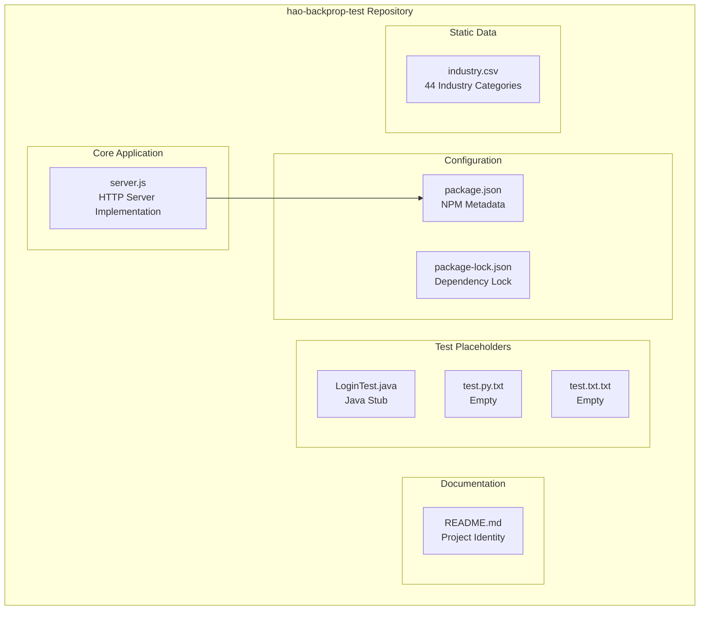

#### Component Inventory

| Component | File | Lines | Purpose | Status |
|-----------|------|-------|---------|--------|
| HTTP Server | `server.js` | 14 | Main application entry point | Functional |
| Package Manifest | `package.json` | ~12 | NPM metadata and scripts | Configured |
| Dependency Lock | `package-lock.json` | — | lockfileVersion 3 | Present |
| Documentation | `README.md` | 2 | Project identity and warning | Minimal |
| Java Placeholder | `LoginTest.java` | ~8 | Non-functional test stub | Incomplete |
| Industry Data | `industry.csv` | 45 | Static industry categories | Static data |
| Test Placeholder | `test.py.txt` | 0 | Empty placeholder | Placeholder |
| Test Placeholder | `test.txt.txt` | 0 | Empty placeholder | Placeholder |

#### Core Technical Approach

The project employs a **zero-dependency, single-file architecture**:

1. **Built-in Modules Only**: Uses exclusively the Node.js native `http` module
2. **Single Entry Point**: All server logic contained in `server.js` (14 lines)
3. **No Framework**: Pure Node.js implementation without Express, Fastify, or similar
4. **Synchronous Response**: Simple, blocking response pattern with static content
5. **Flat Structure**: All files at repository root level with no subdirectories

### 1.2.3 Success Criteria

#### Measurable Objectives

As a test project without formal requirements documentation, success criteria are inferred from the project's purpose:

| Objective | Measurement | Target |
|-----------|-------------|--------|
| Server Availability | HTTP response on localhost:3000 | 100% when running |
| Response Correctness | Output matches "Hello, World!\n" | Exact match |
| Backprop Compatibility | Successful tool integration | Analysis completes without errors |
| Environment Stability | Consistent behavior across runs | No variation |

#### Critical Success Factors

1. **Minimal Complexity**: Codebase remains simple enough for unambiguous analysis
2. **Zero Dependencies**: No external packages that could introduce variability
3. **Isolation**: Localhost binding prevents unintended external interactions
4. **Reproducibility**: Identical behavior across all test executions

#### Key Performance Indicators

| KPI | Description | Current State |
|-----|-------------|---------------|
| Dependency Count | Number of external npm packages | 0 |
| Code Complexity | Lines of executable code | 14 (server.js) |
| Startup Time | Time to server ready state | < 100ms |
| Response Latency | Time to return "Hello, World!" | < 10ms |

---

## 1.3 Scope

### 1.3.1 In-Scope Elements

#### Core Features and Functionalities

**Must-Have Capabilities:**

| Capability | Description | Implementation |
|------------|-------------|----------------|
| HTTP Server Initialization | Create and configure HTTP server instance | `http.createServer()` in `server.js` |
| Request Handling | Accept and respond to HTTP requests | Callback function with 200 status |
| Startup Logging | Display server URL on successful start | `console.log()` output |
| Static Response | Return consistent "Hello, World!" message | Plain text response body |

**Primary User Workflow:**

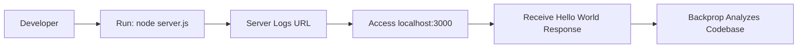

1. Developer executes `node server.js` from the repository root
2. Server initializes and logs: "Server running at http://127.0.0.1:3000/"
3. Developer or automated test accesses the endpoint
4. Server responds with "Hello, World!\n" (HTTP 200, text/plain)
5. Backprop tool performs analysis on the running or static codebase

**Essential Technical Requirements:**

| Requirement | Specification |
|-------------|---------------|
| Runtime | Node.js (no version constraint specified) |
| Network | Local network access (127.0.0.1) |
| Port | 3000 (hardcoded) |
| Storage | Read access to repository files |

#### Implementation Boundaries

**System Boundaries:**

- Single server instance operation
- Localhost-only network binding (127.0.0.1)
- All HTTP methods treated identically (GET, POST, etc.)
- No URL path differentiation (all paths return same response)
- No query parameter processing

**User Groups Covered:**

- Development team members running integration tests
- Automated CI/CD processes executing Backprop analysis
- Repository owner/maintainer (hxu)

**Data Domains Included:**

| Domain | File | Records | Usage |
|--------|------|---------|-------|
| Industry Categories | `industry.csv` | 44 | Available for potential analysis testing |

### 1.3.2 Out-of-Scope Elements

#### Explicitly Excluded Features

| Feature | Exclusion Rationale |
|---------|---------------------|
| Production Deployment | Localhost binding; test project designation |
| External Network Access | Intentionally bound to 127.0.0.1 only |
| Authentication/Authorization | No security requirements for test harness |
| Database Connectivity | No data persistence needed |
| HTTPS/TLS Encryption | Security unnecessary for localhost testing |
| Request Routing | Single response for all requests by design |
| Error Handling | Minimal implementation acceptable for test scope |
| Logging Infrastructure | Console output sufficient for test purposes |
| Configuration Management | Hardcoded values ensure consistency |
| Health Checks/Monitoring | Not required for test environment |

#### Future Phase Considerations

Evidence from placeholder files suggests potential future expansions:

| Artifact | Potential Future Use |
|----------|---------------------|
| `LoginTest.java` | Java integration testing with Backprop |
| `test.py.txt` | Python test implementation |
| `test.txt.txt` | Additional test scenarios |
| `industry.csv` | Data processing/analysis feature testing |

#### Integration Points Not Covered

- External API integrations
- Database connections (SQL, NoSQL)
- Message queue systems
- Cloud service providers (AWS, Azure, GCP)
- Third-party authentication services
- CDN or caching layers
- Container orchestration platforms

#### Unsupported Use Cases

| Use Case | Reason for Exclusion |
|----------|---------------------|
| Multi-user concurrent access | Single-purpose test server |
| Production traffic handling | Not designed for load |
| Dynamic content serving | Static response only |
| API versioning | Single endpoint, no versioning |
| Geographic distribution | Localhost binding only |
| Data persistence | No storage implementation |
| Session management | Stateless by design |
| Rate limiting | No traffic management features |

---

## 1.4 Document Conventions

### 1.4.1 Terminology

| Term | Definition |
|------|------------|
| Backprop | Code analysis, refactoring, or AI-assisted development tool being tested |
| Test Harness | The controlled environment (this project) used for integration testing |
| Placeholder | Files present in repository but not functionally implemented |
| Zero-dependency | Architecture using only Node.js built-in modules |

### 1.4.2 Configuration Discrepancy Note

The `package.json` file specifies `"main": "index.js"`, however the actual executable entry point is `server.js`. This discrepancy does not affect functionality but should be noted for documentation accuracy.

---

#### References

- `server.js` - Main HTTP server implementation (14 lines, core application logic)
- `package.json` - NPM package metadata, scripts, author, and license information
- `package-lock.json` - Dependency lock file (lockfileVersion 3, confirms zero dependencies)
- `README.md` - Project identity ("hao-backprop-test"), purpose statement, and access warning
- `industry.csv` - Static data file containing 44 industry category entries
- `LoginTest.java` - Java placeholder stub in com.blitzyTest package (non-functional)
- `test.py.txt` - Empty Python test placeholder file (0 bytes)
- `test.txt.txt` - Empty text test placeholder file (0 bytes)

# 2. Product Requirements

## 2.1 Feature Catalog

### 2.1.1 Feature Overview

This section documents the discrete, testable features of the hao-backprop-test repository. Given the project's intentionally minimal nature as a Backprop integration test harness, the feature catalog reflects a constrained scope focused on providing a predictable, zero-dependency test environment.

#### Feature Summary Matrix

| Feature ID | Feature Name | Category | Priority | Status |
|------------|--------------|----------|----------|--------|
| F-001 | HTTP Server | Core Functionality | Critical | Completed |
| F-002 | Backprop Integration Test Support | Integration | Critical | Completed |
| F-003 | Static Data Asset Availability | Data Resources | Low | Completed |
| F-004 | Multi-Language Test Stubs | Future Testing | Low | Proposed |

---

### 2.1.2 Feature: HTTP Server (F-001)

#### Feature Metadata

| Attribute | Value |
|-----------|-------|
| Feature ID | F-001 |
| Feature Name | HTTP Server |
| Category | Core Functionality |
| Priority Level | Critical |
| Status | Completed |
| Implementation | `server.js` |

#### Description

**Overview:**
The HTTP Server feature provides a minimal, deterministic web server that responds to all incoming HTTP requests with a static "Hello, World!" message. This server operates exclusively on localhost (127.0.0.1) on port 3000.

**Business Value:**
- Establishes a predictable baseline for Backprop tool integration testing
- Provides verifiable server behavior with known, expected outputs
- Enables isolated testing without external system dependencies

**User Benefits:**
- Single-command server startup via `node server.js`
- Immediate feedback through console logging
- Consistent response format across all request types

**Technical Context:**
The implementation uses only the Node.js built-in `http` module, eliminating external package dependencies. All configuration values (hostname, port, response content) are hardcoded to ensure reproducible test conditions.

#### Dependencies

| Dependency Type | Dependency | Notes |
|-----------------|------------|-------|
| Runtime | Node.js | Required runtime environment |
| Built-in Module | `http` | Node.js native HTTP module |
| External NPM | None | Zero external dependencies |
| System | Network stack | Localhost binding capability |

#### Technical Specifications

| Specification | Value |
|---------------|-------|
| Hostname | 127.0.0.1 |
| Port | 3000 |
| Response Status | 200 |
| Content-Type | text/plain |
| Response Body | "Hello, World!\n" |
| Supported Methods | All (undifferentiated) |
| Path Handling | All paths return same response |

---

### 2.1.3 Feature: Backprop Integration Test Support (F-002)

#### Feature Metadata

| Attribute | Value |
|-----------|-------|
| Feature ID | F-002 |
| Feature Name | Backprop Integration Test Support |
| Category | Integration |
| Priority Level | Critical |
| Status | Completed |
| Implementation | Repository structure |

#### Description

**Overview:**
This feature encompasses the repository's architectural design as a controlled test environment for validating Backprop tool integration. The "Do not touch!" directive in `README.md` designates this as a protected test asset.

**Business Value:**
- Provides stable codebase for Backprop analysis validation
- Reduces risk of integration failures in production environments
- Enables reproducible test scenarios across development cycles

**User Benefits:**
- Confidence in Backprop tool behavior through verified integration
- Clear cause-effect relationships during debugging
- Isolated environment prevents cross-contamination with production code

**Technical Context:**
The repository structure, zero-dependency architecture, and minimal code complexity are deliberate design choices to support unambiguous code analysis by external tools.

#### Dependencies

| Dependency Type | Dependency | Notes |
|-----------------|------------|-------|
| Prerequisite Feature | F-001 (HTTP Server) | Primary analysis target |
| External Tool | Backprop | Code analysis/AI development tool |
| Repository | Complete file structure | All 8 files contribute to test harness |

---

### 2.1.4 Feature: Static Data Asset Availability (F-003)

#### Feature Metadata

| Attribute | Value |
|-----------|-------|
| Feature ID | F-003 |
| Feature Name | Static Data Asset Availability |
| Category | Data Resources |
| Priority Level | Low |
| Status | Completed |
| Implementation | `industry.csv` |

#### Description

**Overview:**
The repository includes a static CSV data file containing 44 industry category entries. While not actively consumed by the HTTP server functionality, this data asset provides potential testing scenarios for data processing analysis.

**Business Value:**
- Extends test coverage to include data file parsing scenarios
- Provides structured data for potential multi-format analysis testing
- Demonstrates repository capability to host diverse file types

**User Benefits:**
- Available dataset for Backprop data handling validation
- Structured content for file type recognition testing

**Technical Context:**
The `industry.csv` file contains a single-column list of 44 industry categories (e.g., Accounting/Finance, Technology, Healthcare, Legal) in standard CSV format.

#### Dependencies

| Dependency Type | Dependency | Notes |
|-----------------|------------|-------|
| File System | `industry.csv` | 45 lines including header |
| External Dependencies | None | Self-contained static file |

---

### 2.1.5 Feature: Multi-Language Test Stubs (F-004)

#### Feature Metadata

| Attribute | Value |
|-----------|-------|
| Feature ID | F-004 |
| Feature Name | Multi-Language Test Stubs |
| Category | Future Testing |
| Priority Level | Low |
| Status | Proposed |
| Implementation | Placeholder files |

#### Description

**Overview:**
The repository contains placeholder artifacts for potential multi-language testing scenarios, including Java and Python test stubs. These files are currently non-functional but indicate planned expansion of testing capabilities.

**Business Value:**
- Establishes foundation for cross-language Backprop analysis testing
- Prepares repository for expanded integration validation scenarios

**User Benefits:**
- Framework for future multi-language test implementation
- Placeholder structure for organized test expansion

**Technical Context:**
Current placeholder state:
- `LoginTest.java`: Non-functional Java stub in `com.blitzyTest` package
- `test.py.txt`: Empty Python test placeholder (0 bytes)
- `test.txt.txt`: Empty text placeholder (0 bytes)

#### Dependencies

| Dependency Type | Dependency | Notes |
|-----------------|------------|-------|
| Java Runtime | JDK | Required for Java test execution |
| Python Runtime | Python 3.x | Required for Python test execution |
| Status | Incomplete | Requires implementation |

---

## 2.2 Functional Requirements Tables

### 2.2.1 HTTP Server Requirements (F-001)

#### Core Requirements

| Req ID | Description | Priority |
|--------|-------------|----------|
| F-001-RQ-001 | Server Initialization | Must-Have |
| F-001-RQ-002 | Request Handling | Must-Have |
| F-001-RQ-003 | Response Generation | Must-Have |
| F-001-RQ-004 | Startup Logging | Must-Have |

---

#### F-001-RQ-001: Server Initialization

**Requirement Details**

| Attribute | Specification |
|-----------|---------------|
| Requirement ID | F-001-RQ-001 |
| Description | System shall initialize HTTP server on localhost:3000 |
| Priority | Must-Have |
| Complexity | Low |

**Acceptance Criteria**

| Criterion ID | Description |
|--------------|-------------|
| AC-001-01 | Server binds to IP address 127.0.0.1 |
| AC-001-02 | Server listens on port 3000 |
| AC-001-03 | Server accepts incoming HTTP connections |
| AC-001-04 | No errors thrown during initialization |

**Technical Specifications**

| Parameter | Specification |
|-----------|---------------|
| Input | `node server.js` command execution |
| Output | Running server instance |
| Performance | Startup time < 100ms |
| Data Requirements | `server.js` file accessible |

**Validation Rules**

| Rule Type | Rule |
|-----------|------|
| Business Rule | Server must use hardcoded configuration |
| Data Validation | Port must be numeric (3000) |
| Security | Binding restricted to localhost only |
| Compliance | MIT license compliance required |

---

#### F-001-RQ-002: Request Handling

**Requirement Details**

| Attribute | Specification |
|-----------|---------------|
| Requirement ID | F-001-RQ-002 |
| Description | System shall accept all HTTP requests regardless of method or path |
| Priority | Must-Have |
| Complexity | Low |

**Acceptance Criteria**

| Criterion ID | Description |
|--------------|-------------|
| AC-002-01 | GET requests are accepted and processed |
| AC-002-02 | POST requests are accepted and processed |
| AC-002-03 | All URL paths return identical response |
| AC-002-04 | Query parameters are ignored |

**Technical Specifications**

| Parameter | Specification |
|-----------|---------------|
| Input | Any HTTP request to localhost:3000 |
| Output | Triggers response generation |
| Performance | Request processing < 10ms |
| Data Requirements | Valid HTTP request format |

**Validation Rules**

| Rule Type | Rule |
|-----------|------|
| Business Rule | No path differentiation implemented |
| Data Validation | HTTP protocol compliance |
| Security | Localhost-only access |
| Compliance | Standard HTTP/1.1 protocol |

---

#### F-001-RQ-003: Response Generation

**Requirement Details**

| Attribute | Specification |
|-----------|---------------|
| Requirement ID | F-001-RQ-003 |
| Description | System shall respond with "Hello, World!" message |
| Priority | Must-Have |
| Complexity | Low |

**Acceptance Criteria**

| Criterion ID | Description |
|--------------|-------------|
| AC-003-01 | Response body contains exactly "Hello, World!\n" |
| AC-003-02 | HTTP status code is 200 |
| AC-003-03 | Content-Type header is "text/plain" |
| AC-003-04 | Response is consistent across all requests |

**Technical Specifications**

| Parameter | Specification |
|-----------|---------------|
| Input | Processed HTTP request |
| Output | HTTP 200 with "Hello, World!\n" |
| Performance | Response latency < 10ms |
| Data Requirements | Static response string |

**Validation Rules**

| Rule Type | Rule |
|-----------|------|
| Business Rule | Response content is immutable |
| Data Validation | Exact string match required |
| Security | No sensitive data in response |
| Compliance | UTF-8 encoding |

---

#### F-001-RQ-004: Startup Logging

**Requirement Details**

| Attribute | Specification |
|-----------|---------------|
| Requirement ID | F-001-RQ-004 |
| Description | System shall log server URL upon successful startup |
| Priority | Must-Have |
| Complexity | Low |

**Acceptance Criteria**

| Criterion ID | Description |
|--------------|-------------|
| AC-004-01 | Console displays server URL on startup |
| AC-004-02 | Log message format: "Server running at http://127.0.0.1:3000/" |
| AC-004-03 | Log appears only after successful binding |

**Technical Specifications**

| Parameter | Specification |
|-----------|---------------|
| Input | Successful server binding |
| Output | Console log message |
| Performance | Immediate upon binding |
| Data Requirements | None |

**Validation Rules**

| Rule Type | Rule |
|-----------|------|
| Business Rule | Single log message per startup |
| Data Validation | Valid URL format in message |
| Security | No sensitive information logged |
| Compliance | Standard console output |

---

### 2.2.2 Backprop Integration Requirements (F-002)

| Req ID | Description | Priority |
|--------|-------------|----------|
| F-002-RQ-001 | Repository Accessibility | Must-Have |
| F-002-RQ-002 | Codebase Stability | Must-Have |
| F-002-RQ-003 | Zero-Dependency Maintenance | Should-Have |

---

#### F-002-RQ-001: Repository Accessibility

**Requirement Details**

| Attribute | Specification |
|-----------|---------------|
| Requirement ID | F-002-RQ-001 |
| Description | Repository structure shall remain accessible for Backprop analysis |
| Priority | Must-Have |
| Complexity | Low |

**Acceptance Criteria**

| Criterion ID | Description |
|--------------|-------------|
| AC-010-01 | All 8 repository files accessible |
| AC-010-02 | File permissions allow read access |
| AC-010-03 | No encrypted or obfuscated content |

**Technical Specifications**

| Parameter | Specification |
|-----------|---------------|
| Input | Backprop analysis request |
| Output | File content availability |
| Performance | Standard file system access |
| Data Requirements | Complete repository structure |

---

#### F-002-RQ-002: Codebase Stability

**Requirement Details**

| Attribute | Specification |
|-----------|---------------|
| Requirement ID | F-002-RQ-002 |
| Description | Codebase shall maintain consistent state for reproducible testing |
| Priority | Must-Have |
| Complexity | Low |

**Acceptance Criteria**

| Criterion ID | Description |
|--------------|-------------|
| AC-011-01 | "Do not touch!" directive respected |
| AC-011-02 | File contents unchanged between tests |
| AC-011-03 | Package version remains 1.0.0 |

**Technical Specifications**

| Parameter | Specification |
|-----------|---------------|
| Input | Repository state |
| Output | Consistent analysis results |
| Performance | N/A |
| Data Requirements | Version-controlled files |

---

#### F-002-RQ-003: Zero-Dependency Maintenance

**Requirement Details**

| Attribute | Specification |
|-----------|---------------|
| Requirement ID | F-002-RQ-003 |
| Description | Repository shall maintain zero external npm dependencies |
| Priority | Should-Have |
| Complexity | Low |

**Acceptance Criteria**

| Criterion ID | Description |
|--------------|-------------|
| AC-012-01 | `package.json` dependencies object empty |
| AC-012-02 | `package-lock.json` confirms no packages |
| AC-012-03 | Only Node.js built-in modules used |

**Technical Specifications**

| Parameter | Specification |
|-----------|---------------|
| Input | Dependency configuration |
| Output | Isolated execution environment |
| Performance | No dependency resolution overhead |
| Data Requirements | package.json, package-lock.json |

---

### 2.2.3 Static Data Requirements (F-003)

| Req ID | Description | Priority |
|--------|-------------|----------|
| F-003-RQ-001 | Data File Availability | Could-Have |
| F-003-RQ-002 | Data Format Compliance | Could-Have |

---

#### F-003-RQ-001: Data File Availability

**Requirement Details**

| Attribute | Specification |
|-----------|---------------|
| Requirement ID | F-003-RQ-001 |
| Description | Industry data file shall be present and readable |
| Priority | Could-Have |
| Complexity | Low |

**Acceptance Criteria**

| Criterion ID | Description |
|--------------|-------------|
| AC-020-01 | `industry.csv` exists in repository root |
| AC-020-02 | File contains 44 industry entries |
| AC-020-03 | Standard CSV format maintained |

**Technical Specifications**

| Parameter | Specification |
|-----------|---------------|
| Input | File system read request |
| Output | CSV content |
| Performance | Standard file read |
| Data Requirements | Valid CSV syntax |

---

## 2.3 Feature Relationships

### 2.3.1 Feature Dependency Map

The hao-backprop-test repository implements a deliberately simple architecture with minimal feature interdependencies. The following diagram illustrates the relationship hierarchy:

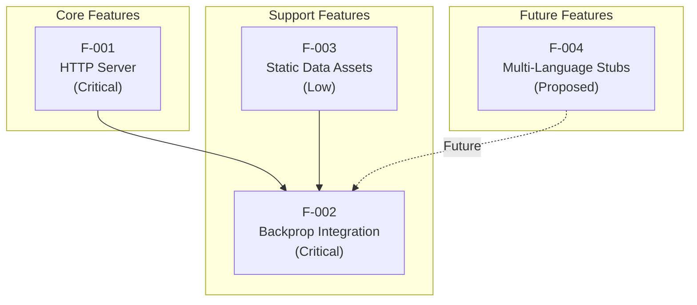

### 2.3.2 Dependency Matrix

| Feature | Depends On | Required By | Relationship Type |
|---------|------------|-------------|-------------------|
| F-001 | None | F-002 | Primary dependency |
| F-002 | F-001, F-003 | None | Integration feature |
| F-003 | None | F-002 | Optional enhancement |
| F-004 | None | F-002 | Future expansion |

### 2.3.3 Integration Points

| Integration Point | Features Involved | Description |
|-------------------|-------------------|-------------|
| HTTP Endpoint | F-001, F-002 | Server provides testable endpoint |
| File System | F-001, F-002, F-003 | Repository files available for analysis |
| Console Output | F-001, F-002 | Startup log enables verification |

### 2.3.4 Shared Components

| Component | Used By | Purpose |
|-----------|---------|---------|
| Node.js Runtime | F-001 | Server execution environment |
| Repository Structure | F-002, F-003, F-004 | File organization for analysis |
| Package Configuration | F-001, F-002 | npm metadata and scripts |

### 2.3.5 Common Services

Given the minimal nature of this test harness, common services are limited to:

| Service | Features | Implementation |
|---------|----------|----------------|
| Logging | F-001 | Console.log output |
| Configuration | F-001 | Hardcoded values in server.js |

---

## 2.4 Implementation Considerations

### 2.4.1 HTTP Server (F-001) Implementation

#### Technical Constraints

| Constraint | Description | Impact |
|------------|-------------|--------|
| Hardcoded Configuration | Port 3000 and IP 127.0.0.1 immutable | Prevents flexible deployment |
| Single Response | All requests receive identical response | No dynamic behavior |
| No Path Routing | URL paths ignored | Limited endpoint testing |
| No Error Handling | Basic error scenarios unhandled | May fail silently |

#### Performance Requirements

| Metric | Target | Rationale |
|--------|--------|-----------|
| Startup Time | < 100ms | Rapid test initialization |
| Response Latency | < 10ms | Efficient test execution |
| Memory Footprint | Minimal | Single-purpose operation |
| CPU Usage | Negligible | Static response generation |

#### Scalability Considerations

| Aspect | Current State | Notes |
|--------|---------------|-------|
| Concurrent Connections | Relies on Node.js defaults | No explicit handling |
| Horizontal Scaling | Not applicable | Single instance by design |
| Vertical Scaling | Not applicable | Minimal resource requirements |
| Load Handling | Not designed for load | Test environment only |

#### Security Implications

| Aspect | Implementation | Risk Level |
|--------|----------------|------------|
| Network Exposure | Localhost only (127.0.0.1) | Low |
| Authentication | None | Acceptable for test scope |
| Data Transmission | Plain HTTP | Low (localhost only) |
| Input Validation | None | Low (no input processing) |

#### Maintenance Requirements

| Requirement | Frequency | Description |
|-------------|-----------|-------------|
| Code Updates | Minimal | Intentionally stable |
| Dependency Updates | None | Zero external dependencies |
| Security Patches | None | Localhost isolation |
| Documentation | As needed | Maintain accuracy |

---

### 2.4.2 Backprop Integration (F-002) Implementation

#### Technical Constraints

| Constraint | Description | Impact |
|------------|-------------|--------|
| Repository Immutability | "Do not touch!" directive | Limited modification |
| Version Lock | Fixed at v1.0.0 | No version progression |
| Structure Stability | Fixed file layout | Consistent analysis baseline |

#### Performance Requirements

| Metric | Target | Rationale |
|--------|--------|-----------|
| Analysis Completion | Within tool timeout | Backprop compatibility |
| File Accessibility | Immediate | No access barriers |
| Parse Success | 100% | Clean, standard code |

#### Security Implications

| Aspect | Implementation | Risk Level |
|--------|----------------|------------|
| Code Exposure | Intentional for analysis | Accepted |
| Tool Access | Required for Backprop | Controlled environment |

#### Maintenance Requirements

| Requirement | Frequency | Description |
|-------------|-----------|-------------|
| Stability Verification | Per Backprop version | Ensure compatibility |
| Structure Preservation | Continuous | Maintain test baseline |

---

### 2.4.3 Static Data (F-003) Implementation

#### Technical Constraints

| Constraint | Description | Impact |
|------------|-------------|--------|
| Read-Only | Data not programmatically consumed | Analysis only |
| Static Content | 44 fixed entries | No dynamic updates |
| Single Column | Limited data complexity | Simple parsing |

#### Maintenance Requirements

| Requirement | Frequency | Description |
|-------------|-----------|-------------|
| Data Integrity | None | Static, unchanging |
| Format Validation | Initial | CSV compliance |

---

### 2.4.4 Configuration Discrepancy Resolution

**Issue:** The `package.json` file specifies `"main": "index.js"`, while the actual executable entry point is `server.js`.

**Impact Assessment:**

| Aspect | Impact Level | Notes |
|--------|--------------|-------|
| Functionality | None | Direct execution unaffected |
| npm Start | Potential Issue | If npm start script added |
| Backprop Analysis | Minor | May note discrepancy |

**Recommendation:** Maintain current state to preserve test baseline stability. Document discrepancy for reference.

---

## 2.5 Traceability Matrix

### 2.5.1 Feature to Requirement Traceability

| Feature ID | Requirements | Implementation File |
|------------|--------------|---------------------|
| F-001 | F-001-RQ-001, F-001-RQ-002, F-001-RQ-003, F-001-RQ-004 | `server.js` |
| F-002 | F-002-RQ-001, F-002-RQ-002, F-002-RQ-003 | Repository structure |
| F-003 | F-003-RQ-001, F-003-RQ-002 | `industry.csv` |
| F-004 | (Proposed) | Placeholder files |

### 2.5.2 Requirement to Acceptance Criteria Traceability

| Requirement ID | Acceptance Criteria | Verification Method |
|----------------|---------------------|---------------------|
| F-001-RQ-001 | AC-001-01 through AC-001-04 | Server startup test |
| F-001-RQ-002 | AC-002-01 through AC-002-04 | HTTP request tests |
| F-001-RQ-003 | AC-003-01 through AC-003-04 | Response validation |
| F-001-RQ-004 | AC-004-01 through AC-004-03 | Console output check |
| F-002-RQ-001 | AC-010-01 through AC-010-03 | File access test |
| F-002-RQ-002 | AC-011-01 through AC-011-03 | Integrity check |
| F-002-RQ-003 | AC-012-01 through AC-012-03 | Dependency audit |
| F-003-RQ-001 | AC-020-01 through AC-020-03 | CSV validation |

### 2.5.3 Requirement to Source File Mapping

| Requirement ID | Source File(s) | Line Reference |
|----------------|----------------|----------------|
| F-001-RQ-001 | `server.js` | Lines 1-4 (imports, config) |
| F-001-RQ-002 | `server.js` | Lines 6-9 (createServer callback) |
| F-001-RQ-003 | `server.js` | Lines 7-9 (response generation) |
| F-001-RQ-004 | `server.js` | Lines 11-13 (listen callback) |
| F-002-RQ-003 | `package.json`, `package-lock.json` | Dependencies section |
| F-003-RQ-001 | `industry.csv` | Full file |

### 2.5.4 Feature to Stakeholder Traceability

| Feature ID | Primary Stakeholder | Interest |
|------------|---------------------|----------|
| F-001 | Development/Integration Team | Test execution |
| F-002 | Backprop Tool Developers | Integration validation |
| F-003 | Development/Integration Team | Data analysis testing |
| F-004 | Development/Integration Team | Future expansion |

---

## 2.6 Assumptions and Constraints

### 2.6.1 Documented Assumptions

| ID | Assumption | Impact if Invalid |
|----|------------|-------------------|
| A-001 | Node.js runtime available on test system | Server cannot start |
| A-002 | Port 3000 available on localhost | Binding fails |
| A-003 | Backprop tool compatible with Node.js analysis | Integration fails |
| A-004 | Repository remains unchanged during testing | Inconsistent results |
| A-005 | Single-user test execution model | Concurrent access undefined |

### 2.6.2 Documented Constraints

| ID | Constraint | Rationale |
|----|------------|-----------|
| C-001 | Localhost binding only | Security and isolation |
| C-002 | No external dependencies | Test predictability |
| C-003 | Hardcoded configuration | Reproducibility |
| C-004 | Static response content | Simplicity |
| C-005 | Repository immutability | Test baseline preservation |

---

## 2.7 Requirement Version History

| Version | Date | Author | Changes |
|---------|------|--------|---------|
| 1.0.0 | Initial | hxu | Initial feature set established |

---

#### References

- `server.js` - HTTP server implementation containing all core functionality (14 lines)
- `package.json` - NPM package manifest defining project metadata and version (v1.0.0)
- `package-lock.json` - Dependency lock file confirming zero external dependencies
- `README.md` - Project identity documentation with "Do not touch!" protection directive
- `industry.csv` - Static data file with 44 industry category entries
- `LoginTest.java` - Java test placeholder stub (non-functional)
- `test.py.txt` - Python test placeholder (empty, 0 bytes)
- `test.txt.txt` - Text test placeholder (empty, 0 bytes)

---

# 3. Technology Stack

## 3.1 Overview

The hao-backprop-test project employs a **deliberately minimal technology stack** as a fundamental architectural decision. This minimalism is not a limitation but rather a core requirement to ensure predictable, reproducible behavior for Backprop integration testing. The zero-dependency architecture eliminates external variables that could compromise test reliability.

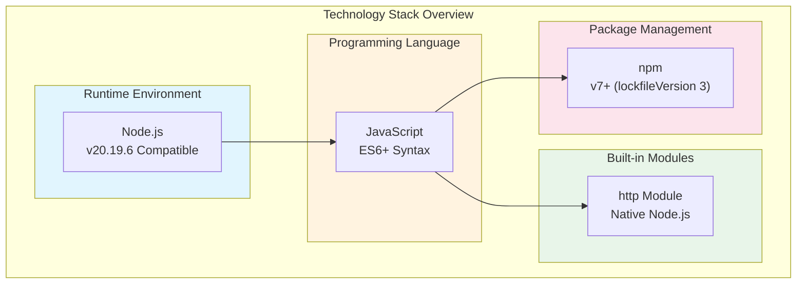

### 3.1.1 Technology Selection Philosophy

| Principle | Implementation | Rationale |
|-----------|----------------|-----------|
| Zero Dependencies | No external npm packages | Eliminates dependency-related test variables |
| Built-in Only | Native Node.js `http` module | Guaranteed availability across Node.js installations |
| Single Language | JavaScript only (functional) | Simplifies analysis scope |
| Minimal Tooling | npm for package metadata only | Reduces configuration complexity |

### 3.1.2 Stack Summary

| Layer | Technology | Version | Status |
|-------|------------|---------|--------|
| Runtime | Node.js | v20.19.6 compatible | Active |
| Language | JavaScript (ES6+) | — | Active |
| Core Module | Node.js `http` | Built-in | Active |
| Package Manager | npm | v7+ | Metadata only |
| Frameworks | None | — | Intentionally excluded |
| External Dependencies | None | — | Intentionally excluded |
| Database | None | — | Intentionally excluded |
| Cloud Services | None | — | Intentionally excluded |

---

## 3.2 Programming Languages

### 3.2.1 Primary Language: JavaScript (Node.js)

JavaScript serves as the sole functional programming language in this project, executed within the Node.js runtime environment.

#### Language Specification

| Attribute | Value | Evidence |
|-----------|-------|----------|
| Language | JavaScript | `server.js` implementation |
| Runtime | Node.js | Uses `http` module (Node.js built-in) |
| Compatibility | Node.js v20.19.6 | Documented runtime target |
| Syntax Level | ES6+ | `const` declarations, arrow function support |
| Module System | CommonJS | `require('http')` pattern |

#### Selection Criteria

| Criterion | Assessment | Justification |
|----------|------------|---------------|
| Runtime Availability | Excellent | Node.js widely available on development systems |
| Predictability | High | Consistent behavior across installations |
| Simplicity | High | No compilation or transpilation required |
| Backprop Compatibility | Verified | Primary target for integration testing |

#### Implementation Details

The JavaScript implementation in `server.js` demonstrates minimal, standards-compliant code:

| Aspect | Implementation |
|--------|----------------|
| Variable Declarations | `const` for immutable bindings |
| Module Import | CommonJS `require()` |
| Callback Handling | Standard function callbacks |
| String Output | Template-free static strings |

### 3.2.2 Placeholder Languages

The repository contains non-functional placeholder files for potential future multi-language testing capabilities:

#### Java Placeholder

| Attribute | Value |
|-----------|-------|
| File | `LoginTest.java` |
| Package | `com.blitzyTest` |
| Class | `LoginTest` |
| Status | **Non-functional** (empty method body) |
| Purpose | Future multi-language Backprop testing |

#### Python Placeholder

| Attribute | Value |
|-----------|-------|
| File | `test.py.txt` |
| Size | 0 bytes (empty) |
| Status | **Placeholder only** |
| Purpose | Future Python integration testing |

### 3.2.3 Language Distribution

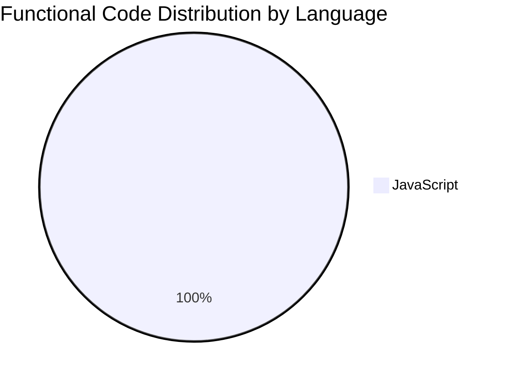

| Language | Files | Lines of Code | Functional Status |
|----------|-------|---------------|-------------------|
| JavaScript | 1 (`server.js`) | 14 | ✅ Fully functional |
| Java | 1 (`LoginTest.java`) | ~8 | ❌ Non-functional stub |
| Python | 1 (`test.py.txt`) | 0 | ❌ Empty placeholder |

---

## 3.3 Frameworks & Libraries

### 3.3.1 Framework Selection: None

This project **intentionally uses no frameworks**. The absence of frameworks such as Express.js, Fastify, Koa, or Hapi is a deliberate architectural decision.

#### Rationale for Framework Exclusion

| Consideration | With Framework | Without Framework (Current) |
|---------------|----------------|----------------------------|
| Dependencies | Multiple transitive packages | Zero external packages |
| Test Variability | Framework version changes affect results | Consistent across all test runs |
| Analysis Scope | Framework code included in analysis | Only application code analyzed |
| Behavior Predictability | Framework abstractions may vary | Direct Node.js behavior |
| Maintenance Burden | Security updates required | No maintenance needed |

### 3.3.2 Built-in Module Usage

The project relies exclusively on the Node.js built-in `http` module:

## Node.js `http` Module

| Attribute | Value |
|-----------|-------|
| Module Name | `http` |
| Type | Node.js built-in (core module) |
| Import Method | `const http = require('http');` |
| Version | Tied to Node.js runtime version |
| External Dependency | None (ships with Node.js) |

#### Module Capabilities Used

| Capability | Method | Usage in Project |
|------------|--------|------------------|
| Server Creation | `http.createServer()` | Creates HTTP server instance |
| Request Handling | Callback function | Processes all incoming requests |
| Response Writing | `res.statusCode`, `res.setHeader()`, `res.end()` | Sends HTTP response |
| Server Binding | `server.listen()` | Binds to localhost:3000 |

### 3.3.3 Excluded Libraries

The following common Node.js libraries are **explicitly not used**:

| Library Category | Common Options | Reason for Exclusion |
|------------------|----------------|---------------------|
| Web Frameworks | Express, Fastify, Koa, Hapi | Zero-dependency requirement |
| HTTP Utilities | Axios, node-fetch, got | No external requests needed |
| Logging | Winston, Pino, Morgan | Console.log sufficient |
| Testing | Jest, Mocha, Chai | No test implementation |
| Validation | Joi, Yup, Zod | No input processing |
| Configuration | dotenv, config | Hardcoded values by design |

---

## 3.4 Open Source Dependencies

### 3.4.1 Dependency Status: Zero

The project maintains **zero external dependencies** as a core architectural constraint (C-002).

## Package.json Dependencies

```
Production Dependencies:     0
Development Dependencies:    0
Peer Dependencies:          0
Optional Dependencies:      0
─────────────────────────────
Total External Packages:    0
```

#### Evidence from Configuration Files

**package.json** confirms no dependencies are declared:

| Field | Value | Notes |
|-------|-------|-------|
| `name` | `hello_world` | Package identifier |
| `version` | `1.0.0` | Semantic version |
| `description` | `Hello world in Node.js` | Package description |
| `main` | `index.js` | Entry point (note: actual file is `server.js`) |
| `author` | `hxu` | Package author |
| `license` | `MIT` | Open source license |
| `dependencies` | *Not present* | No production dependencies |
| `devDependencies` | *Not present* | No development dependencies |

**package-lock.json** confirms empty dependency tree:

| Field | Value |
|-------|-------|
| `name` | `hello_world` |
| `version` | `1.0.0` |
| `lockfileVersion` | 3 |
| `requires` | `true` |
| `packages` | Single entry (root package only) |

### 3.4.2 Dependency Philosophy

#### Benefits of Zero Dependencies

| Benefit | Description |
|---------|-------------|
| **Test Predictability** | No external code changes can affect test outcomes |
| **Security Posture** | No supply chain vulnerabilities possible |
| **Installation Speed** | No `node_modules` to download |
| **Reproducibility** | Identical behavior guaranteed across environments |
| **Analysis Clarity** | Backprop analyzes only application code |

#### Constraint Documentation

| Constraint ID | Description | Impact |
|---------------|-------------|--------|
| C-002 | No external dependencies | Ensures test predictability |

### 3.4.3 Package Registry Configuration

| Attribute | Value |
|-----------|-------|
| Registry | npm (npmjs.org) - default |
| Lock File Version | 3 (npm v7+ format) |
| Package Manager | npm |
| Private | Not specified (defaults to public) |

---

## 3.5 Third-Party Services

### 3.5.1 External Service Status: None

The project operates as a **completely standalone application** with no external service integrations.

#### Excluded Service Categories

| Service Category | Common Examples | Status | Exclusion Rationale |
|------------------|-----------------|--------|---------------------|
| Cloud Platforms | AWS, Azure, GCP | ❌ Not used | Localhost isolation requirement |
| Authentication | Auth0, Okta, Firebase Auth | ❌ Not used | No security requirements |
| Monitoring | Datadog, New Relic, Prometheus | ❌ Not used | Console output sufficient |
| Logging Services | Splunk, Loggly, ELK Stack | ❌ Not used | Test scope limitation |
| CDN | CloudFront, Cloudflare, Fastly | ❌ Not used | No static asset delivery |
| API Gateways | Kong, AWS API Gateway | ❌ Not used | Direct localhost access |
| Message Queues | RabbitMQ, SQS, Kafka | ❌ Not used | No async processing |
| Email Services | SendGrid, SES, Mailgun | ❌ Not used | No notification requirements |
| Payment Processing | Stripe, PayPal | ❌ Not used | Not applicable |
| Analytics | Google Analytics, Mixpanel | ❌ Not used | Test project scope |

### 3.5.2 Integration Points

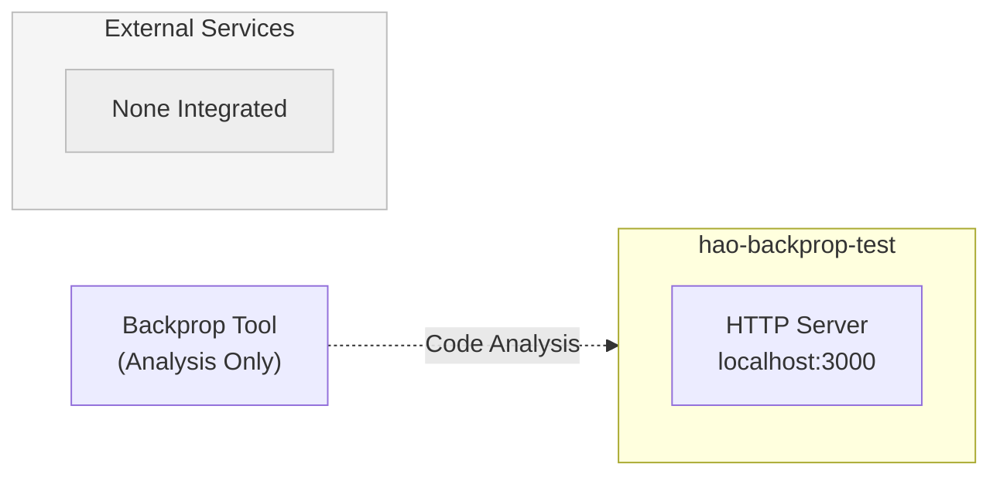

The only external interaction point is the **Backprop tool**, which performs code analysis on the repository but does not require runtime integration.

### 3.5.3 Network Isolation

| Aspect | Configuration | Security Impact |
|--------|---------------|-----------------|
| Binding Address | 127.0.0.1 (localhost only) | Prevents external network access |
| Port | 3000 (hardcoded) | Single, known endpoint |
| Protocol | HTTP (no TLS) | Acceptable for localhost |
| External Calls | None | No egress traffic |

---

## 3.6 Databases & Storage

### 3.6.1 Database Status: None

The project implements **no data persistence** mechanisms. This is an intentional design decision aligned with the project's purpose as a stateless test server.

#### Excluded Database Technologies

| Database Type | Common Options | Status | Exclusion Rationale |
|---------------|----------------|--------|---------------------|
| Relational (SQL) | PostgreSQL, MySQL, SQLite | ❌ Not used | No data persistence needed |
| Document (NoSQL) | MongoDB, CouchDB | ❌ Not used | No data storage requirements |
| Key-Value | Redis, Memcached | ❌ Not used | No caching requirements |
| Graph | Neo4j, ArangoDB | ❌ Not used | No relationship modeling |
| Time-Series | InfluxDB, TimescaleDB | ❌ Not used | No metrics collection |
| Search | Elasticsearch, Algolia | ❌ Not used | No search functionality |

### 3.6.2 Static Data Assets

The repository contains one static data file that is **not programmatically consumed** by the server:

## industry.csv

| Attribute | Value |
|-----------|-------|
| File Path | `industry.csv` |
| Format | CSV (Comma-Separated Values) |
| Structure | Single column |
| Record Count | 44 entries |
| Header | `industries` |
| Status | Static, read-only |
| Runtime Usage | None (not loaded by server) |
| Purpose | Available for Backprop analysis testing |

#### Sample Data Categories

The file contains industry classification labels such as:
- Technology sectors
- Healthcare categories  
- Financial services
- Manufacturing segments
- Professional services

### 3.6.3 Data Persistence Architecture

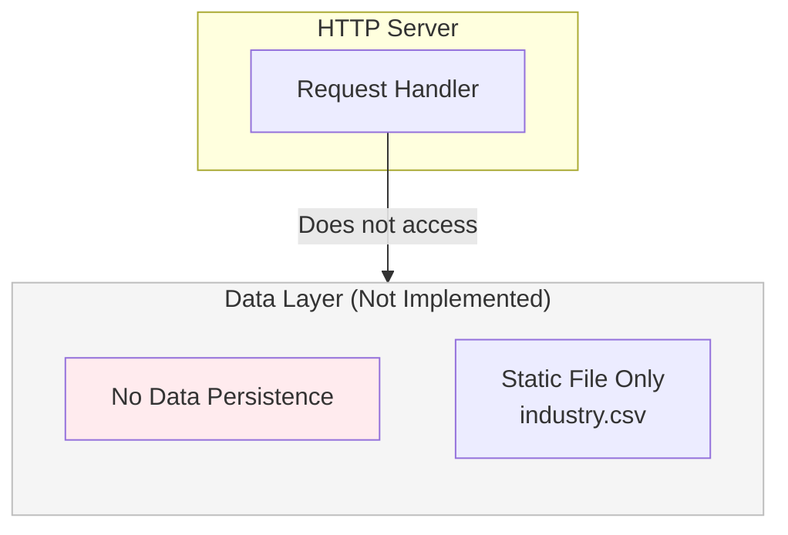

| Storage Aspect | Implementation |
|----------------|----------------|
| Session Storage | None (stateless) |
| User Data | None |
| Configuration | Hardcoded in source |
| Logs | Console output only |
| Cache | None |
| File System | Read-only static assets |

---

## 3.7 Development & Deployment

### 3.7.1 Development Tools

#### Package Management

| Tool | Version | Purpose | Evidence |
|------|---------|---------|----------|
| npm | v7+ (compatible) | Package metadata management | `package-lock.json` lockfileVersion: 3 |

The lockfileVersion 3 format in `package-lock.json` indicates compatibility with npm v7 and later versions.

#### Runtime Environment

| Component | Specification | Source |
|-----------|---------------|--------|
| Runtime | Node.js | `server.js` uses `http` module |
| Minimum Version | v20.19.6 compatible | Technical specification |
| Module System | CommonJS | `require()` syntax |

### 3.7.2 Build System

#### Build Status: None Required

The project requires **no build process**:

| Build Aspect | Status | Rationale |
|--------------|--------|-----------|
| Transpilation | Not needed | Plain JavaScript (no TypeScript) |
| Bundling | Not needed | Single-file application |
| Minification | Not needed | Development/test use only |
| Compilation | Not needed | Interpreted language |
| Asset Processing | Not needed | No frontend assets |

#### Execution Model

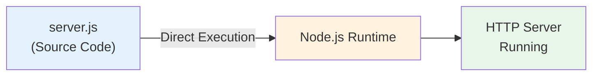

The application runs directly via:
```
node server.js
```

### 3.7.3 Containerization

#### Container Status: None

The project does **not include containerization**:

| Container Artifact | Status |
|--------------------|--------|
| Dockerfile | Not present |
| docker-compose.yml | Not present |
| .dockerignore | Not present |
| Container registry config | Not present |

#### Rationale for No Containerization

| Consideration | Assessment |
|---------------|------------|
| Deployment Target | Local development only |
| Isolation Need | Localhost binding provides isolation |
| Dependency Management | Zero dependencies eliminates need |
| Environment Consistency | Minimal runtime requirements |

### 3.7.4 CI/CD Configuration

#### CI/CD Status: None Configured

The project has **no continuous integration or deployment configuration**:

| CI/CD Component | Status | Evidence |
|-----------------|--------|----------|
| GitHub Actions | Not configured | No `.github/workflows` directory |
| Jenkins | Not configured | No `Jenkinsfile` |
| CircleCI | Not configured | No `.circleci` directory |
| Travis CI | Not configured | No `.travis.yml` |
| GitLab CI | Not configured | No `.gitlab-ci.yml` |

## Package.json Scripts

| Script | Command | Purpose |
|--------|---------|---------|
| `test` | `echo "Error: no test specified" && exit 1` | Placeholder (non-functional) |

The test script is a placeholder that returns an error, indicating no automated testing is implemented.

### 3.7.5 Development Workflow

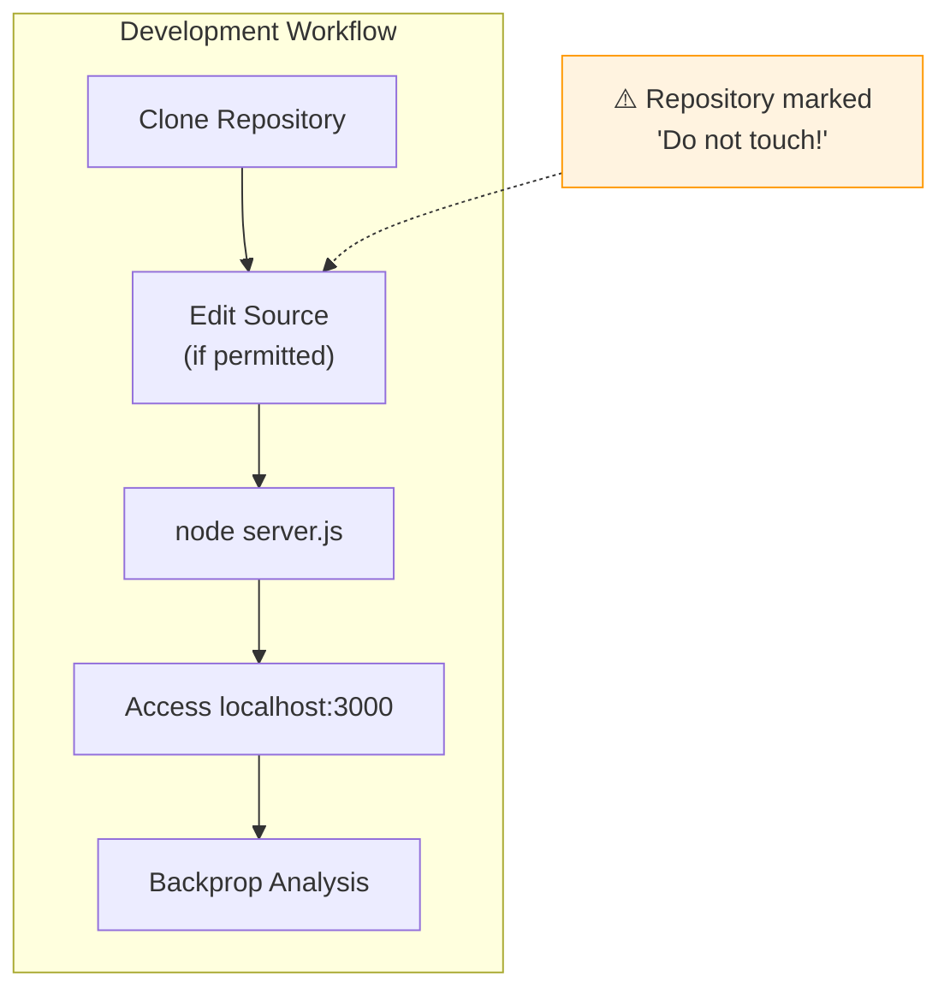

#### Minimal Development Requirements

| Requirement | Specification |
|-------------|---------------|
| Node.js | v20.19.6 or compatible |
| npm | v7+ (for lockfile compatibility) |
| Text Editor | Any |
| Terminal | Any shell |
| Port Availability | 3000 must be free |

---

## 3.8 Technology Stack Constraints

### 3.8.1 Architectural Constraints

| Constraint ID | Constraint | Technology Impact |
|---------------|------------|-------------------|
| C-001 | Localhost binding only | No cloud/remote deployment |
| C-002 | No external dependencies | Zero npm packages |
| C-003 | Hardcoded configuration | No environment variables |
| C-004 | Static response content | No templating engines |
| C-005 | Repository immutability | Technology stack frozen |

### 3.8.2 Technology Assumptions

| Assumption ID | Assumption | Technology Dependency |
|---------------|------------|----------------------|
| A-001 | Node.js runtime available | Required on test system |
| A-002 | Port 3000 available | No port configuration |
| A-003 | Backprop tool compatible | Node.js analysis support |

### 3.8.3 Security Implications

| Security Aspect | Technology Choice | Risk Assessment |
|-----------------|-------------------|-----------------|
| Supply Chain | Zero dependencies | No risk |
| Network Exposure | Localhost only | Minimal risk |
| Authentication | None implemented | Acceptable (test scope) |
| Encryption | Plain HTTP | Acceptable (localhost) |
| Input Validation | None | Low risk (static response) |

---

## 3.9 Configuration Discrepancy

### 3.9.1 Entry Point Mismatch

A configuration discrepancy exists between `package.json` and the actual implementation:

| Attribute | package.json Value | Actual Value |
|-----------|-------------------|--------------|
| Entry Point | `index.js` | `server.js` |

#### Impact Assessment

| Scenario | Impact |
|----------|--------|
| Direct Execution (`node server.js`) | None - works correctly |
| npm Start Script (if added) | Would fail without correction |
| Backprop Analysis | May note discrepancy |
| Module Import | Not applicable (not a library) |

#### Resolution Status

Per implementation considerations, the discrepancy is **intentionally maintained** to preserve test baseline stability.

---

## 3.10 References

#### Files Examined

- `server.js` - Primary HTTP server implementation (14 lines)
- `package.json` - npm package metadata and configuration
- `package-lock.json` - Dependency lock file (confirms zero dependencies)
- `README.md` - Project documentation and "Do not touch!" warning
- `LoginTest.java` - Java placeholder file (non-functional)
- `test.py.txt` - Python placeholder file (empty)
- `industry.csv` - Static data asset (44 industry categories)

#### Technical Specification Sections Referenced

- Section 1.1 Executive Summary - Project overview and business context
- Section 1.2 System Overview - Technical characteristics and component inventory
- Section 1.3 Scope - In-scope and out-of-scope elements
- Section 2.4 Implementation Considerations - Technical constraints and requirements
- Section 2.6 Assumptions and Constraints - Documented constraints (C-001 through C-005)

# 4. Process Flowchart

## 4.1 Overview

### 4.1.1 Process Architecture Summary

The hao-backprop-test repository implements a deliberately minimal process architecture designed to serve as a predictable test harness for Backprop integration testing. The system's workflow simplicity is an intentional design choice that eliminates variables that could interfere with code analysis validation.

#### Process Characteristics

| Characteristic | Implementation | Design Rationale |
|----------------|----------------|------------------|
| Process Complexity | Minimal | Unambiguous analysis baseline |
| Decision Points | None at runtime | Deterministic behavior |
| State Management | Stateless | No persistence requirements |
| Error Handling | Implicit (Node.js defaults) | Test simplicity prioritization |
| Transaction Boundaries | Single atomic operation | Request-response isolation |

#### System Actors

| Actor | Role | Interactions |
|-------|------|--------------|
| Developer/User | Process initiator | Starts server, makes HTTP requests |
| Node.js Runtime | Execution environment | Runs `server.js`, manages HTTP module |
| HTTP Server | Request handler | Receives requests, generates responses |
| Backprop Tool | Code analyzer | Analyzes repository files and running server |
| Console | Output destination | Receives startup logging |
| Client (Browser/curl) | Request originator | Sends HTTP requests to endpoint |

### 4.1.2 High-Level System Workflow

The following diagram illustrates the complete end-to-end system workflow from server initialization through Backprop analysis:

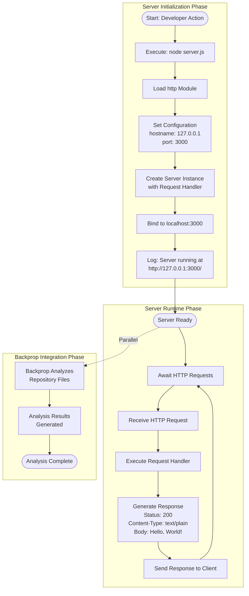

---

## 4.2 Core Business Processes

### 4.2.1 Server Initialization Process

The server initialization process represents the critical startup sequence that establishes the HTTP server instance. This process must complete successfully before the server can accept requests.

#### Process Flow Diagram

```mermaid
flowchart TD
    subgraph InitProcess["Server Initialization Process"]
        Init_Start([Start: node server.js])
        Init_Import["const http = require('http')"]
        Init_Hostname["const hostname = '127.0.0.1'"]
        Init_Port["const port = 3000"]
        Init_Create["http.createServer(callback)"]
        Init_Callback["Define Request Handler:<br/>- Set statusCode: 200<br/>- Set header: text/plain<br/>- Write: Hello, World!<br/>- End response"]
        Init_Listen["server.listen(port, hostname, callback)"]
        Init_Log["console.log(`Server running at...`)"]
        Init_Ready([Server Ready State])
    end
    
    Init_Start --> Init_Import
    Init_Import --> Init_Hostname
    Init_Hostname --> Init_Port
    Init_Port --> Init_Create
    Init_Create --> Init_Callback
    Init_Callback --> Init_Listen
    Init_Listen --> Init_Log
    Init_Log --> Init_Ready
```

#### Process Step Details

| Step | Action | Technical Implementation | Timing |
|------|--------|--------------------------|--------|
| 1 | Import HTTP Module | `const http = require('http')` | < 10ms |
| 2 | Define Hostname | `const hostname = '127.0.0.1'` | Immediate |
| 3 | Define Port | `const port = 3000` | Immediate |
| 4 | Create Server | `http.createServer(callback)` | < 5ms |
| 5 | Register Handler | Callback function defined inline | Immediate |
| 6 | Bind to Port | `server.listen(port, hostname, callback)` | < 50ms |
| 7 | Log Startup | `console.log(...)` | Immediate |

#### Validation Rules

| Rule ID | Rule Type | Validation | Enforcement Point |
|---------|-----------|------------|-------------------|
| VR-001 | Business Rule | Configuration values hardcoded | Compile-time |
| VR-002 | Data Validation | Port must be numeric (3000) | Runtime |
| VR-003 | Security | Localhost binding only (127.0.0.1) | Runtime |
| VR-004 | Compliance | MIT license compliance | Design-time |

### 4.2.2 HTTP Request Processing Flow

The request processing flow demonstrates the end-to-end user journey from HTTP request initiation through response delivery. This flow represents the primary functional capability of the system.

#### Detailed Request-Response Flow

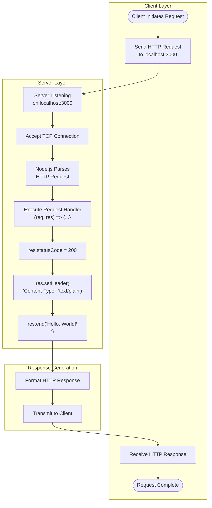

#### Request Processing Specifications

| Specification | Value | Evidence |
|---------------|-------|----------|
| Supported Methods | All (GET, POST, PUT, DELETE, etc.) | No method differentiation in `server.js` |
| Path Handling | All paths return identical response | No routing implementation |
| Query Parameters | Ignored | No query parsing |
| Request Body | Ignored | No body parsing |
| Response Status | 200 OK (constant) | `res.statusCode = 200` |
| Content-Type | text/plain | `res.setHeader('Content-Type', 'text/plain')` |
| Response Body | "Hello, World!\n" | `res.end('Hello, World!\n')` |

#### User Touchpoints

| Touchpoint | Actor | Action | System Response |
|------------|-------|--------|-----------------|
| Server Start | Developer | Execute `node server.js` | Console log: "Server running at..." |
| HTTP Request | Client | Send request to localhost:3000 | Return "Hello, World!\n" |
| Response Receipt | Client | Receive HTTP response | 200 OK with text/plain content |

### 4.2.3 End-to-End User Journey

The complete user journey encompasses all interactions from initial repository setup through Backprop analysis completion.

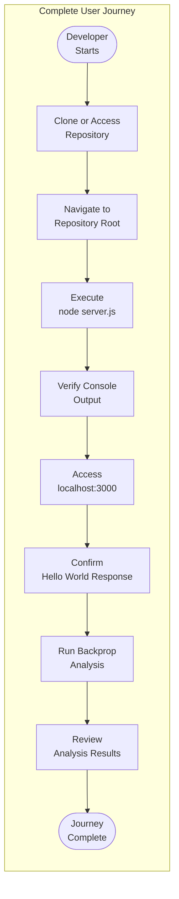

#### Journey Step Details

| Step | User Action | Expected Outcome | Success Criteria |
|------|-------------|------------------|------------------|
| 1 | Access repository | Files available locally | All 8 files present |
| 2 | Navigate to root | Terminal at repository root | `server.js` accessible |
| 3 | Start server | Server initializes | No startup errors |
| 4 | Verify startup | Console shows URL | Log matches expected format |
| 5 | Access endpoint | HTTP request sent | Connection established |
| 6 | Confirm response | "Hello, World!" received | Exact string match |
| 7 | Run Backprop | Analysis executes | Tool processes repository |
| 8 | Review results | Analysis completes | No analysis errors |

---

## 4.3 Integration Workflows

### 4.3.1 Backprop Integration Flow

The Backprop integration workflow illustrates how the test repository interfaces with the Backprop code analysis tool. This workflow represents the primary purpose of the repository's existence.

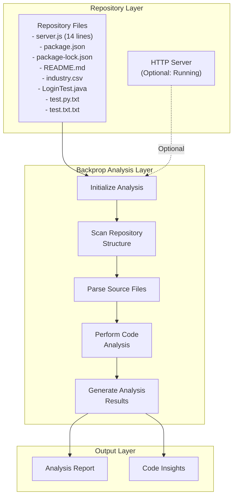

#### Integration Points

| Integration Point | Source | Target | Data Flow | Protocol |
|-------------------|--------|--------|-----------|----------|
| File System Access | Backprop | Repository | Read files | File I/O |
| HTTP Endpoint | Backprop | Server | Test connectivity | HTTP/1.1 |
| Console Output | Server | System | Startup verification | stdout |

#### Data Flow Between Systems

| Flow ID | Source System | Target System | Data Type | Frequency |
|---------|---------------|---------------|-----------|-----------|
| DF-001 | Repository | Backprop | Source code files | Per analysis |
| DF-002 | Server | Client | HTTP response | Per request |
| DF-003 | Server | Console | Log messages | Per startup |
| DF-004 | Backprop | User | Analysis results | Per analysis |

### 4.3.2 Development Workflow

The development workflow documents the process for working with the repository while respecting the "Do not touch!" directive that marks this as a protected test asset.

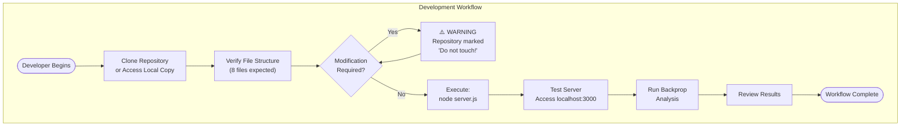

#### Development Prerequisites

| Requirement | Specification | Validation |
|-------------|---------------|------------|
| Node.js Runtime | v20.19.6 or compatible | `node --version` |
| npm | v7+ (lockfile compatibility) | `npm --version` |
| Port Availability | Port 3000 must be free | `lsof -i :3000` (Linux/Mac) |
| File Access | Read permissions on repository | File system check |

---

## 4.4 State Management

### 4.4.1 State Architecture

The hao-backprop-test system implements a **completely stateless architecture**. This design choice ensures deterministic behavior and eliminates variables that could affect Backprop analysis reproducibility.

#### State Transition Diagram

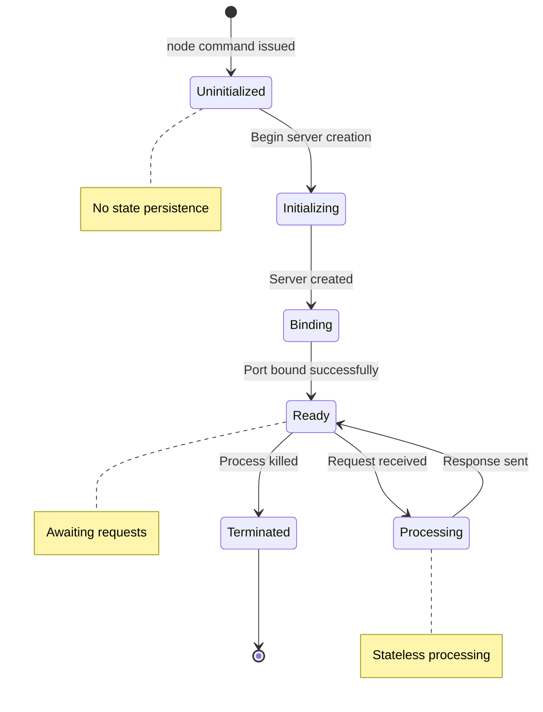

#### Server States

| State | Description | Transitions To | Trigger |
|-------|-------------|----------------|---------|
| Uninitialized | Process not started | Initializing | `node server.js` |
| Initializing | Loading modules, setting config | Binding | `http.createServer()` |
| Binding | Attaching to port 3000 | Ready | `server.listen()` |
| Ready | Awaiting HTTP requests | Processing | Incoming request |
| Processing | Handling current request | Ready | Response sent |
| Terminated | Process ended | (none) | SIGINT/SIGTERM |

### 4.4.2 Data Persistence Points

| Persistence Point | Implementation | Purpose |
|-------------------|----------------|---------|
| Configuration | Hardcoded in `server.js` | No runtime persistence |
| Request Data | Not stored | Immediate processing only |
| Response Data | Not stored | Generated per request |
| Session Data | None | Stateless design |
| Application State | None | No state maintained between requests |

### 4.4.3 Configuration State

All configuration is immutable and hardcoded within `server.js`:

| Configuration | Value | Storage | Mutability |
|---------------|-------|---------|------------|
| hostname | '127.0.0.1' | `server.js` line 3 | Immutable |
| port | 3000 | `server.js` line 4 | Immutable |
| statusCode | 200 | `server.js` line 7 | Immutable |
| contentType | 'text/plain' | `server.js` line 8 | Immutable |
| responseBody | 'Hello, World!\n' | `server.js` line 9 | Immutable |

### 4.4.4 Caching Requirements

| Caching Aspect | Implementation | Rationale |
|----------------|----------------|-----------|
| Server-side Caching | None | Static response, no benefit |
| Client-side Caching | Not controlled | No cache headers set |
| Request Caching | None | Each request processed independently |
| Response Caching | None | Response generated per request |

### 4.4.5 Transaction Boundaries

Given the system's stateless nature, each HTTP request represents a complete, isolated transaction:

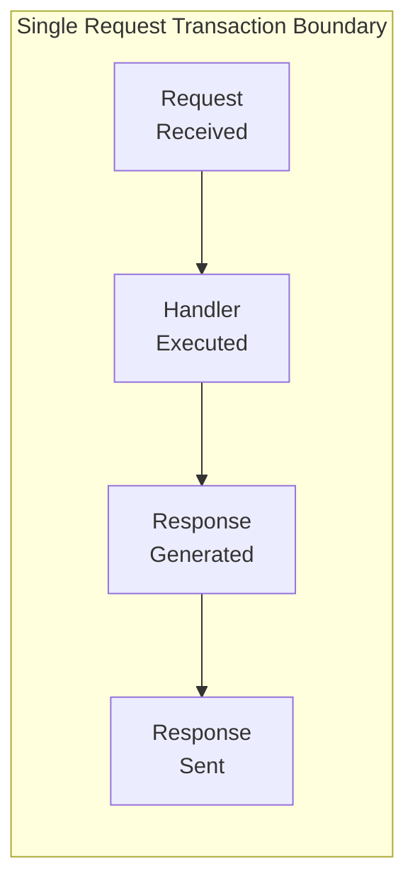

| Transaction Property | Value | Notes |
|----------------------|-------|-------|
| Atomicity | Yes | Single operation, no partial state |
| Consistency | Yes | Same input always produces same output |
| Isolation | Yes | No shared state between requests |
| Durability | N/A | No persistent data |

---

## 4.5 Error Handling

### 4.5.1 Error Handling Architecture

The hao-backprop-test system implements **minimal error handling** as a deliberate design choice to maintain simplicity for test purposes. Error scenarios are largely delegated to the Node.js runtime defaults.

#### Current Error Handling Status

| Error Category | Handling Implementation | Status |
|----------------|------------------------|--------|
| Startup Errors | Node.js defaults | Not explicitly handled |
| Runtime Errors | Node.js defaults | Not explicitly handled |
| Request Errors | HTTP module defaults | Not explicitly handled |
| Network Errors | Node.js defaults | Not explicitly handled |

### 4.5.2 Error Scenario Flow (Theoretical)

The following diagram illustrates theoretical error paths that could occur but are not explicitly handled by the application:

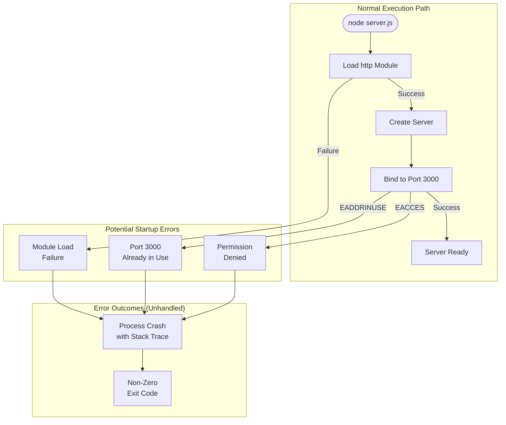

### 4.5.3 Error Types and Expected Behaviors

| Error Type | Error Code | Trigger Condition | Current Behavior | Recovery Path |
|------------|------------|-------------------|------------------|---------------|
| Port In Use | EADDRINUSE | Port 3000 occupied | Process crash | Free port, restart |
| Permission Denied | EACCES | Insufficient privileges | Process crash | Run with elevated permissions |
| Module Not Found | MODULE_NOT_FOUND | Corrupted Node.js | Process crash | Reinstall Node.js |
| Network Error | ENETDOWN | Network unavailable | Process crash | Restore network, restart |
| Memory Exhaustion | ENOMEM | Insufficient memory | Process crash | Free memory, restart |

### 4.5.4 Retry Mechanisms

| Mechanism | Implementation | Notes |
|-----------|----------------|-------|
| Automatic Retry | None | Not implemented |
| Exponential Backoff | None | Not implemented |
| Circuit Breaker | None | Not implemented |
| Fallback Processes | None | Not implemented |

### 4.5.5 Error Notification Flows

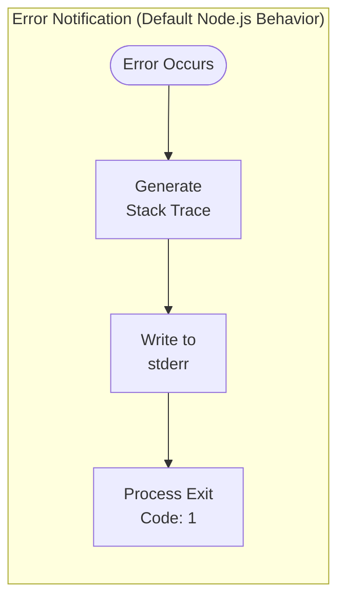

#### Error Output Destinations

| Error Type | Output Destination | Format |
|------------|-------------------|--------|
| Startup Errors | stderr | Stack trace |
| Runtime Exceptions | stderr | Stack trace |
| Uncaught Rejections | stderr | Stack trace (Node.js 15+) |

### 4.5.6 Recovery Procedures

Since the application implements no explicit error recovery, all recovery is manual:

| Scenario | Recovery Procedure |
|----------|-------------------|
| Port conflict | 1. Identify process using port 3000<br/>2. Terminate conflicting process<br/>3. Restart server with `node server.js` |
| Server crash | 1. Review error message in stderr<br/>2. Address root cause<br/>3. Restart server with `node server.js` |
| Node.js unavailable | 1. Install Node.js v20.19.6 or compatible<br/>2. Verify installation with `node --version`<br/>3. Start server with `node server.js` |

---

## 4.6 Validation Rules and Business Logic

### 4.6.1 Request Processing Rules

The following business rules govern request processing:

| Rule ID | Rule Category | Rule Description | Enforcement |
|---------|---------------|------------------|-------------|
| BR-001 | Path Handling | All URL paths return identical response | Implicit (no routing) |
| BR-002 | Method Handling | All HTTP methods treated equally | Implicit (no differentiation) |
| BR-003 | Response Content | Response body is exactly "Hello, World!\n" | Hardcoded |
| BR-004 | Response Format | Content-Type is always text/plain | Hardcoded |
| BR-005 | Status Code | HTTP status is always 200 | Hardcoded |

### 4.6.2 Data Validation Requirements

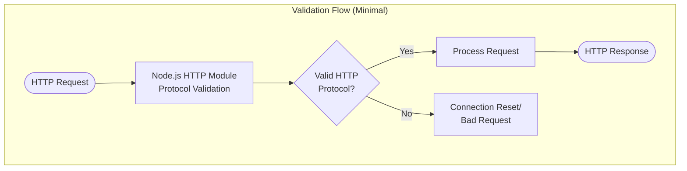

| Validation Type | Implementation | Scope |
|-----------------|----------------|-------|
| HTTP Protocol | Node.js http module | Automatic |
| Request Headers | Node.js http module | Automatic |
| Input Sanitization | None | Not required (no input processing) |
| Business Logic | None | No conditional logic |

### 4.6.3 Authorization Checkpoints

| Checkpoint | Implementation | Notes |
|------------|----------------|-------|
| Authentication | None | Not implemented |
| Authorization | None | Not implemented |
| Rate Limiting | None | Not implemented |
| IP Filtering | Implicit (localhost only) | Hardcoded binding |

### 4.6.4 Security Validation Points

```mermaid
flowchart LR
    subgraph Security["Security Boundary"]
        External["External<br/>Network"]
        Boundary["Network Binding<br/>127.0.0.1:3000"]
        Server["HTTP Server"]
    end
    
    External -->|Blocked| Boundary
    Boundary -->|Localhost Only| Server
```

| Security Control | Implementation | Risk Level |
|------------------|----------------|------------|
| Network Isolation | Localhost binding (127.0.0.1) | Low |
| Access Control | None beyond localhost binding | Acceptable for test scope |
| Input Validation | None (static response) | Low |
| Output Encoding | Plain text (no injection risk) | Low |

---

## 4.7 Performance and Timing Considerations

### 4.7.1 Timing Constraints

| Metric | Target | Rationale | Evidence |
|--------|--------|-----------|----------|
| Server Startup | < 100ms | Rapid test initialization | Section 2.4 requirements |
| Response Latency | < 10ms | Efficient test execution | Section 2.4 requirements |
| Memory Footprint | Minimal | Single-purpose operation | Zero dependencies |
| CPU Usage | Negligible | Static response generation | No computation |

### 4.7.2 Process Timing Diagram

```mermaid
gantt
    dateFormat  S
    title Server Lifecycle Timing
    
    section Initialization
    Module Load           :a1, 0, 10
    Configuration Setup   :a2, after a1, 1
    Server Creation       :a3, after a2, 5
    Port Binding          :a4, after a3, 50
    Startup Log           :a5, after a4, 1
    
    section Request Processing
    Request Receipt       :b1, 70, 1
    Handler Execution     :b2, after b1, 5
    Response Generation   :b3, after b2, 2
    Response Transmission :b4, after b3, 2
```

### 4.7.3 SLA Considerations

| SLA Metric | Target | Applicability |
|------------|--------|---------------|
| Availability | 100% when running | Local development only |
| Response Time | < 10ms | Test environment |
| Throughput | Not specified | Not designed for load |
| Error Rate | 0% | Deterministic responses |

**Note:** This is a test project with no formal SLA requirements. The metrics above represent design expectations rather than contractual obligations.

---

## 4.8 Integration Sequence Diagrams

### 4.8.1 HTTP Request-Response Sequence

```mermaid
sequenceDiagram
    participant C as Client (Browser/curl)
    participant N as Node.js Runtime
    participant S as HTTP Server
    participant H as Request Handler
    
    C->>N: HTTP Request to localhost:3000
    N->>S: Incoming Connection
    S->>H: Execute Callback(req, res)
    H->>H: Set statusCode = 200
    H->>H: Set Content-Type: text/plain
    H->>H: Write "Hello, World!\n"
    H->>S: End Response
    S->>N: Response Ready
    N->>C: HTTP 200 OK<br/>"Hello, World!\n"
```

### 4.8.2 Server Initialization Sequence

```mermaid
sequenceDiagram
    participant D as Developer
    participant T as Terminal
    participant N as Node.js Runtime
    participant H as http Module
    participant S as Server Instance
    
    D->>T: node server.js
    T->>N: Execute server.js
    N->>H: require('http')
    H-->>N: http module loaded
    N->>N: Define hostname, port
    N->>H: createServer(callback)
    H-->>N: Server instance
    N->>S: listen(port, hostname, callback)
    S-->>N: Binding complete
    N->>T: console.log("Server running...")
    T-->>D: Display startup message
```

### 4.8.3 Backprop Integration Sequence

```mermaid
sequenceDiagram
    participant D as Developer
    participant R as Repository
    participant B as Backprop Tool
    participant S as HTTP Server (Optional)
    
    D->>R: Access repository
    D->>B: Initiate analysis
    B->>R: Read server.js
    B->>R: Read package.json
    B->>R: Read other files
    B->>B: Parse source code
    B->>B: Perform analysis
    opt Server Running
        B->>S: Test HTTP endpoint
        S-->>B: "Hello, World!\n"
    end
    B->>B: Generate results
    B-->>D: Analysis complete
```

---

## 4.9 Decision Points Analysis

### 4.9.1 Runtime Decision Points

The system implements **zero explicit decision points** at runtime. This is a deliberate design choice that ensures deterministic behavior for test purposes.

```mermaid
flowchart TD
    subgraph NoDecisions["Runtime Flow (No Decision Points)"]
        R1([Request Received])
        R2["Set Status: 200"]
        R3["Set Header: text/plain"]
        R4["Write Body: Hello, World!"]
        R5["End Response"]
        R6([Response Sent])
    end
    
    R1 --> R2 --> R3 --> R4 --> R5 --> R6
```

### 4.9.2 Implicit Decision Points

While the application has no explicit branching logic, the Node.js runtime makes implicit decisions:

| Decision Point | Decision Maker | Possible Outcomes |
|----------------|----------------|-------------------|
| HTTP Protocol Validity | Node.js http module | Accept request / Reject connection |
| Port Availability | Operating System | Bind successfully / EADDRINUSE error |
| Memory Allocation | Node.js runtime | Allocate / Throw OOM error |
| TCP Connection | Network stack | Establish / Timeout |

### 4.9.3 Design Decision Flow

The following represents decisions made at design time that eliminate runtime decisions:

```mermaid
flowchart TB
    subgraph DesignDecisions["Design-Time Decisions"]
        D1{"Path-Based<br/>Routing?"}
        D2{"Method-Based<br/>Handling?"}
        D3{"Dynamic<br/>Configuration?"}
        D4{"Error<br/>Handling?"}
        D5{"State<br/>Management?"}
    end
    
    subgraph Outcomes["Design Outcomes"]
        O1["All paths: same response"]
        O2["All methods: same response"]
        O3["Hardcoded values"]
        O4["Node.js defaults"]
        O5["Stateless design"]
    end
    
    D1 -->|No| O1
    D2 -->|No| O2
    D3 -->|No| O3
    D4 -->|Minimal| O4
    D5 -->|No| O5
```

---

## 4.10 Process Summary

### 4.10.1 Process Inventory

| Process ID | Process Name | Type | Complexity | Status |
|------------|--------------|------|------------|--------|
| P-001 | Server Initialization | Core | Low | Implemented |
| P-002 | HTTP Request Processing | Core | Low | Implemented |
| P-003 | Response Generation | Core | Low | Implemented |
| P-004 | Startup Logging | Support | Low | Implemented |
| P-005 | Error Handling | Support | Minimal | Node.js defaults |
| P-006 | Backprop Integration | Integration | Low | Supported |
| P-007 | Development Workflow | Operational | Low | Documented |

### 4.10.2 Process Complexity Assessment

| Metric | Value | Assessment |
|--------|-------|------------|
| Total Processes | 7 | Minimal |
| Decision Points | 0 (runtime) | Simplest possible |
| State Transitions | 6 | Linear progression |
| Error Paths | 5 (unhandled) | Delegated to runtime |
| Integration Points | 3 | Limited scope |

### 4.10.3 Key Findings

1. **Deliberate Simplicity**: The process architecture is intentionally minimal to serve as an unambiguous test baseline for Backprop integration testing.

2. **Stateless Design**: No state is maintained between requests, ensuring deterministic behavior across all test executions.

3. **No Decision Points**: The absence of runtime branching eliminates test variability and simplifies analysis.

4. **Implicit Error Handling**: Error scenarios rely on Node.js defaults rather than explicit application-level handling.

5. **Linear Workflows**: All processes follow linear, non-branching flows from start to completion.

---

## 4.11 References

### 4.11.1 Source Files Referenced

| File Path | Relevance to Section |
|-----------|---------------------|
| `server.js` | Primary process implementation (14 lines), request handler, server initialization |
| `package.json` | NPM metadata, scripts configuration, entry point specification |
| `package-lock.json` | Dependency verification (zero dependencies), npm version compatibility |
| `README.md` | "Do not touch!" directive affecting development workflow |
| `industry.csv` | Static data asset included in Backprop analysis scope |
| `LoginTest.java` | Multi-language placeholder in analysis scope |

### 4.11.2 Technical Specification Sections Referenced

| Section | Information Used |
|---------|-----------------|
| 1.2 System Overview | High-level architecture, component inventory, success criteria |
| 1.3 Scope | Primary user workflow, in-scope/out-scope elements |
| 2.1 Feature Catalog | Feature definitions (F-001 through F-004) |
| 2.2 Functional Requirements Tables | Detailed requirements and acceptance criteria |
| 2.3 Feature Relationships | Dependency map, integration points |
| 2.4 Implementation Considerations | Technical constraints, performance requirements |
| 2.6 Assumptions and Constraints | System assumptions, design constraints |
| 3.7 Development & Deployment | Development workflow, execution model |
| 3.8 Technology Stack Constraints | Architectural constraints |
| 3.9 Configuration Discrepancy | Entry point mismatch documentation |
| Node.js `http` Module | Module capabilities used |
| Package.json Scripts | Development workflow scripts |

### 4.11.3 Related Technical Requirements

| Requirement ID | Requirement Description | Process Impact |
|----------------|------------------------|----------------|
| F-001-RQ-001 | Server Initialization | Defines P-001 |
| F-001-RQ-002 | Request Handling | Defines P-002 |
| F-001-RQ-003 | Response Generation | Defines P-003 |
| F-001-RQ-004 | Startup Logging | Defines P-004 |
| F-002-RQ-001 | Repository Accessibility | Defines P-006 |
| F-002-RQ-002 | Codebase Stability | Constrains P-007 |

# 5. System Architecture

## 5.1 High-Level Architecture

### 5.1.1 System Overview

The hao-backprop-test system implements a **zero-dependency, single-file, stateless HTTP server architecture** specifically designed to serve as a controlled test environment for Backprop integration testing. This architectural approach prioritizes predictability, reproducibility, and isolation over scalability or feature richness.

#### Architectural Style and Rationale

The system follows a **Minimal Monolith** architectural pattern—a deliberately constrained architecture that consolidates all functionality within a single entry point while eliminating external dependencies. This style was selected for the following reasons:

| Design Decision | Rationale | Trade-off |
|-----------------|-----------|-----------|
| Single-file implementation | Complete system visibility in 14 lines of code | Limited functionality scope |
| Zero external dependencies | Eliminates supply chain risk and test variables | No framework conveniences |
| Localhost-only binding | Prevents unintended external access | No remote accessibility |
| Hardcoded configuration | Guarantees identical behavior across runs | No runtime flexibility |

#### Key Architectural Principles

1. **Determinism**: Every execution produces identical results under identical conditions
2. **Isolation**: Network binding restricted to 127.0.0.1 prevents external interference
3. **Transparency**: Entire system behavior visible in a single 14-line file
4. **Immutability**: Configuration values hardcoded to prevent runtime modification
5. **Statelessness**: No data persistence between requests ensures test independence

#### System Boundaries and Major Interfaces

```mermaid
flowchart TB
    subgraph External[External Environment]
        Backprop[Backprop Analysis Tool]
        Developer[Developer/Tester]
        Browser[HTTP Client/Browser]
    end
    
    subgraph SystemBoundary[System Boundary: hao-backprop-test]
        subgraph CoreApp[Core Application]
            Server[server.js<br/>HTTP Server]
        end
        
        subgraph Config[Configuration Layer]
            Package[package.json<br/>NPM Metadata]
            Lock[package-lock.json<br/>Dependency Lock]
        end
        
        subgraph StaticAssets[Static Assets]
            CSV[industry.csv<br/>Data File]
            Readme[README.md<br/>Documentation]
        end
        
        subgraph Placeholders[Test Placeholders]
            Java[LoginTest.java]
            PyTest[test.py.txt]
            TxtTest[test.txt.txt]
        end
    end
    
    Developer -->|node server.js| Server
    Browser -->|HTTP Request| Server
    Server -->|HTTP Response| Browser
    Server -->|stdout| Developer
    Backprop -->|File System Read| SystemBoundary
```

The system boundary encompasses all repository files, with the HTTP server (`server.js`) serving as the single active runtime component. External actors interact with the system through file system access (Backprop analysis) or HTTP protocol (runtime testing).

### 5.1.2 Core Components Table

| Component Name | Primary Responsibility | Key Dependencies | Integration Points | Critical Considerations |
|----------------|------------------------|------------------|-------------------|------------------------|
| HTTP Server (`server.js`) | Handle HTTP requests and generate responses | Node.js `http` module (built-in) | TCP port 3000, stdout | Single point of execution; 14 lines of code |
| Package Manifest (`package.json`) | Define npm package metadata and project identity | npm v7+ | npm ecosystem, Backprop metadata analysis | Entry point mismatch with actual implementation |
| Dependency Lock (`package-lock.json`) | Lock dependency versions (empty dependencies) | npm lockfileVersion 3 | npm install operations | Confirms zero external dependencies |
| Documentation (`README.md`) | Identify project purpose and restrictions | None | Developer reference | Contains "Do not touch!" warning |
| Industry Data (`industry.csv`) | Provide static test data for potential analysis | None | Backprop data analysis | 44 industry categories; read-only |
| Java Placeholder (`LoginTest.java`) | Reserve space for future Java testing | None | Multi-language analysis | Non-functional stub (empty main method) |
| Python Placeholder (`test.py.txt`) | Reserve space for future Python testing | None | Multi-language analysis | Empty file (0 bytes) |
| Text Placeholder (`test.txt.txt`) | General test placeholder | None | Future expansion | Empty file (0 bytes) |

### 5.1.3 Data Flow Description

#### Primary Request-Response Data Flow

The system implements a simple, unidirectional request-response data flow with no intermediate transformations or storage:

1. **Request Ingress**: HTTP requests arrive at the server listening on `127.0.0.1:3000`
2. **Handler Invocation**: Node.js `http` module invokes the registered callback function
3. **Response Generation**: Handler sets status code (200), content-type header (`text/plain`), and response body (`Hello, World!\n`)
4. **Response Egress**: Formatted HTTP response transmitted back to the requesting client

#### Integration Patterns and Protocols

| Pattern | Implementation | Protocol | Data Format |
|---------|----------------|----------|-------------|
| Synchronous Request-Response | HTTP server callback | HTTP/1.1 | Plain text |
| File System Access | Direct read by Backprop | OS-native I/O | Multiple formats |
| Console Logging | stdout stream | Standard output | Plain text |

#### Data Transformation Points

The system performs **no data transformations**. The response body `Hello, World!\n` is a static string literal with no dynamic content generation, templating, or data processing.

#### Key Data Stores and Caches

| Store Type | Implementation | Purpose |
|------------|----------------|---------|
| Persistent Storage | None | Stateless by design |
| In-Memory Cache | None | Static response requires no caching |
| Session Store | None | No session management |
| Configuration Store | Hardcoded in source | Immutable runtime configuration |

### 5.1.4 External Integration Points

| System Name | Integration Type | Data Exchange Pattern | Protocol/Format | SLA Requirements |
|-------------|------------------|----------------------|-----------------|------------------|
| Backprop Analysis Tool | File System | Read-only access to repository files | File I/O / Multiple formats | No formal SLA (test environment) |
| HTTP Client/Browser | Request-Response | Synchronous HTTP request/response | HTTP/1.1 / Plain text | Response < 10ms |
| Node.js Runtime | Process Execution | Command-line invocation | OS process / JavaScript | Startup < 100ms |
| Console/Terminal | Log Output | Unidirectional stdout stream | stdout / Plain text | Immediate output |

---

## 5.2 Component Details

### 5.2.1 HTTP Server Component (server.js)

#### Purpose and Responsibilities

The `server.js` file serves as the sole runtime component of the system, implementing the complete HTTP server functionality in 14 lines of JavaScript code. Its responsibilities include:

- Loading the Node.js native `http` module
- Defining network binding configuration (hostname and port)
- Creating the HTTP server instance with request handler
- Binding the server to the specified network address
- Logging successful startup to the console

#### Technologies and Frameworks Used

| Technology | Version | Usage |
|------------|---------|-------|
| Node.js | v20.19.6 compatible | JavaScript runtime environment |
| Node.js `http` module | Built-in (tied to runtime) | HTTP server creation and request handling |
| JavaScript (ES6+) | ECMAScript 2015+ | `const` declarations, template literals |

#### Key Interfaces and APIs

| Interface | Method/API | Signature | Purpose |
|-----------|------------|-----------|---------|
| Module Import | `require()` | `const http = require('http')` | Load native HTTP module |
| Server Creation | `http.createServer()` | `http.createServer((req, res) => {...})` | Instantiate server with handler |
| Response Control | `res.statusCode` | Assignment: `res.statusCode = 200` | Set HTTP status code |
| Header Setting | `res.setHeader()` | `res.setHeader('Content-Type', 'text/plain')` | Set response headers |
| Response Completion | `res.end()` | `res.end('Hello, World!\n')` | Send body and complete response |
| Server Binding | `server.listen()` | `server.listen(port, hostname, callback)` | Bind to network address |

#### Data Persistence Requirements

**None.** The server component maintains no persistent state. Each request is processed independently with no data retention between requests or across server restarts.

#### Scaling Considerations

| Aspect | Current Design | Scaling Impact |
|--------|----------------|----------------|
| Concurrency Model | Node.js event loop (single-threaded) | Limited by single process |
| Horizontal Scaling | Not supported | Localhost binding prevents distribution |
| Vertical Scaling | Limited by Node.js memory constraints | Not applicable for test scope |
| Load Balancing | Not applicable | Single instance design |

### 5.2.2 Package Management Component (package.json)

#### Purpose and Responsibilities

The `package.json` file provides npm package metadata, enabling the project to be recognized as a valid Node.js package while deliberately declaring zero external dependencies.

#### Configuration Details

| Field | Value | Purpose |
|-------|-------|---------|
| `name` | `hello_world` | npm package identifier |
| `version` | `1.0.0` | Semantic version |
| `description` | (empty) | Package description |
| `main` | `index.js` | Entry point declaration (**mismatch with actual `server.js`**) |
| `author` | `hxu` | Package author |
| `license` | `MIT` | Open source license |
| `dependencies` | `{}` | Zero external dependencies |

#### Configuration Discrepancy

A known discrepancy exists between the declared entry point (`index.js`) and the actual implementation file (`server.js`):

| Impact Scenario | Behavior |
|-----------------|----------|
| Direct execution (`node server.js`) | Works correctly |
| npm start script (if added) | Would fail without correction |
| Module import | Not applicable (not a library) |
| Backprop analysis | May detect discrepancy |

This discrepancy is **intentionally maintained** to preserve test baseline stability.

### 5.2.3 Component Interaction Diagram

```mermaid
flowchart TD
    subgraph RuntimeExecution[Runtime Execution Flow]
        NodeProcess[Node.js Process]
        HTTPModule[http Module]
        ServerInstance[Server Instance]
        RequestHandler[Request Handler Callback]
        ResponseWriter[Response Writer]
    end
    
    subgraph StaticFiles[Static Configuration]
        PackageJSON[package.json]
        PackageLock[package-lock.json]
    end
    
    subgraph AnalysisTargets[Analysis Target Files]
        ServerJS[server.js]
        IndustryCSV[industry.csv]
        LoginJava[LoginTest.java]
    end
    
    NodeProcess -->|require| HTTPModule
    HTTPModule -->|createServer| ServerInstance
    ServerInstance -->|register| RequestHandler
    RequestHandler -->|write| ResponseWriter
    
    PackageJSON -.->|metadata| NodeProcess
    PackageLock -.->|validates| PackageJSON
    
    ServerJS -->|executed by| NodeProcess
```

### 5.2.4 Server State Transition Diagram

```mermaid
stateDiagram-v2
    [*] --> Uninitialized: node command issued
    
    Uninitialized --> Initializing: Begin module loading
    Initializing --> ServerCreated: http.createServer() completes
    ServerCreated --> Binding: server.listen() called
    Binding --> Ready: Port 3000 bound successfully
    Ready --> Processing: HTTP request received
    Processing --> Ready: Response sent
    Ready --> Terminated: SIGINT/SIGTERM received
    
    Binding --> BindError: Port unavailable
    BindError --> Terminated: Process exits with error
    
    Terminated --> [*]
    
    note right of Ready: Stateless - no data<br/>persists between requests
    note right of Processing: ~10ms per request
```

### 5.2.5 Request Processing Sequence Diagram

```mermaid
sequenceDiagram
    participant Client as HTTP Client
    participant NodeJS as Node.js Runtime
    participant HTTP as http Module
    participant Handler as Request Handler
    participant Response as Response Object
    
    Client->>NodeJS: HTTP Request to localhost:3000
    NodeJS->>HTTP: Route to server instance
    HTTP->>Handler: Invoke callback(req, res)
    Handler->>Response: res.statusCode = 200
    Handler->>Response: res.setHeader('Content-Type', 'text/plain')
    Handler->>Response: res.end('Hello, World!\n')
    Response->>HTTP: Response complete
    HTTP->>NodeJS: Format HTTP response
    NodeJS->>Client: HTTP 200 OK + "Hello, World!\n"
    
    Note over Client,Response: Total latency target: <10ms
```

---

## 5.3 Technical Decisions

### 5.3.1 Architecture Style Decisions and Trade-offs

The following architectural decisions shape the system's design and behavior:

| Decision Area | Choice Made | Alternatives Considered | Rationale for Choice |
|---------------|-------------|------------------------|---------------------|
| Dependency Strategy | Zero external dependencies | Express.js, Fastify, Koa | Eliminates supply chain risk and ensures reproducible test conditions |
| Server Implementation | Native `http` module | Web framework | Guaranteed availability; no installation required |
| Configuration Approach | Hardcoded values | Environment variables, config files | Ensures identical behavior across all test executions |
| Network Binding | Localhost only (127.0.0.1) | All interfaces (0.0.0.0) | Security isolation; prevents external access |
| Response Pattern | Static content | Dynamic templating | Deterministic output for verification testing |
| Error Handling | Node.js defaults | Custom error handling | Simplicity; acceptable for test scope |

### 5.3.2 Communication Pattern Choices

| Pattern | Decision | Justification |
|---------|----------|---------------|
| Request-Response Model | Synchronous blocking | Simplest pattern; adequate for test workload |
| Connection Handling | HTTP/1.1 with keep-alive | Node.js default; no optimization needed |
| Protocol Selection | Plain HTTP | Encryption unnecessary for localhost |
| Content Negotiation | Fixed text/plain | Single response type by design |

### 5.3.3 Data Storage Solution Rationale

**Decision: No Data Storage**

| Storage Option | Evaluation | Decision |
|----------------|------------|----------|
| In-memory cache | Not needed (static response) | Excluded |
| File-based storage | Not needed (stateless design) | Excluded |
| Database (SQL/NoSQL) | Adds complexity, dependencies | Excluded |
| Session storage | No session management required | Excluded |

The stateless architecture eliminates all storage requirements, ensuring each request is an independent, atomic transaction with no side effects.

### 5.3.4 Security Mechanism Selection

| Security Aspect | Decision | Rationale |
|-----------------|----------|-----------|
| Authentication | None implemented | Test environment; no sensitive data |
| Authorization | None implemented | All requests receive identical response |
| Encryption (TLS) | Not implemented | Localhost communication only |
| Input Validation | Not implemented | No input processing required |
| Supply Chain Security | Zero dependencies | Eliminates third-party vulnerabilities |

#### Security Risk Assessment

| Risk Category | Risk Level | Mitigation |
|---------------|------------|------------|
| Supply Chain Attack | None | No external dependencies |
| Network Exposure | Minimal | Localhost-only binding |
| Data Breach | None | No sensitive data stored |
| Injection Attacks | None | No input processing |

### 5.3.5 Architecture Decision Records

```mermaid
flowchart TD
    subgraph ADR001[ADR-001: Zero Dependency Architecture]
        ADR1_Context[Context: Test environment<br/>for Backprop integration]
        ADR1_Decision[Decision: Use only<br/>Node.js built-in modules]
        ADR1_Consequence[Consequence: No npm install<br/>required; guaranteed consistency]
    end
    
    subgraph ADR002[ADR-002: Localhost-Only Binding]
        ADR2_Context[Context: Security and<br/>isolation requirements]
        ADR2_Decision[Decision: Bind to<br/>127.0.0.1 only]
        ADR2_Consequence[Consequence: No remote<br/>access possible]
    end
    
    subgraph ADR003[ADR-003: Stateless Design]
        ADR3_Context[Context: Test reproducibility<br/>requirements]
        ADR3_Decision[Decision: No state<br/>persistence between requests]
        ADR3_Consequence[Consequence: Each request<br/>is independent; deterministic output]
    end
    
    ADR1_Context --> ADR1_Decision --> ADR1_Consequence
    ADR2_Context --> ADR2_Decision --> ADR2_Consequence
    ADR3_Context --> ADR3_Decision --> ADR3_Consequence
```

---

## 5.4 Cross-Cutting Concerns

### 5.4.1 Monitoring and Observability Approach

#### Current Implementation

The system implements **minimal observability** appropriate for its test purpose:

| Observability Aspect | Implementation | Tool/Method |
|---------------------|----------------|-------------|
| Health Monitoring | None | Server availability verified by HTTP request |
| Metrics Collection | None | Not required for test scope |
| Distributed Tracing | None | Single-component system |
| Log Aggregation | None | Console output only |

#### Verification Methods

| Verification Type | Method | Expected Outcome |
|-------------------|--------|------------------|
| Server Running | HTTP GET to localhost:3000 | 200 OK response |
| Startup Success | Console output inspection | "Server running at..." message |
| Process Status | OS process listing | Node.js process on port 3000 |

### 5.4.2 Logging and Tracing Strategy

#### Logging Implementation

| Log Type | Output Destination | Format | Trigger |
|----------|-------------------|--------|---------|
| Startup Log | stdout | Plain text template literal | Server successfully bound |
| Error Logs | stderr | Node.js stack trace | Unhandled exceptions |

#### Log Output Specification

```
Server running at http://127.0.0.1:3000/
```

This single log entry confirms:
- Server initialization completed successfully
- Network binding successful
- Hostname and port configuration active

#### Tracing Considerations

**Not Implemented.** Tracing is unnecessary for this single-component, synchronous system. Each request completes within a single thread with no external service calls.

### 5.4.3 Error Handling Patterns

#### Error Handling Architecture

The system delegates all error handling to Node.js runtime defaults, implementing no custom error management:

| Error Category | Handling Approach | Behavior |
|----------------|-------------------|----------|
| Startup Errors | Node.js default | Stack trace to stderr; process exit |
| Runtime Exceptions | Uncaught exception handler | Stack trace; process termination |
| Request Processing Errors | None possible | Static response guarantees no errors |

#### Error Handling Flow Diagram

```mermaid
flowchart TD
    subgraph NormalPath[Normal Execution Path]
        Start([node server.js])
        LoadModule[Load http Module]
        CreateServer[Create Server Instance]
        BindPort[Bind to Port 3000]
        ServerReady[Server Ready]
    end
    
    subgraph ErrorPath[Error Scenarios]
        ModuleError[MODULE_NOT_FOUND<br/>Node.js Corrupted]
        PortError[EADDRINUSE<br/>Port 3000 Occupied]
        PermError[EACCES<br/>Permission Denied]
    end
    
    subgraph ErrorOutcome[Error Outcome]
        StackTrace[Generate Stack Trace]
        WriteStderr[Write to stderr]
        ProcessExit[Process Exit Code 1]
    end
    
    Start --> LoadModule
    LoadModule -->|Success| CreateServer
    LoadModule -->|Failure| ModuleError
    CreateServer --> BindPort
    BindPort -->|Success| ServerReady
    BindPort -->|Port Busy| PortError
    BindPort -->|No Permission| PermError
    
    ModuleError --> StackTrace
    PortError --> StackTrace
    PermError --> StackTrace
    StackTrace --> WriteStderr
    WriteStderr --> ProcessExit
```

#### Error Recovery Procedures

| Error Scenario | Recovery Steps |
|----------------|---------------|
| Port 3000 in use | 1. Identify process: `lsof -i :3000`<br/>2. Terminate conflicting process<br/>3. Restart: `node server.js` |
| Permission denied | 1. Verify user permissions<br/>2. Run with appropriate privileges<br/>3. Restart: `node server.js` |
| Node.js unavailable | 1. Install Node.js v20.19.6+<br/>2. Verify: `node --version`<br/>3. Start: `node server.js` |

### 5.4.4 Authentication and Authorization Framework

**Not Applicable.** The system implements no authentication or authorization mechanisms. This is an intentional design decision based on:

- Test environment scope (no production data)
- Localhost-only binding (no external access)
- Static response content (no access control needed)
- Single-user execution model assumed

### 5.4.5 Performance Requirements and SLAs

#### Performance Targets

| Metric | Target | Measurement Method | Current Status |
|--------|--------|-------------------|----------------|
| Server Startup Time | < 100ms | Time from `node server.js` to ready state | Achieved |
| Response Latency | < 10ms | Time from request receipt to response completion | Achieved |
| Memory Footprint | Minimal | Node.js process memory | ~20-50MB (Node.js baseline) |
| CPU Utilization | Negligible | Process CPU usage | Near-zero when idle |
| Availability | 100% when running | HTTP endpoint accessibility | Design target |
| Error Rate | 0% | Failed requests / total requests | Deterministic response guarantees this |

#### SLA Considerations

**Note:** This is a test project with no formal SLA requirements. The metrics above represent design expectations for test environment operation rather than contractual service level agreements.

| SLA Metric | Target | Applicability |
|------------|--------|---------------|
| Availability | 100% when running | Local development only |
| Response Time | < 10ms | Test environment |
| Throughput | Unspecified | Not designed for load testing |
| Error Rate | 0% | Deterministic static response |

### 5.4.6 Disaster Recovery Procedures

#### Recovery Strategy

Given the stateless, zero-persistence architecture, disaster recovery is straightforward:

| Failure Scenario | Recovery Procedure | RTO |
|------------------|-------------------|-----|
| Server Process Crash | Execute `node server.js` | < 1 second |
| Port Conflict | Clear port; restart server | < 1 minute |
| Repository Corruption | Re-clone from source | < 5 minutes |
| Node.js Failure | Reinstall Node.js runtime | < 10 minutes |

#### Data Recovery

**Not Applicable.** The system maintains no persistent data. All configuration is hardcoded in source files, which are version-controlled and can be restored from the repository.

#### Business Continuity

| Aspect | Implementation |
|--------|----------------|
| Data Backup | Not required (no persistent data) |
| Redundancy | Not required (test environment) |
| Failover | Not implemented (single instance design) |
| Geographic Distribution | Not applicable (localhost binding) |

---

## 5.5 Architectural Constraints

### 5.5.1 Documented Constraints

| Constraint ID | Constraint Description | Technology Impact | Enforcement |
|---------------|------------------------|-------------------|-------------|
| C-001 | Localhost binding only | No cloud/remote deployment possible | Hardcoded in `server.js` |
| C-002 | No external dependencies | Zero npm packages allowed | Empty dependencies in `package.json` |
| C-003 | Hardcoded configuration | No environment variable support | Values embedded in source code |
| C-004 | Static response content | No templating engines or dynamic content | Response string literal |
| C-005 | Repository immutability | Technology stack must remain frozen | "Do not touch!" policy |

### 5.5.2 Documented Assumptions

| Assumption ID | Assumption | Impact if Invalid |
|---------------|------------|-------------------|
| A-001 | Node.js runtime available on test system | Server cannot start |
| A-002 | Port 3000 available on localhost | Binding fails with EADDRINUSE |
| A-003 | Backprop tool compatible with Node.js analysis | Integration fails |
| A-004 | Repository remains unchanged during testing | Inconsistent test results |
| A-005 | Single-user test execution model | Concurrent access behavior undefined |

---

## 5.6 References

### 5.6.1 Repository Files Examined

- `server.js` - Main HTTP server implementation (14 lines); core runtime component
- `package.json` - NPM package manifest; metadata and dependency declarations
- `package-lock.json` - Dependency lock file; confirms zero external dependencies
- `README.md` - Project documentation; contains "Do not touch!" warning
- `industry.csv` - Static data file; 44 industry categories for potential analysis testing
- `LoginTest.java` - Java test placeholder; non-functional stub for multi-language testing
- `test.py.txt` - Python test placeholder; empty file (0 bytes)
- `test.txt.txt` - General test placeholder; empty file (0 bytes)

### 5.6.2 Technical Specification Sections Referenced

- Section 1.1 Executive Summary - Project overview and stakeholder context
- Section 1.2 System Overview - High-level system description and component inventory
- Section 1.3 Scope - In-scope and out-of-scope elements
- Section 2.6 Assumptions and Constraints - Documented system constraints
- Section 3.1 Overview - Technology stack overview and selection philosophy
- Section 3.8 Technology Stack Constraints - Architectural constraints
- Section 3.9 Configuration Discrepancy - Entry point mismatch documentation
- Section 4.2 Core Business Processes - Server initialization and request flows
- Section 4.3 Integration Workflows - Backprop integration and development workflows
- Section 4.4 State Management - Stateless architecture documentation
- Section 4.5 Error Handling - Error handling architecture and scenarios
- Section 4.7 Performance and Timing Considerations - Performance metrics and SLAs
- Node.js `http` Module - Module capabilities and usage documentation

# 6. SYSTEM COMPONENTS DESIGN

## 6.1 Core Services Architecture

#### SYSTEM ARCHITECTURE (Continued)

## 6.1 Core Services Architecture

### 6.1.1 Applicability Assessment

**Core Services Architecture is not applicable for this system.**

The hao-backprop-test repository implements a deliberately minimal, single-component HTTP server designed exclusively as a test harness for Backprop integration testing. This architectural approach explicitly excludes microservices, distributed architecture, and distinct service components by design.

#### Justification for Non-Applicability

| Architecture Requirement | System Status | Evidence |
|-------------------------|---------------|----------|
| Microservices | Not Implemented | Single-file implementation (`server.js`, 14 lines) |
| Distributed Architecture | Not Supported | Localhost-only binding (`127.0.0.1`) prevents distribution |
| Distinct Service Components | Not Present | All functionality consolidated in one file |
| External Service Dependencies | Zero | Empty `dependencies` object in `package.json` |
| Service Discovery | Not Applicable | Single instance, no service registry |
| Inter-service Communication | Not Applicable | No services to communicate between |

The system follows a **Minimal Monolith** architectural pattern—a deliberately constrained architecture that consolidates all functionality within a single entry point while eliminating external dependencies. This design prioritizes predictability, reproducibility, and isolation over scalability or feature richness.

### 6.1.2 Project Purpose and Constraints

#### Project Context

The README.md explicitly identifies this as a **"test project for backprop integration"** with a directive to "Do not touch!" This classification places the repository outside the domain of production systems where Core Services Architecture would typically apply.

#### Architectural Classification

```mermaid
flowchart TB
    subgraph Classification["Architecture Classification"]
        direction TB
        Q1{{"Is this a<br/>distributed system?"}}
        Q2{{"Are there multiple<br/>service components?"}}
        Q3{{"Does it require<br/>scaling infrastructure?"}}
        Result[["Core Services Architecture<br/>NOT APPLICABLE"]]
    end
    
    Q1 -->|"No: localhost only"| Q2
    Q2 -->|"No: single file"| Q3
    Q3 -->|"No: test project"| Result
```

#### Documented Constraints Preventing Core Services Architecture

| Constraint ID | Description | Impact on Core Services |
|---------------|-------------|------------------------|
| C-001 | Localhost binding only | Prevents cloud/remote deployment; no distribution possible |
| C-002 | No external dependencies | Cannot integrate service mesh, discovery, or orchestration tools |
| C-003 | Hardcoded configuration | No environment variable support for service configuration |
| C-004 | Static response content | No dynamic routing or service-based content generation |
| C-005 | Repository immutability | Technology stack frozen; cannot add service infrastructure |

### 6.1.3 Actual System Architecture

While Core Services Architecture is not applicable, the following documents the actual architectural implementation present in this system.

#### Single-Component Architecture Overview

```mermaid
flowchart TB
    subgraph ExternalActors["External Environment"]
        Developer["Developer/Tester"]
        Browser["HTTP Client/Browser"]
        Backprop["Backprop Analysis Tool"]
    end
    
    subgraph SystemBoundary["System Boundary: hao-backprop-test"]
        subgraph CoreApplication["Core Application (Single Component)"]
            HTTPServer["server.js<br/>HTTP Server<br/>14 lines of code"]
        end
        
        subgraph Configuration["Configuration Layer"]
            PackageJSON["package.json<br/>NPM Metadata"]
            PackageLock["package-lock.json<br/>Dependency Lock"]
        end
        
        subgraph StaticAssets["Static Assets"]
            README["README.md"]
            IndustryCSV["industry.csv"]
        end
    end
    
    Developer -->|"node server.js"| HTTPServer
    Browser -->|"HTTP Request"| HTTPServer
    HTTPServer -->|"HTTP Response"| Browser
    HTTPServer -->|"stdout"| Developer
    Backprop -->|"File System Read"| SystemBoundary
```

#### Component Inventory

| Component | Type | Responsibility | Service Classification |
|-----------|------|----------------|----------------------|
| `server.js` | Runtime | HTTP request handling | Monolithic (single component) |
| `package.json` | Configuration | NPM metadata | Not a service |
| `package-lock.json` | Configuration | Dependency lock | Not a service |
| `README.md` | Documentation | Project identity | Not a service |
| `industry.csv` | Static Data | Test data asset | Not a service |

### 6.1.4 Service Component Analysis

#### Why Microservices Are Not Applicable

The system consists of a single 14-line implementation file that handles all functionality:

| Microservice Characteristic | System Implementation | Gap Analysis |
|-----------------------------|----------------------|--------------|
| Independent Deployment | Not supported | Single file, single deployment unit |
| Service Boundaries | None defined | All logic in one function |
| Polyglot Persistence | Not applicable | No data persistence |
| Decentralized Governance | Not applicable | Single codebase |
| Infrastructure Automation | Not implemented | Manual `node server.js` execution |
| Design for Failure | Minimal | Process crash requires manual restart |

#### Service Boundary Assessment

```mermaid
flowchart LR
    subgraph SingleBoundary["Single Service Boundary"]
        AllFunctions["All Functions:<br/>• HTTP Listening<br/>• Request Handling<br/>• Response Generation<br/>• Startup Logging"]
    end
    
    Input["HTTP Request"] --> SingleBoundary
    SingleBoundary --> Output["'Hello, World!'"]
```

The entire application functionality exists within a single service boundary with no decomposition opportunities relevant to its test project purpose.

### 6.1.5 Scalability Assessment

#### Horizontal Scaling

| Aspect | Status | Technical Reason |
|--------|--------|------------------|
| Multi-Instance Deployment | **Not Supported** | Hardcoded `127.0.0.1` binding prevents network distribution |
| Load Balancing | **Not Applicable** | Single instance by design |
| Service Replication | **Not Implemented** | No orchestration infrastructure |
| State Synchronization | **Not Required** | Stateless by design |

#### Vertical Scaling

| Aspect | Status | Technical Reason |
|--------|--------|------------------|
| Resource Allocation | **Not Configurable** | No configuration mechanism |
| Memory Management | **Node.js Defaults** | Limited to Node.js process constraints |
| CPU Utilization | **Single-Threaded** | Node.js event loop model |

#### Scaling Constraints Diagram

```mermaid
flowchart TB
    subgraph ScalingLimitations["Scaling Limitations"]
        LocalhostBinding["Constraint: Localhost<br/>Binding (127.0.0.1)"]
        SingleProcess["Constraint: Single<br/>Process Model"]
        NoDependencies["Constraint: Zero<br/>Dependencies"]
    end
    
    subgraph BlockedCapabilities["Blocked Scaling Capabilities"]
        HorizontalScale["Horizontal Scaling<br/>BLOCKED"]
        LoadBalancing["Load Balancing<br/>BLOCKED"]
        AutoScaling["Auto-Scaling<br/>BLOCKED"]
        ServiceMesh["Service Mesh<br/>BLOCKED"]
    end
    
    LocalhostBinding --> HorizontalScale
    LocalhostBinding --> LoadBalancing
    SingleProcess --> AutoScaling
    NoDependencies --> ServiceMesh
```

#### Auto-Scaling Assessment

| Auto-Scaling Feature | Implementation | Reason |
|---------------------|----------------|--------|
| Triggers | None | No metrics collection |
| Rules | None | No orchestration platform |
| Thresholds | None | Not configurable |
| Policies | None | Single instance design |

### 6.1.6 Resilience Patterns Assessment

#### Fault Tolerance Mechanisms

The system implements **no explicit fault tolerance mechanisms**. All error handling is delegated to Node.js runtime defaults:

| Fault Tolerance Pattern | Implementation Status | Rationale |
|------------------------|----------------------|-----------|
| Circuit Breaker | Not Implemented | No external service calls to protect |
| Retry Logic | Not Implemented | Static response guarantees no transient failures |
| Bulkhead | Not Implemented | Single-threaded event loop |
| Timeout Handling | Not Implemented | Synchronous response pattern |
| Fallback | Not Implemented | Single response type only |

#### Error Handling Architecture

```mermaid
flowchart TD
    subgraph NormalExecution["Normal Execution Path"]
        Start(["node server.js"])
        LoadModule["Load http Module"]
        CreateServer["Create Server Instance"]
        BindPort["Bind to Port 3000"]
        ServerReady["Server Ready"]
    end
    
    subgraph ErrorScenarios["Error Scenarios (Node.js Defaults)"]
        PortError["EADDRINUSE<br/>Port Occupied"]
        PermError["EACCES<br/>Permission Denied"]
        ModuleError["MODULE_NOT_FOUND"]
    end
    
    subgraph ErrorOutcome["Error Outcome"]
        StackTrace["Stack Trace to stderr"]
        ProcessExit["Process Exit Code 1"]
    end
    
    Start --> LoadModule
    LoadModule -->|Success| CreateServer
    LoadModule -->|Failure| ModuleError
    CreateServer --> BindPort
    BindPort -->|Success| ServerReady
    BindPort -->|Port Busy| PortError
    BindPort -->|No Permission| PermError
    
    ModuleError --> StackTrace
    PortError --> StackTrace
    PermError --> StackTrace
    StackTrace --> ProcessExit
```

#### Disaster Recovery Assessment

Given the stateless, zero-persistence architecture, disaster recovery is trivial:

| Failure Scenario | Recovery Procedure | Recovery Time Objective |
|------------------|-------------------|------------------------|
| Server Process Crash | Execute `node server.js` | < 1 second |
| Port Conflict | Clear port; restart server | < 1 minute |
| Repository Corruption | Re-clone from source | < 5 minutes |
| Node.js Failure | Reinstall Node.js runtime | < 10 minutes |

#### Data Redundancy Assessment

| Redundancy Aspect | Implementation | Rationale |
|-------------------|----------------|-----------|
| Data Backup | Not Required | No persistent data |
| Replication | Not Implemented | Stateless architecture |
| Failover | Not Implemented | Single instance design |
| Geographic Distribution | Not Applicable | Localhost binding only |

### 6.1.7 Inter-Service Communication Assessment

#### Communication Patterns

**Not Applicable.** The system contains only one component and does not communicate with any external services:

| Communication Pattern | Status | Reason |
|----------------------|--------|--------|
| Synchronous (REST/HTTP) | N/A | No external services |
| Asynchronous (Message Queue) | N/A | No messaging infrastructure |
| Event-Driven | N/A | No event bus |
| gRPC/Protocol Buffers | N/A | No inter-service calls |

#### Service Discovery

**Not Applicable.** Service discovery mechanisms are unnecessary for a single-instance, localhost-bound application:

| Discovery Mechanism | Implementation | Reason for Exclusion |
|--------------------|----------------|---------------------|
| DNS-based Discovery | Not Implemented | Single instance |
| Service Registry | Not Implemented | No services to register |
| Client-Side Discovery | Not Implemented | No service consumers |
| Server-Side Discovery | Not Implemented | No load balancer |

### 6.1.8 Comparison: Expected vs. Actual Architecture

```mermaid
flowchart TB
    subgraph ExpectedCoreServices["Expected Core Services Architecture"]
        MS1["Microservice A"]
        MS2["Microservice B"]
        MS3["Microservice C"]
        LB["Load Balancer"]
        SR["Service Registry"]
        MQ["Message Queue"]
        
        LB --> MS1
        LB --> MS2
        LB --> MS3
        MS1 <--> MQ
        MS2 <--> MQ
        MS3 <--> MQ
        MS1 -.-> SR
        MS2 -.-> SR
        MS3 -.-> SR
    end
    
    subgraph ActualArchitecture["Actual System Architecture"]
        SingleServer["server.js<br/>(14 lines)<br/>Localhost Only"]
    end
    
    ExpectedCoreServices ~~~ ActualArchitecture
```

### 6.1.9 Explicit Out-of-Scope Elements

The following capabilities are explicitly excluded from this system and will not be implemented:

| Feature Category | Excluded Elements | Exclusion Rationale |
|------------------|-------------------|---------------------|
| Deployment | Production deployment, Container orchestration | Localhost binding; test project |
| Security | Authentication, Authorization, HTTPS/TLS | No security requirements for test harness |
| Data | Database connectivity, Data persistence | No data storage needed |
| Networking | External network access, Geographic distribution | Intentionally bound to 127.0.0.1 |
| Scaling | Load balancing, Auto-scaling, Multi-instance | Single-purpose test server |
| Operations | Health checks, Monitoring, Log aggregation | Console output sufficient |
| API | Request routing, API versioning, Rate limiting | Single static response by design |

### 6.1.10 Summary and Recommendations

#### Summary

Core Services Architecture is definitively **not applicable** for the hao-backprop-test system due to:

1. **Architectural Simplicity**: The entire application consists of 14 lines of code in a single file
2. **Intentional Isolation**: Localhost binding (127.0.0.1) prevents any form of distribution
3. **Zero Dependencies**: No external packages, including service mesh or orchestration tools
4. **Test Project Designation**: Explicitly marked as a test harness for Backprop integration
5. **Stateless Design**: No persistent data requiring redundancy or failover
6. **Single-Purpose Function**: Returns "Hello, World!" response with no routing or service logic

#### Architectural Appropriateness

The minimal architecture is **appropriate and intentional** for this system's purpose. The constraints that prevent Core Services Architecture are features, not limitations:

| Constraint | Benefit for Test Project |
|------------|-------------------------|
| Zero dependencies | Eliminates supply chain risk and test variables |
| Localhost binding | Maintains isolation; prevents unintended external access |
| Hardcoded configuration | Guarantees identical behavior across test runs |
| Single-file implementation | Complete system visibility; unambiguous analysis target |

#### Future Considerations

If the system scope were to expand beyond its current test project purpose to require Core Services Architecture, the following would need to be implemented:

| Capability | Required Changes |
|------------|-----------------|
| Multi-instance deployment | Remove localhost binding; add configuration management |
| Service discovery | Add service registry (e.g., Consul, etcd) |
| Load balancing | Add reverse proxy (e.g., NGINX, HAProxy) |
| Inter-service communication | Add messaging infrastructure (e.g., RabbitMQ, Kafka) |
| Resilience patterns | Implement circuit breakers, retries, and fallbacks |

However, such expansion would contradict the project's stated purpose and the "Do not touch!" directive in the README.md.

#### References

#### Technical Specification Sections Retrieved

- `5.1 High-Level Architecture` - Confirms "zero-dependency, single-file, stateless HTTP server architecture" and Minimal Monolith pattern
- `5.2 Component Details` - Documents scaling considerations confirming horizontal/vertical scaling not supported
- `5.4 Cross-Cutting Concerns` - Confirms no failover, redundancy, geographic distribution, or monitoring implementation
- `5.5 Architectural Constraints` - Documents C-001 through C-005 constraints preventing Core Services Architecture
- `1.2 System Overview` - Confirms test project purpose, minimal architecture, and zero-dependency approach
- `1.3 Scope` - Comprehensive list of out-of-scope features including production deployment
- `4.5 Error Handling` - Confirms no retry mechanisms, circuit breakers, or fallback processes

#### Repository Files Referenced

- `server.js` - Complete HTTP server implementation (14 lines); confirms monolithic single-file architecture
- `package.json` - Confirms zero external dependencies; package metadata with empty dependencies object
- `README.md` - Confirms test project purpose: "test project for backprop integration. Do not touch!"

## 6.2 Database Design

### 6.2.1 Applicability Assessment

**Database Design is not applicable to this system.**

The hao-backprop-test repository implements a deliberately minimal, stateless HTTP server designed exclusively as a test harness for Backprop integration testing. This architectural approach explicitly excludes all forms of data persistence, database connectivity, and storage mechanisms by design.

#### Justification for Non-Applicability

The system's architecture intentionally omits database functionality to ensure test reproducibility, predictable behavior, and complete isolation. The following analysis provides comprehensive justification for why Database Design documentation is not applicable.

| Architecture Requirement | System Status | Evidence |
|-------------------------|---------------|----------|
| Data Persistence | Not Implemented | No database drivers in `package.json` |
| Database Connectivity | Not Supported | Zero external dependencies |
| Query Execution | Not Present | No ORM or SQL libraries |
| Data Storage | Not Required | Stateless response pattern |
| Schema Management | Not Applicable | No data models defined |
| Migration Support | Not Applicable | No database to migrate |

#### Architectural Classification for Database Requirements

```mermaid
flowchart TB
    subgraph Assessment["Database Requirement Assessment"]
        direction TB
        Q1{{"Does the system<br/>store user data?"}}
        Q2{{"Does it require<br/>session management?"}}
        Q3{{"Are there any<br/>database dependencies?"}}
        Q4{{"Does it perform<br/>CRUD operations?"}}
        Result[["Database Design<br/>NOT APPLICABLE"]]
    end
    
    Q1 -->|"No: Static response"| Q2
    Q2 -->|"No: Stateless design"| Q3
    Q3 -->|"No: Zero dependencies"| Q4
    Q4 -->|"No: Read-only operations"| Result
```

### 6.2.2 Excluded Database Technologies

The project explicitly excludes all database technologies as part of its zero-dependency architecture. This is an intentional design decision aligned with the project's purpose as a stateless test server.

#### Relational Database Exclusions

| Database Type | Common Options | Status | Exclusion Rationale |
|---------------|----------------|--------|---------------------|
| PostgreSQL | pg, sequelize | ❌ Not used | No data persistence needed |
| MySQL | mysql2, knex | ❌ Not used | No relational data requirements |
| SQLite | better-sqlite3 | ❌ Not used | No local storage needed |
| SQL Server | mssql | ❌ Not used | No enterprise data requirements |

#### NoSQL Database Exclusions

| Database Type | Common Options | Status | Exclusion Rationale |
|---------------|----------------|--------|---------------------|
| Document (MongoDB) | mongoose, mongodb | ❌ Not used | No document storage requirements |
| Key-Value (Redis) | ioredis, redis | ❌ Not used | No caching requirements |
| Graph (Neo4j) | neo4j-driver | ❌ Not used | No relationship modeling |
| Wide-Column | cassandra-driver | ❌ Not used | No distributed data needs |

#### Specialized Storage Exclusions

| Storage Type | Common Options | Status | Exclusion Rationale |
|--------------|----------------|--------|---------------------|
| Time-Series | InfluxDB, TimescaleDB | ❌ Not used | No metrics collection |
| Search Engine | Elasticsearch, Algolia | ❌ Not used | No search functionality |
| Message Queue | RabbitMQ, Kafka | ❌ Not used | No async processing |
| Object Storage | S3, MinIO | ❌ Not used | No file storage needs |

### 6.2.3 Data Architecture Analysis

#### Stateless Architecture Diagram

The system implements a completely stateless architecture where no data persists between requests. The following diagram illustrates the absence of a data layer:

```mermaid
flowchart TB
    subgraph ExternalActors["External Environment"]
        Client["HTTP Client/Browser"]
        Developer["Developer/Tester"]
        Backprop["Backprop Analysis Tool"]
    end
    
    subgraph SystemBoundary["System Boundary: hao-backprop-test"]
        subgraph ApplicationLayer["Application Layer"]
            HTTPServer["server.js<br/>HTTP Server<br/>14 lines of code"]
        end
        
        subgraph ConfigLayer["Configuration Layer"]
            PackageJSON["package.json<br/>NPM Metadata"]
            PackageLock["package-lock.json<br/>Dependency Lock"]
        end
        
        subgraph StaticFiles["Static Assets (Not Runtime Consumed)"]
            IndustryCSV["industry.csv<br/>44 Industry Categories"]
            README["README.md"]
        end
        
        subgraph AbsentLayers["Absent Data Layers"]
            NoDatabase[/"No Database Layer<br/>(By Design)"/]
            NoCache[/"No Cache Layer<br/>(Not Required)"/]
            NoSession[/"No Session Store<br/>(Stateless)"/]
        end
    end
    
    Client -->|"HTTP Request"| HTTPServer
    HTTPServer -->|"'Hello, World!'"| Client
    HTTPServer -.->|"No Connection"| NoDatabase
    HTTPServer -.->|"No Connection"| NoCache
    HTTPServer -.->|"No Connection"| NoSession
    Backprop -->|"File System Read Only"| StaticFiles
```

#### Data Persistence Assessment

| Persistence Point | Implementation | Storage Location | Purpose |
|-------------------|----------------|------------------|---------|
| Configuration | Hardcoded | `server.js` lines 3-4 | No runtime persistence |
| Request Data | Not stored | Memory only (transient) | Immediate processing |
| Response Data | Not stored | Generated per request | Static output |
| Session Data | None | Not applicable | Stateless design |

#### Request-Response Data Flow

Each HTTP request represents a complete, isolated transaction with no data retention:

```mermaid
flowchart LR
    subgraph RequestCycle["Single Request Lifecycle (No Persistence)"]
        R1["Request<br/>Received"]
        R2["Handler<br/>Invoked"]
        R3["Response<br/>Generated"]
        R4["Response<br/>Sent"]
        R5["Data<br/>Discarded"]
    end
    
    R1 --> R2 --> R3 --> R4 --> R5
    
    subgraph DataRetention["Data Retention Status"]
        NoRequestLog["Request: Not Logged"]
        NoResponseLog["Response: Not Stored"]
        NoMetrics["Metrics: Not Collected"]
    end
    
    R5 -.-> NoRequestLog
    R5 -.-> NoResponseLog
    R5 -.-> NoMetrics
```

### 6.2.4 Static Data Asset Analysis

## Industry.csv File Assessment

The repository contains one static data file (`industry.csv`) that warrants documentation, though it is **not programmatically consumed** by the server at runtime.

| Attribute | Value | Significance |
|-----------|-------|--------------|
| File Path | `industry.csv` (root directory) | Available for Backprop analysis |
| Runtime Usage | None | Server does not load or read this file |
| Content | 44 industry categories | Static reference data |
| Purpose | Backprop test data | Available for code analysis tools |

#### Static Asset Architecture

```mermaid
flowchart TB
    subgraph RuntimeBehavior["Runtime Data Access"]
        ServerJS["server.js"]
        NoFileAccess["No File System Access"]
        StaticResponse["Static Response:<br/>'Hello, World!'"]
    end
    
    subgraph StaticAssets["Static Repository Assets"]
        IndustryCSV["industry.csv<br/>44 industry categories"]
        FileStatus["Status: NOT CONSUMED<br/>by server at runtime"]
    end
    
    subgraph BackpropAnalysis["Backprop Analysis Context"]
        BackpropTool["Backprop Tool"]
        FileSystemRead["File System Read"]
    end
    
    ServerJS --> NoFileAccess
    NoFileAccess --> StaticResponse
    ServerJS -.->|"No Runtime<br/>Connection"| IndustryCSV
    BackpropTool --> FileSystemRead
    FileSystemRead --> IndustryCSV
    IndustryCSV --> FileStatus
```

### 6.2.5 Schema Design Assessment

#### Schema Design Status: Not Applicable

Since the system implements no data persistence, schema design documentation is not applicable. The following table summarizes what would typically be documented and why it's excluded:

| Schema Component | Typical Purpose | Status | Rationale |
|------------------|-----------------|--------|-----------|
| Entity Relationships | Define data model connections | ❌ N/A | No entities exist |
| Data Models | Structure stored data | ❌ N/A | No data storage |
| Indexing Strategy | Optimize query performance | ❌ N/A | No queries executed |
| Partitioning Approach | Distribute data across storage | ❌ N/A | No data to partition |

#### Entity-Relationship Assessment

```mermaid
erDiagram
    SYSTEM {
        string status "No Entities Defined"
        string reason "Stateless Architecture"
    }
    
    NO_TABLES {
        string explanation "Zero database tables"
        string rationale "No data persistence"
    }
    
    NO_RELATIONSHIPS {
        string explanation "Zero entity relationships"
        string rationale "No data models"
    }
    
    SYSTEM ||--|| NO_TABLES : "by design"
    SYSTEM ||--|| NO_RELATIONSHIPS : "by design"
```

### 6.2.6 Data Management Assessment

#### Data Management Status: Not Applicable

The system requires no data management capabilities due to its stateless architecture and zero-persistence design.

| Management Area | Typical Purpose | Status | Rationale |
|-----------------|-----------------|--------|-----------|
| Migration Procedures | Evolve schema over time | ❌ N/A | No schema exists |
| Versioning Strategy | Track data changes | ❌ N/A | No data changes |
| Archival Policies | Preserve historical data | ❌ N/A | No data to archive |
| Caching Policies | Optimize repeated access | ❌ N/A | Static response |

#### Caching Requirements Analysis

| Caching Aspect | Implementation | Rationale |
|----------------|----------------|-----------|
| Server-side Caching | None | Static response provides no caching benefit |
| Client-side Caching | Not controlled | No cache headers set by server |
| Request Caching | None | Each request processed independently |
| Response Caching | None | Response generated per request |

### 6.2.7 Compliance Considerations Assessment

#### Compliance Status: Minimal Applicable Requirements

Given the system's stateless architecture and zero data persistence, most compliance considerations are not applicable.

| Compliance Area | Typical Requirement | Status | Rationale |
|-----------------|---------------------|--------|-----------|
| Data Retention | Define retention periods | ❌ N/A | No data retained |
| Backup Policies | Regular data backups | ❌ N/A | No data to backup |
| Privacy Controls | PII protection | ❌ N/A | No PII collected |
| Audit Mechanisms | Track data access | ❌ N/A | No data accessed |

#### Access Control Assessment

| Access Control Type | Implementation | Notes |
|--------------------|----------------|-------|
| Database Authentication | Not Implemented | No database connection |
| Role-Based Access | Not Implemented | No user roles defined |
| Row-Level Security | Not Implemented | No database rows |
| Encryption at Rest | Not Required | No persistent data |

#### Data Redundancy Assessment

| Redundancy Aspect | Implementation | Rationale |
|-------------------|----------------|-----------|
| Data Backup | Not Required | No persistent data exists |
| Replication | Not Implemented | Stateless architecture |
| Failover | Not Implemented | Single instance design |
| Geographic Distribution | Not Applicable | Localhost binding only |

### 6.2.8 Performance Optimization Assessment

#### Database Performance: Not Applicable

Since no database operations occur, database performance optimization is not applicable to this system.

| Optimization Area | Typical Purpose | Status | Rationale |
|-------------------|-----------------|--------|-----------|
| Query Optimization | Improve query speed | ❌ N/A | No queries executed |
| Connection Pooling | Reuse connections | ❌ N/A | No database connections |
| Read/Write Splitting | Distribute load | ❌ N/A | No read/write operations |
| Batch Processing | Optimize bulk operations | ❌ N/A | No bulk data processing |

#### Response Performance Characteristics

While database performance is not applicable, the system's response performance is documented for completeness:

| Performance Metric | Value | Notes |
|--------------------|-------|-------|
| Response Generation | < 1ms | Static string literal |
| Memory Footprint | Minimal | No data buffering |
| CPU Usage | Negligible | No computation required |
| I/O Operations | None | No file or database I/O |

### 6.2.9 Replication Architecture Assessment

#### Replication Status: Not Applicable

The system implements no replication mechanisms as there is no data to replicate.

```mermaid
flowchart TB
    subgraph ReplicationAssessment["Replication Architecture Assessment"]
        subgraph NotApplicable["Not Applicable (No Data to Replicate)"]
            NoPrimary["No Primary Database"]
            NoReplica["No Replica Databases"]
            NoSyncRequired["No Synchronization Required"]
        end
        
        subgraph SystemReality["Actual System State"]
            StatelessServer["Stateless HTTP Server"]
            NoDataPersistence["Zero Data Persistence"]
            SingleInstance["Single Instance Only"]
        end
    end
    
    StatelessServer --> NoDataPersistence
    NoDataPersistence --> SingleInstance
    NoPrimary -.->|"Not Implemented"| StatelessServer
    NoReplica -.->|"Not Implemented"| StatelessServer
```

| Replication Component | Status | Implementation |
|-----------------------|--------|----------------|
| Primary Database | ❌ N/A | No database deployed |
| Read Replicas | ❌ N/A | No data to replicate |
| Synchronization | ❌ N/A | No replication targets |
| Failover | ❌ N/A | No database instances |

### 6.2.10 Constraints Preventing Database Implementation

The following architectural constraints explicitly prevent database implementation in this system:

| Constraint ID | Description | Impact on Database Design |
|---------------|-------------|---------------------------|
| C-001 | Localhost binding only | Cannot connect to external database servers |
| C-002 | Zero external dependencies | Cannot add database drivers or ORMs |
| C-003 | Hardcoded configuration | No connection string support |
| C-004 | Repository immutability | Technology stack frozen ("Do not touch!") |
| C-005 | Stateless design principle | Explicitly requires no data persistence |

#### Constraint Impact Visualization

```mermaid
flowchart TB
    subgraph Constraints["Architectural Constraints"]
        C1["C-001<br/>Localhost Only"]
        C2["C-002<br/>Zero Dependencies"]
        C3["C-003<br/>Hardcoded Config"]
        C4["C-004<br/>Frozen Repository"]
        C5["C-005<br/>Stateless Design"]
    end
    
    subgraph BlockedCapabilities["Blocked Database Capabilities"]
        NoExtDB["External Database<br/>Connection BLOCKED"]
        NoDrivers["Database Drivers<br/>BLOCKED"]
        NoConnStr["Connection Strings<br/>BLOCKED"]
        NoChanges["Schema Changes<br/>BLOCKED"]
        NoPersistence["Data Persistence<br/>BLOCKED"]
    end
    
    C1 --> NoExtDB
    C2 --> NoDrivers
    C3 --> NoConnStr
    C4 --> NoChanges
    C5 --> NoPersistence
```

### 6.2.11 Summary and Recommendations

#### Summary

Database Design is definitively **not applicable** for the hao-backprop-test system due to:

1. **Zero Dependencies**: The `package.json` contains no database drivers, ORMs, or data access libraries
2. **Stateless Architecture**: The system explicitly maintains no state between HTTP requests
3. **Test Project Designation**: Marked as a test harness for Backprop integration with a "Do not touch!" directive
4. **Hardcoded Configuration**: No mechanism for database connection strings or credentials
5. **Localhost Binding**: Network isolation prevents connection to external database servers
6. **Single-File Implementation**: The entire application (14 lines in `server.js`) contains no database logic

#### Architectural Appropriateness

The absence of database design is **intentional and appropriate** for this system's purpose:

| Design Decision | Benefit for Test Project |
|-----------------|--------------------------|
| No database dependencies | Eliminates database-related test variables |
| Stateless responses | Ensures identical behavior across test runs |
| Zero external connections | Maintains complete test isolation |
| Static response content | Guarantees deterministic output |

#### Future Considerations

If the system scope were to expand beyond its current test project purpose to require database functionality, the following would need to be implemented:

| Capability | Required Changes |
|------------|------------------|
| Database Connectivity | Add database driver dependencies |
| Schema Management | Implement migration tooling |
| Data Persistence | Remove localhost binding constraint |
| Configuration Management | Add environment variable support |

However, such expansion would contradict the project's stated purpose and the repository's immutability constraints as documented in the README.md.

### 6.2.12 References

#### Repository Files Examined

- `server.js` - Complete HTTP server implementation (14 lines); confirmed absence of any database code or data persistence logic
- `package.json` - Confirmed zero external dependencies; no database drivers (mongoose, sequelize, pg, mysql, mongodb, etc.)
- `package-lock.json` - Confirmed empty dependency tree; validates zero database package installations
- `industry.csv` - Static data file present but NOT consumed by server at runtime; available for Backprop analysis only
- `README.md` - Confirms test project designation: "test project for backprop integration. Do not touch!"

#### Technical Specification Sections Referenced

- `3.6 Databases & Storage` - Explicit "Database Status: None" declaration; comprehensive excluded technologies table
- `4.4 State Management` - Documents "completely stateless architecture" with no data persistence points
- `5.1 High-Level Architecture` - Confirms "zero-dependency, single-file, stateless HTTP server architecture"
- `6.1 Core Services Architecture` - Confirms "No data persistence"; data redundancy not applicable

## 6.3 Integration Architecture

### 6.3.1 Applicability Assessment

**Integration Architecture is not applicable for this system.**

The hao-backprop-test repository implements a deliberately minimal "Hello World" HTTP server designed exclusively as a test harness for Backprop integration testing. The system architecture explicitly excludes all external service integrations, API design patterns, and message processing capabilities by design.

#### Justification for Non-Applicability

| Integration Requirement | System Status | Evidence |
|------------------------|---------------|----------|
| External API Integrations | Not Implemented | Zero dependencies in `package.json` |
| Third-Party Services | None Connected | Localhost-only binding prevents external access |
| API Design (REST/GraphQL) | Not Applicable | Single static response for all requests |
| Message Processing | Not Implemented | No async processing or event handling |
| Database Connectivity | Not Present | Stateless architecture by design |
| Service-to-Service Communication | Not Required | Single-component system |

The system follows a **Minimal Monolith** architectural pattern that consolidates all functionality within a single 14-line implementation file while eliminating external dependencies. This design prioritizes predictability, reproducibility, and isolation over integration capabilities.

#### Architectural Classification

```mermaid
flowchart TB
    subgraph Classification["Integration Architecture Assessment"]
        direction TB
        Q1{{"Does the system<br/>connect to external APIs?"}}
        Q2{{"Does it process<br/>messages or events?"}}
        Q3{{"Does it require<br/>third-party services?"}}
        Q4{{"Does it implement<br/>API specifications?"}}
        Result[["Integration Architecture<br/>NOT APPLICABLE"]]
    end
    
    Q1 -->|"No: Zero dependencies"| Q2
    Q2 -->|"No: Static response"| Q3
    Q3 -->|"No: Localhost only"| Q4
    Q4 -->|"No: Single endpoint"| Result
```

### 6.3.2 Project Context and Constraints

#### Project Purpose

The README.md explicitly identifies this as a **"test project for backprop integration"** with a directive to "Do not touch!" This classification places the repository outside the domain of production systems where Integration Architecture would typically apply.

#### Architectural Constraints Preventing Integration

| Constraint ID | Description | Integration Impact |
|---------------|-------------|-------------------|
| C-001 | Localhost binding only (127.0.0.1) | Prevents connection to cloud services or remote APIs |
| C-002 | No external dependencies | Cannot integrate SDK libraries or API clients |
| C-003 | Hardcoded configuration | No environment variables for API keys or endpoints |
| C-004 | Static response content | No dynamic data from external sources |
| C-005 | Repository immutability | Cannot add integration infrastructure |

#### Network Isolation

| Aspect | Configuration | Integration Impact |
|--------|---------------|-------------------|
| Binding Address | 127.0.0.1 (localhost only) | Prevents external network access |
| Port | 3000 (hardcoded) | Single, known endpoint |
| Protocol | HTTP (no TLS) | No secure external connections |
| External Calls | None | Zero egress traffic |

### 6.3.3 API Design Assessment

**API Design is not applicable for this system.**

The system does not implement an API in the traditional sense. It provides a single HTTP endpoint that returns an identical static response regardless of request method, path, headers, or body content.

#### Excluded API Design Elements

| API Design Element | Status | Exclusion Rationale |
|-------------------|--------|---------------------|
| Protocol Specifications | Not Implemented | Basic HTTP/1.1 via Node.js built-in module only |
| Authentication Methods | Not Implemented | No security requirements for test harness |
| Authorization Framework | Not Implemented | No access control needed for localhost |
| Rate Limiting Strategy | Not Implemented | Single-user test execution model |
| API Versioning | Not Implemented | Single static endpoint, no versioning |
| Documentation Standards | Not Applicable | No API to document (OpenAPI/Swagger) |

#### Request Handling Characteristics

| Characteristic | Implementation | API Implications |
|---------------|----------------|------------------|
| HTTP Methods | All treated identically | No RESTful method differentiation |
| URL Paths | All return same response | No request routing |
| Query Parameters | Ignored | No parameter processing |
| Request Headers | Not inspected | No content negotiation |
| Request Body | Not parsed | No payload processing |

#### HTTP Response Specification

The system generates a single response type for all requests:

| Response Element | Value | Notes |
|-----------------|-------|-------|
| Status Code | 200 | Always successful |
| Content-Type | text/plain | Static header |
| Response Body | "Hello, World!\n" | 14-character static string |

### 6.3.4 Message Processing Assessment

**Message Processing is not applicable for this system.**

The system implements no asynchronous processing, event handling, or message queue interactions.

#### Excluded Message Processing Patterns

| Pattern Category | Status | Exclusion Rationale |
|-----------------|--------|---------------------|
| Event Processing | Not Implemented | No event bus or pub/sub infrastructure |
| Message Queue Architecture | Not Implemented | No async processing requirements |
| Stream Processing Design | Not Implemented | Static response requires no streaming |
| Batch Processing Flows | Not Implemented | No data processing workloads |
| Error Handling Strategy | Node.js Defaults | No custom retry or circuit breaker logic |

#### Async Processing Assessment

| Async Pattern | Implementation Status | Technical Reason |
|--------------|----------------------|------------------|
| Message Queues | None | Zero dependencies prevent queue client integration |
| Event Streams | None | No Kafka, RabbitMQ, or SQS integration |
| Pub/Sub | None | No event-driven architecture |
| Webhooks | None | Localhost binding prevents callback registration |
| Background Jobs | None | Synchronous request-response only |

#### Error Handling Strategy

The system delegates all error handling to Node.js runtime defaults:

| Error Category | Handling Approach | Behavior |
|---------------|-------------------|----------|
| Startup Errors | Node.js default | Stack trace to stderr; process exit |
| Runtime Exceptions | Uncaught exception handler | Stack trace; process termination |
| Request Processing Errors | None possible | Static response guarantees no errors |

```mermaid
flowchart TD
    subgraph NormalPath["Normal Execution"]
        Start([node server.js])
        LoadModule[Load http Module]
        CreateServer[Create Server Instance]
        BindPort[Bind to Port 3000]
        ServerReady[Server Ready<br/>Awaiting Requests]
    end
    
    subgraph ErrorScenarios["Error Scenarios"]
        PortError[EADDRINUSE<br/>Port Occupied]
        PermError[EACCES<br/>Permission Denied]
        ModuleError[MODULE_NOT_FOUND]
    end
    
    subgraph ErrorOutcome["Error Outcome"]
        StackTrace[Stack Trace to stderr]
        ProcessExit[Process Exit Code 1]
    end
    
    Start --> LoadModule
    LoadModule -->|Success| CreateServer
    LoadModule -->|Failure| ModuleError
    CreateServer --> BindPort
    BindPort -->|Success| ServerReady
    BindPort -->|Port Busy| PortError
    BindPort -->|No Permission| PermError
    
    ModuleError --> StackTrace
    PortError --> StackTrace
    PermError --> StackTrace
    StackTrace --> ProcessExit
```

### 6.3.5 External Systems Assessment

**External Systems integration is not applicable for this system.**

The system operates as a completely standalone application with no external service connections.

#### Excluded Service Categories

| Service Category | Common Examples | Status | Exclusion Rationale |
|------------------|-----------------|--------|---------------------|
| Cloud Platforms | AWS, Azure, GCP | ❌ Not used | Localhost isolation requirement |
| Authentication | Auth0, Okta, Firebase Auth | ❌ Not used | No security requirements |
| API Gateways | Kong, AWS API Gateway | ❌ Not used | Direct localhost access |
| Message Queues | RabbitMQ, SQS, Kafka | ❌ Not used | No async processing |
| Monitoring | Datadog, New Relic | ❌ Not used | Console output sufficient |
| CDN | CloudFront, Cloudflare | ❌ Not used | No static asset delivery |
| Email Services | SendGrid, SES, Mailgun | ❌ Not used | No notification requirements |
| Payment Processing | Stripe, PayPal | ❌ Not used | Not applicable |

#### Third-Party Integration Assessment

| Integration Requirement | System Implementation | Gap |
|------------------------|----------------------|-----|
| SDK Libraries | None installed | Zero dependencies policy |
| API Clients | None configured | No external endpoints |
| Authentication Providers | None integrated | No identity management |
| Storage Services | None connected | Stateless architecture |
| Analytics Platforms | None configured | Test project scope |

#### External Service Connectivity Diagram

```mermaid
flowchart LR
    subgraph Project["hao-backprop-test System"]
        Server["HTTP Server<br/>localhost:3000"]
    end
    
    subgraph External["External Services"]
        None["None Integrated"]
    end
    
    Backprop["Backprop Tool<br/>(Analysis Only)"] -.->|"Code Analysis<br/>(File I/O)"| Project
    
    style External fill:#f5f5f5,stroke:#bdbdbd
    style None fill:#eeeeee,stroke:#bdbdbd
```

### 6.3.6 Single External Interaction: Backprop Analysis Tool

The only external interaction is with the **Backprop code analysis tool**, which represents a non-runtime integration through file system access.

#### Backprop Integration Characteristics

| Aspect | Specification | Notes |
|--------|--------------|-------|
| Integration Type | File System | Read-only access to repository files |
| Protocol | File I/O | Not HTTP-based runtime integration |
| Runtime Dependency | None | Analysis performed on static codebase |
| Data Flow | Unidirectional | Backprop reads; system does not respond |

#### Backprop Integration Sequence

```mermaid
sequenceDiagram
    participant D as Developer
    participant R as Repository
    participant B as Backprop Tool
    participant S as HTTP Server (Optional)
    
    D->>R: Access repository
    D->>B: Initiate analysis
    B->>R: Read server.js
    B->>R: Read package.json
    B->>R: Read other files
    B->>B: Parse source code
    B->>B: Perform analysis
    opt Server Running
        B->>S: Test HTTP endpoint
        S-->>B: "Hello, World!\n"
    end
    B->>B: Generate results
    B-->>D: Analysis complete
```

#### Integration Flow Diagram

```mermaid
flowchart TB
    subgraph Repository["Repository Layer"]
        RepoFiles["Repository Files<br/>• server.js (14 lines)<br/>• package.json<br/>• package-lock.json<br/>• README.md<br/>• industry.csv"]
        RepoServer["HTTP Server<br/>(Optional: Running)"]
    end
    
    subgraph Backprop["Backprop Analysis Layer"]
        BPInit["Initialize Analysis"]
        BPScan["Scan Repository<br/>Structure"]
        BPParse["Parse Source Files"]
        BPAnalyze["Perform Code<br/>Analysis"]
        BPResults["Generate Analysis<br/>Results"]
    end
    
    subgraph Output["Output Layer"]
        OutReport["Analysis Report"]
        OutInsights["Code Insights"]
    end
    
    RepoFiles --> BPInit
    RepoServer -.->|Optional| BPInit
    BPInit --> BPScan
    BPScan --> BPParse
    BPParse --> BPAnalyze
    BPAnalyze --> BPResults
    BPResults --> OutReport
    BPResults --> OutInsights
```

#### Integration Data Flow

| Flow ID | Source System | Target System | Data Type | Frequency |
|---------|---------------|---------------|-----------|-----------|
| DF-001 | Repository | Backprop | Source code files | Per analysis |
| DF-002 | Server | Client | HTTP response | Per request |
| DF-003 | Server | Console | Log messages | Per startup |
| DF-004 | Backprop | User | Analysis results | Per analysis |

### 6.3.7 System Boundary and Integration Points

#### Complete System Architecture

```mermaid
flowchart TB
    subgraph External["External Environment"]
        Backprop["Backprop Analysis Tool"]
        Developer["Developer/Tester"]
        Browser["HTTP Client/Browser"]
    end
    
    subgraph SystemBoundary["System Boundary: hao-backprop-test"]
        subgraph CoreApp["Core Application"]
            Server["server.js<br/>HTTP Server<br/>14 lines of code"]
        end
        
        subgraph Config["Configuration Layer"]
            Package["package.json<br/>NPM Metadata"]
            Lock["package-lock.json<br/>Dependency Lock"]
        end
        
        subgraph StaticAssets["Static Assets"]
            CSV["industry.csv<br/>Data File"]
            Readme["README.md<br/>Documentation"]
        end
    end
    
    Developer -->|"node server.js"| Server
    Browser -->|"HTTP Request"| Server
    Server -->|"HTTP Response"| Browser
    Server -->|"stdout"| Developer
    Backprop -->|"File System Read"| SystemBoundary
```

#### External Integration Points Summary

| System Name | Integration Type | Protocol/Format | Runtime? |
|-------------|------------------|-----------------|----------|
| Backprop Analysis Tool | File System | File I/O | No |
| HTTP Client/Browser | Request-Response | HTTP/1.1 | Yes |
| Node.js Runtime | Process Execution | OS process | Yes |
| Console/Terminal | Log Output | stdout | Yes |

### 6.3.8 Comparison: Expected vs. Actual Integration Architecture

```mermaid
flowchart TB
    subgraph ExpectedIntegration["Expected Integration Architecture"]
        API["REST API<br/>Gateway"]
        Auth["Authentication<br/>Service"]
        MQ["Message<br/>Queue"]
        DB["Database<br/>Connection"]
        Third["Third-Party<br/>Services"]
        
        API --> Auth
        API --> MQ
        API --> DB
        API --> Third
    end
    
    subgraph ActualArchitecture["Actual System Architecture"]
        SingleServer["server.js<br/>(14 lines)<br/>Localhost Only<br/>Zero Integrations"]
    end
    
    ExpectedIntegration ~~~ ActualArchitecture
```

### 6.3.9 Explicitly Excluded Integration Elements

The following integration capabilities are explicitly excluded from this system and will not be implemented:

| Feature Category | Excluded Elements | Exclusion Rationale |
|------------------|-------------------|---------------------|
| API Design | REST endpoints, GraphQL, versioning | Single static response by design |
| Authentication | OAuth, JWT, API keys, session management | No security requirements |
| External Services | Cloud platforms, third-party APIs | Zero dependency policy |
| Message Processing | Queues, streams, pub/sub, webhooks | No async processing needed |
| Data Integration | Database connections, cache services | Stateless architecture |
| Service Discovery | Consul, etcd, service registry | Single-instance design |
| Gateway | API gateway, load balancer, reverse proxy | Localhost-only binding |

### 6.3.10 Summary

#### Integration Architecture Non-Applicability Summary

Integration Architecture is definitively **not applicable** for the hao-backprop-test system due to:

1. **Zero External Dependencies**: Empty `dependencies` object in `package.json` prevents SDK/client library integration
2. **Localhost Binding**: Hardcoded `127.0.0.1` prevents connection to external services
3. **Static Response**: No dynamic content from external data sources
4. **Test Project Designation**: Explicitly marked as a test harness for Backprop integration
5. **Repository Immutability**: "Do not touch!" policy prevents adding integration infrastructure
6. **Single-Purpose Function**: Returns "Hello, World!" with no service logic

#### Architectural Appropriateness

The absence of Integration Architecture is **appropriate and intentional** for this system's purpose:

| Constraint | Benefit for Test Project |
|------------|-------------------------|
| Zero dependencies | Eliminates supply chain risk and test variables |
| Localhost binding | Maintains isolation; prevents unintended external access |
| Hardcoded configuration | Guarantees identical behavior across test runs |
| Static response | Provides predictable, verifiable output for testing |

#### Future Considerations

If the system scope were to expand beyond its current test project purpose to require Integration Architecture, the following would need to be implemented:

| Capability | Required Changes |
|------------|-----------------|
| External API Integration | Add HTTP client libraries; configure endpoints |
| Authentication | Implement OAuth/JWT; add identity provider integration |
| Message Processing | Add queue client libraries; implement async handlers |
| Third-Party Services | Remove localhost binding; add SDK dependencies |
| API Gateway | Add reverse proxy; implement routing |

However, such expansion would contradict the project's stated purpose and the "Do not touch!" directive in the README.md.

#### References

#### Technical Specification Sections Retrieved

- `6.1 Core Services Architecture` - Confirms single-component architecture with no service integration
- `3.5 Third-Party Services` - Documents zero external service integrations
- `1.3 Scope` - Lists out-of-scope elements including all integration points
- `4.3 Integration Workflows` - Documents Backprop as only external interaction (non-runtime)
- `5.5 Architectural Constraints` - Documents C-001 through C-005 constraints
- `5.4 Cross-Cutting Concerns` - Confirms no authentication, monitoring services, or distributed tracing
- `4.8 Integration Sequence Diagrams` - Provides Backprop integration sequence
- `5.1 High-Level Architecture` - Confirms zero-dependency, single-file architecture
- `Node.js http Module` - Confirms only built-in http module used; lists excluded libraries

#### Repository Files Referenced

- `server.js` - Complete HTTP server implementation (14 lines); confirms no external service calls
- `package.json` - Confirms zero external dependencies; empty dependencies object
- `README.md` - Confirms test project purpose: "test project for backprop integration. Do not touch!"

## 6.4 Security Architecture

### 6.4.1 Applicability Assessment

**Detailed Security Architecture is not applicable for this system.**

The hao-backprop-test repository implements a deliberately minimal, single-component HTTP server designed exclusively as a test harness for Backprop integration testing. This architectural approach explicitly excludes authentication, authorization, encryption, and comprehensive security infrastructure by design. The following documentation explains this design decision and identifies the standard security practices that are implicitly followed.

#### 6.4.1.1 Justification for Non-Applicability

The absence of formal security architecture is an intentional design decision based on the following factors:

| Factor | Description | Evidence |
|--------|-------------|----------|
| Test Environment Scope | No production data processed or stored | `README.md`: "test project for backprop integration" |
| Localhost-Only Binding | Network isolation prevents external access | `server.js`: `const hostname = '127.0.0.1'` |
| Static Response Content | No dynamic content requiring access control | `server.js`: Returns identical "Hello, World!" for all requests |
| Single-User Execution Model | No concurrent access requiring authentication | Constraint A-005 documents assumed single-user execution |
| Zero Dependencies | No security libraries or infrastructure | `package.json`: Empty dependencies object |

#### 6.4.1.2 Security Architecture Decision Matrix

The following matrix documents the explicit exclusion of security features from this system:

| Security Domain | Implementation Status | Design Rationale |
|-----------------|----------------------|------------------|
| Authentication Framework | ❌ Not Implemented | No user identity required for test harness |
| Authorization System | ❌ Not Implemented | Single static response; no protected resources |
| Data Protection | ⚠️ Minimal | Network isolation via localhost binding |
| Encryption (TLS/SSL) | ❌ Not Implemented | Localhost traffic does not traverse network |
| Session Management | ❌ Not Implemented | Stateless architecture by design |
| Audit Logging | ❌ Not Implemented | Only startup console.log present |

#### 6.4.1.3 Architectural Classification

```mermaid
flowchart TB
    subgraph SecurityClassification["Security Architecture Classification"]
        direction TB
        Q1{{"Does system handle<br/>sensitive data?"}}
        Q2{{"Is system<br/>externally accessible?"}}
        Q3{{"Are there multiple<br/>user roles?"}}
        Q4{{"Does system persist<br/>user data?"}}
        Result[["Security Architecture<br/>NOT APPLICABLE"]]
    end
    
    Q1 -->|"No: Static response only"| Q2
    Q2 -->|"No: Localhost only"| Q3
    Q3 -->|"No: Single-user model"| Q4
    Q4 -->|"No: Stateless design"| Result
```

---

### 6.4.2 Authentication Framework Assessment

#### 6.4.2.1 Identity Management

**Not Implemented.** The system does not implement identity management as it operates under a single-user execution model with no requirement to distinguish between requesters.

| Identity Component | Status | Technical Justification |
|-------------------|--------|------------------------|
| User Registration | ❌ Not Applicable | No user accounts or identities |
| Identity Provider Integration | ❌ Not Applicable | No Auth0, Okta, or similar services |
| User Directory | ❌ Not Applicable | No LDAP, Active Directory, or user store |
| Identity Federation | ❌ Not Applicable | No cross-system authentication |

#### 6.4.2.2 Multi-Factor Authentication

**Not Implemented.** Multi-factor authentication is not applicable as no authentication mechanism exists in the system.

| MFA Component | Status | Reason |
|--------------|--------|--------|
| Primary Factor (Password) | ❌ Not Implemented | No authentication layer |
| Secondary Factor (OTP/SMS) | ❌ Not Applicable | No primary authentication to supplement |
| Hardware Tokens | ❌ Not Applicable | No authentication infrastructure |
| Biometric Factors | ❌ Not Applicable | No identity verification required |

#### 6.4.2.3 Session Management

**Not Implemented.** The system is stateless by design, with no session tracking or management.

| Session Aspect | Status | Design Rationale |
|---------------|--------|------------------|
| Session Creation | ❌ Not Implemented | Stateless architecture |
| Session Storage | ❌ Not Implemented | No persistent state |
| Session Expiration | ❌ Not Applicable | No sessions to expire |
| Session Invalidation | ❌ Not Applicable | Each request is independent |

#### 6.4.2.4 Token Handling

**Not Implemented.** The system does not use JWT, OAuth tokens, or any form of bearer tokens.

| Token Type | Status | Technical Evidence |
|-----------|--------|-------------------|
| JWT (JSON Web Tokens) | ❌ Not Implemented | No `jsonwebtoken` dependency |
| OAuth 2.0 Tokens | ❌ Not Implemented | No OAuth provider integration |
| API Keys | ❌ Not Implemented | No request header validation |
| Refresh Tokens | ❌ Not Applicable | No token-based authentication |

#### 6.4.2.5 Password Policies

**Not Applicable.** No password-based authentication exists in the system.

| Password Policy | Status | Reason |
|----------------|--------|--------|
| Complexity Requirements | ❌ N/A | No password authentication |
| Rotation Policies | ❌ N/A | No credentials to rotate |
| Hashing Algorithms | ❌ N/A | No password storage |
| Breach Detection | ❌ N/A | No credential database |

---

### 6.4.3 Authorization System Assessment

#### 6.4.3.1 Role-Based Access Control (RBAC)

**Not Implemented.** The system has no concept of users, roles, or permissions.

| RBAC Component | Status | Technical Evidence |
|----------------|--------|-------------------|
| Role Definitions | ❌ Not Implemented | No user model exists |
| Role Assignment | ❌ Not Applicable | No users to assign roles |
| Role Hierarchy | ❌ Not Applicable | Single-permission model (implicit allow) |
| Role-Permission Mapping | ❌ Not Applicable | All requests treated identically |

#### 6.4.3.2 Permission Management

**Not Implemented.** All HTTP requests receive identical treatment and response.

| Permission Aspect | Status | Implementation |
|------------------|--------|----------------|
| Resource Permissions | ❌ Not Implemented | Single resource (/) returns same response |
| Action Permissions | ❌ Not Implemented | All HTTP methods accepted |
| Permission Inheritance | ❌ Not Applicable | No permission structure |
| Dynamic Permissions | ❌ Not Applicable | Static response logic |

#### 6.4.3.3 Resource Authorization

**Not Implemented.** The system exposes a single resource with no access restrictions.

```mermaid
flowchart LR
    subgraph RequestFlow["Request Authorization Flow"]
        Request["Any HTTP Request"]
        Server["server.js"]
        Response["'Hello, World!'<br/>HTTP 200"]
    end
    
    Request -->|"No Authorization Check"| Server
    Server -->|"Static Response"| Response
```

| Resource | Authorization Level | Access Control |
|----------|-------------------|----------------|
| Root Endpoint (/) | Open | No restrictions |
| All Other Paths | Open | Same response as root |
| HTTP Methods (GET, POST, etc.) | Open | All methods accepted |

#### 6.4.3.4 Policy Enforcement Points

**Not Implemented.** No policy enforcement points exist in the request processing pipeline.

| Enforcement Point | Status | Evidence |
|------------------|--------|----------|
| Network Layer | ❌ None | No firewall rules; localhost-only binding serves as implicit restriction |
| Application Layer | ❌ None | No middleware checking authorization |
| Data Layer | ❌ None | No data persistence; no access control |

#### 6.4.3.5 Audit Logging

**Minimal Implementation.** The system logs only server startup; no request audit trail exists.

| Audit Capability | Status | Current Implementation |
|-----------------|--------|----------------------|
| Startup Events | ✅ Basic | `console.log("Server running at...")` |
| Request Logging | ❌ Not Implemented | No request handler logging |
| Authentication Events | ❌ N/A | No authentication |
| Authorization Events | ❌ N/A | No authorization |
| Security Alerts | ❌ Not Implemented | No anomaly detection |

---

### 6.4.4 Data Protection Assessment

#### 6.4.4.1 Encryption Standards

**Not Implemented.** The system uses plain HTTP without TLS/SSL encryption.

| Encryption Type | Status | Technical Evidence |
|-----------------|--------|-------------------|
| Transport Layer (TLS/SSL) | ❌ Not Implemented | Uses `http` module, not `https` |
| Application Layer | ❌ Not Implemented | No encryption libraries |
| Data at Rest | ❌ N/A | No persistent data storage |
| End-to-End | ❌ N/A | No cross-service communication |

**Acceptable Risk Rationale:** Transport encryption is unnecessary for localhost-bound traffic as data never traverses a network that could be intercepted.

#### 6.4.4.2 Key Management

**Not Applicable.** No cryptographic operations require key management.

| Key Management Aspect | Status | Reason |
|----------------------|--------|--------|
| Key Generation | ❌ N/A | No encryption implemented |
| Key Storage | ❌ N/A | No secrets to store |
| Key Rotation | ❌ N/A | No keys to rotate |
| Key Revocation | ❌ N/A | No certificate infrastructure |

#### 6.4.4.3 Data Masking Rules

**Not Applicable.** The system processes no sensitive data requiring masking.

| Data Category | Masking Status | Reason |
|--------------|----------------|--------|
| PII (Personal Identifiable Information) | ❌ N/A | No user data processed |
| Financial Data | ❌ N/A | No payment processing |
| Health Data (PHI) | ❌ N/A | No health information |
| Credentials | ❌ N/A | No authentication data |

#### 6.4.4.4 Secure Communication

**Partial Implementation.** Network isolation via localhost binding provides security through architectural constraint.

| Communication Aspect | Implementation | Security Implication |
|---------------------|----------------|---------------------|
| Binding Address | `127.0.0.1` (localhost only) | Prevents external network access |
| Protocol | HTTP (not HTTPS) | Acceptable for localhost traffic |
| Port Exposure | Port 3000 only | Single known endpoint |
| External Calls | None | No egress traffic; no data leakage risk |

#### 6.4.4.5 Compliance Controls

**Not Applicable.** As a test project with no production data, compliance frameworks do not apply.

| Compliance Framework | Applicability | Justification |
|---------------------|---------------|---------------|
| GDPR | ❌ Not Applicable | No personal data processed |
| HIPAA | ❌ Not Applicable | No health information |
| PCI-DSS | ❌ Not Applicable | No payment data |
| SOC 2 | ❌ Not Applicable | No production services |
| SOX | ❌ Not Applicable | No financial reporting |

---

### 6.4.5 Security Zone Architecture

#### 6.4.5.1 Network Security Zones

The system operates within a single, isolated security zone defined by its localhost binding:

```mermaid
flowchart TB
    subgraph ExternalZone["External Zone (Untrusted)"]
        ExternalClient["External Network<br/>Clients"]
        Internet["Internet"]
    end
    
    subgraph HostZone["Host Machine Zone (Trusted)"]
        subgraph LocalhostBoundary["Localhost Boundary (127.0.0.1)"]
            Server["HTTP Server<br/>Port 3000"]
            LocalClient["Local HTTP Client<br/>(Browser/curl)"]
        end
        
        Developer["Developer"]
        Backprop["Backprop Tool"]
    end
    
    ExternalClient -.->|"BLOCKED<br/>by localhost binding"| LocalhostBoundary
    Internet -.->|"BLOCKED"| LocalhostBoundary
    
    Developer -->|"node server.js"| Server
    LocalClient <-->|"HTTP Request/Response"| Server
    Backprop -->|"File System Access"| LocalhostBoundary
    
    style ExternalZone fill:#ffcdd2,stroke:#c62828
    style LocalhostBoundary fill:#c8e6c9,stroke:#2e7d32
    style HostZone fill:#e3f2fd,stroke:#1565c0
```

#### 6.4.5.2 Security Zone Definition Table

| Zone | Trust Level | Access Method | Protected Assets |
|------|-------------|---------------|------------------|
| External (Internet) | Untrusted | BLOCKED | N/A |
| Host Machine | Trusted | File System | Source code, configuration |
| Localhost Network | Trusted | HTTP (127.0.0.1:3000) | HTTP endpoint |

#### 6.4.5.3 Implicit Security Through Architecture

The system's security posture relies on architectural constraints rather than implemented security controls:

```mermaid
flowchart LR
    subgraph ArchitecturalSecurity["Security Through Architecture"]
        C001["C-001: Localhost Binding<br/>Network Isolation"]
        C002["C-002: Zero Dependencies<br/>Supply Chain Protection"]
        C003["C-003: Static Response<br/>Injection Prevention"]
        C004["C-004: Stateless Design<br/>Session Attack Prevention"]
    end
    
    subgraph SecurityOutcomes["Security Outcomes"]
        NetSec["Network Security"]
        SupplySec["Supply Chain Security"]
        AppSec["Application Security"]
        DataSec["Data Security"]
    end
    
    C001 --> NetSec
    C002 --> SupplySec
    C003 --> AppSec
    C004 --> DataSec
```

---

### 6.4.6 Standard Security Practices Applied

While formal security architecture is not applicable, the system implicitly follows several security best practices through its architectural constraints:

#### 6.4.6.1 Network Isolation

| Practice | Implementation | Benefit |
|----------|----------------|---------|
| Localhost-Only Binding | `const hostname = '127.0.0.1'` in `server.js` | Prevents any external network access to the server |
| No External Network Calls | Zero egress traffic | Eliminates data exfiltration risk |
| Single Port Exposure | Port 3000 only | Minimizes attack surface |

#### 6.4.6.2 Zero Supply Chain Risk

| Practice | Implementation | Benefit |
|----------|----------------|---------|
| Zero External Dependencies | Empty `dependencies` in `package.json` | Eliminates npm package vulnerabilities |
| Built-in Modules Only | Uses only Node.js native `http` module | No third-party code execution |
| No Security Library Dependencies | No passport, bcrypt, helmet, etc. | Intentional—security not required |

#### 6.4.6.3 Minimal Attack Surface

| Practice | Implementation | Benefit |
|----------|----------------|---------|
| Minimal Codebase | 14 lines of executable code | Reduced vulnerability surface |
| Static Response | Same response for all requests | Prevents injection attacks |
| No Input Processing | Request content ignored | Eliminates input validation vulnerabilities |
| No Dynamic Content | No template engines or user content | Prevents XSS and injection |

#### 6.4.6.4 Stateless Architecture

| Practice | Implementation | Benefit |
|----------|----------------|---------|
| No Session State | Each request independent | Prevents session hijacking |
| No Persistent Data | No database or file storage | No data breach risk |
| No User Context | No authentication state | Eliminates credential theft risk |

---

### 6.4.7 Security Control Matrix

#### 6.4.7.1 Control Implementation Summary

| Control Category | Control Type | Status | Responsibility |
|-----------------|--------------|--------|----------------|
| Network Controls | Preventive | ✅ Implicit | Architecture (localhost binding) |
| Access Controls | Preventive | ❌ Not Implemented | N/A |
| Encryption Controls | Preventive | ❌ Not Implemented | N/A |
| Detection Controls | Detective | ❌ Not Implemented | N/A |
| Response Controls | Corrective | ❌ Not Implemented | N/A |

#### 6.4.7.2 Threat Mitigation Matrix

| Threat Category | OWASP Risk | Mitigation Status | Mitigation Method |
|-----------------|------------|-------------------|-------------------|
| Injection (SQLi, XSS) | Critical | ✅ Mitigated | No input processing; static response |
| Broken Authentication | Critical | ✅ Mitigated | No authentication required |
| Sensitive Data Exposure | High | ✅ Mitigated | No sensitive data processed |
| Broken Access Control | Critical | ✅ Mitigated | No protected resources |
| Security Misconfiguration | High | ⚠️ Acceptable Risk | Default Node.js configuration |
| Vulnerable Components | High | ✅ Mitigated | Zero external dependencies |
| Insufficient Logging | Medium | ⚠️ Acceptable Risk | Test project scope |

---

### 6.4.8 Authentication Flow Diagram

Since authentication is not implemented, the following diagram illustrates the current (non-authenticated) request flow:

```mermaid
sequenceDiagram
    participant Client as HTTP Client
    participant Server as server.js
    
    Note over Client,Server: No Authentication Required
    
    Client->>Server: HTTP Request (any method, any path)
    Note right of Server: No credential validation
    Note right of Server: No token verification
    Note right of Server: No session check
    Server->>Client: HTTP 200 OK
    Server->>Client: "Hello, World!"
    
    Note over Client,Server: All requests treated identically
```

---

### 6.4.9 Authorization Flow Diagram

Since authorization is not implemented, the following diagram illustrates the current (non-authorized) request processing:

```mermaid
sequenceDiagram
    participant Client as HTTP Client
    participant Server as server.js
    
    Note over Client,Server: No Authorization Required
    
    Client->>Server: Any HTTP Request
    Note right of Server: No role check
    Note right of Server: No permission check
    Note right of Server: No resource validation
    Server->>Client: HTTP 200 OK
    Server->>Client: "Hello, World!"
    
    Note over Client,Server: Universal access to all endpoints
```

---

### 6.4.10 Security Risk Assessment

#### 6.4.10.1 Risk Evaluation

| Security Aspect | Risk Level | Justification |
|-----------------|------------|---------------|
| Supply Chain Vulnerabilities | **No Risk** | Zero external dependencies |
| Network Exposure | **Minimal Risk** | Localhost-only binding |
| Authentication Bypass | **Acceptable** | No authentication required by design |
| Data Breach | **No Risk** | No sensitive data stored or processed |
| Injection Attacks | **No Risk** | No input processing; static response |
| Session Hijacking | **No Risk** | Stateless architecture |
| Man-in-the-Middle | **Minimal Risk** | Localhost traffic only |

#### 6.4.10.2 Residual Risk Acceptance

The following residual risks are accepted as appropriate for the system's test project scope:

| Residual Risk | Risk Level | Acceptance Rationale |
|---------------|------------|---------------------|
| No HTTPS encryption | Low | Localhost traffic not exposed to network interception |
| No audit logging | Low | Test environment with no compliance requirements |
| No authentication | Low | Single-user model with localhost isolation |
| Default error messages | Low | No sensitive information in stack traces |

---

### 6.4.11 Future Security Considerations

If the system scope were to expand beyond its current test project purpose, the following security elements would need to be implemented:

#### 6.4.11.1 Required Security Additions for Production Use

| Expansion Scenario | Required Security Changes |
|-------------------|--------------------------|
| External Network Access | HTTPS/TLS encryption; firewall rules; rate limiting |
| Multi-User Access | Authentication framework (OAuth 2.0, JWT); session management |
| Protected Resources | Authorization system (RBAC); permission middleware |
| Data Persistence | Encryption at rest; secure credential storage; data masking |
| Compliance Requirements | Audit logging; access controls; data retention policies |

#### 6.4.11.2 Security Implementation Priority Matrix

| Security Control | Implementation Priority | Reason |
|-----------------|------------------------|--------|
| HTTPS/TLS | P0 (Critical) | Required for any external access |
| Authentication | P0 (Critical) | Required for user identification |
| Authorization | P1 (High) | Required for resource protection |
| Audit Logging | P1 (High) | Required for security monitoring |
| Input Validation | P2 (Medium) | Required for dynamic content |
| Rate Limiting | P2 (Medium) | Required for abuse prevention |

**Note:** Such expansion would contradict the project's stated purpose and the "Do not touch!" directive in the `README.md`.

---

### 6.4.12 Summary

#### 6.4.12.1 Key Findings

The hao-backprop-test repository deliberately excludes formal security architecture based on its constrained scope as a test project for Backprop integration:

1. **Authentication Framework**: Not implemented—no user identity requirements
2. **Authorization System**: Not implemented—single static response for all requests
3. **Data Protection**: Minimal—relies on localhost binding for network isolation
4. **Encryption**: Not implemented—HTTP-only; acceptable for localhost traffic
5. **Compliance**: Not applicable—test project with no production data

#### 6.4.12.2 Security Posture Summary

| Domain | Formal Implementation | Implicit Protection |
|--------|----------------------|---------------------|
| Network Security | None | Localhost binding (127.0.0.1) |
| Application Security | None | Static response; no input processing |
| Data Security | None | No persistent data; stateless design |
| Supply Chain Security | None | Zero external dependencies |

#### 6.4.12.3 Architectural Constraints Enabling Security

| Constraint ID | Description | Security Benefit |
|--------------|-------------|------------------|
| C-001 | Localhost binding only | Complete network isolation |
| C-002 | No external dependencies | Zero supply chain risk |
| C-003 | Hardcoded configuration | No credential exposure in environment |
| C-004 | Static response content | Injection attack prevention |
| C-005 | Repository immutability | Prevents security drift |

---

### 6.4.13 References

#### Technical Specification Sections Retrieved

- `5.4 Cross-Cutting Concerns` - Confirms Authentication and Authorization "Not Applicable" (Section 5.4.4)
- `1.3 Scope` - Documents out-of-scope security features: Authentication/Authorization, HTTPS/TLS, Session management, Rate limiting
- `5.5 Architectural Constraints` - Documents constraints C-001 through C-005 that shape security posture
- `6.1 Core Services Architecture` - Confirms single-component, localhost-only architecture with no security services
- `3.5 Third-Party Services` - Confirms no authentication services (Auth0, Okta, etc.) integrated
- `1.2 System Overview` - Confirms test project purpose with zero-dependency architecture

#### Repository Files Referenced

- `server.js` - HTTP server implementation using `http` module (not `https`); localhost binding (`127.0.0.1`); no authentication or authorization logic
- `package.json` - Confirms zero external dependencies; no security libraries present
- `README.md` - Confirms test project designation: "test project for backprop integration. Do not touch!"

## 6.5 Monitoring and Observability

### 6.5.1 Applicability Assessment

**Detailed Monitoring Architecture is not applicable for this system.**

The hao-backprop-test repository implements a deliberately minimal, single-component HTTP server designed exclusively as a test harness for Backprop integration testing. This architectural approach explicitly excludes monitoring infrastructure, alerting systems, distributed tracing, and comprehensive observability tooling by design. The following documentation explains this design decision and identifies the basic monitoring practices that are implicitly followed.

#### 6.5.1.1 Justification for Non-Applicability

The absence of formal monitoring architecture is an intentional design decision based on the following factors:

| Factor | Description | Evidence |
|--------|-------------|----------|
| Test Environment Scope | No production workloads or SLA requirements | `README.md`: "test project for backprop integration" |
| Single-User Execution Model | No concurrent access requiring capacity monitoring | Constraint A-005 documents assumed single-user execution |
| Localhost-Only Binding | No network metrics or external access to monitor | `server.js`: `const hostname = '127.0.0.1'` |
| Zero Dependencies | No monitoring libraries or infrastructure | `package.json`: Empty dependencies object |
| Stateless Architecture | No data persistence requiring storage monitoring | Single static response; no state changes |

#### 6.5.1.2 Monitoring Architecture Decision Matrix

The following matrix documents the explicit exclusion of monitoring features from this system:

| Monitoring Domain | Implementation Status | Design Rationale |
|-------------------|----------------------|------------------|
| Metrics Collection | ❌ Not Implemented | Not required for test environment scope |
| Log Aggregation | ❌ Not Implemented | Console output sufficient for test purposes |
| Distributed Tracing | ❌ Not Implemented | Single-component system; no distributed calls |
| Alert Management | ❌ Not Implemented | No SLA requirements or production criticality |
| Health Checks | ❌ Not Implemented | Server availability verified by HTTP request |
| Dashboard Monitoring | ❌ Not Implemented | No metrics to visualize |

#### 6.5.1.3 Architectural Classification

```mermaid
flowchart TB
    subgraph MonitoringClassification["Monitoring Architecture Classification"]
        direction TB
        Q1{{"Does system have<br/>production SLAs?"}}
        Q2{{"Are there multiple<br/>distributed components?"}}
        Q3{{"Does system require<br/>capacity planning?"}}
        Q4{{"Is there compliance<br/>logging requirement?"}}
        Result[["Monitoring Architecture<br/>NOT APPLICABLE"]]
    end
    
    Q1 -->|"No: Test project only"| Q2
    Q2 -->|"No: Single file"| Q3
    Q3 -->|"No: Localhost only"| Q4
    Q4 -->|"No: No compliance"| Result
```

---

### 6.5.2 Current Observability Implementation

#### 6.5.2.1 Observability Status Summary

The system implements **minimal observability** appropriate for its test purpose:

| Observability Aspect | Implementation | Tool/Method |
|---------------------|----------------|-------------|
| Health Monitoring | None | Server availability verified by HTTP request |
| Metrics Collection | None | Not required for test scope |
| Distributed Tracing | None | Single-component system |
| Log Aggregation | None | Console output only |

#### 6.5.2.2 Logging Implementation

The system's logging capability consists of a single startup notification:

| Log Type | Output Destination | Format | Trigger |
|----------|-------------------|--------|---------|
| Startup Log | stdout | Plain text template literal | Server successfully bound |
| Error Logs | stderr | Node.js stack trace | Unhandled exceptions (runtime default) |

#### Log Output Specification

```
Server running at http://127.0.0.1:3000/
```

This single log entry confirms:
- Server initialization completed successfully
- Network binding successful
- Hostname and port configuration active

#### 6.5.2.3 Verification Methods

The following verification methods are available to confirm system operation:

| Verification Type | Method | Expected Outcome |
|-------------------|--------|------------------|
| Server Running | HTTP GET to localhost:3000 | 200 OK response |
| Startup Success | Console output inspection | "Server running at..." message |
| Process Status | OS process listing | Node.js process on port 3000 |

#### 6.5.2.4 Basic Verification Flow

```mermaid
flowchart LR
    subgraph VerificationMethods["Basic System Verification"]
        Start([Start Verification])
        CheckProcess["Check Process<br/>ps aux | grep node"]
        CheckPort["Check Port<br/>lsof -i :3000"]
        CheckHTTP["HTTP Request<br/>curl localhost:3000"]
        VerifyResponse["Verify Response<br/>'Hello, World!'"]
        Complete([System Verified])
    end
    
    Start --> CheckProcess
    CheckProcess --> CheckPort
    CheckPort --> CheckHTTP
    CheckHTTP --> VerifyResponse
    VerifyResponse --> Complete
```

---

### 6.5.3 Error Notification and Output

#### 6.5.3.1 Error Output Destinations

Error handling is delegated entirely to Node.js runtime defaults:

| Error Type | Output Destination | Format |
|------------|-------------------|--------|
| Startup Errors | stderr | Stack trace |
| Runtime Exceptions | stderr | Stack trace |
| Uncaught Rejections | stderr | Stack trace (Node.js 15+) |

#### 6.5.3.2 Error Notification Flow

```mermaid
flowchart LR
    subgraph ErrorNotification["Error Notification (Default Node.js Behavior)"]
        Error([Error Occurs])
        Stack["Generate<br/>Stack Trace"]
        Console["Write to<br/>stderr"]
        Exit["Process Exit<br/>Code: 1"]
    end
    
    Error --> Stack --> Console --> Exit
```

#### 6.5.3.3 Error Scenarios and Outputs

| Error Scenario | Error Code | Console Output | Exit Code |
|----------------|------------|----------------|-----------|
| Port 3000 in use | EADDRINUSE | Stack trace with error details | 1 |
| Permission denied | EACCES | Stack trace with error details | 1 |
| Node.js corrupted | MODULE_NOT_FOUND | Stack trace with module error | 1 |
| Network unavailable | ENETDOWN | Stack trace with network error | 1 |

---

### 6.5.4 Performance Targets (Informational)

#### 6.5.4.1 Design Expectations

While no formal monitoring verifies these metrics, the following represent design expectations for the test environment:

| Metric | Target | Measurement Method | Current Status |
|--------|--------|-------------------|----------------|
| Server Startup Time | < 100ms | Time from execution to ready state | Achieved |
| Response Latency | < 10ms | Request to response completion | Achieved |
| Memory Footprint | ~20-50MB | Node.js process memory | Node.js baseline |
| CPU Utilization | Negligible | Process CPU usage | Near-zero when idle |

#### 6.5.4.2 SLA Considerations (Non-Binding)

**Note:** This is a test project with no formal SLA requirements. The metrics below represent design expectations for test environment operation rather than contractual service level agreements.

| SLA Metric | Target | Applicability |
|------------|--------|---------------|
| Availability | 100% when running | Local development only |
| Response Time | < 10ms | Test environment |
| Throughput | Unspecified | Not designed for load testing |
| Error Rate | 0% | Deterministic static response |

---

### 6.5.5 Recovery Procedures

#### 6.5.5.1 Manual Recovery Requirements

Given the absence of automated monitoring and recovery, all recovery procedures are manual:

| Failure Scenario | Recovery Procedure | RTO |
|------------------|-------------------|-----|
| Server Process Crash | Execute `node server.js` | < 1 second |
| Port Conflict | Clear port; restart server | < 1 minute |
| Repository Corruption | Re-clone from source | < 5 minutes |
| Node.js Failure | Reinstall Node.js runtime | < 10 minutes |

#### 6.5.5.2 Diagnostic Commands

| Diagnostic Need | Command | Expected Output |
|-----------------|---------|-----------------|
| Verify server process | `ps aux \| grep node` | Node process with server.js |
| Check port availability | `lsof -i :3000` | Process ID if port in use |
| Test HTTP endpoint | `curl http://localhost:3000` | "Hello, World!" |
| Check Node.js version | `node --version` | v20.19.6 or compatible |

#### 6.5.5.3 Recovery Decision Flow

```mermaid
flowchart TD
    subgraph RecoveryFlow["Recovery Decision Flow"]
        Start([Server Not Responding])
        CheckProcess{{"Is Node.js<br/>process running?"}}
        CheckPort{{"Is port 3000<br/>available?"}}
        CheckNode{{"Is Node.js<br/>installed?"}}
        
        KillProcess["Kill conflicting<br/>process on port"]
        InstallNode["Install Node.js<br/>v20.19.6+"]
        StartServer["Execute<br/>node server.js"]
        Recovered([Server Recovered])
    end
    
    Start --> CheckProcess
    CheckProcess -->|"No"| CheckPort
    CheckProcess -->|"Yes (crashed)"| StartServer
    CheckPort -->|"In Use"| KillProcess
    CheckPort -->|"Available"| CheckNode
    KillProcess --> StartServer
    CheckNode -->|"No"| InstallNode
    CheckNode -->|"Yes"| StartServer
    InstallNode --> StartServer
    StartServer --> Recovered
```

---

### 6.5.6 Architectural Constraints Affecting Monitoring

#### 6.5.6.1 Constraint Impact Analysis

The following architectural constraints prevent implementation of standard monitoring practices:

| Constraint ID | Description | Impact on Monitoring |
|--------------|-------------|---------------------|
| C-001 | Localhost binding only | No remote monitoring possible; no external health check endpoints |
| C-002 | No external dependencies | Cannot add monitoring libraries (Prometheus, DataDog, etc.) |
| C-003 | Hardcoded configuration | No configurable alerting thresholds or log levels |
| C-004 | Static response content | No dynamic health check responses or metrics endpoints |
| C-005 | Repository immutability | Cannot add monitoring infrastructure ("Do not touch!") |

#### 6.5.6.2 Blocked Monitoring Capabilities

```mermaid
flowchart TB
    subgraph Constraints["Architectural Constraints"]
        LocalhostBinding["C-001: Localhost<br/>Binding Only"]
        ZeroDeps["C-002: Zero<br/>Dependencies"]
        Hardcoded["C-003: Hardcoded<br/>Configuration"]
        Immutable["C-005: Repository<br/>Immutability"]
    end
    
    subgraph BlockedCapabilities["Blocked Monitoring Capabilities"]
        RemoteMonitoring["Remote Monitoring<br/>BLOCKED"]
        MetricsLibrary["Metrics Libraries<br/>BLOCKED"]
        Alerting["Alert Configuration<br/>BLOCKED"]
        HealthEndpoint["Health Endpoints<br/>BLOCKED"]
        LogAggregation["Log Aggregation<br/>BLOCKED"]
    end
    
    LocalhostBinding --> RemoteMonitoring
    ZeroDeps --> MetricsLibrary
    ZeroDeps --> LogAggregation
    Hardcoded --> Alerting
    Immutable --> HealthEndpoint
```

---

### 6.5.7 Basic Monitoring Practices Followed

#### 6.5.7.1 Implicit Monitoring Practices

While formal monitoring architecture is not applicable, the system implicitly follows several basic monitoring practices through its architectural constraints and minimal implementation:

| Practice | Implementation | Benefit |
|----------|----------------|---------| 
| Startup Notification | `console.log()` on successful bind | Confirms server initialization |
| Error Output to stderr | Node.js default behavior | Provides error visibility |
| Deterministic Response | Static "Hello, World!" output | Simplifies verification |
| Single Entry Point | Port 3000 only | Easy availability check |

#### 6.5.7.2 Observability Through Simplicity

The minimal architecture provides implicit observability benefits:

| Architectural Feature | Observability Benefit |
|-----------------------|----------------------|
| 14 lines of code | Complete system visibility |
| Single file implementation | Unambiguous failure source |
| Zero dependencies | No third-party failure modes |
| Stateless design | No state corruption to diagnose |
| Static response | Binary success/failure determination |

---

### 6.5.8 Monitoring Architecture Comparison

#### 6.5.8.1 Expected vs. Actual Implementation

```mermaid
flowchart TB
    subgraph ExpectedMonitoring["Expected Monitoring Architecture"]
        Prometheus["Prometheus<br/>Metrics Collection"]
        Grafana["Grafana<br/>Dashboards"]
        ELK["ELK Stack<br/>Log Aggregation"]
        PagerDuty["PagerDuty<br/>Alert Management"]
        Jaeger["Jaeger<br/>Distributed Tracing"]
        
        Prometheus --> Grafana
        ELK --> Grafana
        Prometheus --> PagerDuty
    end
    
    subgraph ActualImplementation["Actual System Implementation"]
        ConsoleLog["console.log()<br/>Startup Message"]
        Stderr["stderr<br/>Error Output"]
        HTTPCheck["HTTP GET<br/>Availability Check"]
    end
    
    ExpectedMonitoring ~~~ ActualImplementation
```

#### 6.5.8.2 Feature Gap Analysis

| Monitoring Feature | Production Expectation | Actual Implementation |
|-------------------|----------------------|----------------------|
| Metrics Collection | Prometheus, StatsD, CloudWatch | None |
| Log Aggregation | ELK, Splunk, Datadog Logs | stdout/stderr only |
| Distributed Tracing | Jaeger, Zipkin, X-Ray | None (single component) |
| Alert Management | PagerDuty, OpsGenie, Slack | None |
| Dashboards | Grafana, Kibana, CloudWatch | None |
| Health Checks | /health, /ready endpoints | HTTP 200 on root only |
| APM | New Relic, Datadog APM | None |

---

### 6.5.9 Out-of-Scope Monitoring Elements

#### 6.5.9.1 Explicitly Excluded Features

The following monitoring capabilities are explicitly out of scope per the system's design:

| Feature | Exclusion Rationale |
|---------|---------------------|
| Metrics Infrastructure | Not required for test environment |
| Log Aggregation Systems | Console output sufficient for test purposes |
| Distributed Tracing | Single-component system |
| Alert Management | No SLA requirements |
| Dashboard Monitoring | No metrics to visualize |
| APM Integration | No performance optimization needed |
| Health Check Endpoints | Server availability verified by HTTP request |

#### 6.5.9.2 Incident Response Elements Not Implemented

| Element | Status | Justification |
|---------|--------|---------------|
| Alert Routing | Not Implemented | No alert system |
| Escalation Procedures | Not Implemented | Single-user execution model |
| Runbooks | Not Required | Restart procedure is trivial |
| Post-Mortem Processes | Not Required | Test project scope |
| Improvement Tracking | Not Required | Frozen architecture ("Do not touch!") |

---

### 6.5.10 Future Monitoring Considerations

#### 6.5.10.1 Required Additions for Production Use

If the system scope were to expand beyond its current test project purpose, the following monitoring elements would need to be implemented:

| Expansion Scenario | Required Monitoring Changes |
|-------------------|----------------------------|
| Production Deployment | Metrics collection; health endpoints; log aggregation |
| External Network Access | Network monitoring; DDoS detection; rate limiting metrics |
| Multi-User Access | User activity tracking; concurrent connection monitoring |
| SLA Requirements | Uptime monitoring; latency tracking; error rate alerting |
| Compliance Requirements | Audit logging; access logging; retention policies |

#### 6.5.10.2 Monitoring Implementation Priority Matrix

| Monitoring Control | Implementation Priority | Reason |
|-------------------|------------------------|--------|
| Health Check Endpoints | P0 (Critical) | Required for any orchestration |
| Metrics Collection | P0 (Critical) | Required for SLA tracking |
| Structured Logging | P1 (High) | Required for debugging |
| Alert Management | P1 (High) | Required for incident response |
| Distributed Tracing | P2 (Medium) | Required for distributed systems |
| Dashboards | P2 (Medium) | Required for operational visibility |

**Note:** Such expansion would contradict the project's stated purpose and the "Do not touch!" directive in the `README.md`.

---

### 6.5.11 Summary

#### 6.5.11.1 Key Findings

The hao-backprop-test repository deliberately excludes formal monitoring architecture based on its constrained scope as a test project for Backprop integration:

1. **Metrics Collection**: Not implemented—no production SLA requirements
2. **Log Aggregation**: Not implemented—console output sufficient
3. **Distributed Tracing**: Not implemented—single-component system
4. **Alert Management**: Not implemented—test project scope
5. **Health Checks**: Not implemented—HTTP availability verification sufficient

#### 6.5.11.2 Monitoring Posture Summary

| Domain | Formal Implementation | Basic Practice |
|--------|----------------------|----------------|
| Startup Notification | None | console.log() message |
| Error Visibility | None | stderr output (Node.js default) |
| Availability Verification | None | HTTP GET returns 200 |
| Performance Tracking | None | Manual observation |

#### 6.5.11.3 Architectural Constraints Summary

| Constraint ID | Description | Monitoring Impact |
|--------------|-------------|-------------------|
| C-001 | Localhost binding only | Prevents remote monitoring |
| C-002 | No external dependencies | Prevents monitoring library integration |
| C-003 | Hardcoded configuration | Prevents configurable alerting |
| C-005 | Repository immutability | Prevents monitoring infrastructure additions |

---

### 6.5.12 References

#### Technical Specification Sections Retrieved

- `5.4 Cross-Cutting Concerns` - Confirms minimal observability implementation, verification methods, logging strategy, and SLA considerations
- `1.3 Scope` - Documents Health Checks/Monitoring as explicitly out-of-scope; lists logging infrastructure exclusion
- `5.5 Architectural Constraints` - Documents constraints C-001 through C-005 affecting monitoring capabilities
- `6.1 Core Services Architecture` - Confirms single-component architecture with monitoring explicitly excluded
- `6.4 Security Architecture` - Confirms minimal audit logging (startup only); documents security zone architecture
- `4.5 Error Handling` - Documents error notification flow, recovery procedures, and absence of retry mechanisms

#### Repository Files Referenced

- `server.js` - HTTP server implementation with single `console.log()` as only observability feature; localhost binding (`127.0.0.1`)
- `package.json` - Confirms zero external dependencies; no monitoring libraries present
- `README.md` - Confirms test project designation: "test project for backprop integration. Do not touch!"

## 6.6 Testing Strategy

### 6.6.1 Applicability Assessment

**Detailed Testing Strategy is not applicable for this system.**

The hao-backprop-test repository is a deliberately minimal, single-component HTTP server consisting of only 14 lines of code. It is explicitly designated as a test harness for Backprop integration testing, with a "Do not touch!" directive in the `README.md`. This architectural simplicity and constrained purpose explicitly exclude formal testing infrastructure, automated test suites, and comprehensive quality gates by design.

#### 6.6.1.1 Justification for Non-Applicability

The absence of formal testing infrastructure is an intentional design decision based on the following factors:

| Factor | Description | Evidence |
|--------|-------------|----------|
| Test Project Scope | System exists solely as a test harness for Backprop analysis | `README.md`: "test project for backprop integration" |
| Minimal Codebase | Complete implementation in 14 lines of code | `server.js`: Single-file implementation |
| Zero Dependencies | No external packages requiring integration testing | `package.json`: Empty dependencies object |
| Deterministic Output | Static response eliminates test scenario complexity | Returns "Hello, World!\n" for all requests |
| Repository Immutability | Cannot add testing infrastructure | "Do not touch!" directive |
| Single Functionality | Only one behavior to verify | HTTP 200 response with static content |

#### 6.6.1.2 Testing Architecture Decision Matrix

The following matrix documents the explicit exclusion of testing features from this system:

| Testing Domain | Implementation Status | Design Rationale |
|----------------|----------------------|------------------|
| Unit Testing Framework | ❌ Not Implemented | Single function; complexity doesn't warrant framework |
| Integration Testing | ❌ Not Implemented | No external services or dependencies to integrate |
| End-to-End Testing | ❌ Not Implemented | Trivial request-response pattern |
| CI/CD Pipeline | ❌ Not Configured | Test project designation |
| Code Coverage Tools | ❌ Not Installed | No tests to measure coverage for |
| Test Automation | ❌ Not Required | Manual verification sufficient |

#### 6.6.1.3 Testing Classification Flow

```mermaid
flowchart TB
    subgraph TestingClassification[Testing Architecture Classification]
        Q1{{Does system have<br/>production requirements?}}
        Q2{{Is codebase complexity<br/>above minimal threshold?}}
        Q3{{Are there external<br/>dependencies to test?}}
        Q4{{Is automated testing<br/>permitted by constraints?}}
        Result[[Testing Strategy<br/>NOT APPLICABLE]]
    end
    
    Q1 -->|No: Test project only| Q2
    Q2 -->|No: 14 lines| Q3
    Q3 -->|No: Zero dependencies| Q4
    Q4 -->|No: Do not touch| Result
```

---

### 6.6.2 Current Testing Implementation Status

#### 6.6.2.1 Test Script Configuration

The `package.json` contains only a placeholder test script:

| Script | Command | Status |
|--------|---------|--------|
| `test` | `echo "Error: no test specified" && exit 1` | Placeholder (non-functional) |

This placeholder script:
- Returns exit code 1 (failure) when invoked
- Outputs explicit error message indicating no tests exist
- Serves as NPM convention compliance rather than actual testing capability

#### 6.6.2.2 Testing Infrastructure Inventory

| Testing Component | Status | Evidence |
|-------------------|--------|----------|
| Test Framework (Jest/Mocha) | Not Installed | No devDependencies in `package.json` |
| Test Runner | Not Configured | Placeholder script only |
| Test Directories | Not Present | No `test/`, `tests/`, `__tests__/`, or `spec/` folders |
| Coverage Tools (Istanbul/nyc) | Not Installed | No coverage configuration |
| Assertion Libraries | Not Installed | No chai, expect, or similar packages |
| Mocking Libraries | Not Installed | No sinon, jest mocks, or nock |

#### 6.6.2.3 CI/CD Testing Configuration

| CI/CD Platform | Configuration Status | Evidence |
|----------------|---------------------|----------|
| GitHub Actions | Not Configured | No `.github/workflows/` directory |
| Jenkins | Not Configured | No `Jenkinsfile` |
| CircleCI | Not Configured | No `.circleci/` directory |
| Travis CI | Not Configured | No `.travis.yml` |
| GitLab CI | Not Configured | No `.gitlab-ci.yml` |

#### 6.6.2.4 Placeholder Test Files (Non-Functional)

The repository contains placeholder files that suggest potential future multi-language testing scenarios but provide no functional testing implementation:

| File | Status | Contents | Purpose |
|------|--------|----------|---------|
| `LoginTest.java` | Non-functional | Incomplete Java stub | Potential Backprop multi-language analysis target |
| `test.py.txt` | Empty | 0 bytes | Placeholder |
| `test.txt.txt` | Empty | 0 bytes | Placeholder |

---

### 6.6.3 Basic Verification Approach

#### 6.6.3.1 Manual Verification Methods

While formal testing infrastructure is not applicable, the following verification methods are available to confirm system operation:

| Verification Type | Method | Expected Outcome | Purpose |
|-------------------|--------|------------------|---------|
| Server Availability | HTTP GET to `localhost:3000` | HTTP 200 OK response | Confirms server is running |
| Startup Success | Console output inspection | "Server running at..." message | Confirms initialization |
| Process Status | OS process listing | Node.js process on port 3000 | Confirms runtime |
| Response Correctness | Compare response body | Exact match: "Hello, World!\n" | Validates functionality |

#### 6.6.3.2 Verification Execution Flow

```mermaid
flowchart LR
    subgraph ManualVerification[Manual Verification Process]
        Start([Start Verification])
        StartServer[Execute<br/>node server.js]
        CheckConsole[Verify Console<br/>Output Message]
        SendRequest[Send HTTP Request<br/>curl localhost:3000]
        ValidateResponse[Validate Response<br/>Hello World]
        Complete([Verification Complete])
    end
    
    Start --> StartServer
    StartServer --> CheckConsole
    CheckConsole --> SendRequest
    SendRequest --> ValidateResponse
    ValidateResponse --> Complete
```

#### 6.6.3.3 Diagnostic Commands

The following commands provide verification capabilities without formal testing infrastructure:

| Diagnostic Need | Command | Expected Output |
|-----------------|---------|-----------------|
| Verify server process | `ps aux \| grep node` | Node process running server.js |
| Check port availability | `lsof -i :3000` | Process ID if port in use |
| Test HTTP endpoint | `curl http://localhost:3000` | "Hello, World!" |
| Check Node.js version | `node --version` | v20.19.6 or compatible |
| Verify package integrity | `npm ls` | Empty dependency tree |

#### 6.6.3.4 Verification Success Criteria

| Criterion | Measurement | Target |
|-----------|-------------|--------|
| Server Startup | Console log message displayed | "Server running at http://127.0.0.1:3000/" |
| HTTP Response Status | Status code from HTTP request | 200 OK |
| Content-Type Header | Header value from response | `text/plain` |
| Response Body | Body content from response | Exact match: "Hello, World!\n" |
| Process Stability | Server remains running | No crashes during operation |

---

### 6.6.4 Theoretical Test Scenarios

#### 6.6.4.1 Functional Test Cases (Hypothetical)

If testing were to be implemented, the following test cases would provide complete coverage of the system's single functionality:

| Test ID | Test Case | Input | Expected Output | Priority |
|---------|-----------|-------|-----------------|----------|
| TC-001 | Server responds to GET request | GET `/` | 200 OK, "Hello, World!\n" | P0 |
| TC-002 | Server responds to POST request | POST `/` | 200 OK, "Hello, World!\n" | P1 |
| TC-003 | Server returns correct Content-Type | Any HTTP method | `text/plain` header | P0 |
| TC-004 | Server handles any URL path | GET `/any/path` | 200 OK, "Hello, World!\n" | P1 |
| TC-005 | Server ignores query parameters | GET `/?param=value` | 200 OK, "Hello, World!\n" | P2 |
| TC-006 | Server starts successfully | Execute `node server.js` | Console log message | P0 |

#### 6.6.4.2 Error Scenario Test Cases (Hypothetical)

| Test ID | Scenario | Trigger Condition | Expected Behavior |
|---------|----------|-------------------|-------------------|
| ERR-001 | Port in use | Port 3000 occupied | EADDRINUSE error, exit code 1 |
| ERR-002 | Permission denied | Insufficient privileges | EACCES error, exit code 1 |
| ERR-003 | Node.js unavailable | Missing runtime | MODULE_NOT_FOUND error |

#### 6.6.4.3 Test Data Requirements

| Data Category | Requirement | Current Status |
|---------------|-------------|----------------|
| Test Fixtures | None required | Static response eliminates fixtures |
| Mock Data | None required | No external services to mock |
| Seed Data | None required | No database or state |
| Environment Variables | None required | Hardcoded configuration |

---

### 6.6.5 Architectural Constraints Affecting Testing

#### 6.6.5.1 Constraint Impact Analysis

The following architectural constraints prevent implementation of standard testing practices:

| Constraint ID | Description | Impact on Testing |
|---------------|-------------|-------------------|
| C-001 | Localhost binding only | Prevents remote test execution; limits to local manual verification |
| C-002 | No external dependencies | Cannot add testing frameworks (Jest, Mocha, etc.) |
| C-003 | Hardcoded configuration | No configurable test environments or test modes |
| C-004 | Static response content | Single test case covers all functionality |
| C-005 | Repository immutability | Cannot add test infrastructure ("Do not touch!") |

#### 6.6.5.2 Blocked Testing Capabilities

```mermaid
flowchart TB
    subgraph Constraints[Architectural Constraints]
        ZeroDeps[C-002: Zero<br/>Dependencies]
        Immutable[C-005: Repository<br/>Immutability]
        LocalhostOnly[C-001: Localhost<br/>Binding Only]
    end
    
    subgraph BlockedCapabilities[Blocked Testing Capabilities]
        TestFrameworks[Test Frameworks<br/>Jest Mocha<br/>BLOCKED]
        CoverageTools[Coverage Tools<br/>Istanbul nyc<br/>BLOCKED]
        CIPipeline[CI CD Pipeline<br/>BLOCKED]
        E2EFrameworks[E2E Frameworks<br/>Playwright Cypress<br/>BLOCKED]
        RemoteTesting[Remote Test<br/>Execution<br/>BLOCKED]
    end
    
    ZeroDeps --> TestFrameworks
    ZeroDeps --> CoverageTools
    Immutable --> CIPipeline
    Immutable --> E2EFrameworks
    LocalhostOnly --> RemoteTesting
```

---

### 6.6.6 Testing Strategy Comparison

#### 6.6.6.1 Expected vs. Actual Implementation

```mermaid
flowchart TB
    subgraph ExpectedTesting[Expected Testing Architecture]
        UnitTests[Unit Tests<br/>Jest Mocha]
        IntTests[Integration Tests<br/>Supertest]
        E2ETests[E2E Tests<br/>Playwright]
        Coverage[Coverage Reports<br/>Istanbul]
        CICD[CI CD Pipeline<br/>GitHub Actions]
        
        UnitTests --> Coverage
        IntTests --> Coverage
        E2ETests --> Coverage
        Coverage --> CICD
    end
    
    subgraph ActualImplementation[Actual System Implementation]
        ManualTest[Manual HTTP Request<br/>curl localhost:3000]
        ConsoleLog[Console Log<br/>Verification]
    end
    
    ExpectedTesting ~~~ ActualImplementation
```

#### 6.6.6.2 Feature Gap Analysis

| Testing Feature | Production Expectation | Actual Implementation |
|-----------------|----------------------|----------------------|
| Unit Tests | Jest/Mocha with assertions | None |
| Integration Tests | Supertest, API testing | None |
| E2E Tests | Playwright, Cypress | None |
| Code Coverage | Istanbul, 80%+ target | None |
| CI/CD Integration | Automated pipeline | None |
| Test Reporting | JUnit XML, HTML reports | None |
| Mocking | Sinon, Jest mocks | None |
| Test Data Management | Fixtures, factories | None |

---

### 6.6.7 Quality Metrics (Non-Applicable)

#### 6.6.7.1 Standard Quality Metrics Status

| Metric | Standard Target | Current Status | Applicability |
|--------|-----------------|----------------|---------------|
| Code Coverage | ≥80% | Not Measured | Not Applicable |
| Test Pass Rate | 100% | No Tests | Not Applicable |
| Test Execution Time | <5 minutes | N/A | Not Applicable |
| Defect Detection Rate | ≥90% | Not Measured | Not Applicable |
| Test Case Count | Varies | 0 | Not Applicable |

#### 6.6.7.2 Quality Gates (Non-Applicable)

| Quality Gate | Standard Threshold | Implementation Status |
|--------------|-------------------|----------------------|
| Unit Test Pass | 100% | Not Implemented |
| Integration Test Pass | 100% | Not Implemented |
| Code Coverage | ≥80% | Not Implemented |
| No Critical Bugs | 0 | Not Measured |
| Performance SLA | <100ms response | Not Measured (meets design target) |

---

### 6.6.8 Recommended Testing Approach (If Implemented)

#### 6.6.8.1 Framework Recommendations

If testing requirements were to change, the following Node.js ecosystem tools would be recommended:

| Category | Recommended Tool | Rationale |
|----------|------------------|-----------|
| Unit Testing | Jest or Mocha | Most popular Node.js test frameworks |
| HTTP Testing | supertest | HTTP assertion library for Node.js servers |
| Coverage | Istanbul/nyc | Standard coverage tool for Node.js |
| Mocking | Sinon or Jest mocks | Comprehensive mocking capabilities |
| Linting | ESLint | Code quality assurance |

#### 6.6.8.2 Hypothetical Test Structure

```mermaid
flowchart TB
    subgraph HypotheticalStructure[Hypothetical Test Structure]
        Root[Project Root]
        TestDir[test/]
        UnitDir[unit/]
        IntDir[integration/]
        ServerTest[server.test.js]
        ConfigFile[jest.config.js]
    end
    
    Root --> TestDir
    Root --> ConfigFile
    TestDir --> UnitDir
    TestDir --> IntDir
    UnitDir --> ServerTest
```

#### 6.6.8.3 Hypothetical Test Implementation Pattern

If tests were implemented, they would follow this pattern:

| Test File | Test Suite | Test Cases |
|-----------|------------|------------|
| `server.test.js` | Hello World Server | Response status, Content-Type, Body content |
| `startup.test.js` | Server Initialization | Port binding, Console logging |

#### 6.6.8.4 Hypothetical Test Execution Flow

```mermaid
flowchart TD
    subgraph TestExecution[Hypothetical Test Execution Flow]
        Start([npm test])
        LoadConfig[Load Test<br/>Configuration]
        DiscoverTests[Discover<br/>Test Files]
        ExecuteTests[Execute<br/>Test Suites]
        CollectCoverage[Collect<br/>Coverage Data]
        GenerateReport[Generate<br/>Test Report]
        Complete([Exit with<br/>Status Code])
    end
    
    Start --> LoadConfig
    LoadConfig --> DiscoverTests
    DiscoverTests --> ExecuteTests
    ExecuteTests --> CollectCoverage
    CollectCoverage --> GenerateReport
    GenerateReport --> Complete
```

#### 6.6.8.5 Hypothetical CI/CD Integration

| CI/CD Stage | Actions | Triggers |
|-------------|---------|----------|
| Build | `npm install` | Push to branch |
| Test | `npm test` | Push, PR |
| Coverage | Generate coverage report | Post-test |
| Quality Gate | Enforce thresholds | Pre-merge |

---

### 6.6.9 Test Environment Architecture (Theoretical)

#### 6.6.9.1 Environment Requirements

If testing were implemented, the following environment would be required:

| Environment | Purpose | Configuration |
|-------------|---------|---------------|
| Development | Local testing | Node.js v20.19.6+, Port 3000 available |
| CI | Automated testing | GitHub Actions runner, Node.js image |

#### 6.6.9.2 Theoretical Test Environment Diagram

```mermaid
flowchart TB
    subgraph TheoreticalEnvironment[Theoretical Test Environment]
        subgraph LocalDev[Local Development]
            DevMachine[Developer<br/>Machine]
            NodeRuntime[Node.js<br/>Runtime]
            TestRunner[Test Runner<br/>Jest Mocha]
        end
        
        subgraph CIEnvironment[CI Environment]
            GitHubActions[GitHub Actions<br/>Runner]
            NodeImage[Node.js<br/>Container Image]
            CoverageService[Coverage<br/>Reporting]
        end
    end
    
    DevMachine --> NodeRuntime
    NodeRuntime --> TestRunner
    GitHubActions --> NodeImage
    NodeImage --> CoverageService
```

---

### 6.6.10 Security Testing Considerations

#### 6.6.10.1 Security Testing Status

| Security Test Type | Implementation | Rationale |
|-------------------|----------------|-----------|
| Vulnerability Scanning | Not Implemented | Zero dependencies eliminate supply chain risks |
| Penetration Testing | Not Applicable | Localhost-only binding; no external attack surface |
| Authentication Testing | Not Applicable | No authentication mechanism |
| Authorization Testing | Not Applicable | No authorization mechanism |
| Input Validation Testing | Not Applicable | No input processing |

#### 6.6.10.2 Security Posture Summary

The system's minimal architecture provides inherent security through simplicity:

| Security Aspect | Status |
|-----------------|--------|
| Attack Surface | Minimal (localhost only) |
| Dependencies | Zero (no supply chain risk) |
| Input Processing | None (static response) |
| Data Handling | None (stateless) |

---

### 6.6.11 Summary

#### 6.6.11.1 Key Findings

The hao-backprop-test repository deliberately excludes formal testing architecture based on its constrained scope as a test project for Backprop integration:

1. **Test Framework**: Not implemented—placeholder test script returns error
2. **CI/CD Pipeline**: Not configured—no automation files present
3. **Code Coverage**: Not measured—no coverage tools installed
4. **Test Directories**: Not present—no test file organization
5. **Quality Gates**: Not implemented—no enforcement mechanisms

#### 6.6.11.2 Testing Posture Summary

| Domain | Formal Implementation | Basic Practice |
|--------|----------------------|----------------|
| Functional Testing | None | Manual HTTP verification |
| Error Testing | None | Manual error observation |
| Regression Testing | None | N/A (no changes permitted) |
| Performance Testing | None | Manual observation |

#### 6.6.11.3 Verification Methods Available

| Method | Command | Expected Result |
|--------|---------|-----------------|
| HTTP Test | `curl http://localhost:3000` | "Hello, World!" |
| Process Check | `ps aux \| grep node` | Running process |
| Port Check | `lsof -i :3000` | Port in use |
| Console Check | Visual inspection | Startup message |

#### 6.6.11.4 Architectural Constraints Summary

| Constraint ID | Description | Testing Impact |
|---------------|-------------|----------------|
| C-001 | Localhost binding only | Prevents remote test execution |
| C-002 | No external dependencies | Prevents test framework installation |
| C-003 | Hardcoded configuration | Prevents test environment configuration |
| C-005 | Repository immutability | Prevents test infrastructure additions |

---

### 6.6.12 References

#### Technical Specification Sections Retrieved

- `1.2 System Overview` - Confirms test project purpose, 14-line implementation, zero dependencies, and success criteria
- `1.3 Scope` - Documents out-of-scope features including production deployment and monitoring
- `3.7 Development & Deployment` - Documents CI/CD status (none configured), development tools, and build system (none required)
- `Package.json Scripts` - Confirms placeholder test script: `echo "Error: no test specified" && exit 1`
- `4.5 Error Handling` - Documents error scenarios and theoretical test cases for error conditions
- `5.4 Cross-Cutting Concerns` - Confirms verification methods, performance targets, and recovery procedures
- `6.1 Core Services Architecture` - Confirms single-component architecture, minimal monolith pattern, and scaling limitations
- `6.5 Monitoring and Observability` - Confirms diagnostic commands and verification flow

#### Repository Files Referenced

- `server.js` - Complete HTTP server implementation (14 lines); single functionality to test
- `package.json` - Confirms zero external dependencies; placeholder test script; no devDependencies
- `README.md` - Confirms test project designation: "test project for backprop integration. Do not touch!"
- `LoginTest.java` - Non-functional Java test stub (placeholder)
- `test.py.txt` - Empty placeholder file (0 bytes)
- `test.txt.txt` - Empty placeholder file (0 bytes)

# 7. User Interface Design

## 7.1 Overview

### 7.1.1 UI Applicability Assessment

**No user interface required.**

The hao-backprop-test repository implements a minimal, single-purpose HTTP server designed exclusively as a test harness for Backprop integration testing. The system architecture explicitly excludes all user interface components, frontend technologies, and visual presentation layers by design.

### 7.1.2 Justification for Non-Applicability

The absence of a user interface is an intentional architectural decision aligned with the project's core purpose. The following evidence confirms this determination:

| Assessment Criterion | Finding | Evidence |
|---------------------|---------|----------|
| Response Content-Type | Plain text only | `res.setHeader('Content-Type', 'text/plain')` in `server.js` |
| Response Body | Static string | Returns `"Hello, World!\n"` - no HTML rendering |
| Frontend Dependencies | None | Empty `dependencies` object in `package.json` |
| UI Frameworks | None present | No React, Vue, Angular, Svelte, or templating engines |
| Static Assets | None served | No CSS, JavaScript bundles, or image delivery |
| View Rendering | Not implemented | No templating engine (EJS, Handlebars, Pug) |
| Client-Side Code | None | No browser-executable JavaScript |

### 7.1.3 Project Context

The README.md explicitly identifies this as a **"test project for backprop integration"** with a directive to **"Do not touch!"** This classification places the repository outside the domain of user-facing applications where UI design would apply.

```mermaid
flowchart TB
    subgraph Assessment[UI Requirement Assessment]
        direction TB
        Q1{{"Does the system<br/>render HTML?"}}
        Q2{{"Does it serve<br/>static assets?"}}
        Q3{{"Are there frontend<br/>dependencies?"}}
        Q4{{"Does it require<br/>user interaction?"}}
        Result[["User Interface<br/>NOT REQUIRED"]]
    end
    
    Q1 -->|"No: text/plain only"| Q2
    Q2 -->|"No: static response"| Q3
    Q3 -->|"No: zero dependencies"| Q4
    Q4 -->|"No: test harness"| Result
```

## 7.2 Technical Analysis

### 7.2.1 Response Characteristics

The HTTP server generates a single response type that precludes any user interface functionality:

| Response Element | Value | UI Implication |
|-----------------|-------|----------------|
| Status Code | 200 | Standard success response |
| Content-Type | `text/plain` | **Not** `text/html` - no browser rendering |
| Response Body | `"Hello, World!\n"` | 14-character static string, no markup |
| Character Set | Default | No encoding considerations |

### 7.2.2 Server Implementation Analysis

The complete server implementation (`server.js`, 14 lines) confirms no UI rendering capability:

| Implementation Aspect | Status | Analysis |
|----------------------|--------|----------|
| Template Engine | ❌ Not present | No view rendering system |
| HTML Generation | ❌ Not implemented | Plain text response only |
| Static File Serving | ❌ Not implemented | No `express.static()` or equivalent |
| Asset Pipeline | ❌ Not present | No build tools for CSS/JS |
| Route Handling | ❌ Not implemented | All paths return identical response |
| Content Negotiation | ❌ Not implemented | Single content type only |

### 7.2.3 Dependency Analysis

The `package.json` confirms zero frontend-related dependencies:

| Dependency Category | Expected for UI | Actual Status |
|--------------------|-----------------|---------------|
| UI Frameworks | React, Vue, Angular, Svelte | ❌ None |
| CSS Frameworks | Tailwind, Bootstrap, Material UI | ❌ None |
| Template Engines | EJS, Handlebars, Pug, Mustache | ❌ None |
| Build Tools | Webpack, Vite, Rollup, Parcel | ❌ None |
| CSS Preprocessors | Sass, Less, PostCSS | ❌ None |
| State Management | Redux, Vuex, MobX | ❌ None |
| HTTP Clients | Axios, Fetch polyfill | ❌ None |

## 7.3 Excluded UI Elements

### 7.3.1 Comprehensive Exclusion List

The following UI capabilities are explicitly excluded from this system and will not be implemented:

| Feature Category | Excluded Elements | Exclusion Rationale |
|------------------|-------------------|---------------------|
| **Frontend Technologies** | HTML, CSS, JavaScript bundles | Plain text response only |
| **UI Frameworks** | React, Vue, Angular, Svelte | Zero dependency architecture |
| **Templating** | EJS, Handlebars, Pug, JSX | No dynamic content rendering |
| **Styling** | CSS files, preprocessors, frameworks | No visual presentation layer |
| **Responsive Design** | Media queries, mobile layouts | No HTML to render |
| **Accessibility** | ARIA labels, keyboard navigation | No UI to make accessible |
| **User Interactions** | Forms, buttons, navigation | Single static response |
| **Client-Side State** | Sessions, cookies, local storage | Stateless test server |
| **Asset Delivery** | CDN, static file serving, caching | Not applicable |
| **UI Testing** | Cypress, Playwright, Jest DOM | No UI to test |

### 7.3.2 Visual Representation of Excluded Architecture

```mermaid
flowchart TB
    subgraph ExcludedUIArch["Excluded UI Architecture (Not Implemented)"]
        direction TB
        Browser["Browser Client"]
        HTML["HTML Documents"]
        CSS["CSS Stylesheets"]
        JS["JavaScript Bundles"]
        Assets["Static Assets<br/>(images, fonts)"]
        Templates["Template Engine"]
        
        Browser --> HTML
        HTML --> CSS
        HTML --> JS
        HTML --> Assets
        Templates --> HTML
    end
    
    subgraph ActualArch["Actual System Response"]
        PlainText["Plain Text Response<br/>'Hello, World!'"]
    end
    
    style ExcludedUIArch fill:#f5f5f5,stroke:#bdbdbd,stroke-dasharray: 5 5
    style ActualArch fill:#e8f5e9,stroke:#4caf50
```

## 7.4 Client Interaction Model

### 7.4.1 Request-Response Pattern

While the system has no user interface, it does respond to HTTP requests. The interaction model is purely programmatic:

```mermaid
sequenceDiagram
    participant Client as HTTP Client<br/>(Browser/cURL/Tool)
    participant Server as Node.js HTTP Server<br/>localhost:3000
    
    Client->>Server: HTTP Request<br/>(Any method, any path)
    Note over Server: No rendering<br/>No templating<br/>Static response
    Server-->>Client: HTTP 200 OK<br/>Content-Type: text/plain<br/>"Hello, World!\n"
    
    Note over Client,Server: Response displayed as raw text<br/>No HTML interpretation
```

### 7.4.2 Expected Client Interactions

| Client Type | Interaction Method | Response Display |
|-------------|-------------------|------------------|
| Web Browser | Direct URL access | Raw text display (no page rendering) |
| cURL | Command-line request | Text output to terminal |
| Postman/Insomnia | API testing tool | Plain text response panel |
| Backprop Tool | Automated testing | Verification of response content |
| Unit Tests | Programmatic HTTP call | Assertion against expected string |

### 7.4.3 Browser Behavior

When accessed via a web browser, the server returns plain text that browsers display without HTML interpretation:

| Browser Action | System Response | User Experience |
|----------------|-----------------|-----------------|
| Navigate to `http://localhost:3000` | Returns `Hello, World!\n` | Plain text displayed in browser window |
| View Page Source | Plain text (not HTML) | Shows `Hello, World!` only |
| Inspect Elements | No DOM structure | Empty/minimal DOM created by browser |
| Network Tab | `text/plain` response | Standard HTTP response data |

## 7.5 Comparison: Expected vs. Actual

### 7.5.1 Architecture Comparison

```mermaid
flowchart TB
    subgraph ExpectedUI["Expected UI Architecture<br/>(Typical Web Application)"]
        direction LR
        FE1["React/Vue<br/>Frontend"]
        API1["REST API<br/>Backend"]
        DB1["Database"]
        
        FE1 <-->|"JSON/HTTP"| API1
        API1 <--> DB1
    end
    
    subgraph ActualImpl["Actual Implementation<br/>(hao-backprop-test)"]
        direction LR
        SingleServer["server.js<br/>14 lines<br/>Plain text response"]
    end
    
    ExpectedUI ~~~ ActualImpl
    
    style ExpectedUI fill:#e3f2fd,stroke:#1976d2
    style ActualImpl fill:#e8f5e9,stroke:#4caf50
```

### 7.5.2 Feature Comparison Matrix

| UI Feature | Typical Web App | This System |
|------------|-----------------|-------------|
| Frontend Framework | Yes | No |
| HTML Rendering | Yes | No |
| CSS Styling | Yes | No |
| Client-Side JavaScript | Yes | No |
| Responsive Design | Yes | No |
| User Authentication UI | Yes | No |
| Navigation System | Yes | No |
| Form Handling | Yes | No |
| Interactive Components | Yes | No |
| API Integration | Yes | No |

## 7.6 Future Considerations

### 7.6.1 Potential UI Implementation (If Scope Changes)

If the system scope were to expand beyond its current test project purpose to require a user interface, the following would need to be implemented:

| Capability | Required Implementation |
|------------|------------------------|
| HTML Responses | Change `Content-Type` to `text/html`; generate HTML markup |
| Template Engine | Add EJS, Handlebars, or Pug dependency |
| Frontend Framework | Add React, Vue, or Angular with build pipeline |
| Static Assets | Implement file serving for CSS, JS, images |
| Routing | Add path-based request handling |
| Build Tools | Configure Webpack, Vite, or equivalent |

### 7.6.2 Expansion Constraints

However, such expansion would contradict:

1. The **zero-dependency architecture** policy
2. The project's **test harness purpose**
3. The **"Do not touch!"** directive in README.md
4. The **localhost-only binding** design decision
5. The **repository immutability** constraint

## 7.7 Summary

### 7.7.1 Key Findings

| Assessment Area | Conclusion |
|-----------------|------------|
| UI Requirement | **Not Required** |
| Frontend Technologies | **None Implemented** |
| Visual Design | **Not Applicable** |
| User Interactions | **Not Applicable** |
| Screens/Views | **None Present** |
| UI/Backend Boundary | **No UI Layer Exists** |

### 7.7.2 Architectural Appropriateness

The absence of a user interface is **appropriate and intentional** for this system's purpose:

| Design Decision | Benefit for Test Project |
|-----------------|--------------------------|
| Plain text response | Predictable, easily verifiable output |
| Zero UI dependencies | Eliminates frontend-related test variables |
| No HTML rendering | Simplifies response verification |
| Stateless design | No session/cookie management complexity |
| Single response type | Consistent behavior across all requests |

### 7.7.3 Final Determination

**User Interface Design is definitively not applicable** for the hao-backprop-test system. The system is a minimal HTTP server that returns plain text responses and serves exclusively as a controlled test environment for Backprop integration testing.

---

## 7.8 References

### 7.8.1 Repository Files Examined

| File Path | Relevance |
|-----------|-----------|
| `server.js` | Complete HTTP server implementation - confirms `text/plain` response with no HTML rendering |
| `package.json` | NPM metadata - confirms zero dependencies (no UI frameworks installed) |
| `README.md` | Project purpose documentation - confirms test project designation |

### 7.8.2 Technical Specification Sections Retrieved

| Section | Information Provided |
|---------|---------------------|
| 1.2 System Overview | Confirms plain-text HTTP response capability; single-file architecture |
| 2.1 Feature Catalog | Enumerates all features - none UI-related; confirms `Content-Type: text/plain` |
| 3.3 Frameworks & Libraries | Confirms no frameworks used; only Node.js built-in `http` module |
| 5.1 High-Level Architecture | Confirms Minimal Monolith pattern; zero-dependency design |
| 5.2 Component Details | Details server.js as sole runtime component with no view rendering |
| 6.1 Core Services Architecture | Confirms single-component system with no frontend layer |
| 6.3 Integration Architecture | Confirms no CDN, no static asset delivery, no client-side code |

### 7.8.3 Evidence Summary

The determination that no user interface is required is supported by:

- **14 lines of server code** returning only plain text
- **Zero dependencies** in `package.json`
- **No UI-related files** in the repository (no `.html`, `.css`, `.jsx`, `.vue`, `.svelte` files)
- **Explicit `text/plain` Content-Type** header in server response
- **Test project designation** with "Do not touch!" directive
- **Architectural constraints** (C-001 through C-005) preventing frontend expansion

# 8. Infrastructure

## 8.1 Applicability Assessment

**Detailed Infrastructure Architecture is not applicable for this system.**

The hao-backprop-test repository is a deliberately minimal, 14-line Node.js HTTP server designed exclusively as a test harness for Backprop integration testing. This architectural approach explicitly excludes deployment infrastructure, cloud services, containerization, orchestration, and CI/CD pipelines by design. The system operates solely in a local development context with no production deployment requirements.

### 8.1.1 Justification for Non-Applicability

The absence of formal infrastructure architecture is an intentional design decision based on the following factors:

| Factor | Description | Evidence |
|--------|-------------|----------|
| Test Project Designation | Explicitly identified as a test harness, not a production system | `README.md`: "test project for backprop integration. Do not touch!" |
| Localhost-Only Binding | Network binding restricted to 127.0.0.1, preventing remote deployment | `server.js`: `const hostname = '127.0.0.1'` |
| Zero Dependencies | No external packages requiring infrastructure management | `package.json`: Empty dependencies object |
| Single-File Implementation | Complete system contained in 14 lines of code | `server.js`: Single executable file |
| Repository Immutability | Frozen architecture per project directive | `README.md`: "Do not touch!" warning |

### 8.1.2 Infrastructure Decision Matrix

The following matrix documents the explicit exclusion of infrastructure features from this system:

| Infrastructure Domain | Implementation Status | Design Rationale |
|-----------------------|----------------------|------------------|
| Cloud Services | ❌ Not Applicable | Localhost binding prevents cloud deployment |
| Containerization | ❌ Not Applicable | Zero dependencies eliminate container benefits |
| Orchestration | ❌ Not Applicable | Single instance, manual execution by design |
| CI/CD Pipelines | ❌ Not Configured | Test project with frozen architecture |
| Load Balancing | ❌ Not Applicable | Single localhost instance only |
| Auto-Scaling | ❌ Not Applicable | No orchestration or scaling triggers |
| Infrastructure Monitoring | ❌ Not Applicable | Console output sufficient for test purposes |

### 8.1.3 Architectural Constraints Preventing Infrastructure

The system operates under explicit architectural constraints that prevent traditional infrastructure implementation:

| Constraint ID | Constraint Description | Infrastructure Impact |
|---------------|------------------------|----------------------|
| C-001 | Localhost binding only | No cloud, remote, or distributed deployment possible |
| C-002 | No external dependencies | Cannot integrate infrastructure-as-code tools, monitoring libraries, or container runtimes |
| C-003 | Hardcoded configuration | No environment variable support for deployment customization |
| C-004 | Static response content | No dynamic content requiring CDN, caching, or edge infrastructure |
| C-005 | Repository immutability | Technology stack frozen; cannot add infrastructure components |

### 8.1.4 Infrastructure Classification Diagram

```mermaid
flowchart TB
    subgraph InfrastructureClassification["Infrastructure Architecture Classification"]
        direction TB
        Q1{{"Does system require<br/>production deployment?"}}
        Q2{{"Are there cloud<br/>service dependencies?"}}
        Q3{{"Does system require<br/>containerization?"}}
        Q4{{"Is there CI/CD<br/>pipeline configuration?"}}
        Result[["Infrastructure Architecture<br/>NOT APPLICABLE"]]
    end
    
    Q1 -->|"No: Localhost test project"| Q2
    Q2 -->|"No: Zero dependencies"| Q3
    Q3 -->|"No: Single file, direct execution"| Q4
    Q4 -->|"No: Manual node server.js"| Result
```

---

## 8.2 Deployment Environment

### 8.2.1 Target Environment Assessment

The system targets exclusively local development environments with no production deployment capability.

#### 8.2.1.1 Environment Type Classification

| Environment Aspect | Classification | Rationale |
|--------------------|----------------|-----------|
| Environment Type | Local Development Only | Hardcoded localhost binding (127.0.0.1) |
| Deployment Model | Single Developer Workstation | Test project for integration testing |
| Network Accessibility | Private/Local Only | Port 3000 on loopback interface |
| Geographic Distribution | N/A | No remote deployment support |

#### 8.2.1.2 Resource Requirements

The system operates with minimal resource requirements inherent to the Node.js runtime:

| Resource Category | Requirement | Specification |
|-------------------|-------------|---------------|
| **Compute** | CPU | Single-core sufficient (single-threaded event loop) |
| **Memory** | RAM | ~20-50 MB (Node.js baseline) |
| **Storage** | Disk | < 1 MB (repository files only) |
| **Network** | Ports | Port 3000 on localhost (127.0.0.1) |

#### 8.2.1.3 Runtime Environment Specifications

| Component | Required Version | Source |
|-----------|------------------|--------|
| Node.js Runtime | v20.19.6 or compatible | Technical specification |
| npm Package Manager | v7+ (lockfileVersion 3 compatible) | `package-lock.json` format |
| Operating System | Any supporting Node.js | Cross-platform JavaScript |

### 8.2.2 Environment Configuration

#### 8.2.2.1 Configuration Management Status

The system employs **no external configuration management**:

| Configuration Aspect | Implementation | Evidence |
|---------------------|----------------|----------|
| Environment Variables | Not Supported | Hardcoded values in source |
| Configuration Files | Not Present | No `.env`, `config.json`, or similar |
| Secrets Management | N/A | No secrets required |
| Feature Flags | Not Implemented | Static behavior only |

#### 8.2.2.2 Hardcoded Configuration Values

All system configuration is embedded directly in `server.js`:

| Parameter | Hardcoded Value | Modifiability |
|-----------|-----------------|---------------|
| Hostname | `127.0.0.1` | Requires source code change |
| Port | `3000` | Requires source code change |
| Response Body | `Hello, World!\n` | Requires source code change |
| Content-Type | `text/plain` | Requires source code change |
| Status Code | `200` | Requires source code change |

### 8.2.3 Environment Promotion Strategy

**Not Applicable.** The system operates in a single environment context (local development) with no promotion workflow:

| Environment Tier | Status | Rationale |
|------------------|--------|-----------|
| Development | ✅ Only Environment | Local execution on developer machine |
| Staging | ❌ Not Applicable | No pre-production testing required |
| Production | ❌ Not Applicable | Test project; localhost binding prevents deployment |

### 8.2.4 Backup and Disaster Recovery

Given the stateless, zero-persistence architecture, disaster recovery is trivial:

| Failure Scenario | Recovery Procedure | Recovery Time Objective |
|------------------|-------------------|------------------------|
| Server Process Crash | Execute `node server.js` | < 1 second |
| Port Conflict (EADDRINUSE) | Clear port 3000; restart server | < 1 minute |
| Repository Corruption | Re-clone from source control | < 5 minutes |
| Node.js Runtime Failure | Reinstall Node.js runtime | < 10 minutes |

#### 8.2.4.1 Recovery Decision Flow

```mermaid
flowchart TD
    subgraph RecoveryFlow["Recovery Decision Flow"]
        Start([Server Not Responding])
        CheckProcess{{"Is Node.js<br/>process running?"}}
        CheckPort{{"Is port 3000<br/>available?"}}
        CheckNode{{"Is Node.js<br/>installed?"}}
        
        KillProcess["Kill conflicting<br/>process on port"]
        InstallNode["Install Node.js<br/>v20.19.6+"]
        StartServer["Execute<br/>node server.js"]
        Recovered([Server Recovered])
    end
    
    Start --> CheckProcess
    CheckProcess -->|"No"| CheckPort
    CheckProcess -->|"Yes but crashed"| StartServer
    CheckPort -->|"In Use"| KillProcess
    CheckPort -->|"Available"| CheckNode
    KillProcess --> StartServer
    CheckNode -->|"No"| InstallNode
    CheckNode -->|"Yes"| StartServer
    InstallNode --> StartServer
    StartServer --> Recovered
```

---

## 8.3 Cloud Services

### 8.3.1 Cloud Services Assessment

**Cloud Services are not applicable for this system.**

The hao-backprop-test repository is bound exclusively to the localhost interface (127.0.0.1), which architecturally prevents any form of cloud deployment or cloud service integration.

#### 8.3.1.1 Cloud Services Exclusion Rationale

| Cloud Service Category | Exclusion Rationale | Evidence |
|------------------------|---------------------|----------|
| Compute (EC2, GCE, Azure VMs) | Localhost binding prevents remote execution | `server.js`: `hostname = '127.0.0.1'` |
| Container Services (ECS, GKE, AKS) | No containerization present | No Dockerfile in repository |
| Serverless (Lambda, Cloud Functions) | Architecture incompatible with FaaS model | Long-running HTTP server pattern |
| Databases (RDS, Cloud SQL) | No data persistence requirements | Stateless by design |
| Storage (S3, Cloud Storage) | No file storage requirements | Response is static string literal |
| CDN/Edge | No static assets or distribution needs | Single localhost endpoint |
| Message Queues (SQS, Pub/Sub) | No asynchronous processing | Synchronous request-response only |
| Monitoring (CloudWatch, Stackdriver) | No cloud deployment to monitor | Localhost execution only |

#### 8.3.1.2 Cloud Provider Exclusion Matrix

| Provider | Status | Constraint |
|----------|--------|------------|
| Amazon Web Services (AWS) | ❌ Not Applicable | C-001: Localhost binding only |
| Google Cloud Platform (GCP) | ❌ Not Applicable | C-001: Localhost binding only |
| Microsoft Azure | ❌ Not Applicable | C-001: Localhost binding only |
| Other Cloud Providers | ❌ Not Applicable | C-001: Localhost binding only |

---

## 8.4 Containerization

### 8.4.1 Containerization Assessment

**Containerization is not applicable for this system.**

The repository contains no container-related artifacts, and the project's architectural constraints eliminate the benefits that containerization would typically provide.

#### 8.4.1.1 Container Artifact Status

| Container Artifact | Status | Evidence |
|--------------------|--------|----------|
| Dockerfile | ❌ Not Present | Repository search confirms absence |
| docker-compose.yml | ❌ Not Present | No multi-container orchestration |
| .dockerignore | ❌ Not Present | No container build context |
| Container Registry Config | ❌ Not Present | No image publishing |

#### 8.4.1.2 Containerization Exclusion Rationale

| Typical Container Benefit | Applicability | Reason |
|---------------------------|---------------|--------|
| Environment Consistency | Not Needed | Zero dependencies eliminate environment drift |
| Dependency Isolation | Not Needed | No external packages to isolate |
| Deployment Portability | Not Applicable | Localhost binding prevents deployment |
| Scalability | Not Applicable | Single instance, test project only |
| Resource Limits | Not Needed | Minimal resource footprint (~20MB) |

#### 8.4.1.3 Container Architecture Comparison

```mermaid
flowchart TB
    subgraph ExpectedContainer["Expected Container Architecture"]
        Dockerfile["Dockerfile"]
        BaseImage["Base Image<br/>node:20-alpine"]
        Layers["Application Layers"]
        Registry["Container Registry"]
        Orchestrator["Kubernetes/ECS"]
        
        Dockerfile --> BaseImage
        BaseImage --> Layers
        Layers --> Registry
        Registry --> Orchestrator
    end
    
    subgraph ActualImplementation["Actual System Implementation"]
        DirectExec["Direct Execution<br/>node server.js"]
        NodeRuntime["Local Node.js<br/>Runtime"]
        
        DirectExec --> NodeRuntime
    end
    
    ExpectedContainer ~~~ ActualImplementation
```

---

## 8.5 Orchestration

### 8.5.1 Orchestration Assessment

**Orchestration is not applicable for this system.**

The system operates as a single-instance, manually-executed server with no requirements for container orchestration, service discovery, or automated scaling.

#### 8.5.1.1 Orchestration Exclusion Rationale

| Orchestration Feature | Applicability | Reason |
|----------------------|---------------|--------|
| Container Scheduling | ❌ Not Applicable | No containers to schedule |
| Service Discovery | ❌ Not Applicable | Single instance, hardcoded endpoint |
| Load Balancing | ❌ Not Applicable | Localhost binding, single instance |
| Auto-Scaling | ❌ Not Applicable | No scaling triggers or orchestrator |
| Health Checks | ❌ Not Applicable | HTTP availability check sufficient |
| Rolling Updates | ❌ Not Applicable | Manual execution model |

#### 8.5.1.2 Orchestration Platform Status

| Platform | Status | Constraint |
|----------|--------|------------|
| Kubernetes | ❌ Not Configured | No manifests, no containers |
| Docker Swarm | ❌ Not Configured | No Dockerfile, no compose files |
| Amazon ECS | ❌ Not Configured | No task definitions, localhost binding |
| Nomad | ❌ Not Configured | No job specifications |

#### 8.5.1.3 Scaling Architecture Limitations

```mermaid
flowchart TB
    subgraph ScalingLimitations["Scaling Limitations"]
        LocalhostBinding["Constraint: Localhost<br/>Binding (127.0.0.1)"]
        SingleProcess["Constraint: Single<br/>Process Model"]
        NoDependencies["Constraint: Zero<br/>Dependencies"]
    end
    
    subgraph BlockedCapabilities["Blocked Orchestration Capabilities"]
        HorizontalScale["Horizontal Scaling<br/>BLOCKED"]
        LoadBalancing["Load Balancing<br/>BLOCKED"]
        AutoScaling["Auto-Scaling<br/>BLOCKED"]
        ServiceMesh["Service Mesh<br/>BLOCKED"]
    end
    
    LocalhostBinding --> HorizontalScale
    LocalhostBinding --> LoadBalancing
    SingleProcess --> AutoScaling
    NoDependencies --> ServiceMesh
```

---

## 8.6 CI/CD Pipeline

### 8.6.1 CI/CD Configuration Status

**No CI/CD configuration exists in this repository.**

The project has no continuous integration or deployment configuration files. All execution is performed manually through direct Node.js invocation.

#### 8.6.1.1 CI/CD Platform Status

| CI/CD Platform | Configuration File | Status | Evidence |
|----------------|-------------------|--------|----------|
| GitHub Actions | `.github/workflows/` | ❌ Not Configured | Directory not present |
| Jenkins | `Jenkinsfile` | ❌ Not Configured | File not present |
| CircleCI | `.circleci/config.yml` | ❌ Not Configured | Directory not present |
| Travis CI | `.travis.yml` | ❌ Not Configured | File not present |
| GitLab CI | `.gitlab-ci.yml` | ❌ Not Configured | File not present |
| Azure DevOps | `azure-pipelines.yml` | ❌ Not Configured | File not present |

#### 8.6.1.2 CI/CD Exclusion Rationale

| CI/CD Feature | Status | Rationale |
|---------------|--------|-----------|
| Automated Builds | Not Needed | No build process required (direct JS execution) |
| Automated Testing | Not Configured | Placeholder test script in package.json |
| Linting/Quality Checks | Not Configured | Minimal codebase (14 lines) |
| Security Scanning | Not Configured | Zero dependencies, no supply chain risk |
| Automated Deployment | Not Applicable | Localhost binding prevents deployment |
| Release Management | Not Applicable | Test project, no versioned releases |

### 8.6.2 Build Pipeline

#### 8.6.2.1 Build System Status

**No build process is required.** The project runs directly as interpreted JavaScript:

| Build Aspect | Status | Rationale |
|--------------|--------|-----------|
| Transpilation | ❌ Not Needed | Plain JavaScript (no TypeScript, Babel) |
| Bundling | ❌ Not Needed | Single-file application |
| Minification | ❌ Not Needed | Development/test use only |
| Compilation | ❌ Not Needed | Interpreted language |
| Asset Processing | ❌ Not Needed | No frontend assets |

#### 8.6.2.2 Execution Model Diagram

```mermaid
flowchart LR
    Source["server.js<br/>(Source Code)"] -->|"Direct Execution"| NodeJS["Node.js Runtime"]
    NodeJS --> Server["HTTP Server<br/>Running on :3000"]
    
    style Source fill:#e3f2fd
    style NodeJS fill:#fff3e0
    style Server fill:#e8f5e9
```

#### 8.6.2.3 Package.json Scripts Analysis

The `package.json` contains minimal script configuration:

| Script | Command | Status |
|--------|---------|--------|
| `test` | `echo "Error: no test specified" && exit 1` | Placeholder (returns error) |
| `start` | Not defined | Requires manual `node server.js` |
| `build` | Not defined | No build process |
| `lint` | Not defined | No linting configured |

### 8.6.3 Deployment Pipeline

**Not Applicable.** The system has no deployment pipeline due to its localhost-only binding and test project designation.

#### 8.6.3.1 Deployment Status Summary

| Deployment Strategy | Applicability |
|--------------------|---------------|
| Blue-Green Deployment | ❌ Not Applicable |
| Canary Deployment | ❌ Not Applicable |
| Rolling Updates | ❌ Not Applicable |
| Feature Flags | ❌ Not Applicable |
| A/B Testing | ❌ Not Applicable |

#### 8.6.3.2 Expected vs. Actual Pipeline Comparison

```mermaid
flowchart TB
    subgraph ExpectedPipeline["Expected CI/CD Pipeline"]
        Commit["Git Commit"]
        Build["Build Stage"]
        Test["Test Stage"]
        Scan["Security Scan"]
        Deploy["Deploy Stage"]
        Verify["Post-Deploy<br/>Verification"]
        
        Commit --> Build
        Build --> Test
        Test --> Scan
        Scan --> Deploy
        Deploy --> Verify
    end
    
    subgraph ActualWorkflow["Actual Execution Workflow"]
        Clone["Clone Repository"]
        Run["node server.js"]
        Access["Access localhost:3000"]
        
        Clone --> Run
        Run --> Access
    end
    
    ExpectedPipeline ~~~ ActualWorkflow
```

---

## 8.7 Infrastructure Monitoring

### 8.7.1 Monitoring Assessment

**Detailed Infrastructure Monitoring is not applicable for this system.**

The system implements no monitoring infrastructure, relying exclusively on console output and manual verification for observability.

#### 8.7.1.1 Monitoring Exclusion Matrix

| Monitoring Domain | Implementation Status | Rationale |
|-------------------|----------------------|-----------|
| Resource Monitoring | ❌ Not Implemented | No infrastructure to monitor |
| Performance Metrics | ❌ Not Implemented | Test environment scope |
| Cost Monitoring | ❌ Not Applicable | No cloud resources deployed |
| Security Monitoring | ❌ Not Implemented | Localhost isolation sufficient |
| Compliance Auditing | ❌ Not Applicable | No compliance requirements |

#### 8.7.1.2 Current Observability Implementation

The system's observability is limited to a single startup notification:

| Observability Feature | Implementation | Output |
|----------------------|----------------|--------|
| Startup Notification | `console.log()` | `Server running at http://127.0.0.1:3000/` |
| Error Output | Node.js default to stderr | Stack trace on exceptions |
| Request Logging | Not Implemented | No access logs |
| Metrics Export | Not Implemented | No metrics endpoints |

### 8.7.2 Basic Verification Methods

Manual verification procedures replace automated monitoring:

| Verification Type | Command/Method | Expected Outcome |
|-------------------|----------------|------------------|
| Server Running | `curl http://localhost:3000` | `Hello, World!` response |
| Startup Success | Console output inspection | "Server running at..." message |
| Process Status | `ps aux \| grep node` | Node.js process on port 3000 |
| Port Availability | `lsof -i :3000` | Process ID if port in use |
| Node.js Version | `node --version` | v20.19.6 or compatible |

### 8.7.3 Basic Verification Flow Diagram

```mermaid
flowchart LR
    subgraph VerificationMethods["Basic System Verification"]
        Start([Start Verification])
        CheckProcess["Check Process<br/>ps aux | grep node"]
        CheckPort["Check Port<br/>lsof -i :3000"]
        CheckHTTP["HTTP Request<br/>curl localhost:3000"]
        VerifyResponse["Verify Response<br/>'Hello, World!'"]
        Complete([System Verified])
    end
    
    Start --> CheckProcess
    CheckProcess --> CheckPort
    CheckPort --> CheckHTTP
    CheckHTTP --> VerifyResponse
    VerifyResponse --> Complete
```

---

## 8.8 Minimal Build and Distribution Requirements

### 8.8.1 Runtime Requirements

This section documents the minimal requirements for executing the system in its intended local development context.

#### 8.8.1.1 Core Runtime Dependencies

| Requirement | Specification | Purpose |
|-------------|---------------|---------|
| Node.js | v20.19.6 or compatible LTS | JavaScript runtime execution |
| npm | v7+ (lockfileVersion 3 compatible) | Package metadata management |
| Operating System | Any supporting Node.js | Cross-platform compatibility |
| Network | Loopback interface (127.0.0.1) | HTTP server binding |
| Port | 3000 available | Server listening port |

#### 8.8.1.2 Hardware Requirements

| Resource | Minimum | Recommended |
|----------|---------|-------------|
| CPU | 1 core | 1 core |
| Memory | 128 MB | 256 MB |
| Disk Space | < 1 MB (repository) + Node.js | Standard Node.js installation |

### 8.8.2 Execution Procedure

#### 8.8.2.1 Standard Startup Procedure

```
1. Ensure Node.js runtime is installed
2. Clone or navigate to repository directory
3. Execute: node server.js
4. Verify startup message appears
5. Access http://localhost:3000 to test
```

#### 8.8.2.2 Execution Workflow Diagram

```mermaid
flowchart TB
    subgraph ExecutionWorkflow["Development Workflow"]
        Clone["Clone Repository<br/>git clone ..."]
        Navigate["Navigate to Directory<br/>cd hao-backprop-test"]
        Execute["Execute Server<br/>node server.js"]
        Verify["Verify Running<br/>Check console output"]
        Test["Test Endpoint<br/>curl localhost:3000"]
        Analyze["Backprop Analysis<br/>Tool integration"]
        
        Warning["⚠️ Repository marked<br/>'Do not touch!'"]
    end
    
    Clone --> Navigate
    Navigate --> Execute
    Execute --> Verify
    Verify --> Test
    Test --> Analyze
    Warning -.-> Clone
```

### 8.8.3 Distribution Model

#### 8.8.3.1 Distribution Status

The system follows a source-only distribution model with no compiled artifacts or package publishing:

| Distribution Method | Status | Rationale |
|--------------------|--------|-----------|
| npm Registry Publishing | ❌ Not Published | Test project, not a library |
| Container Registry | ❌ Not Applicable | No containerization |
| Binary Distribution | ❌ Not Applicable | Interpreted JavaScript |
| Source Distribution | ✅ Git Repository | Primary distribution mechanism |

#### 8.8.3.2 Repository Structure

```
hao-backprop-test/
├── server.js           # Main HTTP server (14 lines)
├── package.json        # NPM manifest (zero dependencies)
├── package-lock.json   # Dependency lock (empty)
├── README.md           # Project documentation
├── industry.csv        # Static test data (44 records)
├── LoginTest.java      # Java placeholder (non-functional)
├── test.py.txt         # Python placeholder (empty)
├── test.txt.txt        # Text placeholder (empty)
├── 100Pages.pdf        # Test file
├── demo.jpg            # Test image
└── sample.doc          # Test document
```

---

## 8.9 Infrastructure Cost Analysis

### 8.9.1 Cost Assessment Summary

**Infrastructure costs are not applicable for this system.**

The system operates entirely on local development hardware with no cloud resources, no managed services, and no ongoing infrastructure expenses.

| Cost Category | Status | Estimated Cost |
|---------------|--------|----------------|
| Cloud Compute | N/A | $0 |
| Container Orchestration | N/A | $0 |
| Storage Services | N/A | $0 |
| Network/CDN | N/A | $0 |
| Monitoring Services | N/A | $0 |
| CI/CD Pipeline | N/A | $0 |
| **Total Monthly Infrastructure** | **N/A** | **$0** |

### 8.9.2 Resource Sizing Summary

| Environment | Node.js Memory | CPU | Storage | Notes |
|-------------|----------------|-----|---------|-------|
| Local Development | ~20-50 MB | Single-threaded | < 1 MB | Only applicable environment |

---

## 8.10 Future Infrastructure Considerations

### 8.10.1 Production Readiness Gap Analysis

If the system scope were to expand beyond its current test project purpose, the following infrastructure would need to be implemented:

| Infrastructure Domain | Required Implementation | Priority |
|----------------------|------------------------|----------|
| Cloud Deployment | Remove localhost binding; add cloud configuration | P0 (Critical) |
| Containerization | Create Dockerfile; establish image registry | P0 (Critical) |
| Orchestration | Kubernetes manifests or similar orchestration | P1 (High) |
| CI/CD Pipeline | GitHub Actions or equivalent automation | P1 (High) |
| Infrastructure Monitoring | Prometheus/Grafana or cloud-native monitoring | P1 (High) |
| Load Balancing | NGINX, HAProxy, or cloud load balancer | P1 (High) |
| Secret Management | HashiCorp Vault, AWS Secrets Manager, or similar | P2 (Medium) |

### 8.10.2 Architectural Change Requirements

| Current Constraint | Required Change for Production |
|-------------------|-------------------------------|
| C-001: Localhost binding | Configurable hostname via environment variable |
| C-002: Zero dependencies | Add necessary production dependencies |
| C-003: Hardcoded configuration | Implement configuration management |
| C-004: Static response | Add dynamic content capabilities |
| C-005: Repository immutability | Enable ongoing development |

**Note:** Such expansion would directly contradict the project's stated purpose and the "Do not touch!" directive in the `README.md`.

---

## 8.11 Summary

### 8.11.1 Key Findings

The hao-backprop-test repository deliberately excludes formal infrastructure architecture based on its constrained scope as a test project for Backprop integration:

| Infrastructure Domain | Status | Rationale |
|----------------------|--------|-----------|
| Deployment Environment | Local development only | Localhost binding (127.0.0.1) |
| Cloud Services | Not applicable | No cloud deployment support |
| Containerization | Not applicable | Zero dependencies, no container benefits |
| Orchestration | Not applicable | Single instance, manual execution |
| CI/CD Pipeline | Not configured | No automated build or deployment |
| Infrastructure Monitoring | Not applicable | Console output sufficient |

### 8.11.2 Infrastructure Posture Summary

```mermaid
flowchart TB
    subgraph InfrastructureSummary["Infrastructure Architecture Summary"]
        System["hao-backprop-test<br/>Minimal Test Harness"]
        
        subgraph Implemented["✅ Implemented"]
            LocalExec["Local Execution<br/>node server.js"]
            ConsoleLog["Console Logging<br/>Startup message"]
        end
        
        subgraph NotApplicable["❌ Not Applicable"]
            Cloud["Cloud Services"]
            Container["Containerization"]
            Orchestration["Orchestration"]
            CICD["CI/CD Pipeline"]
            Monitoring["Infrastructure Monitoring"]
        end
    end
    
    System --> Implemented
    System --> NotApplicable
```

### 8.11.3 Minimal Execution Requirements

| Requirement | Value |
|-------------|-------|
| Runtime | Node.js v20.19.6+ |
| Package Manager | npm v7+ |
| Execution Command | `node server.js` |
| Endpoint | http://localhost:3000 |
| Response | `Hello, World!` |

---

## 8.12 References

### 8.12.1 Repository Files Referenced

| File | Relevance |
|------|-----------|
| `server.js` | Complete HTTP server implementation confirming localhost binding and minimal architecture (14 lines) |
| `package.json` | NPM manifest confirming zero external dependencies and placeholder test script |
| `package-lock.json` | Dependency lock file (lockfileVersion 3) confirming empty dependency tree |
| `README.md` | Project documentation containing "Do not touch!" warning and test project designation |

### 8.12.2 Technical Specification Sections Referenced

| Section | Relevance |
|---------|-----------|
| 1.2 System Overview | Project context, runtime requirements, and success criteria |
| 1.3 Scope | In-scope/out-of-scope elements including production deployment exclusion |
| 3.7 Development & Deployment | Build system status, containerization absence, CI/CD configuration status |
| 5.1 High-Level Architecture | System boundaries, minimal monolith pattern, and architectural principles |
| 5.5 Architectural Constraints | Constraints C-001 through C-005 affecting infrastructure decisions |
| 6.1 Core Services Architecture | Single-component architecture, scaling limitations, disaster recovery |
| 6.5 Monitoring and Observability | Monitoring non-applicability, basic verification methods, recovery procedures |

# 9. Appendices

## 9.1 Overview

This appendix provides supplementary technical information for the hao-backprop-test Technical Specification document. It consolidates reference material including additional technical details not covered in main sections, a comprehensive glossary of terminology, and a complete list of acronyms used throughout the document. This section serves as a quick reference guide for readers requiring clarification on technical terms or seeking additional context.

---

## 9.2 Additional Technical Information

### 9.2.1 Repository File Inventory

The following table provides a complete inventory of all files in the hao-backprop-test repository with their technical characteristics:

| File Name | Size | Lines | Status | Primary Purpose |
|-----------|------|-------|--------|-----------------|
| `server.js` | ~450 bytes | 14 | Functional | Main HTTP server entry point |
| `package.json` | ~300 bytes | ~12 | Configured | NPM metadata and package identity |
| `package-lock.json` | ~300 bytes | ~13 | Present | Dependency lock (lockfileVersion 3) |
| `README.md` | ~60 bytes | 2 | Minimal | Project identity and access warning |
| `industry.csv` | ~1.1 KB | 45 | Static data | 44 industry category entries |
| `LoginTest.java` | ~150 bytes | ~8 | Non-functional | Java placeholder stub |
| `test.py.txt` | 0 bytes | 0 | Empty | Python test placeholder |
| `test.txt.txt` | 0 bytes | 0 | Empty | General test placeholder |

#### 9.2.1.1 Repository Structure Diagram

```mermaid
flowchart TB
    subgraph Repository["hao-backprop-test Repository (Flat Structure)"]
        direction TB
        
        subgraph CoreFiles["Core Runtime Files"]
            Server["server.js<br/>14 lines<br/>Main Entry Point"]
        end
        
        subgraph ConfigFiles["Configuration Files"]
            Package["package.json<br/>NPM Metadata"]
            Lock["package-lock.json<br/>Dependency Lock"]
        end
        
        subgraph Documentation["Documentation"]
            Readme["README.md<br/>Project Identity"]
        end
        
        subgraph StaticData["Static Data"]
            CSV["industry.csv<br/>44 Categories"]
        end
        
        subgraph Placeholders["Test Placeholders (Non-Functional)"]
            Java["LoginTest.java<br/>Java Stub"]
            Python["test.py.txt<br/>Empty"]
            Text["test.txt.txt<br/>Empty"]
        end
    end
```

### 9.2.2 Configuration Details

#### 9.2.2.1 Server Configuration Reference

| Parameter | Value | Source | Mutability |
|-----------|-------|--------|------------|
| Hostname | `127.0.0.1` | `server.js` line 2 | Hardcoded |
| Port | `3000` | `server.js` line 3 | Hardcoded |
| Protocol | HTTP (not HTTPS) | `http` module usage | Hardcoded |
| Response Body | `Hello, World!\n` | `server.js` line 7 | Hardcoded |
| Status Code | `200 OK` | `server.js` line 5 | Hardcoded |
| Content-Type | `text/plain` | `server.js` line 6 | Hardcoded |

#### 9.2.2.2 Package.json Configuration Reference

| Field | Value | Purpose |
|-------|-------|---------|
| `name` | `hao-backprop-test` | Package identifier |
| `version` | `1.0.0` | Semantic version |
| `main` | `index.js` | Declared entry point (discrepancy noted) |
| `author` | `hxu` | Package author |
| `license` | `MIT` | Open source license |
| `scripts.test` | `echo "Error: no test specified" && exit 1` | Placeholder test script |
| `dependencies` | `{}` (empty) | Zero external dependencies |

#### 9.2.2.3 Configuration Discrepancy Note

A documentation inconsistency exists between the declared and actual entry points:

| Configuration | Declared Value | Actual Implementation |
|---------------|----------------|----------------------|
| Entry Point | `"main": "index.js"` (in `package.json`) | `server.js` (actual executable) |
| Impact | None on runtime functionality | Documentation inconsistency only |
| Resolution | No change required | Preserved per C-005 repository immutability |

### 9.2.3 Industry Categories Reference

The `industry.csv` file contains 44 industry categories for static test data purposes. These categories are organized alphabetically:

| Category Group | Industries |
|----------------|------------|
| A-B | Accounting/Finance, Advertising/Public Relations, Aerospace/Aviation, Arts/Entertainment/Publishing, Automotive, Banking/Mortgage, Business Development, Business Opportunity |
| C-E | Clerical/Administrative, Construction/Facilities, Consumer Goods, Customer Service, Education/Training, Energy/Utilities, Engineering |
| G-I | Government/Military, Green, Healthcare, Hospitality/Travel, Human Resources, Installation/Maintenance, Insurance, Internet |
| J-M | Job Search Aids, Law Enforcement/Security, Legal, Management/Executive, Manufacturing/Operations, Marketing |
| N-R | Non-Profit/Volunteer, Pharmaceutical/Biotech, Professional Services, QA/Quality Control, Real Estate, Restaurant/Food Service, Retail |
| S-T | Sales, Science/Research, Skilled Labor, Technology, Telecommunications, Transportation/Logistics |
| Other | Other (catch-all category) |

### 9.2.4 Error Code Reference

The following error codes may be encountered during server operation, all handled by Node.js runtime defaults:

| Error Code | OS Level | Description | Trigger Condition |
|------------|----------|-------------|-------------------|
| `EADDRINUSE` | POSIX | Address already in use | Port 3000 occupied by another process |
| `EACCES` | POSIX | Permission denied | Insufficient privileges to bind port |
| `MODULE_NOT_FOUND` | Node.js | Required module not found | Corrupted Node.js installation |
| `ENETDOWN` | POSIX | Network is down | Network interface unavailable |
| `ENOMEM` | POSIX | Out of memory | Insufficient system memory |

#### 9.2.4.1 Error Recovery Procedures

| Error Scenario | Diagnostic Command | Recovery Steps |
|----------------|-------------------|----------------|
| Port 3000 in use | `lsof -i :3000` (Unix) or `netstat -ano \| findstr :3000` (Windows) | 1. Identify conflicting process<br/>2. Terminate process<br/>3. Restart with `node server.js` |
| Permission denied | Verify user permissions | 1. Check port binding privileges<br/>2. Run with appropriate permissions<br/>3. Restart with `node server.js` |
| Node.js unavailable | `node --version` | 1. Install Node.js v20.19.6+<br/>2. Verify installation<br/>3. Start with `node server.js` |
| Server crash | Review stderr output | 1. Examine stack trace<br/>2. Address root cause<br/>3. Restart with `node server.js` |

### 9.2.5 Constraint and Assumption Quick Reference

#### 9.2.5.1 Architectural Constraints Summary

| ID | Constraint | Technical Impact | Enforcement Method |
|----|------------|------------------|-------------------|
| C-001 | Localhost binding only | No cloud/remote/distributed deployment | Hardcoded `127.0.0.1` in `server.js` |
| C-002 | No external dependencies | Zero npm packages; built-in modules only | Empty `dependencies` in `package.json` |
| C-003 | Hardcoded configuration | No environment variable support | Values embedded in source code |
| C-004 | Static response content | No templating or dynamic content | Response string literal in handler |
| C-005 | Repository immutability | Technology stack frozen | "Do not touch!" policy in `README.md` |

#### 9.2.5.2 Documented Assumptions Summary

| ID | Assumption | Validation Method | Impact if Invalid |
|----|------------|-------------------|-------------------|
| A-001 | Node.js runtime available | `node --version` | Server cannot start |
| A-002 | Port 3000 available | `lsof -i :3000` | Binding fails with `EADDRINUSE` |
| A-003 | Backprop tool compatible with Node.js | Integration testing | Integration fails |
| A-004 | Repository unchanged during testing | Version control status | Inconsistent test results |
| A-005 | Single-user test execution model | Process monitoring | Concurrent access undefined |

### 9.2.6 Node.js Module Reference

#### 9.2.6.1 Built-in Module Usage

| Module | Type | Import Syntax | Usage |
|--------|------|---------------|-------|
| `http` | Core (built-in) | `const http = require('http');` | HTTP server creation and management |

#### 9.2.6.2 Module API Methods Used

| Method | Purpose | Parameters | Return Value |
|--------|---------|------------|--------------|
| `http.createServer()` | Create HTTP server instance | Callback function `(req, res)` | `http.Server` object |
| `server.listen()` | Bind server to port and hostname | `port`, `hostname`, callback | void |
| `res.statusCode` | Set HTTP status code | Integer (e.g., 200) | Assignment |
| `res.setHeader()` | Set response header | Header name, value | void |
| `res.end()` | Send response and end connection | Response body string | void |

### 9.2.7 Excluded Feature Reference

The following features are explicitly excluded from this system by design:

```mermaid
flowchart TB
    subgraph ExcludedByDesign["Features Excluded by Design"]
        direction TB
        
        subgraph SecurityFeatures["Security Features"]
            Auth["Authentication"]
            Authz["Authorization"]
            TLS["HTTPS/TLS Encryption"]
            Session["Session Management"]
        end
        
        subgraph InfraFeatures["Infrastructure Features"]
            Cloud["Cloud Deployment"]
            Container["Containerization"]
            Orch["Orchestration"]
            CICD["CI/CD Pipelines"]
        end
        
        subgraph DataFeatures["Data Features"]
            DB["Database Connectivity"]
            Cache["Caching Layer"]
            Queue["Message Queues"]
        end
        
        subgraph RuntimeFeatures["Runtime Features"]
            Routing["Request Routing"]
            Middleware["Middleware Stack"]
            ErrorHandler["Custom Error Handling"]
            Logging["Structured Logging"]
        end
    end
    
    Constraint["Architectural Constraints<br/>C-001 through C-005"]
    Purpose["Test Project Purpose"]
    
    Constraint --> ExcludedByDesign
    Purpose --> ExcludedByDesign
```

---

## 9.3 Glossary

### 9.3.1 Core Project Terminology

| Term | Definition |
|------|------------|
| **Backprop** | A code analysis, refactoring, or AI-assisted development tool being tested through this project. The primary integration target for this test harness. |
| **Test Harness** | The controlled environment (this project) used for integration testing with the Backprop tool. Provides a minimal, predictable codebase for analysis validation. |
| **Placeholder File** | Files present in the repository but not functionally implemented. Examples include `LoginTest.java`, `test.py.txt`, and `test.txt.txt`. Reserved for potential future multi-language testing. |
| **Zero-dependency Architecture** | Architectural approach using only Node.js built-in modules with no external npm packages. Eliminates supply chain risk and ensures test predictability. |

### 9.3.2 Architectural Terminology

| Term | Definition |
|------|------------|
| **Minimal Monolith** | Deliberately constrained single-component architecture used by this project. Consolidates all functionality within a single entry point while eliminating external dependencies. |
| **Stateless Architecture** | Design pattern where no session data or state persists between requests. Each HTTP request is independent and self-contained. Implemented by this project. |
| **Localhost Binding** | Network configuration restricting server to accept connections only from the local machine (127.0.0.1). Provides network isolation without firewall configuration. |
| **Single-file Implementation** | Architecture where the complete functional system is contained within a single source code file (`server.js` in this project). |

### 9.3.3 Node.js and JavaScript Terminology

| Term | Definition |
|------|------------|
| **CommonJS** | JavaScript module system using `require()` and `module.exports` syntax. The module format used by this project for importing the `http` module. |
| **ES6 (ECMAScript 2015)** | JavaScript specification version introducing `const`, `let`, arrow functions, and other features. The syntax level used in `server.js`. |
| **Event Loop** | Node.js mechanism for handling asynchronous operations in a single-threaded environment. Processes I/O operations non-blocking. |
| **Built-in Module** | Node.js core module that ships with the runtime and requires no external installation. The `http` module is an example. |
| **lockfileVersion** | Version identifier in `package-lock.json` indicating npm compatibility. Version 3 indicates npm v7+ compatibility. |

### 9.3.4 HTTP and Networking Terminology

| Term | Definition |
|------|------------|
| **HTTP Server** | Software component that listens for HTTP requests and sends HTTP responses. Created using `http.createServer()` in this project. |
| **Request Handler** | Callback function invoked when the server receives an HTTP request. Processes the request and generates a response. |
| **Status Code** | Three-digit number indicating HTTP response status. This project returns 200 (OK) for all requests. |
| **Content-Type Header** | HTTP header specifying the media type of the response body. Set to `text/plain` in this project. |

### 9.3.5 Security Terminology

| Term | Definition |
|------|------------|
| **Supply Chain Risk** | Security vulnerabilities introduced through third-party dependencies. Eliminated in this project through zero-dependency design. |
| **Network Isolation** | Security practice of restricting network access to prevent unauthorized connections. Achieved through localhost-only binding (127.0.0.1). |
| **Attack Surface** | Total sum of vulnerabilities that can be exploited in a system. Minimized in this project through static responses and no input processing. |
| **Injection Attack** | Security exploit where malicious code is inserted into a system. Not applicable to this project due to static response content. |

### 9.3.6 Deployment and Infrastructure Terminology

| Term | Definition |
|------|------------|
| **Blue-Green Deployment** | Deployment strategy using two identical production environments for zero-downtime releases. Not applicable to this project. |
| **Canary Deployment** | Deployment strategy releasing changes to a small subset of users before full rollout. Not applicable to this project. |
| **Containerization** | Packaging applications with their dependencies in isolated containers for consistent deployment. Not used in this project. |
| **CI/CD Pipeline** | Continuous Integration/Continuous Deployment automation for building, testing, and deploying software. Not configured for this project. |
| **Orchestration** | Automated management of container deployment, scaling, and networking. Not applicable to this project. |

### 9.3.7 Resilience and Reliability Terminology

| Term | Definition |
|------|------------|
| **Circuit Breaker** | Resilience pattern preventing repeated calls to failing services. Not implemented in this project. |
| **Bulkhead Pattern** | Fault isolation design preventing failures from cascading across system components. Not implemented. |
| **Recovery Time Objective (RTO)** | Target duration for restoring service after a failure. For this project, RTO is under 1 second (simple restart). |
| **Horizontal Scaling** | Adding more server instances to handle increased load. Not supported due to localhost binding constraint. |
| **Vertical Scaling** | Adding resources (CPU, memory) to existing servers. Limited to Node.js defaults for this project. |

### 9.3.8 Testing and Quality Terminology

| Term | Definition |
|------|------------|
| **Deterministic Behavior** | System behavior that produces identical outputs given identical inputs. A core principle of this test harness. |
| **Reproducibility** | Ability to recreate identical test conditions and results across executions. Ensured through hardcoded configuration. |
| **Integration Testing** | Testing that verifies interactions between system components or external tools. The primary purpose of this project with Backprop. |

---

## 9.4 Acronyms

### 9.4.1 Technology Acronyms

| Acronym | Expansion | Context of Use |
|---------|-----------|----------------|
| **API** | Application Programming Interface | General; this project exposes a basic HTTP endpoint |
| **CDN** | Content Delivery Network | Infrastructure (not applicable to this project) |
| **CLI** | Command-Line Interface | Method of executing `node server.js` |
| **CPU** | Central Processing Unit | Performance and resource discussions |
| **CSV** | Comma-Separated Values | Format of `industry.csv` data file |
| **DNS** | Domain Name System | Networking (not applicable; localhost only) |
| **ES6** | ECMAScript 2015 | JavaScript specification version used |
| **HTTP** | Hypertext Transfer Protocol | Primary protocol used by the server |
| **HTTPS** | HTTP Secure (over TLS) | Encrypted HTTP (not implemented) |
| **I/O** | Input/Output | File system and network operations |
| **JSON** | JavaScript Object Notation | Format of `package.json` and `package-lock.json` |
| **JWT** | JSON Web Token | Authentication token format (not implemented) |
| **NPM** | Node Package Manager | Package management ecosystem |
| **OS** | Operating System | Deployment and process context |
| **REST** | Representational State Transfer | API architectural style (not formally implemented) |
| **SSL** | Secure Sockets Layer | Deprecated encryption protocol (not implemented) |
| **TCP** | Transmission Control Protocol | Network layer underlying HTTP |
| **TLS** | Transport Layer Security | Encryption protocol (not implemented) |
| **UI** | User Interface | Visual interface (not applicable) |
| **URL** | Uniform Resource Locator | Server address format in startup log |

### 9.4.2 DevOps and Infrastructure Acronyms

| Acronym | Expansion | Context of Use |
|---------|-----------|----------------|
| **CI/CD** | Continuous Integration/Continuous Deployment | Pipeline automation (not configured) |
| **K8s** | Kubernetes | Container orchestration (not applicable) |
| **VM** | Virtual Machine | Virtualization (not required) |

### 9.4.3 Security and Compliance Acronyms

| Acronym | Expansion | Context of Use |
|---------|-----------|----------------|
| **GDPR** | General Data Protection Regulation | EU data privacy law (not applicable) |
| **gRPC** | Google Remote Procedure Call | Service communication (not applicable) |
| **HIPAA** | Health Insurance Portability and Accountability Act | Health data regulation (not applicable) |
| **LDAP** | Lightweight Directory Access Protocol | Directory services (not applicable) |
| **MFA** | Multi-Factor Authentication | Security feature (not implemented) |
| **OAuth** | Open Authorization | Authorization protocol (not implemented) |
| **OTP** | One-Time Password | Authentication method (not applicable) |
| **OWASP** | Open Web Application Security Project | Security standards organization |
| **PCI-DSS** | Payment Card Industry Data Security Standard | Payment data security (not applicable) |
| **PHI** | Protected Health Information | Health data category (not applicable) |
| **PII** | Personally Identifiable Information | Data privacy category (not applicable) |
| **RBAC** | Role-Based Access Control | Authorization model (not implemented) |
| **SOC 2** | Service Organization Control 2 | Compliance framework (not applicable) |
| **SOX** | Sarbanes-Oxley Act | Financial compliance (not applicable) |
| **SQLi** | SQL Injection | Attack type (not applicable; no SQL) |
| **XSS** | Cross-Site Scripting | Attack type (mitigated by static response) |

### 9.4.4 Performance and Operations Acronyms

| Acronym | Expansion | Context of Use |
|---------|-----------|----------------|
| **KPI** | Key Performance Indicator | Metrics such as startup time, response latency |
| **RTO** | Recovery Time Objective | Disaster recovery target time |
| **SLA** | Service Level Agreement | Service commitments (none defined for test project) |

### 9.4.5 Project-Specific Identifiers

| Identifier | Meaning | Context |
|------------|---------|---------|
| **C-001** through **C-005** | Constraint identifiers | Documented architectural constraints |
| **A-001** through **A-005** | Assumption identifiers | Documented system assumptions |
| **MIT** | Massachusetts Institute of Technology | License type for this project |
| **N/A** | Not Applicable | Indicates inapplicable features |

---

## 9.5 Quick Reference Cards

### 9.5.1 Server Startup Quick Reference

```
┌─────────────────────────────────────────────────────────┐
│              SERVER STARTUP QUICK REFERENCE             │
├─────────────────────────────────────────────────────────┤
│  Command:        node server.js                         │
│  Working Dir:    Repository root                        │
│  Prerequisites:  Node.js v20.19.6+ installed            │
├─────────────────────────────────────────────────────────┤
│  Success Output: Server running at http://127.0.0.1:3000/│
│  Access URL:     http://localhost:3000                  │
│  Stop Command:   Ctrl+C                                 │
├─────────────────────────────────────────────────────────┤
│  Expected Response:                                     │
│    Status:       200 OK                                 │
│    Content-Type: text/plain                             │
│    Body:         Hello, World!                          │
└─────────────────────────────────────────────────────────┘
```

### 9.5.2 Troubleshooting Quick Reference

| Symptom | Likely Cause | Solution |
|---------|--------------|----------|
| `EADDRINUSE` error | Port 3000 in use | Kill process on port 3000, restart |
| `EACCES` error | Permission denied | Run with appropriate privileges |
| `MODULE_NOT_FOUND` | Node.js issue | Reinstall Node.js |
| No startup message | Server not started | Execute `node server.js` |
| Connection refused | Server not running | Start server first |

### 9.5.3 File Purpose Quick Reference

| File | One-Line Purpose |
|------|------------------|
| `server.js` | Main HTTP server (run this) |
| `package.json` | NPM package metadata |
| `package-lock.json` | Dependency version lock |
| `README.md` | Project identity and warning |
| `industry.csv` | Static test data (44 industries) |
| `LoginTest.java` | Java placeholder (non-functional) |
| `test.py.txt` | Python placeholder (empty) |
| `test.txt.txt` | Text placeholder (empty) |

---

## 9.6 Version Compatibility Matrix

### 9.6.1 Runtime Compatibility

| Component | Minimum Version | Recommended Version | Maximum Tested |
|-----------|-----------------|---------------------|----------------|
| Node.js | Not specified | v20.19.6 | Not specified |
| npm | v7+ | v7+ (for lockfileVersion 3) | Not specified |

### 9.6.2 Module Compatibility

| Module | Type | Compatibility |
|--------|------|---------------|
| `http` | Built-in | All Node.js versions |

---

## 9.7 Document Cross-Reference Index

### 9.7.1 Constraint References

| Constraint ID | Primary Documentation | Related Sections |
|---------------|----------------------|------------------|
| C-001 | Section 2.6.2 | 5.5, 6.4.5, 8.1.3 |
| C-002 | Section 2.6.2 | 3.4, 6.4.6.2, 8.1.3 |
| C-003 | Section 2.6.2 | 5.5, 6.4.6.4, 8.1.3 |
| C-004 | Section 2.6.2 | 5.5, 6.4.6.3, 8.1.3 |
| C-005 | Section 2.6.2 | 5.5, 8.1.3 |

### 9.7.2 Assumption References

| Assumption ID | Primary Documentation | Related Sections |
|---------------|----------------------|------------------|
| A-001 | Section 2.6.1 | 3.2, 4.5 |
| A-002 | Section 2.6.1 | 4.5, 5.4 |
| A-003 | Section 2.6.1 | 1.1, 1.2 |
| A-004 | Section 2.6.1 | 6.6 |
| A-005 | Section 2.6.1 | 6.4.1 |

---

## 9.8 References

### 9.8.1 Repository Files Referenced

| File Path | Relevance to Appendices |
|-----------|------------------------|
| `server.js` | Server configuration parameters, error handling behavior, HTTP response specification |
| `package.json` | Package metadata, configuration discrepancy documentation, dependency confirmation |
| `package-lock.json` | lockfileVersion compatibility, zero-dependency verification |
| `README.md` | Project identity, repository immutability policy |
| `industry.csv` | Static data reference, industry category enumeration |
| `LoginTest.java` | Placeholder file documentation |
| `test.py.txt` | Placeholder file documentation |
| `test.txt.txt` | Placeholder file documentation |

### 9.8.2 Technical Specification Sections Retrieved

| Section | Information Used |
|---------|-----------------|
| 1.3 Scope | In-scope and out-of-scope feature definitions |
| 1.4 Document Conventions | Existing terminology definitions, configuration discrepancy note |
| 2.6 Assumptions and Constraints | Constraint and assumption ID definitions (C-001 to C-005, A-001 to A-005) |
| 3.2 Programming Languages | JavaScript/Node.js specification, placeholder language documentation |
| 3.4 Open Source Dependencies | Zero-dependency architecture confirmation |
| Node.js `http` Module | Module capabilities, excluded library reference |
| 4.5 Error Handling | Error codes, recovery procedures, error handling architecture |
| 5.1 High-Level Architecture | Architectural terminology, system boundary definitions |
| 5.4 Cross-Cutting Concerns | Observability, logging, error handling, SLA terminology |
| 6.4 Security Architecture | Security terminology, compliance framework references, threat mitigation |
| 8.1 Applicability Assessment | Infrastructure terminology, deployment strategy definitions |
| 8.6 CI/CD Pipeline | CI/CD terminology, build system status |

---

*End of Appendices*